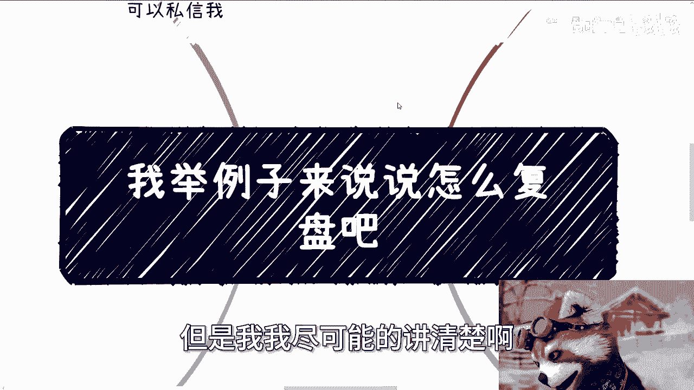
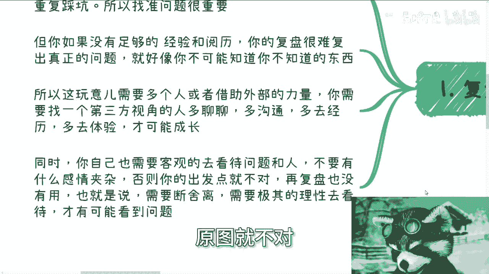
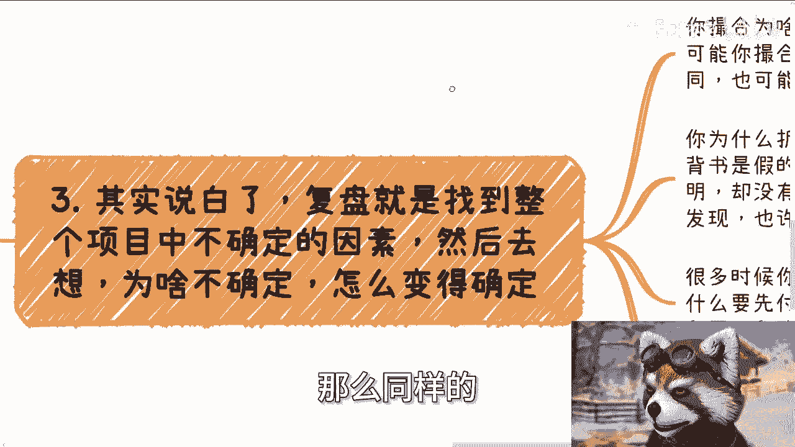
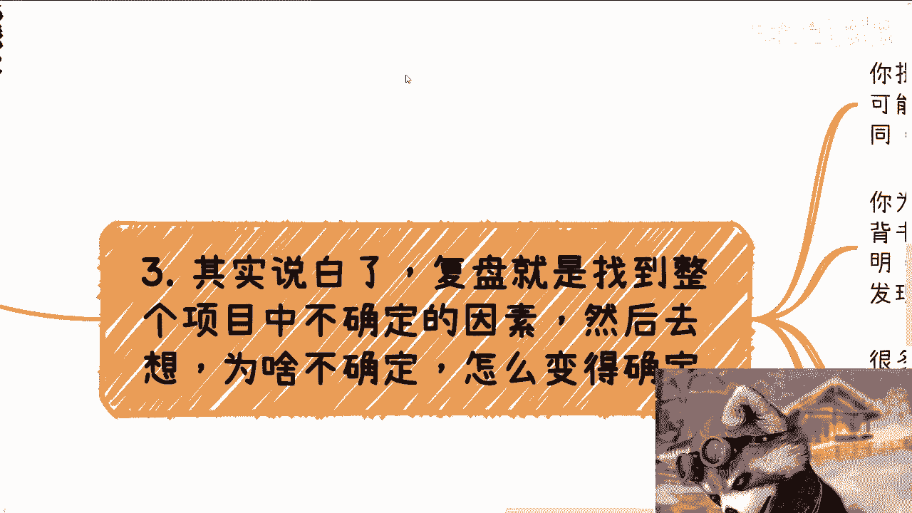
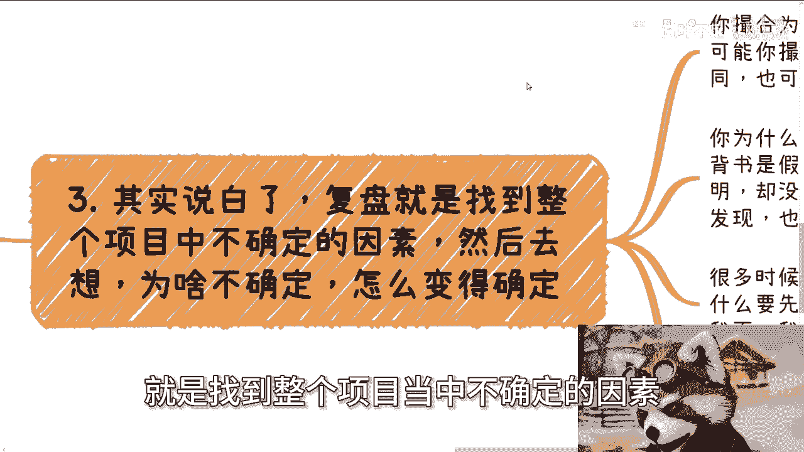
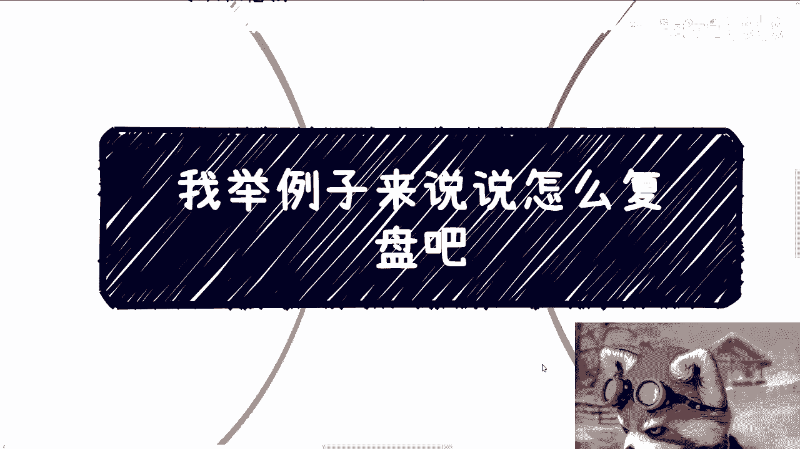
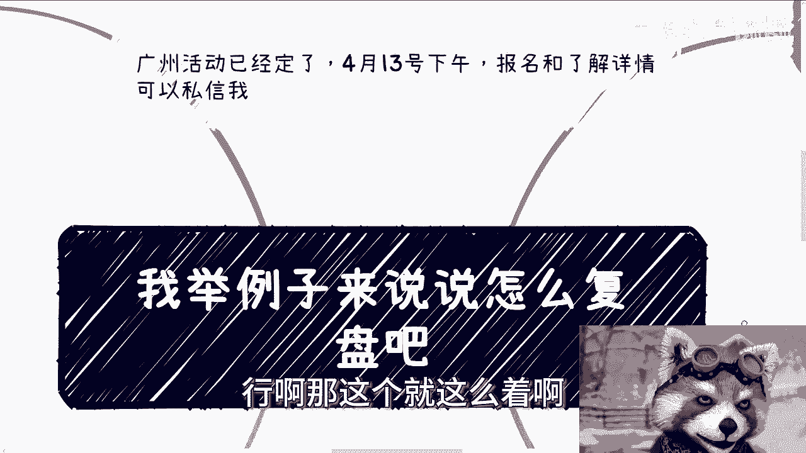
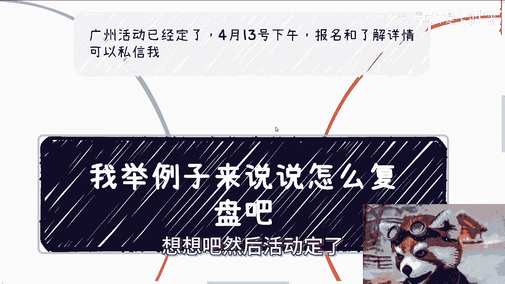

# 复盘方法论详解 - 课程01：如何有效复盘避免重复踩坑 🔍

在本节课中，我们将学习复盘的核心概念、正确方法以及常见误区。复盘不仅是回顾过去，更是为了明确对错、避免重复犯错，从而推动个人与项目的成长。

---

## 复盘的核心理念与前提

上一节我们介绍了课程概述，本节中我们来看看进行有效复盘所需具备的核心认知与前提条件。

复盘的关键在于理解什么是对的、什么是错的，并且确保之后不再重复踩坑。因此，找准问题至关重要。然而，如果个人缺乏足够的经验和阅历，仅靠自我复盘很难得出有价值的结论。

这就像你无法认知自己不知道的事物。如果你在踩坑的当下未能察觉问题，那么仅靠事后回顾也很难发现它。因此，复盘在逻辑上常常需要借助外部力量。

你需要引入**第三方视角**来共同复盘，而非仅仅依靠自己。多交流、多取经、多经历、多体验，才能获得成长。同时，你必须**客观地看待问题**，复盘时不应掺杂个人感情与情绪。如果出发点被情绪左右，复盘就失去了意义。

例如，在项目复盘时，如果你情绪化地认定“某个人是傻X”，那么复盘就无法进行下去。核心问题往往不在于个人，而在于流程、协作或机制。你需要以**极其理性**的状态进行断舍离，才能看到真正的问题所在。否则，你将永远卡在表面问题上，无法进步。

---

## 复盘实战：案例分析

理解了复盘的基本理念后，我们通过一个具体的案例，来看看如何将理论应用于实践。

我们曾多次举办企业家课程培训，但最终并未盈利。我们对此进行了数次复盘。以下是复盘时考察的部分角度：

以下是复盘时需要考察的关键维度列表：
*   **背书有效性**：所谓的“国家背书”真的有用吗？需要具体分析其实际价值，例如能否帮助就业、落户或带来其他实质利益。如果无法证明其实际效用，则视为无效。
*   **渠道与招生**：我们拥有渠道，也进行了招生，但为何无人报名？需要审视以下两点：
    *   **痛点解决**：课程是否解决了目标客户的真实痛点？是否存在让客户冲动消费的可能性？
    *   **定价与分润**：课程单价是否过高？给招生渠道的分润是否足够有吸引力？需要对比市场同类项目的合作分成。
*   **流程与吸引力**：活动流程的设计是否足够有吸引力？是单纯的课程，还是结合了游学、参观等环节？需要明确活动性质（培训、展会、私董会等）。
*   **对标分析**：寻找市场上的同质化项目，分析他们为何能成功招生。这是发现自身差距的重要途径。

通过多角度审视，我们才能发现“为什么没有招到人”、“为什么没有人愿意付钱”的根本原因。

---

## 复盘的本质：从不确定到确定

通过案例分析，我们看到了复盘需要考察的多个维度。本节我们将深入探讨复盘的本质逻辑。

复盘本质上是一个**将不确定因素变为确定**的过程。
你需要找出项目中的不确定因素，思考其为何不确定，并寻找将其确定化的方法。

例如：
*   **撮合未成**：可能因双方需求不明确、撮合模式错误、未提前签合同，或者根本就是你错误判断了需求。
*   **折腾未果**：可能因为背书不够硬或无法证明，也可能合作方赚了钱却声称未赚（即被白嫖）。

复盘时，必须客观审视逻辑硬伤。许多人的思维存在固有缺陷，自己难以察觉。例如，认为“付钱就能赚钱”就是一个明显的逻辑谬误。

同时，要警惕**幸存者偏差**。你看到的成功案例可能只是极少数，不代表普遍规律。复盘时需要冷静思考，明白这个道理，否则复盘毫无意义。

---

## 有效复盘的行动指南

明确了复盘的本质是从不确定性中寻找确定性后，我们来学习如何执行一次有效的复盘。

复盘的目标必须明确具体，要找到“为什么没有赚到钱”的深层原因，而非笼统归咎。

例如，做自媒体未赚到钱，不应简单归咎于“没有流量”。这是空话。应该归咎于：**为什么没有找到流量**、**为什么无法确定流量在哪里**，或**为什么无法获取稳定流量**。只有具体的问题，才能产生具体的改进方案。

改进需要通过**测试**来验证。以“办活动没人来”为例，你可以测试免费活动 vs 收费活动、不同领域的话题、不同的海报或嘉宾，通过数据来寻找原因。

原因可分为内因与外因。以摆地摊为例：
*   **内因**：自身不够努力、产品不够好、吆喝不卖力。
*   **外因**：选址不当、城管管制、未找准目标受众。

因此，行动上你可以：
1.  **测试外因**：在不同地点摆摊，用数据说话。
2.  **寻找稳定流量**：在摆摊的同时，发展多个分销商。即使自己没卖出，分销渠道也可能产生销售额。

**复盘必须有目的性**，即下一次相比这一次一定要有改进。没有改进的回顾不叫复盘。同时必须认识到，在现代社会，任何事都难以仅靠一人完成。为了提升成功率、稳定性和性价比，你需要**与更多人合作**，分摊风险，做大事情。

---

## 复盘的自我评估与求助

最后，我们来探讨一下，在开始复盘前如何评估自身状态，以及何时应该向外寻求帮助。

在开始复盘前，先进行自我评估：你是否足够冷静、客观？是否具备基本的商业思维？如果答案是否定的，请不要独自纠结。

**寻求外部帮助是明智之举**。你可以：
*   寻找大量同行或低层级观察者（如10-20人），从他们的视角看问题。
*   花钱请教高水平的专业人士或导师，让他们帮你复盘。

这远比一个人反复跌入同一个坑要好得多。许多人业务中的某个关键不确定性始终未被明确，导致一次次在相同地方失败，却不断追问“为什么赚不到钱”。有效的复盘正是为了打破这种循环。

---

## 课程总结

本节课中，我们一起学习了有效复盘的全套方法论。

我们首先明确了复盘的核心理念是**辨明对错、避免重复踩坑**，并强调需要**客观态度**与**第三方视角**。接着，通过一个企业家培训的案例，我们实战演练了如何从**背书、渠道、定价、流程、对标**等多维度进行剖析。然后，我们揭示了复盘的本质是**将项目中的不确定因素转化为确定因素**，并需要警惕逻辑硬伤和幸存者偏差。最后，我们给出了具体的行动指南：**定位具体原因、通过测试验证、区分内/外因、寻求合作**，并强调了在自我能力不足时**积极向外求助**的重要性。

记住，复盘是一次面向未来的诊断，目的是为了下一次能做得更好。