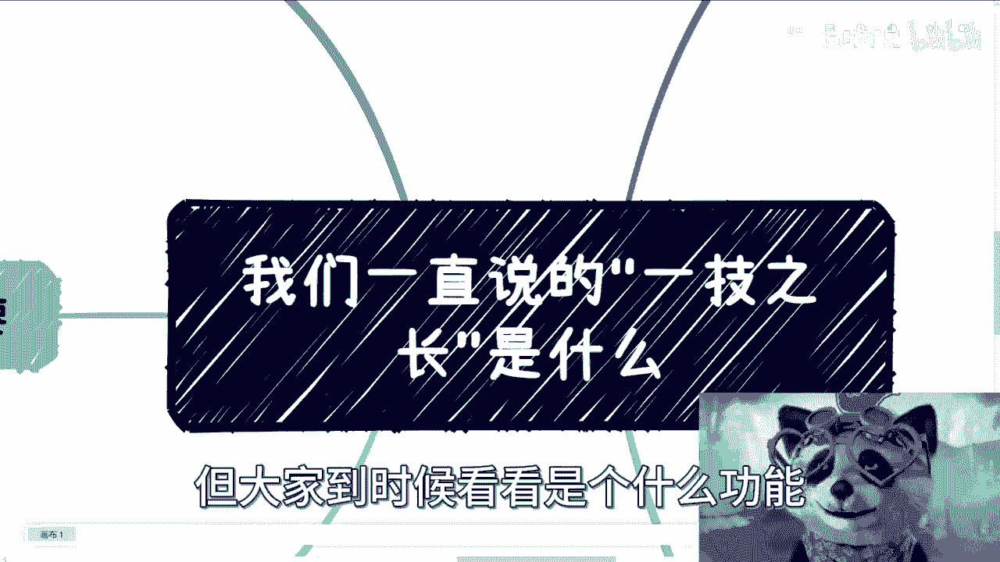
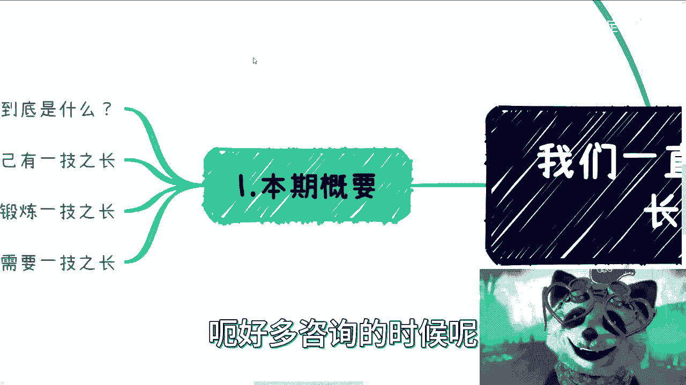
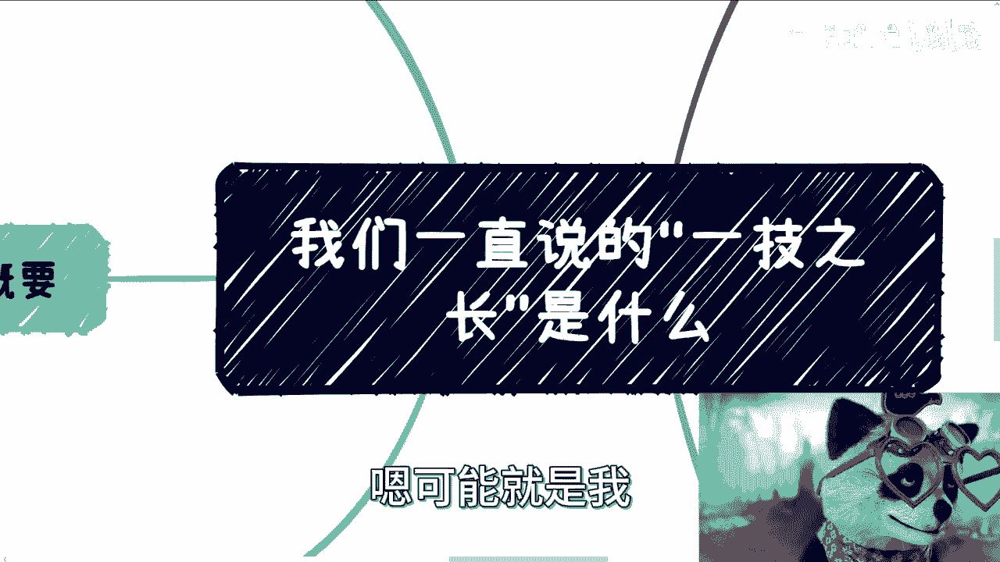

# 我们一直说的”一技之长“到底是什么？ - P1 - 赏味不足 - BV1tu4y1D78D

好大家好，这个感谢B站啊，B站跟我说下周要上上线一个新的功能吧，那我就先不告诉大家，但大家到时候看看是的什么功能好吧。

那今天我们来讲啊。

就是这个一技之长啊，因为之前呃好多咨询的时候呢。

其实都提到过，就关于这个一技之长的这个事儿啊，然后我觉得这个问题吧，可能就是可能就是我。

我觉得大家可能理解不是特别清楚啊，我感觉我在这边给大家罗列一下啊。

呃本期概要对吧，一个是的一技之长到底是什么对吧，然后第二个呢怎么证明自己有一技之长啊，第三呢就是我们说啊就是做一份工作，能不能锻炼一技之长，第四呢我们到底需不需要一技之长对吧。

那我觉得其实核心点是这么几个，那一个个来说一技之长是什么啊，首先在我咨询过程当中呢，我发现很多小伙伴呢其实一直提到，就是说啊就说自己要这个一技之长，那么我觉得呢我们需要去看一下。

这个所谓一技之长是什么东西，对不对，那么一技之长呢按照这个计对吧，因为一技之长，一技之长嘛，那肯定是跟这个计有关嘛对吧，那这个G其实分很多种，但是呢我们不要去分这么细啊，就在我这边呢。

我先把它宏观的啊罗列这么几个，首先叫什么呢，应激能力，那什么叫应激能力呢，就比如说编程造火箭啊，然后什么蓝领对吧，就所谓应激能力，就是说它在短时间内，对方能够判断得出来你有没有这个能力对吧。

就像你写代码，你会不会写对吧，我今天给你个算法，你会就会不会就不会对吧，就很简单这个事，那么或者来说就对方，如果你碰到一个懂的人对吧，比如说什么电工啊，钳工啊对吧，你碰到个懂的人。

他很快就能判断你有没有这个技能，或者说你是不是个初学者，你是不是这个有一定经验对吧等等等，那这个我们称之为硬技能类啊，那么硬技能类当中呢，其实还有一类呢不那么硬的啊，所谓不那么硬。

就是说他可能通过短时间，通过一些技能上的这种判断呢，那他没法去很好的去这个判断你这个人，但你比如说运营啊，销售对吧，这个产品经理，项目经理对吧，这一类，那这种呢其实就比较的综合，也就是说你说他有硬性吧。

有的他有硬技能啊，并不是说没有，但是的你说他多硬吧，或者说你怎么判断这个硬不硬，你就不知道了对吧，你说这个运营做的怎么好，他跟你一顿操作猛如虎，一顿操作猛如虎，所有人都可以一顿操作猛如虎啊对吧。

那说的直白一点，就是所有人都可以吹的一顿操作猛如虎对吧，那你在面试时候或者在沟通时候，那我们怎么判断得出来你这个人好不好呀，不知道吗，那么我们这个是硬技能当中的一个分支啊，那么还有一类呢叫软技能对吧。

软技能啊，我们在这个地方就是还是那句话，不要管它好不好啊，我只是来概括这件事情啊，比如说察言观色，比如说跪舔领导，比如说向上向下管理，比如说挑拨离间，比如说暗中举报，我跟你讲，这都叫软技能。

唉你还别真别讲，唉我跟你们讲，你还真别说啊，你不是你还真别说挑拨离间也要有，也要有技术的啊，举报也要有技术的啊，不是说你今天什么截个图，发句话就举报了，不是的哈，对吧啊，那么这些都属于软技能啊。

那么商业技能，这也就是我们说的第三类商业技能，商业技能简单来讲就是说，说白了就是直接可以变现的技能啊，比如说你今天做什么咨询，有甲方说我愿意明码标价，明码开价，我就要你来，对不对，你能对接什么资源。

那么这些资源能够给你带来多少多少钱，或者你在这当中能能抽多少R，抽多抽多少分，成抽多少水，对不对啊，你能写什么融资计划书，然后对接资本对吧，那么你能提供比如说各种外包外包的资源，各种的这种供应商。

就是说你本身拥有的很多东西，它是直接可以跟商业直接变现的，或者说就是可能啊有了一定的甲方，或者寻找到一定甲方之后，它就能变现，或者寻找到一定的乙方之后，它就能变现，对吧等等等等等。

所以啊我们得出的结论就是，无论硬技能还是硬技能的这个分支还是软技能，本质上啊，无论软硬，它本质上更能直接带来钱的这么一个商业技能，它是不同的啊，并不是说啊我的硬技能达到了一定的级别啊。

我就可以完全跟商业技能挂划等号，没有真没有哦，除非是什么，除非就是说你量变达到了质变，什么叫量变达量质变，就是比如说LOK99对吧，比如说你你你手上有屠龙之技对吧，可能比如说全国就那么几个人啊。

那没问题，剩下的如果大家都是一个标品对吧，都是一个一个模子刻出来的话，那我跟你讲大差不差的啊，你今天能做，他也能做，但是你们做的东西并不能直接变形，对吧好，那么这个时候我们把一技之长。

从宏观角度来分析啊，那么第二点怎么证明一技之长，哎我跟你讲这个事情也就很很奥妙了啊，其实这是一个非常奥妙的问题，你说你花了时间跟金钱，我们什么时间和金钱就是读书嘛对吧，考学历嘛啊。

你说你啊当然还有工作对吧，你花了，你说你花了时间跟金钱去磨练，但重要的并不是你磨练出来的技术，就好像今天今天说，我说我要学个挖掘机，其实你说别人认不认可重要吗，不重要，因为你认可不认可我都会这个技能。

我会挖掘机不需要你认可对吧，我会就会不会就不会有什么好认可的人，你管你认不认可，关我事啊，对不对啊，别人不认可根本没有用啊，那么这些就是现在这个一技之长，最大的问题就是我们重要的并不是我们有什么。

而是别人认可不认可对吧，那也就是说我们分开来说，也就是说硬技能，他其实是最容易能够去判断得出来，你有没有拥有的一种一类技能，但是硬技能相对来讲门槛也相对比较高，而同时大家需要花更多的时间。

更多的经验去和大众区卷对吧，同时诶我看看我后面啊，对就是同时也是最大的，还有一个最大的问题就是随着时间的推移，随着年龄的增长，很多硬技能其实是没有传承性的，也就是说很多硬技能革新太快。

我们还需要不停的去更新，不停的所谓不停的更新，就是我们需要不停的跟年轻人去卷对吧，而你会发现硬技能，这里面最大还有个DEBUFF是什么，就是硬技能这个东西，很多的时候你还你要的是对方的认可。

而不是我们的认可，而不是自己的认可，对吧好，那么综合岗位，就像我们刚刚说的那个应硬技能里面，这个分支对吧，其实最终看的你会发现这个硬技能分支，最终看的是软性更多一点，为什么很简单啊，你项目经理。

产品经理销售或者别的东西，你硬技能有没有啊，有啊没问题啊对吧，但是最终选你为什么不选他，选他为什么不选你，还是面试当中的软性啊，包括你的表达啊，你的普通话啊，你的颜值啊，你的打扮啊，这叫软性啊对吧。

那么我们再说为什么软件更多一点，很简单啊，因为你从人的本质上面来讲，大家接受软件的软性的东西接受度更强了，你硬新东西太硬核了，能有几个人懂啊对吧，你跑过去一顿操作猛如虎啊，他也一顿操作猛如虎。

那最终选择谁呢，那只能选择软性上多一点的人对吧，软性上让对方感觉哦，这个人看上去蛮顺眼的对吧，或者沟通蛮好，沟通的，怎么办呢，没办法呀，因为你真的硬核的东西，我说不好听点，有几个人有能力来判断的啊。

你以为对方坐在对面的那个人就懂吗，他也不见得懂吗对吧，这就好像你们很多的论文啊，paper出去审核审核的时候，你以为审的人真的懂吗，也不见得呀对吧，他懂部分，但你说他懂全部吗，我不相信啊。

那么软技能则不同，软技能其实根本不需要证明，它就更像一种Buff，就更像一种光环啊，就更像一种被动技能对吧，你证明不证明不重要啊，我证明也好，不证明也好，有什么重要不重要。

重要的是这项技能能够更快的在任何时段，任何人身上，更快的帮助这些人，去获得自己想的一些想要的一些东西，这就像我们刚刚说的，60拍马也好，举报也好，或者别的东西也好，他的确能达到他的目的。

但是你说这项技能是一个是不是一个硬技能，不是对吧，但是你说这项技能对方有没有认可，他不需要认可，这更像一种PV，那不需要认可对吧，那么商业上呢其实证明就太容易了，商业上的证明只有一个标准，就是赚钱啊。

啊当然不赚钱都是废话，更多的都是借口啊，呃但是呢同样的单纯赚钱也是不够的啊，商业上其实更重要看重的是什么呢，就是说你要有商业操守，同时在一定的条条框框内啊，或者说在一定的合法范围内。

你要最大效率地去增加你赚钱的效率啊，最大可能性增加你赚钱效率，也就是说最大的可能性去增加单位时间里面，你赚钱的多少对吧，那么这个其实是商业上的一种证明啊，呃说再多啊，你察言观色，观测再牛逼。

你的颜值再高没卵用啊，没卵用啊，那么第三点啊，工作能不能锻炼一技之长啊，这也是一个很多人问的问题啊，他说我想到我想去找份什么工作，那我问他为什么，他就说啊，我找这个工作为了锻炼我一技之长啊。

好你说能不能能，但不多，为什么，因为简单来讲，我们要想好工作到底为了什么，工作为了是温饱对吧，不是为了赚钱，是为了温饱，为了赚钱，不好意思，工作赚不到钱，不要再去看那些幸存者，幸存者偏差了有没有赚到的。

有的对吧，加上股票加上期权，当然有赚到的，但是这占整个比例能有多少啊啊能有多少啊，这少的不能再少了对吧，那么我们就说啊，仔细看看，就我们刚刚写的那些一技之长，你要想想看啊，你真的要锻炼，比如说硬技能。

比如说软硬技能，比如说这个软技能，比如说商业技能，你真的要锻炼，那还不如直接去锻炼去磨练对吧，这就好像说你要说你要赚钱，那么你就好好去学，怎么赚钱，而不是曲线救国的去学什么技术，学什么专业没有用的对吧。

包括就像很多人说，我就想学代码，就想学技术，那你去学啊，你就直接去学啊，哦你总不能告诉我啊，我要学个代码，学个技术哦，我非要花找个工作，花个35年在工作当中学，你能不能学到能唉，但不足一样的道理。

我跟你讲别的东西都一样的，你说我想去锻炼我的运营能力对吧，锻炼我的这个软硬技能能力，我想去找个工作啊，做个35年锻炼能不能能啊，但不多对吧，那你就好像跟我说，我考个本科，考个考研究生。

在未来有没有很大作用啊，有啊，但不多不就这样子的呀，对不对，所以我跟你讲，就很多时候很多东西就是我们要做呢，就就针对性啊，否则就是那种就是说啊你说有没有用啊，但是并没有那么多啊。

那那为什么我们不选择一些更高效的方式对吧，那当然了，也有也有人要问了，也有人要说嘛，那你说更高效方式做来了，你就没有工作了，就不能赚钱了，那说到底你要这么想啊，你要这么问的话。

说到底核心矛盾根本就不在有没有工作上面，核心矛盾是你不会赚钱，对不对，那你不会赚钱，你就去找那些赚钱的东西，是吧啊，所以我觉得这个核心就是很多，这种核心矛盾点嘛，就我们不要嗯自己甩。

就是就是自己去想设设想听想方设法的，还要PV自己说，哎这个可能是工作的问题，这跟工作没有关系，那么第五点啊，第四点就是我们到底要不要一技之长，其实这是个很有意思的话题啊，呃我跟你们讲。

我们换个角度去思考这个问题，就是你说一技之长有没有用的，那么我们反过来说我们有了一技之长，然后呢啊，然后是说哎我们一碰到人就说哎，我们会什么什么，还是说我们就去去卷这个一技之长啊。

然后跟所有拥有这个一技之长的人，去拼高低对吧，那对方是否一定认可你，对方是否一定不认可，你其实都不知道，对吧什么意思呢，也就是说当我们今天拥有一个一技之长的时候，或者我们想要去磨练一个一技之长的时候。

其实我们得要先问自己，我们磨练好了有什么用啊，就是我们一直说所谓的商业闭环，业务闭环，功能闭环，就是它得是个闭环嘛，对不对，那么我们得要问自己有什么用对吧，那么如果你告诉我说，唉我今天拥有了一技之长。

我要去找工作的好，那么你找工作其实是相当于是要对方认可你，而让对方认可你这件事情是你不可控的，所以说当出现一个你不可控的一个东西的时候，你的逻辑其实是不是闭环的，你是断层的，你知道吗，你是断层的啊。

而且这个东西你要这么想，他认不认可你，跟你这个一技之长，其实并没有直接的因果关系啊，这个东西也是由逻辑当中断层的，这也是非常神奇的一件事情啊，你们想想看啊，所以说就是说不管是呃做财务对吧。

做会计做别的东西就是很多时候他认可你，他认可的可能有各种各样的原因，但是真正因为你一技之长，认可你的很少啊，很少啊，所以我觉得呢其实大家可以重新审视这个问题。

就是一技之长的这个点啊，所以呢我觉得呃为什么今天会来讲这个东西，我就觉得呃大部分人呢他有个误区，就是首先这个第一层误区呢，就是这个G，这个G呢并不是所谓的一个技能点啊，而是说你这个人的综合的。

包括你的认知啊，宏观宏观方面的认知啊，包括你的察言观色，你的行为举止对吧，你的说话其实你综合其实都是你这个人的记啊，这都是你这个人的记忆，所以说就像我们一直说，我们比如说你是个六边形战士对吧。

那么六边形战士里面得知其美劳对吧，那么那么学历可能只是里面的一个点对吧，然后你的手上技术可能也是一个点，那并不代表说另外四个点就不要了对吧，那你就不是六边形战士啊，你是一个2222尾2D战士对吧。

你你你整个这个线都不闭环啊，那可能就两个点，你你锻炼了剩下四个点都没有对吧啊，所以我觉得这一方面，第二方面就是说我们得要去想好，就是就是很多时候做事情呢，不是说一技之长不要啊。

你有很多人二极管就要说了啊，那按照你这个说法，我们就不要不是说不要你得想好，你要了干嘛对吧，就我们很多时候就是做一件事情嘛，跟我的目的没有关系，你知道吧，就是每次那个咨询的时候。

你们会发现一个很神奇的问题，就是就是大家会做一件事情啊，然后描描述我想怎么做，我想达到什么目的，但是你知道吗，你仔细去看，就比如说我我哪怕反问一句对吧，你们仔细自己去审核之后。

你们就会发现这当中因果关系其实是不成立的，就是你想走的这个路跟你想达到那个目的，他们完全不是一件事儿啊，所以这个事情也是很神奇的啊，所以说如果你今天做一件事，跟你要达到目的他非常的匹配啊。

那我觉得完全没问题，你这件事情对也好，不对也好，吃亏也好，怎么样也好，他都是对的，为什么，因为你逻辑是清晰的呀，那你就是哪怕试错，你也是对的对吧，但是怕就怕什么，怕就怕你一开始因果关系逻辑就不对。

那那那那那你说这个里面对和错有意义吗，你没有意义啊，啊好吧嗯。

我希望这个怎么说呢，抛砖引玉吧啊就大家能够有一个认知，好吧啊行，那就这么着吧啊，然后嗯期待下周这个新的功能吧啊新的功能啊，然后就是其他的也是一样的好吧，就是大家反正有什么呃职业规划。

或者说手上牌怎么打的或者怎么样子，反正啊整理好好吧，整理好可以走。

