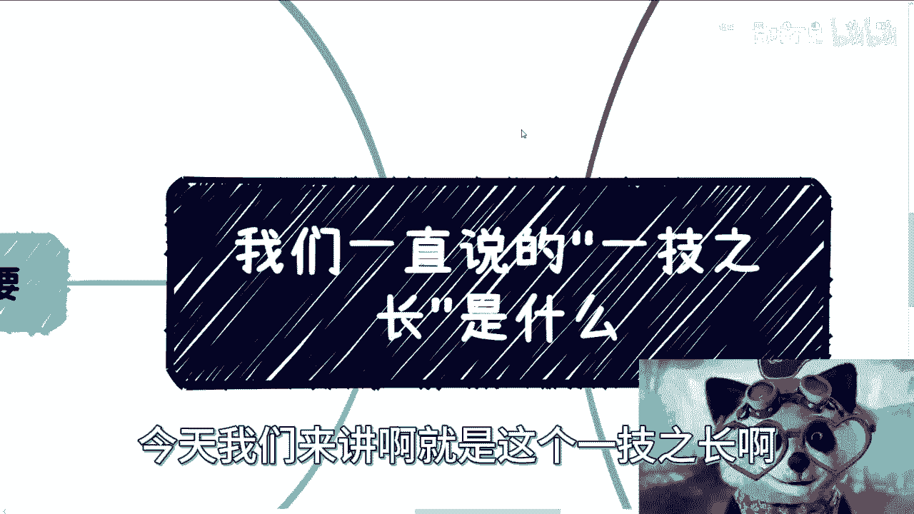

# 课程一：解析“一技之长”的本质与误区 🧠

在本节课中，我们将深入探讨“一技之长”这一常见概念。我们将分析其具体内涵、如何证明、与工作的关系，以及我们是否真的需要它。通过本课，你将能更清晰地规划个人技能发展路径，避免常见的认知误区。

---

## 一、什么是“一技之长”？🔍

上一节我们介绍了课程主题，本节中我们来看看“一技之长”的具体定义。在咨询过程中，我发现许多人常提到需要“一技之长”。我们需要明确这个概念。

所谓“一技之长”，核心在于“技”。我们可以从宏观上将其分为几类：

以下是技能的主要分类：

1.  **硬技能**
    *   **定义**：指在短时间内能被他人明确判断是否掌握的能力。
    *   **公式**：`硬技能 = 可被客观验证的专业能力`
    *   **例子**：编程、电工、钳工等。对方（尤其是懂行的人）能快速判断你的水平。

2.  **硬技能的分支（综合岗位技能）**
    *   **定义**：这类技能包含硬性成分，但难以在短时间内被精确衡量和比较。
    *   **例子**：运营、销售、产品经理、项目经理等。虽然需要硬技能，但优劣判断更综合。

3.  **软技能**
    *   **定义**：通常指与人际互动、职场生存相关的非技术性能力。
    *   **例子**：察言观色、沟通协调、向上管理、处理复杂人际关系等。这些技能同样需要技术含量。

4.  **商业技能**
    *   **定义**：指能直接创造商业价值、实现变现的能力。
    *   **公式**：`商业技能 = 直接对接需求并产生收入的能力`
    *   **例子**：专业咨询、资源对接、融资、供应链管理等。其核心是能直接带来经济回报。

**结论**：硬技能、软技能与商业技能本质不同。除非达到**量变引起质变**的顶尖水平（例如成为领域内极少数专家），否则大多数标准化硬技能并不能直接等同于商业变现能力。

---

## 二、如何证明自己拥有“一技之长”？📜

上一节我们厘清了技能的类型，本节中我们来看看如何证明这些技能。这是一个关键问题：你拥有技能，与他人认可你的技能，是两回事。

以下是不同技能的证明方式：

1.  **硬技能的证明**
    *   最容易通过测试、作品、证书等方式被客观验证。
    *   **挑战**：门槛高，需要持续投入时间与经验，并与他人竞争。同时，技术更新快，需要不断学习，且证明的核心在于 **“他人的认可”** ，而非自我感觉。

2.  **综合岗位技能的证明**
    *   硬技能是基础，但最终区分胜负的往往是**软性因素**。
    *   **原因**：面试官可能并非完全精通该硬技能领域，难以做出绝对技术判断。因此，表达能力、沟通印象、个人形象等软性因素权重增加。最终选择常是“感觉更顺眼、沟通更好”的那一位。

3.  **软技能的证明**
    *   软技能更像一种**被动增益（Buff）或光环**，无需刻意证明。
    *   **核心**：它能否高效地帮助你在各种情境下达成目标（如更好地协调资源、获取信息）。其效果是结果导向的，过程本身不需被鉴定。

4.  **商业技能的证明**
    *   证明标准非常直接：**能否赚钱**。
    *   **更深层标准**：在合法合规的前提下，能否持续、高效地提升**单位时间内的赚钱效率**。空有察言观色的能力而无商业结果，是无效的。

---

## 三、工作能否锻炼“一技之长”？💼

上一节讨论了证明技能的方式，本节中我们探讨一个常见问题：通过工作锻炼技能是否有效？很多人想通过找工作来磨练一技之长。

答案是：**能，但效率不高，作用有限**。

我们需要明确工作的首要目的是解决温饱、获得收入，而非系统地培养技能。如果你想锻炼某项特定技能（无论是硬技能、软技能还是商业技能），最直接高效的方式是**针对性地去学习和实践**。

> 这就好比，如果你想学赚钱，应该直接去学习商业和赚钱的方法，而不是曲线救国地指望通过掌握一门技术来自然获得高收入。

通过工作积累技能，周期长、内容杂、目标分散。这类似于问“读一个研究生学位对未来有没有用？”——有，但可能没有你想象的那么多。我们应该追求更高效、更直接的能力提升路径。

如果有人反驳：“不工作就没钱，怎么学习？”那么，核心矛盾其实在于 **“不会赚钱”** ，而不是“没有工作”。应优先解决“如何创造价值并获得收入”这个根本问题。

---

## 四、我们到底需不需要“一技之长”？🤔

上一节我们分析了通过工作锻炼技能的效率问题，本节我们来思考这个终极问题。要回答它，我们需要换个角度。

拥有“一技之长”后，你用它来做什么？是向人炫耀，还是卷入同质化竞争？关键在于，**对方的认可与否是你无法控制的变量**。如果你的目标是找工作（需要他人认可），那么从“拥有技能”到“获得认可”之间，存在逻辑断层。

> 许多时候，对方认可你可能出于各种复杂原因（如眼缘、团队匹配度、薪资要求等），而单纯因为你的“一技之长”就认可你的情况，并不多见。

因此，在决定投入精力磨练一项技能前，必须问自己：**我磨练好它，具体有什么用？** 你的技能与你的目标之间，必须形成一个**逻辑闭环**。如果路径与目的不匹配，那么无论技能本身好坏，努力都可能失去意义。

---

## 五、核心误区与正确认知 💡

上一节我们探讨了技能与目标的闭环关系，本节我们来总结关于“一技之长”的两个核心误区。

1.  **误区一：将“技”理解为单一技能点**
    *   **正确认知**：“技”是一个人的**综合体现**，包括认知水平、行为举止、沟通方式等。就像“六边形战士”，学历和专业技术只是其中的一两个维度。若只专注两点而忽略其他，就无法形成完整的个人能力闭环。

2.  **误区二：行动与目的脱节**
    *   **正确认知**：并非否定技能的重要性，而是强调**做任何事都要与最终目的紧密关联**。在行动前，必须反复审视：我采取的路径（如学习某项技能）是否真的能导向我想要的结果（如获得某类工作、实现变现）？确保因果关系成立，逻辑清晰，即使试错也是有效的学习。

---

## 总结 📝

本节课中我们一起学习了“一技之长”的多维度内涵。我们将其分为硬技能、综合技能、软技能和商业技能，并分析了各自的特点与证明方式。我们明确了通过工作锻炼技能效率有限，并强调了在培养技能前，务必思考其与个人目标的闭环关系，避免行动与目的脱节。

希望本课能帮助你更理性地规划个人成长路径，将有限的精力投入到能真正创造价值的方向上。