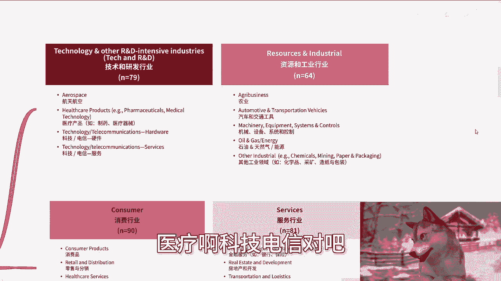
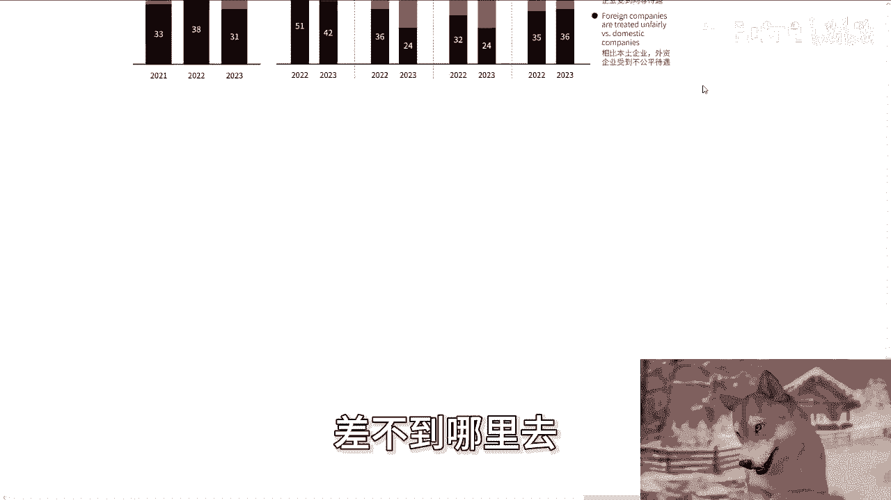
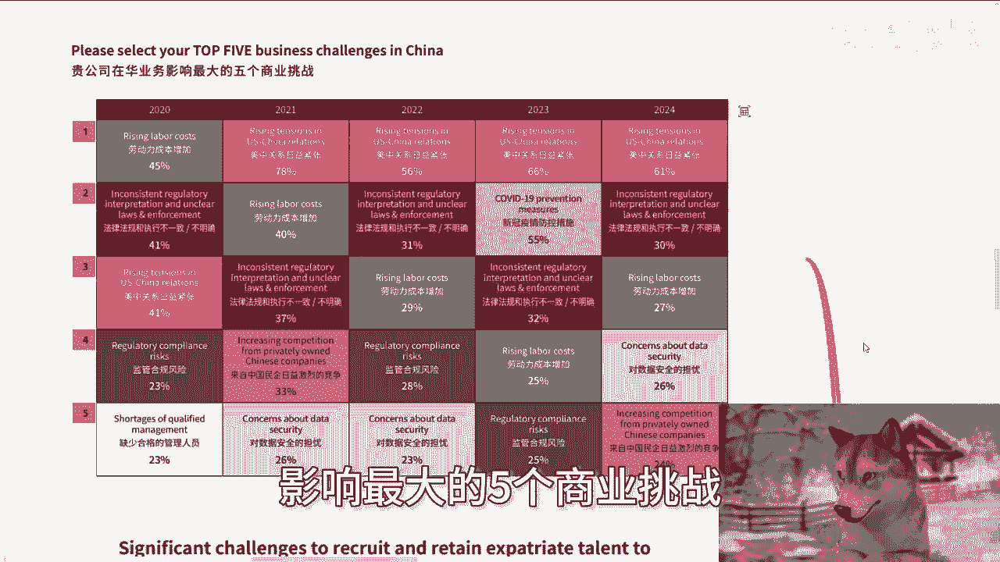
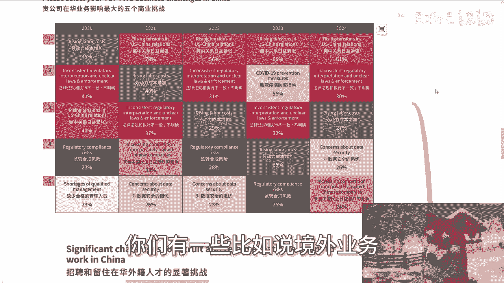
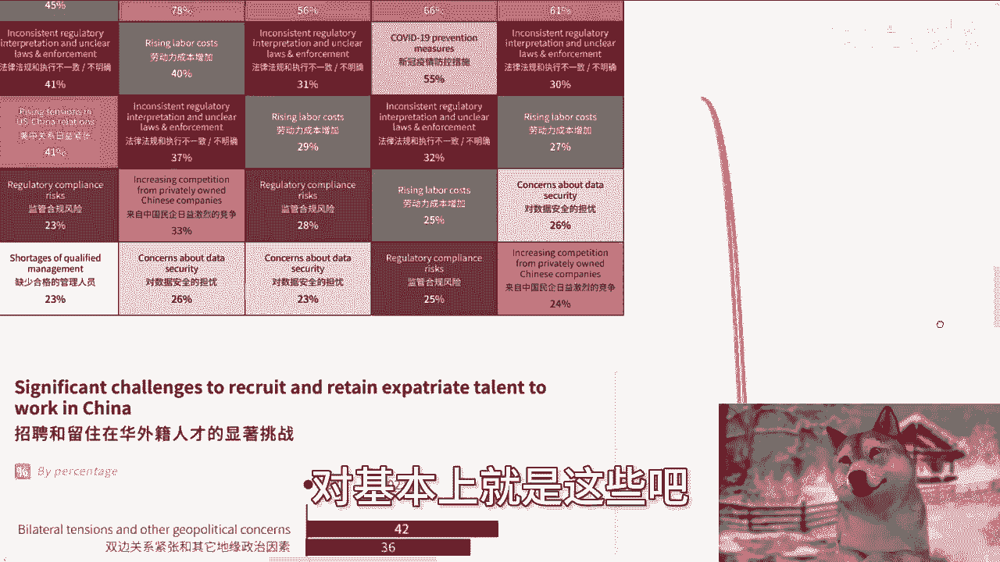

# 我们一起来看下2024中国商务环境报告 - P1 - 赏味不足 - BV1PqtMeZEze

好大家好啊，今天咋这个报告。

这个报告名字听上去不咋地啊对吧，中国商务环境报告啊，但是内容还是不错的啊，涉及到了这个服务业，金融业对吧，制造业，还有这个科技产业啊，主要是说这个中国和全球局势的。

哎我觉得还是不错的啊，interesting啊，interesting啊，为什么interesting，待会你们就知道了啊，呃我先说一下下期活动啊，9月21号下周六呃，一点到六点好吧，在杭州啊，在杭州。

杭州好久没去了，那么本期呢开始我定了几个新的主题，一个是我呃会跟大家分享一下，就这次上海大会的时候，我跟那个研究院院长啊，包括其他一些这个来的一些嘉宾啊，聊的这个最新的一些关注点啊。

一个呢就是说我现场会给大家看一下，我之前和高校啊，包括产业园这边聊的一些大会，包括那个呃叫什么，就是实训平台的这种详细的方案好吧，因为也很多年前了嘛，所以我觉得拿出来也问题不大好吧。

我直接到时候我把那个PPT给你们一边看，一边讲吧，就跟像今天这种逻辑差不多好吧，那么报名跟了解详情呢，你们可以私信我啊，啊，首先啊今天早上呢，小伙伴给我发了这么一份报告。

我看了一下呢，哎有点东西的，就是哎呀怎么讲呢，就是我跟你们这么说，你们看这种报告呢，呃我觉得这样子就是60%呢，你就抱着看着个乐子的这种心态，那40%呢，就是你大概了解一下整个全区呃。

全局的这种趋势方向啊，别的你不要太去细究，就是细究你就又回到我们说的那个点上面，你要细究你就细究你关你赚钱的东西啊。

你不要去细究那些有的没的细细究，有的没的跟你没啥关系，对吧啊，那么碍于就是有些就我之前说的，有些小伙伴呢他其实是不看的啊，他是那个呃这个放在后台听的啊，所以我就这还是们给你们读一下啊。

首先呢就是他报告在最前面啊，列了一些怎么说呢，总结性语言啊，2023年财务表示，2023年在华的美国企业的财务表现，是有所改善的，盈利水平和息税前利润率的这个均有所上升，略低于那个半数啊。

收房企业预期将实现盈利，那么这个呢比较待会我们会看的啊，那么乐观趋势的一个复苏呢，会员企业对于中国接下来两年的这个商业前景，预期有所改善，相较去年更为乐观啊，尤其是中国的市场增长。

盈利能力跟经济总体的情况啊，那么投资意向呢，去年会员企业对中国的投资意向大幅下滑，今年情况略有改善啊，50%的受访企业对中国呃，将中国列为全球首选，或者前三位的这个投资目的地啊，相较2022年上升了呃。

五个这个百分点啊，几乎所有的受访企业都表示，近30%的受访企业预计2024年啊，美中关系将有所改善啊，明显是高于2023年的呃，待遇不均，近近1/3的受访企业表示，相比本土企业。

外资企业受到更多的不公平待遇，但这一感受在各个细分领域存在差异，比如呃，同时在有57%的会员单位仍表示，对中国进一步对外资开放市场的承诺，表示不确定或信心不足啊，尽管相比2022年。

有有有有这个显著的改善啊，那么还有就是持续的这个商业挑战啊，会员单位主要关切的问题零仍然集中在美中，关系中国的监管环境成本，以及中国的法律安全啊，网络安全啊，网络安全。

法律法规和知识产权的这个保护等方面啊，那么人才留存问题呢，过去一年，外籍人才愿意派遣至中国工作的意愿有所上升，仍对招聘外籍人才产生这个负面影响啊，那好你们从这个上面就能看得出来。

就是它的整个的这个受访的企业呢，基本上是属于外资啊，基本上属于外资，然后呢是从外资这边呢，更多的来看中国的整个市场，所以说呢我觉得就是嗯嗯，就还是有一些偏差性的啊。

因为毕竟你要是受访的是中国的中小微企业，那我怕不是对吧，就今天这个数据上，就会有比较大的这个差异化了。

但不管怎么样吧，啊也算是一个这个了解的东西啊，那么我们先来看一下细节啊。

就是在所有的这个报表当中呢，你们会看到有几类，一类是技术和研发，技术和研发，这边呢他也列了，就航天航空医疗啊，科技电信对吧。

硬件软件这样子啊，那么资源跟工业这边呢是农业，汽车交通器械设备系统和控制，石油天然气等能源，然后其他的一些工业领域啊。

那么消费行业呢就是消费品，零售，医疗服务教育啊，媒体与娱乐酒店，旅游休闲，那么服务行业呢就是金融服务，房地产啊，运输啊对吧，投资啊对吧，包括其他一些什么，比如说法律啊，人力资源啊。

会计啊等等等等等等等一系列啊，那么它是这么来划分的，那么还有其他行业，其他行业就是说社会公共非营利性组织对吧，供应链管理，产品开发外包对吧，投资贸易等等等啊，好他是这么列的，那么我们接下来看啊。

首先2023年，贵公司在华业务的财务表现对吧，你看啊，2023相比2022财务表现在这个地方，比如说亏损大幅亏损的呃，技术研发有所提升，但大幅盈利也有所提升啊，也有所提升，那么资源跟工业行业这边呃。

我们就看整体吧，就是说除了消费行业对吧，那么技术研发资额，资源和工业行业服务行业都是亏的，相比上一年他的比例扩大的更大，那么消费行业这边呢是有明显的减少，以及大幅盈利，这边也有明显增加，这估摸着么对吧。

那还是跟疫情有很大关系嘛，啊呃你说这个东西到底是跟疫情单纯的这种，比如说啊当年的叫什么，就是这种怎么说呢，叫做封城有关，还是说啊跟这种老百姓啊，跟企业方面在疫情之后，有报复性的这种消费心理有关。

或者说报复性的这种叫什么，就是投资有关，这咱不知道啊，但是不管怎么样啊，这个明显是跟疫情有关系，那么第二就是说中国在近期全球投资，投资当中的这个重要性，在这当中呢我们也能看到啊。

就是说呃23年相比以前啊也有比较怎么说呢，就是说呃在不是优先考虑对象，众多投资目的地之一，这些里面没有太大差别，包括三大投资目的地之一，可能额差别也也会有啊，但是更多的是呃三大在三大投资目的地里面。

2023年相比以前是有明显的减少的，而与此同时呢，在优先首要投资目的里面也是有明显的这个额，我看看啊，对首要其实也是有明显的一个一个减少的，但是同样的只只在中国有业务的哎，这个是有增加的啊。

那么这个因为它没有太怎么说呢，没有太细分出来他所在领域，所以我们也没法去判断啊，到底是哪个领域是会这么去写的，但是我估摸着嘛，一定的关系啊，对贵公司在华业务的影响的重要性，那这个东西你看啊。

不管哪一个领域，它都是极其重要对吧，那当然你说相比之前20222年，2023年相比之前能有多大差别，差别不大，没什么太大差别啊，但是呢就是说大家基本上所有的企业都会认为，说OK那个整个局势是非常重要的。

那么还有就是说和国内公司相比，这个事情呢，啧我的确不太了解啊，但是从这个报表上来讲呢，就是我们能看到啊，这个相比本土企业，外资企业受到不太公平的待遇，我估摸着这个不太公平待遇，更多的还是在政策上面啊。

就是我们说比如说呃外资的退出啊对吧，外资的一些一些一些一些一些呃，叫什么缩比缩减啊，或者怎么样子啊，更多的还是在政策上面啊，他不单单说的是一些这个薪资待遇上面啊，那么你们能看到就是说呃23年相比22年。

他不公平待遇的整个的比例除了呃消费行业啊，是有很大的，可肉眼可见的一个比例上的一个提升以外，剩下其实也大差不差啊，差不到哪里去好。

那么其他其他这边就比较哎好玩了啊，就interesting了啊，就贵公司在华业务影响最大的五个商业挑战。

我们能看到啊，我们你你你我们直接就看2024年这边，你然后往前推嘛对吧，你首先2024年优先级最高的变成什么，就这么说吧，先看2022年啊，2022年到2024年排名第一的，你看啊，劳动成本增加啊。

占45%啊，劳动成本增加，日益紧张日益紧张对吧，就他妈越来越紧张哈对吧，也就是说大家现在越来越关心的还是关系啊，那么20年时候第二的是什么，是法律法规和执行不一致，你会发现近几年有所改变。

但是到2024年就除了2023年，你看叫新冠疫情的防控措施对吧，那到2024年，又回到了法律法规跟执行不一致，很不明确上面，那么也就说白了的确啊，你看在这5年里面，有3年都是关注在法律法规上面的。

这个可想而知对吧，我我也就不去多说了啊，那么排名第三的，这说明那个时候其实并不怎么紧张啊，那么呃2022年劳动成本，劳动成本增加，2023年还是法律法规不一致，到2024年你会看到啊。

又是劳动成本增加对吧，那么其实嗯，怎么说呢，就是，其实也是卷的一种结果啊，就有一说一其实也是卷的一个结果，你没有办法或者说整体的成本都在增加，你包括房地产，包括消费呃，信息产业，包括那个呃税收对吧。

包括他们的服务业，这都一样的，这没有办法对吧，你就像昨天我去陆家嘴他们那边呃，跟我说啊，一个普通的日日日式的定时对吧，他普通给牛马的日式定时，中午要卖妈80，卧槽，那劳动成本怎么能不增加啊，不增加。

怎么人家怎么吃饭，对吧啊，然后第四个在2020年的时候呢，是监管合规的风险啊，然后往后往后往后往后啊，到20224年就是对数据安全的担忧，这个呢其实我觉得随着时间发展去发展啊。

其实这个数据担忧会越来越担忧，因为数据安全这个东西唉怎么讲呢，就中国在一些数据安全啊，在一些东西上面是很烦啊，就是哼，我只能说就是说这种信任度是打问号的啊，那么第五个就是呃第五个你看啊。

2022年叫什么叫缺少合格的管理人员啊，就这就是相对来讲，管理层可能他觉得啊有所缺陷对吧，或者招不到比较合适的人才，到2024年来，变成什么叫做来自中国民企，日益日益激烈的竞争哈，怎么办呢，没办法呀。

那那不竞争怎么办。

他就要活啦，对不对，哎所以你就会看到很interesting，这是2024年1~5是什么，法律法规，劳动成本增加，对数据安全担忧，来自其他企业的日益竞争，看到没有对吧，就是你们仔细想想看啊。

虽然他说的是外资对吧，在华企业啊，但是你仔细想想看，在华企业，你把你想象成一个在中国创业的，你们因为也都没有创业嘛对吧，也自己没有公司啊，你们就想象成你们自己创业的哎。

然后如果啊你们有一些比如说境外业务。

或者说你们没有进境外业务啊，你们去看啊，第一你们要面对的是法律法规对吧，记住啊，法律法规，第二劳动成本对吧，就你的成本，第三数据安全，包括加各种东西啊，第四包括其他的恶意竞争，对不对。

就你会发现只要你一做业务。

就是这么一些东西，没办法的对吧好，然后招聘和留住在呃在华外籍人才的显著挑战，你看啊在这里面有非常明显的东西。

有几个2023年相比，2022年有很大改善的，你比如说合格候选人无法搬到中国。

那就说明中国对外来人才的一些政策。

肯定有质上面的改变啊，才会有44%转到了44%对吧。

那么有几个有明显的这种增加的呢，你看啊呃2023相比2022，其他的地缘政治因素对吧，那这个没有办法政治因素好，然后还有就是这个中国经济增长放缓，那增长放缓其实大家也看得出来啊，生活跟工资成本高哈。

肉眼可见啊，呃互联网媒体的审查啊，也肉眼可见其他健康安全问题，这个嘿不方便讲啊对吧，然后空气质量啊等等等，那我相信这个数据呢，因为是到2023年的，我估摸着再往后面20242025，2026啊。

这往后几年呃有所改变的，这就是有所就是增加的这几项，后面几年肯定还会再增加，包括经济增长放缓，它肯定是越来越放缓的，这没办法的啊，那么，这个贵公司对今后两年的中国业务的展望，我们能看到啊。

就是呃这个后面两个是略微悲观和悲观，那么相对2023年来讲啊，整体我觉得都还是不错的，因为相参照来讲啊对吧，包括经济复苏啊，其他各个方面都还是不错的，因为周还是有一个正向的一个发展的。

呃除了这个竞争压力啊，竞争压力大家的这个感受是越来越大的啊，剩下我觉得都还是正向发展的嗯，怎么但是怎么说呢，就是说你只是参照正向发展对吧，但是的确大家你我们也能看到嘛，比如说国内市场增加啊，成本啊。

盈利潜能啊，市场管理啊对吧，怎么样啊，基本上呃三三开吧啊，就三分之一三分之一三分之一吧，就是乐观中立，悲观1/3啊，打平基本上属于额，然后后面一个叫考虑，或已经将产能转移到中国和以外的原因啊。

这里面有很大的区别啊，你看2023年相比2022年比较大的第一，排名第一的永远是政治原因啊，政治原因，然后相比增加的，还有什么叫对不确定的政策环境存在顾虑啊，我觉得这点也可以理解啊。

还有就是市场准入壁垒或政策，使所在行业的外企处于不利地位，嘿嘿哎这个描述哈我就不说了对吧，大家自行理解啊，包括劳动力在内的各个类成本有所上升啊，这个也是这个迁出去的原因。

然后就是重新划分其他国家的战略优先次序额，然后这里有一个比较大的一个增加，就是预计中国将放缓增长啊，这个我觉得可能大家也都是比较有共识的。

对基本上就这些吧。

啊那么额我谈一下我自己的想法吧，就是因为外企啊。

我觉得外资在华的这个东西呢，还是有些有有有有很大不一样的，因为一方面就是并不是他们有很多的业务，并不是他们的主因，主营业务或者来说嗯，也并也对他们来讲不是那么的痛啊，但是如果你是一个本土企业。

你是一个小微中小微企业，那那那当然啊我不知道谁敢来做这个哼统计啊，但是如果他做这个统计的话，你们在数据上我可以说啊就很不好看了啊。

就很不好看了，额行吧，但是不管怎么样吧，我觉得这个数据完整的，你们也可以到网上去搜一下对吧，报告就是叫这个2024中国商务环境报告呃，在华的外企这个数据我们也可以参考一下啊，你们我我我个人的想法，就是。

你们可以把中国的企业面对的问题或者困难呃，相比你们刚刚看到的数据和整个的感觉，可以再往往下再挂两个档，那那基本上就差不多了啊，你们可以想象一下多么困难对吧，行啊啊就这么着吧，反正我说个结论啊。

中国当下最难的就是企业家啊。

就是企业家，就是呃就是你们得要有个有个概念理解啊，就是说企业家呢往往是统称那种创业者，或者说那种啊企业的老板啊，并嗯而资本家跟既得利益者呢，更多的是那种就是说呃有盈利的啊。

然后就是就是就是不管企业家死和活，也不管企业死和活，他都能赚到钱的这种人啊，那么那么你可以更多的理解为，就是企业跟企业家其实就是他们的工具人嘛，对吧，那其实是这么个逻辑啊。

行吧，那反正就是说活动呢反正就在下周下周六好吧，你们反正报名的继续私信我，那剩下的话就是说呃工作上面职业规划，包括商啊，商业上面啊，包括叫什么，就是合同啊，股权啊，分红啊，分润啊，商业计划书啊等等等啊。

这个相关的，反正你们要觉得有任何的问题想啊啊，让我根据你们的一个个人问题和个人背景，给你们一些更接地气的建议和啊，让你们少走点弯路的话，那么你们可以整理好对应的问题跟个人背景。

