# 课程：解读《2024中国商务环境报告》 📊 - P1

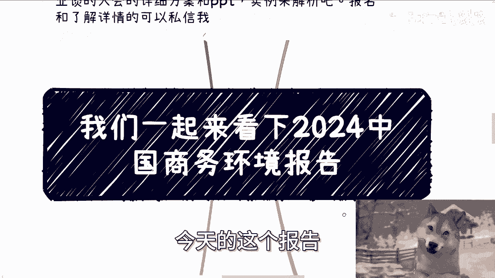

在本节课中，我们将一起解读一份名为《2024中国商务环境报告》的文件。这份报告虽然名称听起来普通，但内容涉及服务业、金融业、制造业和科技产业等多个领域，主要探讨中国与全球的局势。我们将梳理报告的核心数据与观点，并尝试理解其背后的商业含义。

---

## 报告背景与概述

这份报告由在华美国企业商会发布，主要反映了外资企业对中国市场的看法。报告内容基于对会员企业的调查，涵盖了财务表现、投资意向、商业挑战等多个维度。

需要明确的是，受访主体是外资企业，因此报告视角与中国本土中小微企业可能存在差异。在阅读时，可以将其视为一个了解市场趋势的参考，但不必过度深究与自身业务无关的细节。

---

## 行业分类与财务表现

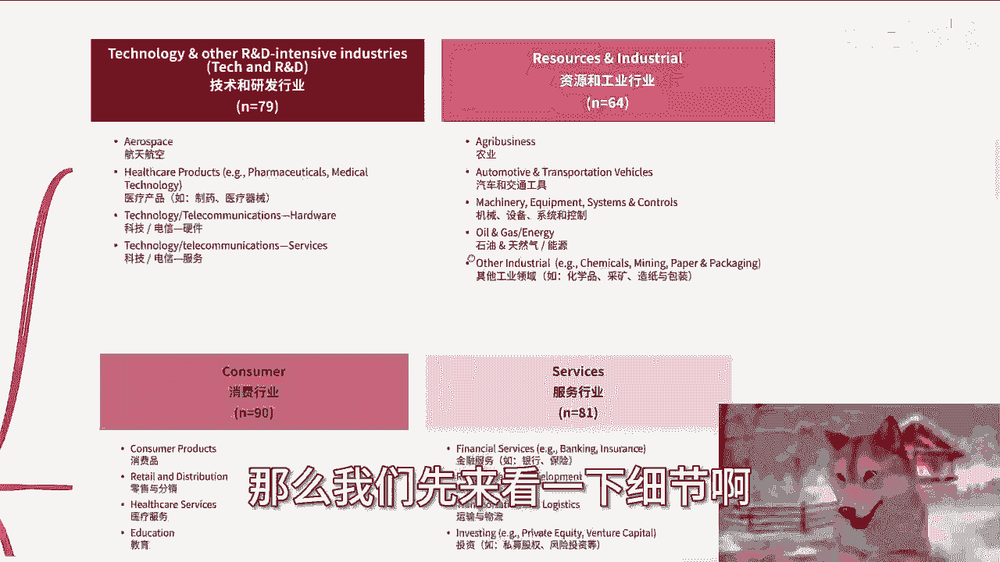

报告将受访企业划分为以下几大类：

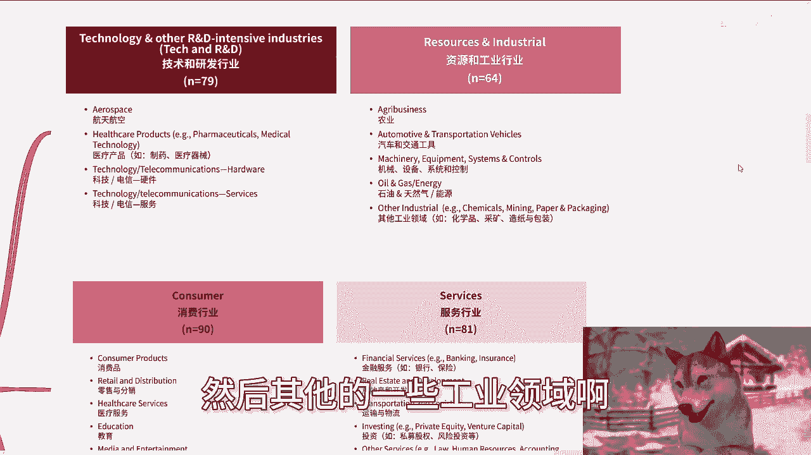

*   **技术与研发**：包括航天航空、医疗科技、电信、硬件、软件等。
*   **资源与工业**：包括农业、汽车交通、器械设备、石油天然气等能源领域及其他工业。
*   **消费行业**：包括消费品、零售、医疗服务、教育、媒体与娱乐、酒店旅游休闲等。
*   **服务行业**：包括金融服务、房地产、运输、投资，以及法律、人力资源、会计等专业服务。
*   **其他行业**：包括社会公共非营利组织、供应链管理、产品开发外包、投资贸易等。

接下来，我们看看2023年各行业在华业务的财务表现。

与2022年相比，**技术研发、资源与工业、服务行业**的亏损面有所扩大。然而，**消费行业**的表现则明显改善，亏损减少，大幅盈利的企业比例增加。这种差异很可能与疫情后的消费复苏趋势有关。

---

## 投资重要性及商业环境感知

上一节我们看了财务表现，本节中我们来看看外资企业如何看待中国市场在其全球布局中的位置。

报告显示，将中国列为**全球前三大投资目的地**的企业比例在2023年有所下降。同时，几乎所有企业都认为中国市场的整体局势对其业务“极其重要”。

在商业环境方面，近三分之一的受访企业认为，相比本土企业，**外资企业受到了更多不公平待遇**。这种感受在消费行业尤为明显。报告指出，这种“不公平”更多体现在政策层面，例如市场准入或监管差异。

---

## 核心商业挑战分析

以下是外资企业在华运营时面临的前五大商业挑战（基于2024年预测数据）：

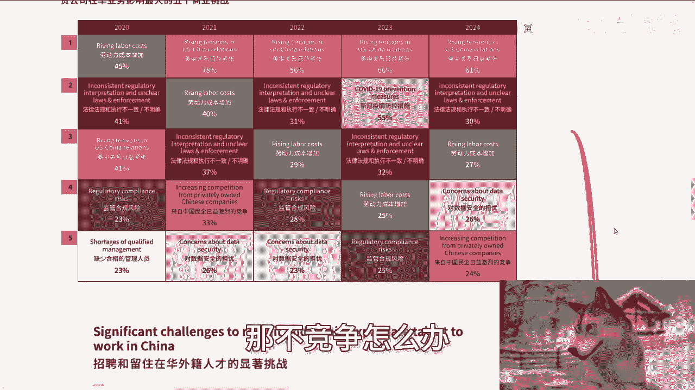

1.  **中美关系日益紧张**：地缘政治成为最首要的关切。
2.  **法律法规不一致与不明确**：监管环境的多变和模糊是长期痛点。
3.  **劳动力成本增加**：运营成本持续上升。
4.  **对数据安全的担忧**：随着法规完善，企业对此的忧虑加深。
5.  **来自中国本土企业的日益激烈竞争**：市场竞争白热化。

值得注意的是，如果将视角切换到中国本土的创业者，面临的挑战清单也高度相似：**政策法规、运营成本、数据合规、同行竞争**。这揭示了在当前环境下经营企业的普遍压力。

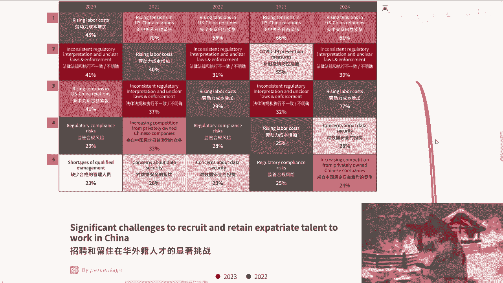

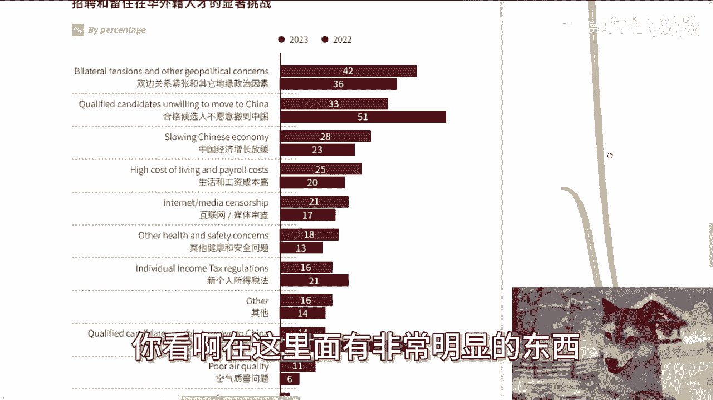

---

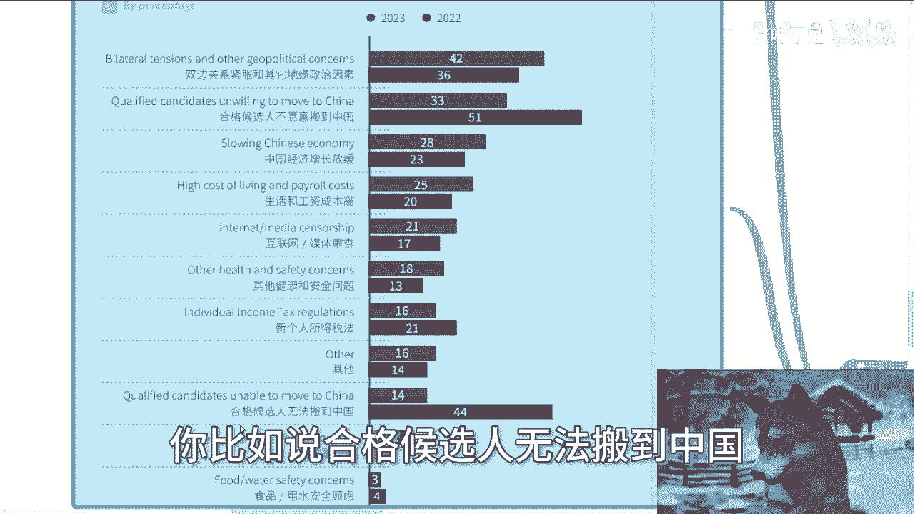

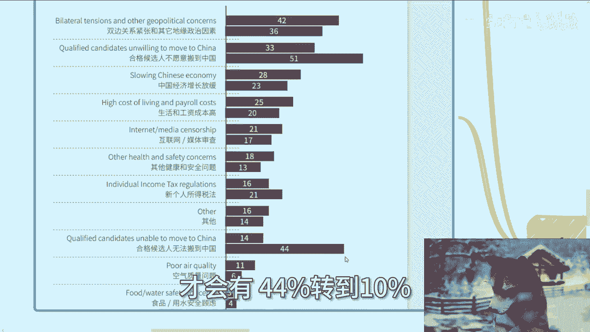

## 人才招聘与未来展望

在招聘和留住外籍人才方面，挑战也在变化。2023年，“合格候选人无法搬到中国”这一困难的比例显著下降，这可能得益于中国相关人才政策的优化。

然而，另一些挑战则更加突出，例如：**地缘政治因素、中国经济增长放缓、生活与工资成本高、互联网媒体审查**等。报告预计，其中部分挑战在未来几年可能进一步加剧。

对于未来两年的业务展望，受访企业的态度大致呈“乐观、中立、悲观”各占三分之一的分布。在具体因素上，企业对“国内市场增长”和“盈利潜力”的看法相对分化，但对“竞争压力”的感受普遍趋于增强。

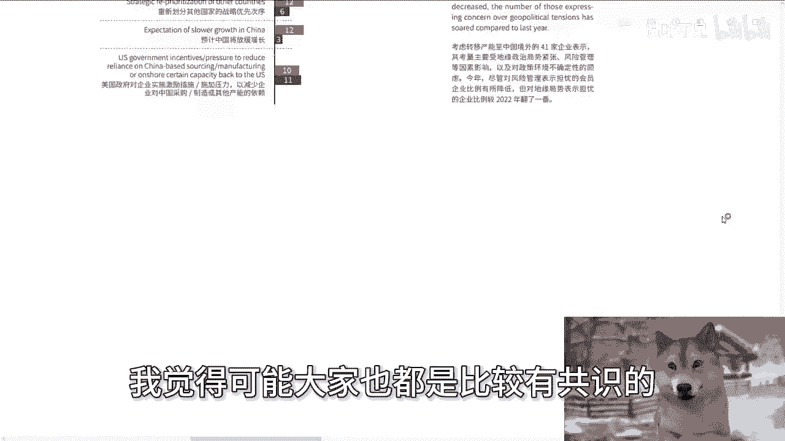

---

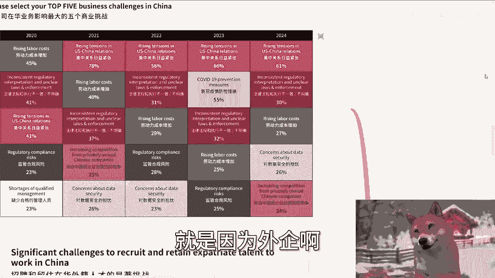

## 产能转移的动因与总结

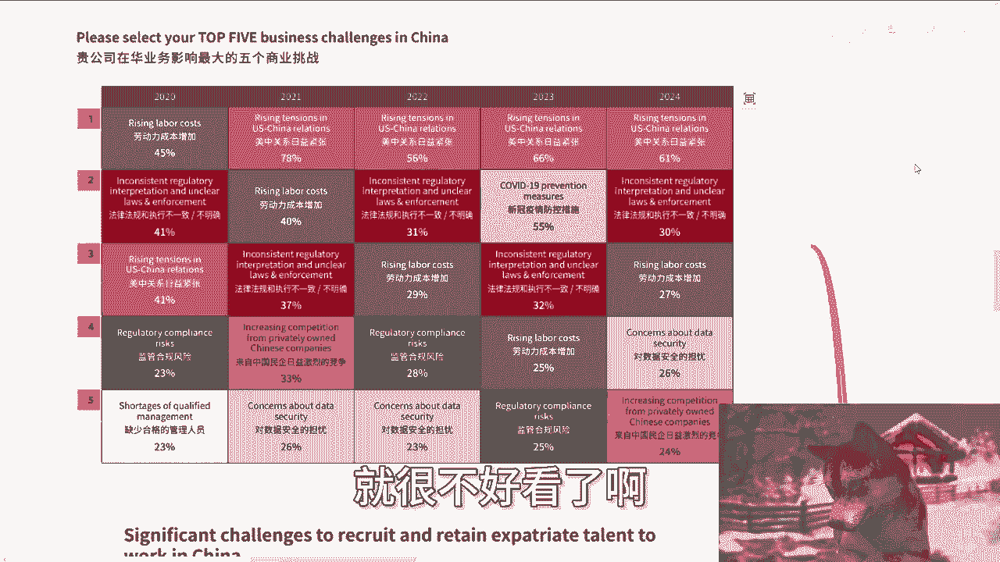

最后，我们看看企业考虑或将产能转移出中国的主要原因。排名前列的包括：

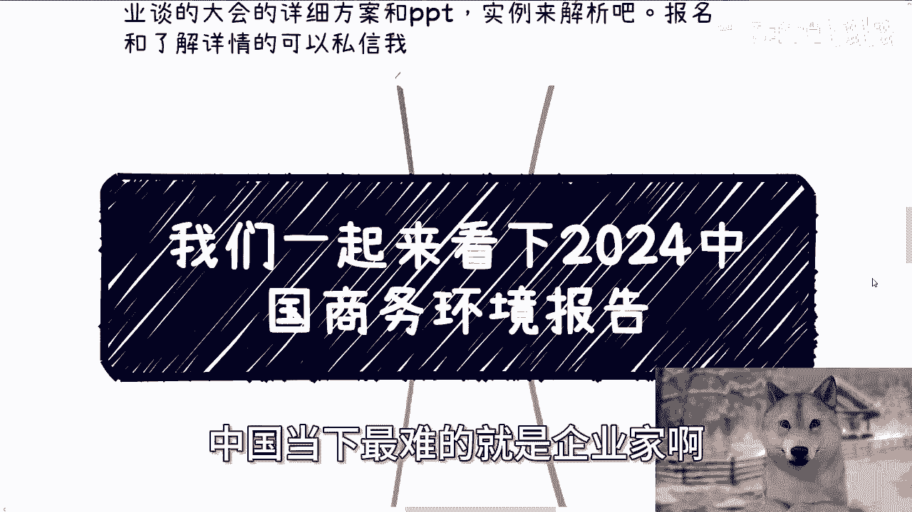

*   **政治原因**（如中美关系）。
*   **对不确定的政策环境存在顾虑**。
*   **市场准入壁垒或政策使外企处于不利地位**。
*   **各类成本（包括劳动力）上升**。
*   **预计中国经济增长将放缓**。

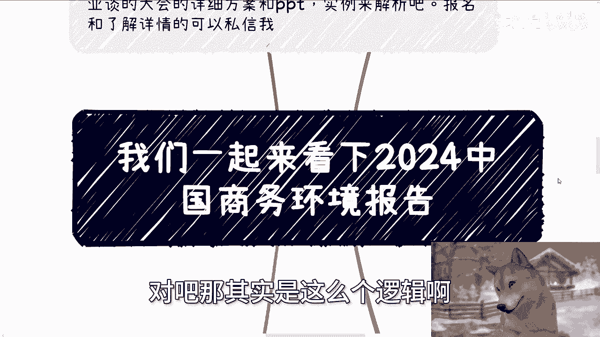

本节课中我们一起学习了《2024中国商务环境报告》的核心内容。报告从外资视角勾勒出中国市场机遇与挑战并存的图景：消费复苏带来亮点，但地缘政治、监管环境、成本上升和激烈竞争构成了主要压力。

需要强调的是，外资企业的感受存在其特定立场。可以想象，对于抗风险能力更弱的**中国本土中小微企业及企业家而言，面临的困难可能更为严峻**。这份报告的价值在于为我们提供了一个参照系，帮助理解当前复杂的商业生态。在制定自身策略时，仍需结合实际情况进行深入分析。