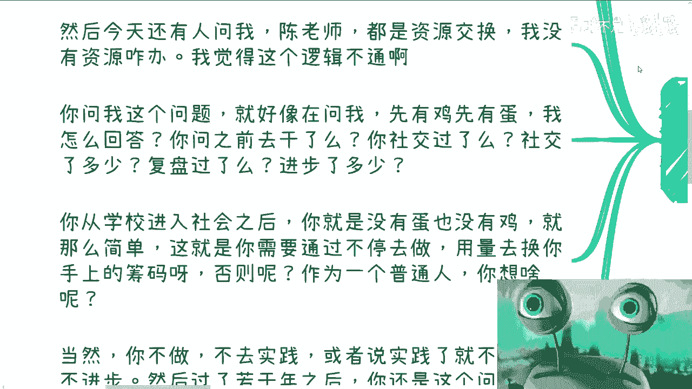
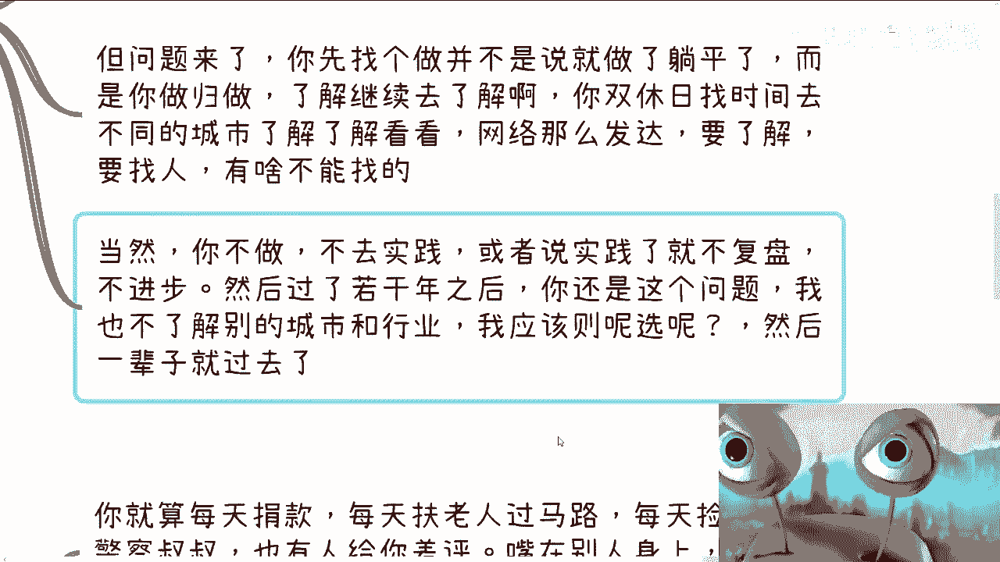
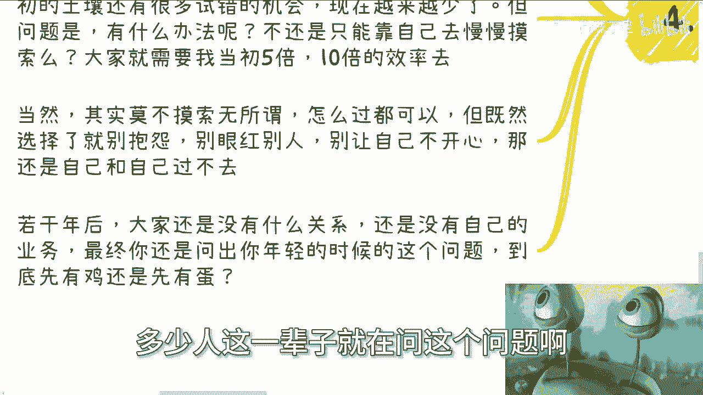

# 我们今天来讨论个问题-先有鸡先有蛋---P1---赏味不足---BV1VN4y1n7pN

在本节课中，我们将探讨一个经典的职业发展迷思：“先有鸡还是先有蛋”。许多人在规划职业、创业或积累资源时，常常陷入这种循环困境。我们将通过分析四个常见的具体问题，来揭示其背后的思维误区，并提供清晰的行动思路。

## 概述：问题的本质

“先有鸡还是先有蛋”的比喻，形象地描述了人们在起步阶段面临的普遍困境：没有资源（蛋）就无法开始行动，但不开始行动（鸡）又无法获得资源。这种纠结导致许多人停滞不前。

## 第一节：关于“社交与资源互换”的迷思

上一节我们概述了问题的本质，本节中我们来看看第一个具体表现：社交资源困境。

许多人认识到社交的本质是资源互换，但随即陷入“我没有资源，如何开始社交”的疑问。这就像在问“先有鸡还是先有蛋”。关键在于，**初始资源 `R_initial` 往往趋近于零**，即 `R_initial ≈ 0`。等待拥有资源后再行动是不现实的。

以下是关于此困境的核心分析：

*   **现状认知**：大部分人毕业进入社会后，在商业和职业层面，初始的“鸡”（行动资本）和“蛋”（资源成果）都很少。
*   **破局方法**：需要通过持续的行动和实践，用数量换取筹码。公式可以表示为：`积累的资源 R = ∫ (行动量 A × 复盘效率 E) dt`。即资源是行动量与复盘效率对时间的积分。
*   **停滞后果**：如果不行动，或者行动后不复盘、不进步，那么若干年后，你依然会卡在同一个问题上，循环往复。

## 第二节：关于“行业与城市选择”的困惑

解决了资源起步的困惑后，另一个常见问题是方向选择。

许多人纠结于哪个行业好、哪个城市有发展、该做什么业务。这同样是一个“先有鸡还是先有蛋”的问题：没有尝试和了解，就无法做出明智选择；但不去选择，又无法开始尝试。

以下是破解方向困惑的步骤：

*   **自我审视**：问自己尝试过几个行业、去过几个城市、深入研究过多少商业模式。如果答案都是“没有”，那么空想和纠结就没有基础。
*   **行动优先**：在缺乏充分信息时，优先选择一件事开始做，同时保持开放心态继续了解。行动与了解可以并行，例如利用业余时间调研、通过网络接触业内人士。
*   **克服恐惧**：担心遇到骗子或对方不理会是正常的，但这不能成为不行动的理由。用行动去验证，在实践中调整。

## 第三节：关于“差评与风险”的过度担忧

确定了方向并开始行动后，一些人会被执行过程中的潜在风险吓退。

例如，创业者担心产品收到差评、客户要求退款，活动组织者害怕有人“砸场子”。这种对负面情况的过度担忧，本质是试图在行动前控制所有不可控因素。

以下是应对风险担忧的正确心态：

*   **接受不可控性**：嘴和手脚长在别人身上，你无法完全控制他人的评价和行为。这是商业世界的客观事实。
*   **区分手段与目的**：合同、条款等是管理和威慑的手段，但不能天真地认为它们能杜绝所有风险。核心是建立应对机制，而非幻想零风险。
*   **在行动中解决**：“万一”的问题，只有在“一万”次实践中才能找到答案。正确的逻辑是：`开始行动 → 遇到问题 → 解决问题 → 积累经验`。停滞不前，问题永远只是假想的“万一”。

## 第四节：关于“普通人如何积累”的灵魂拷问

最后，我们直面最根本的焦虑：作为一个普通人，如何从零开始积累资源、背书和关系？

这是所有问题的集大成者，也是最典型的“鸡与蛋”困境。抱怨起点低、环境差（没有“土壤”）是容易的，但这改变不了现状。

以下是给普通人的积累路径：

*   **认清现实**：从零开始是大部分人的共同起点。区别在于，过去的试错成本可能更低，而现在需要更高的效率和更强的执行力。
*   **主动摸索**：积累没有捷径，核心公式依然是：`资源积累 = 持续行动 + 高效复盘 + 时间`。你需要用比前人更高的效率去执行这个公式。
*   **承担选择**：你可以选择安于平淡，但就不要抱怨收入低或机会少。你也可以选择努力摸索，那就必须接受过程中的不确定性和挫折。**选择即承担**。
*   **避免循环**：如果既不满足于现状，又不采取实质行动，那么一生都可能困在“如何开始积累”这个问题里，毫无意义。

## 总结

本节课中，我们一起学习了如何破解“先有鸡还是先有蛋”的职业发展困局。

我们分析了四个具体场景：
1.  **社交资源**：从接近零的资源开始，靠行动和复盘积累。
2.  **方向选择**：用行动替代空想，在过程中持续了解。
3.  **执行风险**：接受不可控性，在行动中解决问题。
4.  **白手起家**：承认起点，提高效率，为自己的选择负责。

核心在于认识到：**“鸡”（行动）和“蛋”（资源）不是在思考中先后出现的，而是在“行动-获得反馈-调整”的循环中共同生长出来的。** 停止在思维层面空转，迈出第一步，并在实践中不断迭代，是打破僵局的唯一途径。