# 我们今天来讨论个问题：先有鸡先有蛋 - P1 - 赏味不足 - BV1VN4y1n7pN

大家好，又是我今天还是礼拜天，让我把这个眼睛往上调一点啊。

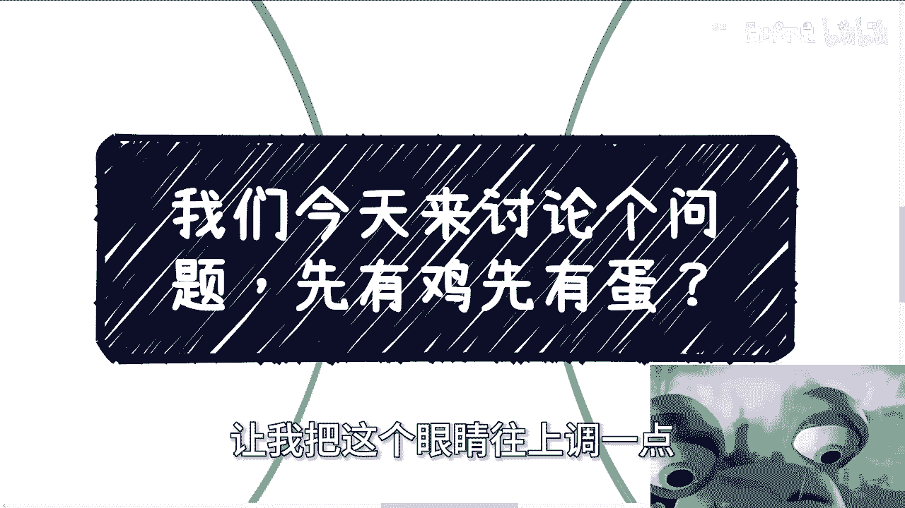

好那么我们今天来讨论个问题，叫做先有鸡先有蛋是吧，那我要是真的来跟你们讨论，先有鸡先有蛋。

那那大家肯定觉得嘛陈老师有毛病是吧啊，嗯我一共写了四点啊，第一个叫做社交呢。

都是资源互换啊，但是我没有资源对吧，好你看啊对啊。

这个就是当下所有人面临的问题啊，这就跟我以前说拉皮条是一样的，那有很多人要问我了，哎呀我不想拉皮条，哎呀我想做什么事情啊，这个陈老师我一定要这个做个公司啊，要创个业，要融个资，对吧哈。

我就问我就问大部分的人，你不拉皮条，你能干嘛，你会干嘛对吧，不是你会干嘛，我们会干嘛，我们干啥是不能被替代的，就真的你说大部分人活着得有个逼数嘛对吧，你你不拉皮条，你干嘛呢对吧。

眼高手低没意思的呀，谁不想闯一番事业，然后今天还有人问我，他说陈老师都是资源置换啊，我没有资源怎么办。

他非要问我，你知道吗，然后他跟我说，我觉得这个逻辑不通，你问我这个问题之前好像问我先有鸡先有蛋，你让我怎么回答，而且先有鸡先有蛋，也是你去摸索的，你来问我是跟你说先有鸡还是先有蛋的，我说了也没用啊对吧。

而而且另外一点你去问之前，你去做过没有对吧。

你社交过没有，社交过多少，复盘过多少，进步过多少对吧，你从你你要这么想啊，你从学校进入社会之后，你就没有机就事实来讲啊，就所有的人我不管你们什么学校出来的，你都是没有鸡，也没有蛋。

你别别别别跟我提那些什么教授，什么什么，你做过什么项目没有用到，我跟你讲啊，不要来跟搞这些，有的没的，你们你们只是我跟你说啊，但凡毕业几年之后，在社会上什么都没有啊，什么都没有，就这么简单啊。

就是这就是需要你通过不停的去做，然后用数量去换，变成你手上的筹码，否则呢我就问，否则呢你都觉得大部分人都是普通人，你手头上也不长角，那你想啥呢对吧，当然啊，还是那句话，你不做，你不去实践。

或者说你实践了也不复盘，不进步对吧，你你不会思考，那么过了若干年之后。

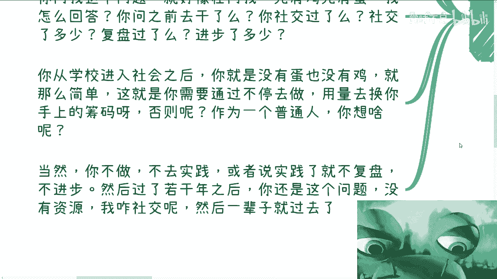

若干年我不知道若干年是多久啊，你过了若干年之后，你还是这个问题啊，你还是在问，我就说哎你好哎，陈老师，就是我这个资源置换，我也没有资源怎么办，你过了500还是个问题啊，但是然后一辈子就过去了。

真的我跟你讲，你后面时间过得很快的，你知道吗，你会觉得刚毕业的时候可能会很难。

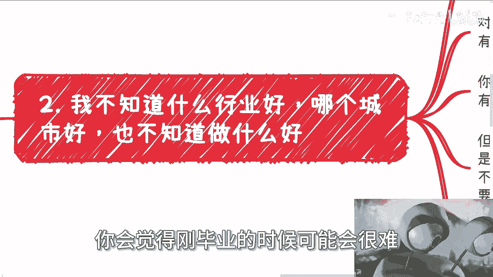

但是我跟你讲，你后面这日子混的有点快。

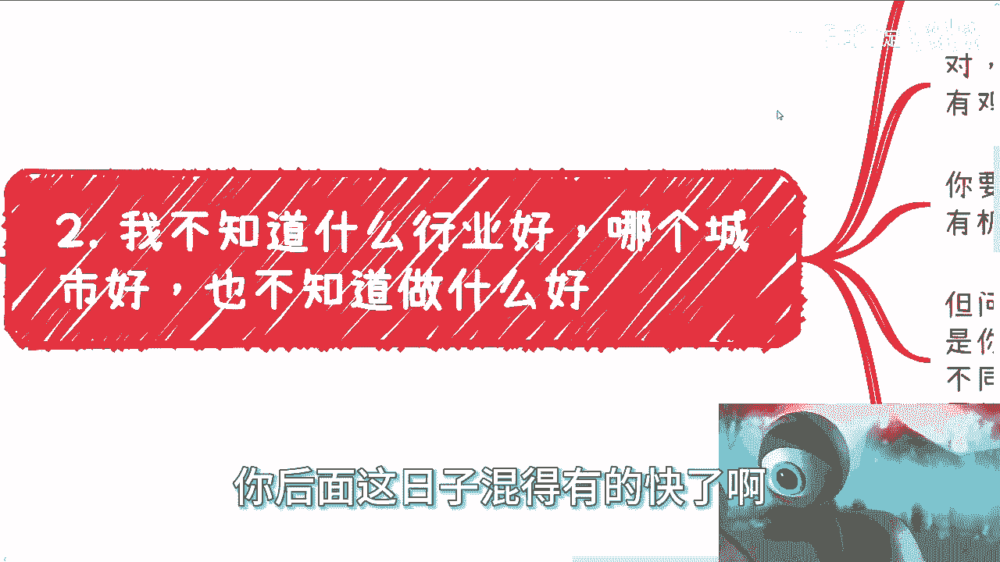

然后第二个叫什么叫我不知道什么行业好啊，哪个城市好，也不知道做什么好好看啊。

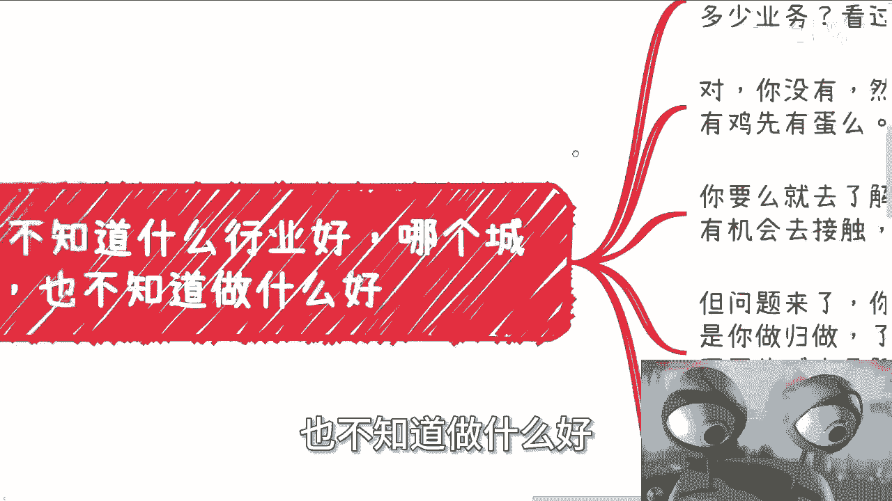

我就问你做过几个行业，你去过几个省市，你做过多少业务。

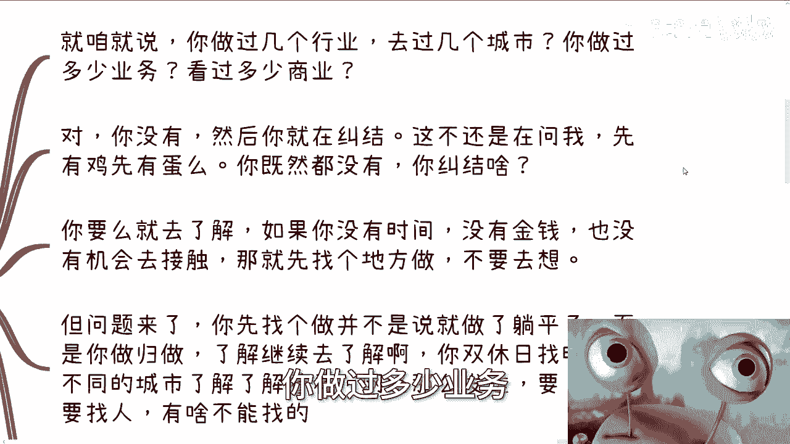

你看过多少商业对吧，你被骗过多少钱对吧，你没有，然后你就开始纠结，但所有人都是都在那边纠结，还有我跟你讲，还搞笑了，还有人纠结我要不要结婚对吧，你你这个问题不也是在问我先有鸡先有蛋吗，就是你既然都没有。

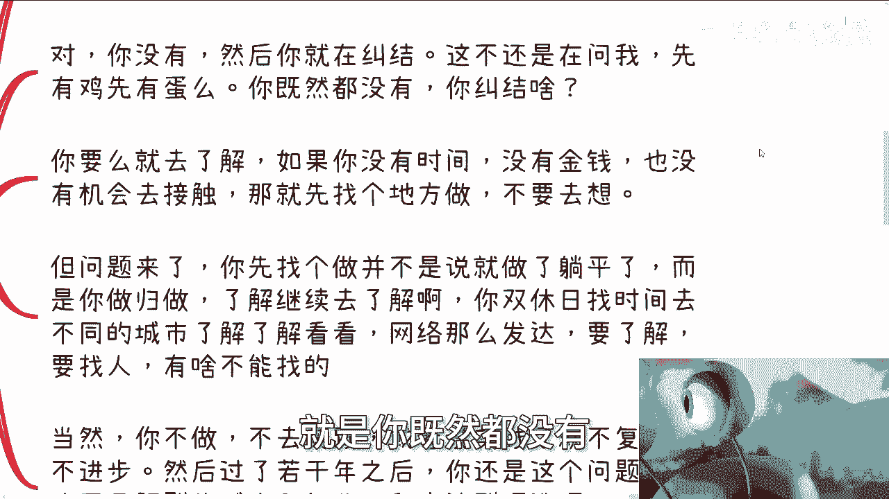

你甚至就像我说的，你都没去过几个城市，你都没出过自己的城市，你都没有做过什么业务，那你纠结啥呢对吧，你摆在面前这两条路你要么就去了解对吧，你如果没有时间，没有金钱，也没有机会去了解。

那么你就先做，你不要去纠结他对吧，你不要在那边想，我到底先有鸡先有蛋，谁知道你先有鸡先有蛋，但是问题来了，你先找一个东西做，并不是说就去做就躺平了，或者说就一头扎进去做了，而是说你做归做了解。

继续要去了解对吧，怎么会没时间呢，我跟你讲，所有人跟我说没时间我都觉得是什么，就是你懒，就是你不够缺钱，我觉得这句话就是你不够缺钱，或者说你野心不够大对吧，你双休找时间去不同的城市，了解了解怎么样的呢。

网络这么发达，要了解要找人有什么找不到的对吧，然后这个时候又有人说了，哎又回到刚刚第一个问题，陈老师，我没有资源，人家为什么跟我聊，陈老师，这些人万一是骗子怎么办怎么办呢，那你每天就在那边想呗。

能怎么办能怎么办，我就问能怎么办。

当然啊你不做不去实践，或者说实践了就不复盘，不进步，那过了若干年后，你不还这个问题吗，对不对。

第三个啊，他说创始人万一有人给我差评怎么办啊，万一有人给我退款怎么办。

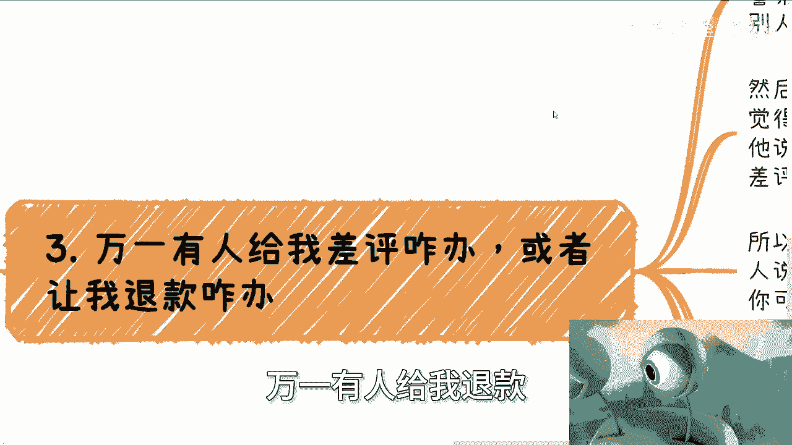

我真的我跟你们讲啊，不是我说你们你那你去看看那些做实业的，就做那个餐饮的，做些其他的，人家要像你们这么想，那他妈这辈子店不要开了对吧，那弓不要打了。

钱不要赚了哦，你现在就这么想了，那我就说万一你哪一天一年赚了一个亿，两个亿怎么了，你晚上别睡觉了，你你你超过20个保镖在身边吗，好了这不奇怪了吗，真是是吧，哦我跟你们讲，真的高情商叫什么。

高情商叫呃未雨绸缪对吧，这个叫为未来考虑啊对吧，那这个好像太高了一点智商情商啊，我觉得这正常来讲。

就他妈的瞎他妈扯瞎他妈想格局太小。

你就算每天捐捐款，每天扶老人过马路，每天去捡钱，交给警察叔叔，也会有人给你差评，什么意思，嘴在别人身上。

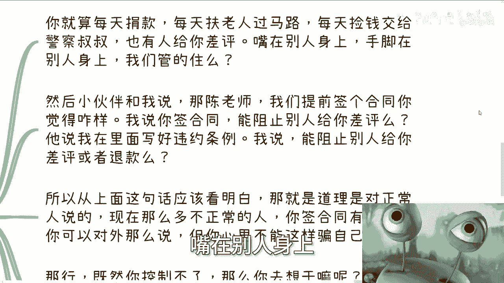

手脚在别人身上，你管得住吗对吧，然后小伙伴跟我说，那陈老师我我我他说我办个活动啊，我我我就怕有人来差评啊，那我说啊，他说我们能不能提前签个合同，你觉得怎么样，我说你签合同能阻止别人给你差评吗对吧。

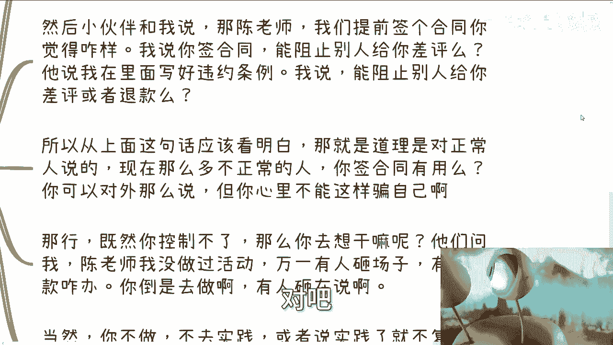

然后他又说了，我在里面写一些什么违约条款怎么样，我说那你能阻止别人给你差评或退款吗，你不能啊，对不对，你所以上面那句话你已经明白了，就是道理是对正常人说的，所以现在那么多不正常的人。

你合同签了有用吗啊有用吗，而当然了，就像我们上一个视频说的，你对外去说可以这么说，你对外去威慑，可以这么威慑，但你自己心里不能这么骗自己啊对吧，你可以对外说我们签合同，我们怎么样怎么样。

但你不能心里面就觉得哦，我签了可以了，高枕无忧啊，好那行，既然你控制不了，那么你就让他干嘛对吧，你说他们问我创老师，我没做过活动，那万一有人来砸场子怎么办，有人退款怎么办，那他妈你倒是去做啊，对不对。

你怎么有人砸了再说啊，看我的眼神，看到你这个一样的道理啊，你若干年后你不做，你不还这个问题吗，是啊好，那第四个灵魂拷问陈老师，我什么都没有啊，这评论区已经出现过好多次了，我什么都没有，我是个普通人。

我怎么去积累自己的资源，自己的背书还有些关系对吧，是我跟你讲，你这话放我毕业，我他妈也想问我问谁去啊啊谁不想啊，我早就跟你们讲过了，你们的日子要比我好过多了啊，我实习的时候是他妈卖水饺贴广告啊。

啊卖卖报纸啊，我他妈一个月才挣几个钱啊，我当时也想问啊，谁谁回答我啊啊，对吧，我觉得唯一的区别是什么，唯一的区别就是我觉得当时啊，当时我相对你们来讲，我有比较大的缓冲期，而且有比较好的土壤去试错。

现在这种土壤越来越少了，但是大部分人没有感知，但是我现在告诉你们了，你们的土壤已经没有了，但是问题在于这个问题啊，就是你说有没有缓冲期，有没有土壤，这是我们能控制的吗，不能那我们不能控制。

那我们讲它干嘛呢，你有什么别的办法，不能没有，那不还是只能靠自己慢慢去摸索吗，只不过就是说我觉得大家需要用我当初五倍，十倍的效率去摸索对吧，当然就如我之前的视频说的，你摸摸我所无所谓，怎么过都是过。

但如果你选择了一种一种过法，你说哎我不摸索对吧，我觉得我就是个普通人对吧，我就我就唉陈老师说的这个东西，我我我也不是那种少数人，我摸不透啊，我也做不了，你既然选择了，那就别抱怨，别眼红别人。

别让自己不开心，别就是说你既然选择了所谓的平淡，又在那边说哎呀为什么我赚不到钱，哎呀为什么我这offer这么低，哎呀为什么为后面等我年纪大了找不到工作。

你自己选的呀，对不了，那你若干年后大家没什么关系，年纪大了，你最终找不到工作，被淘汰下来的，那你最终不还是开始问这个问题吗，哎我怎么去积累自己的资源，我怎么积累自己的关系，我怎么积累自己的背书。

我怎么让自己能赚到钱，那不还是先有鸡先有蛋吗，对吧，没有用的，一点用都没有的，你会发现多少人这一辈子就在问这个问题啊。

对吧，有意义吗，没有意义啊，除了浪费时间有任何意义吗，看似可能你们问这些问题，在别人看似非常睿智对吧，就觉得哎呀好像你看问题看的很明白，你明白个屁呀，哈你看到什么问题了，所有都是表面层面的东西。

没有任何实际的东西，真的就，对吧，我都不知道说啥，我都无语了好吧，我觉得这个问题一样的，就你们真的好好想想吧。

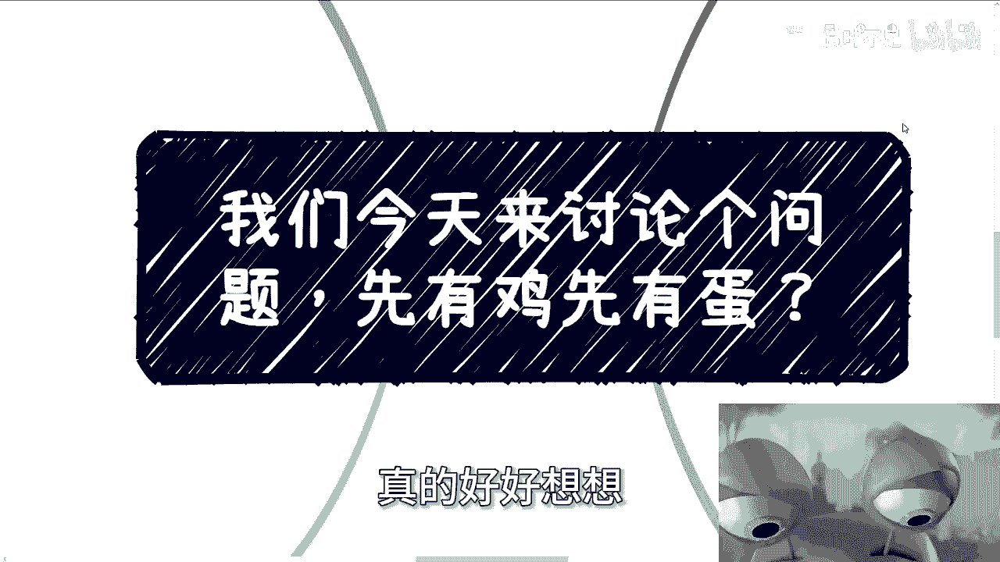

好好想想都一样，我跟你讲千篇一律啊，包括这个之前还有人说我不接地气。

那我就来问你们怎么算接地气啊，啊我带你们现在先来赚钱，来，我来保证每个月能给你们带2000块钱，这叫接地气啊，嗯想屁吃，我觉得这叫啊有那就是庞氏，那就是传销，那想啥呢啊，哎呀我真的有时候想想他妈的唉。

人就是这样子，没办法，我还记得之前还有个人啊，还有个人评论区说的很搞笑，就让我哭笑不得，他说什么，他说陈老师，我之前关注你呢，是觉得你能给我，你能让我赚到钱，我真的没想明白哦。

原来这世界上还有人关注谁能赚到钱呢，嗯真的对吧，你看你看我的眼神，看到了如此智慧的眼神是吧，不明白好吧，就先这么着吧，那个好吧，然后你们反正这个职业规划好吧，商业啊，包括有什么合同啊。

包括有什么最近有人拉你们做项目啊，或者怎么样子啊，啊你们要觉得不放心的啊，可以整理整理好吧。

