# 我们做商业最终要达到的样子和效果是什么----P1---赏味不足---BV1t4421U7Fp_no

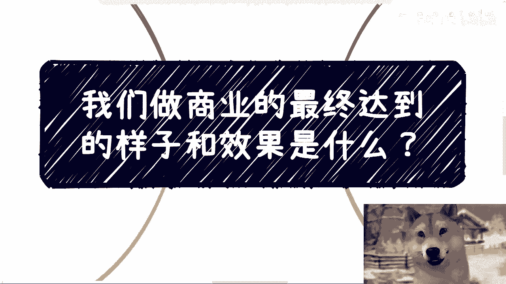

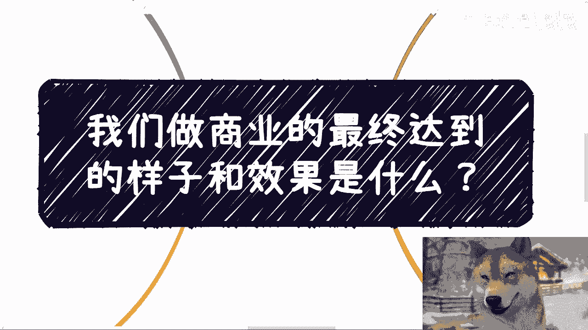

在本节课中，我们将探讨商业运作的最终目标与理想形态。我们将从基础的“长尾效应”开始分析，逐步深入到更高级的商业模式，最终揭示商业的终极追求。

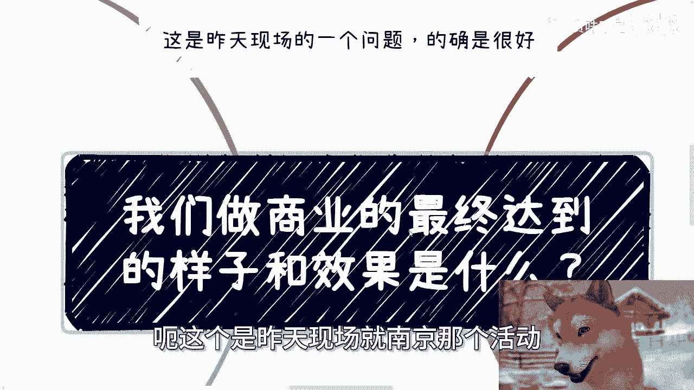

---

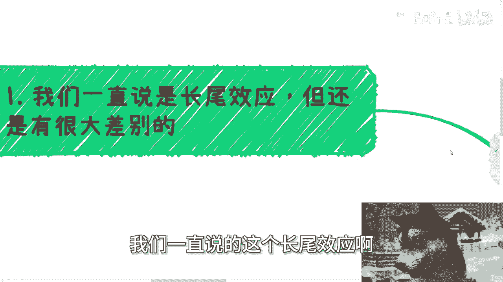

## 概述：商业的演进路径

商业活动有多种形态，其最终追求的效果也各不相同。有人曾提出一个很好的问题：商业的最终形态究竟是什么？要理解这一点，我们需要从最常见的“长尾效应”说起。

---

## 一、 长尾效应及其局限 🎯

我们常说的“长尾效应”，是指一次投入或劳动，能在未来持续产生收益。但这其中存在很大差别，关键在于看什么业务的长尾。

以下是两种典型的长尾模式：

1.  **制作课程**：制作一门课程后，未来每卖出一份，你都能获得一定比例（例如10%）的收益。
2.  **业务对接与分红**：为他人对接业务后，可以签署合同，约定未来每年从该业务流水中抽取一定比例（例如10%）作为回报。这虽然在税务上不叫“分红”，但其“躺赚”的逻辑与分红无异。

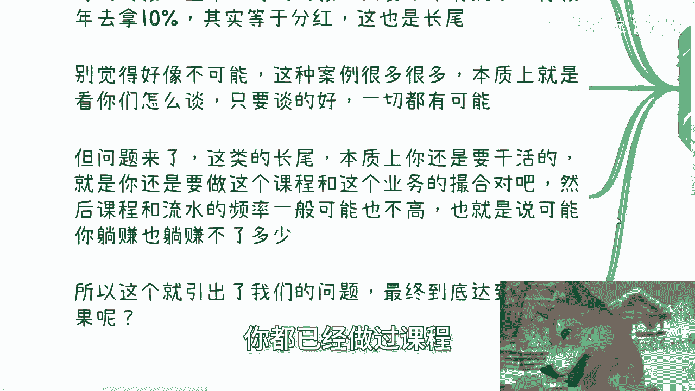

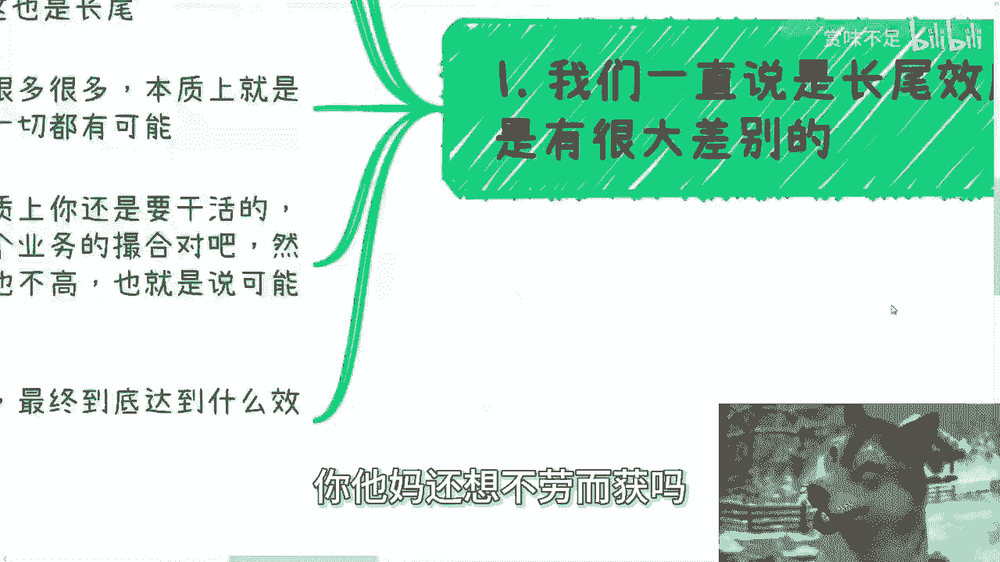

**核心概念**：`收益 = 初始劳动 × 持续分成比例`

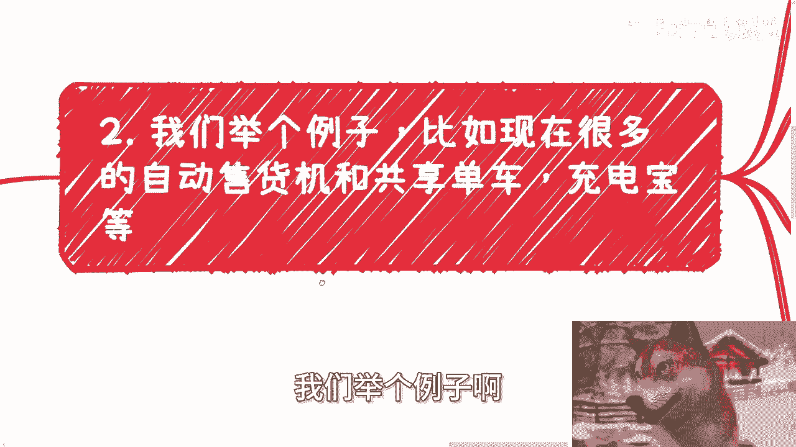

然而，这种模式存在两个明显的弊端：
*   **第一，本质上仍需劳动**：无论是制作课程还是撮合业务，初始阶段都需要投入工作。
*   **第二，收益受频率限制**：如果课程销量或业务流水频率不高，那么“躺赚”的收益也有限。

这就引出了我们的核心问题：有没有更高级的形态，能更好地解决这些问题？

---

## 二、 实体网络模式：解决频率问题 🚲

上一节我们提到了长尾效应的局限。本节中，我们来看看一种能解决“需求频率”问题的模式：实体网络。

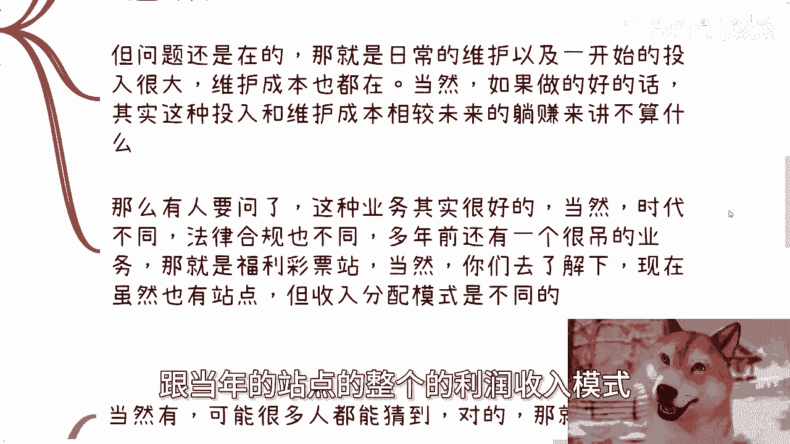

例如自动售货机、共享单车、共享充电宝等业务。这类业务的目的往往是“一鱼多吃”，进行资本运作，争取融资或上市。即使无法上市，铺开市场后也能享受长期的长尾收益。

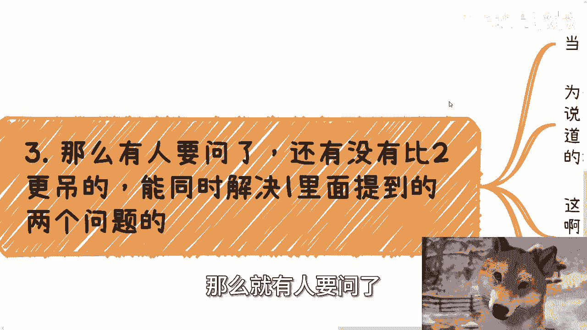

它们解决了第一节中提到的第二个问题（频率低），因为这些都是高频刚需。但问题依然存在：

*   **初始投入成本高**：需要大量资金铺设设备。
*   **需要日常维护**：并非完全“不劳而获”。

当然，如果运营成功，未来的持续收益可以覆盖这些成本。这种模式已经比单纯的长尾更进一步。

---

## 三、 终极形态：金融与资本运作 💹

那么，有没有模式能同时解决“需要初始劳动”和“收益频率低”这两个问题呢？有，那就是金融与资本运作，也就是许多人理解的“不劳而获”。

为什么金融是终极形态？
*   **脱离实体**：金融是虚拟的，不需要实体资产支撑（如放贷、理财、与贷款公司分润）。
*   **复利滚动**：资本可以自我增殖，实现“钱生钱”。
*   **高杠杆**：用少量资金撬动巨大收益。

这也是为什么许多大型公司最终都会涉足金融借贷业务（如滴滴、美团）。资本运作的逻辑也是如此：天使轮投资，B轮退出；公司上市后抛售部分股份，剩余股份留在二级市场持续享受收益。

**核心逻辑**：`最终收益 = 初始资本 × (风险系数 + 复利效应)`

这本质上就是商业的最终形态：一种脱离物理世界、依靠规则和资本滚动的游戏。

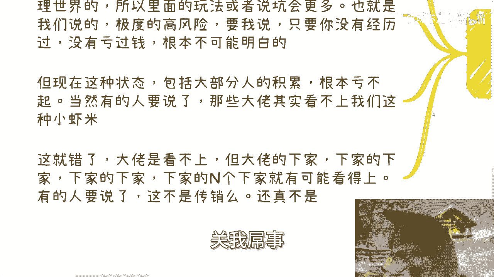

---

## 四、 实践路径与高风险警告 ⚠️

有人会想：能否一开始就直奔金融这个目标？如果你是金融专业或相关行业，或许有机会。但这与书本知识关系不大，更取决于**关系、人脉以及对风险的深刻认知**。

金融游戏因为脱离实体，其玩法和陷阱更多，风险极高。一个残酷的现实是：**没有亏过足够多的钱，很难真正理解其中的规则**。认知无法替代教训。在当下，大部分人的积累根本承受不起这样的亏损。

那么，普通人如何接触？大佬看不上小资金，但大佬的下游，以及下游的下游（N级下游），可能存在机会。这并非法律意义上的“传销”。传销的定义在于**发起方制定了多级分销规则**。而如果只是每一层与自己的直接下一层进行利益分配，链条自发形成，则处于模糊地带。社会上的层层外包在逻辑上与此有相似之处。

---

## 五、 回顾与总结 📝

本节课我们一起学习了商业形态的演进路径：

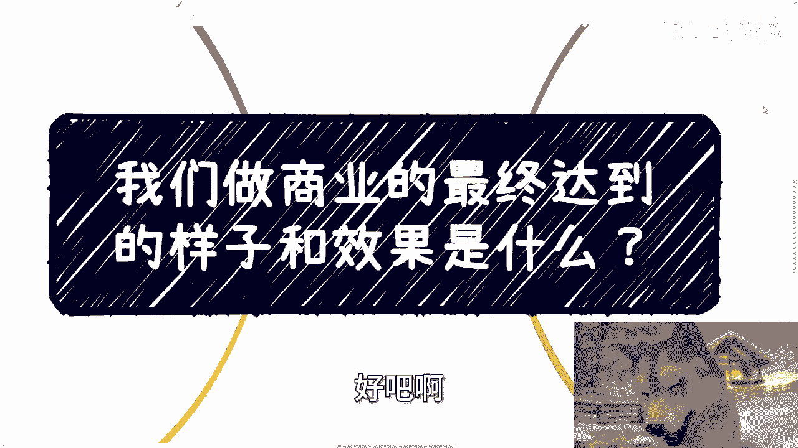

1.  **基础长尾**：通过一次劳动获取持续分成，但仍有劳动投入和频率限制。
2.  **实体网络**：通过铺设高频刚需的实体网络（如共享经济）解决频率问题，但需承担高额初始投入和维护成本。
3.  **金融资本**：商业的终极形态，脱离实体，通过资本运作和金融工具追求复利，实现“不劳而获”式的收益，但伴随极高的风险。

商业的最终目标，对于许多参与者而言，就是追求一种高效率的资本回报。即便是当下热门的“无人驾驶”等高科技项目，其底层商业逻辑也常常是：获取数据 → 争取融资/政府补贴 → 扩大市场估值 → 最终实现资本套利。

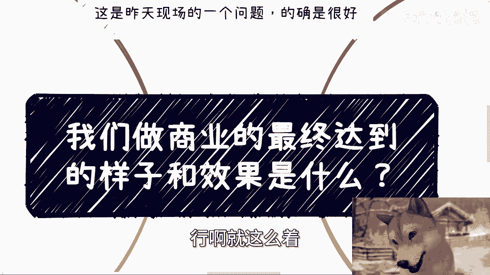

所有的布局，最终往往指向资本的流动与增值。理解这一点，是进行深层商业规划的关键。