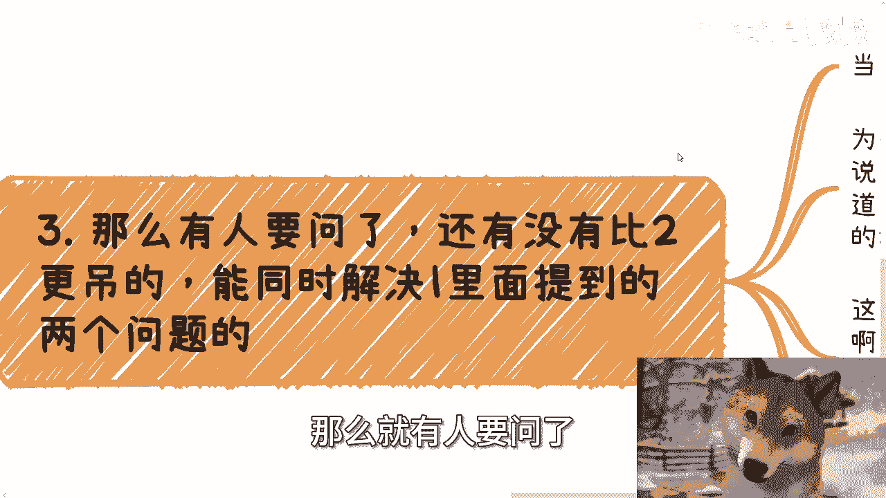

# 我们做商业最终要达到的样子和效果是什么？ - P1 - 赏味不足 - BV1t4421U7Fp

好我们今天来讲这个主题呢比较很重要啊，就是我们说啊做商业的这个最终目的啊，达到的这个最终最终效果是什么，也有人也有人。

就是我们可以这么理解啊，就达到这个最终形态啊，额这个是昨天现场。

就南京那个活动问的一个问题啊，我觉得也的确特别好，首先啊我们一直说的这个长尾效应啊。

呃但是呢还是有很大差别的，我们举个例子啊，一个呢我们要看什么业务的长尾，这个是很重要的，你比如说你做了一个课程，那接下来每次卖出个客户，你可以拿10%对吧啊，这是长尾，没有错啊，没有错。

那么我们再比如说啊，你说你做了一个业务对接，这个业务对接呢，只要未来有流水，你按照每一年拿10%啊，其实等于分红啊，我顺便在这个地方提一嘴啊，就是很多小伙伴你们做事情啊，不要这么死板啊。

不是说只有股东才能分红的，你明白吗，就是哼这什么意思啊，就是说你可以跟对方签署一个合同，然后你说哎我就因为给你对接的这个业务，所以我每一年要拿你流水的10%对吧，就是你虽然从模式上来讲，从税收上来讲。

你这笔钱绝对不是分红的这个税收，但是你的这个逻辑跟丰厚没有区别，你也是躺赚，你明白吗，哦嗯就这个事情都是灵活的，没有什么东西说不，你不允许的，就看你们合同怎么签。

你能懂吗啊我觉得很多人就做事情太太死板啊，呃另外就是别觉得好像不可能啊，我跟你们讲这种案例很多很多啊，只不过只不过啊近几年可能这个经济不好，所以说你们看到这种情况比较少，那本质上就看你们怎么谈。

只要谈的好，一切皆有可能啊，但问题来了，这种长尾本质上的东西，你会发现它还是有个弊端，什么弊端呢，就第一本质上你还是要干活的，就比如说你做这个课程，你还得做吧对吧，你这个业务还得撮合吧对吧啊。

然后呢这个课程跟流水如频率，如果一般可能也不高的话，那么你可能赚的也不多对吧，那也有可能就是说你躺赚也赚不了多少啊，所以这就引出了我们的问题啊，最终到底这个最终形态是什么样子的，而且我们今现在说到这啊。

有的小伙伴也也也在想，他妈的你都已经做过课程。

做过业务撮合，你都能够有长尾效应，你还想怎么滴啊啊还想不劳而获吗。

哎我跟你讲，就他妈想不劳而获，对的没有错啊，我们举个例子啊。

比如现在很多的自动售货机跟共享单车，充电宝等等等啊，那么这种业务本身的目的就是一鱼多吃啊，也就是我们说的资本运作，能融造资则融到资，能上市则上市，就算这些融融不到资，上不上市，那么至少整个是扑下来市场。

整个的长尾效应还是能够去吃的，那么自动售货机共享单车充电宝解决了，我们刚刚在一里面所提到的问题，里面的后面那个问题，也就是业务的频率跟需求，为什么呢，因为共享单车也好，那个这个充电宝也好。

包括自动售货机也好，就是这种业务是刚需，它的频率也会比较高啊，但问题来了，问题还是在的，那就是日常的维护以及一开始投额投入的，这个成本会很高对吧，因为毕竟你该铺还是要铺的嘛，你该投入还得有投入嘛对吧。

那么当然啊做得好的话呢，其实这种投入和维护的成本相对来讲，这个未来的躺赚也不算什么啊，那么有人要问了，那么这种业务其实已经很好了对吧，至少两个大问题里面解决一个问题，当然啊时代不同，法律合规也不同啊。

我给你们讲一个故事啊，多年前还有一个很的业务，那就是福利彩票站，当然你们去了解一下，你们知道现在也的确有站点对吧，但是此站点跟B站点不一样，就是现在的站点的收入模式，跟当年的站点的整个的利润。

收入模式是完全不一样的，那么第三那么就有人要问了。

他说还有没有比二更吊的对吧，能同时解决一里面所提到的两个问题，有有啊，就是我们说的不劳而获，什么是不劳而获，很多人都能猜到对，那就是金融啊，为什么，因为金融本身是虚的，你放贷，你做理财。

或者说和贷款公司合作一起分后面的复利，这才是王道，因为毕竟金融本身投入就是虚的，他不需要实体的一些支撑，那么这也是为什么所有的大公司，到最后都去做借贷了，滴滴啊，饿了么，美团啊，对不对，那简单啊。

借出去了，躺着赚不香吗对吧，你包括我一直说的资本运作，我天使轮进去，B轮出来，我问我干嘛了呢，我我干活了吗，没有啊对吧，或者说运作上上市之后直接抛售，剩下一部分的股份，躺在二级市场继续吃不香吗，对不对。

那金融本质就是商业的最终形态没了呀，那大家可以理解为没有物理世界，或者没有实体资产去支撑的这一部分的玩法啊，就是但是是可以滚复利的对吧，那跟不劳而获有什么区别呢，啊那么第四啊，可能吧有的人就会想了。

那能不能一开始就奔着这个目标去啊，哎很聪明啊，比如啊自己是学金融的或者金融相关行业的啊，但是我跟你讲啊，这事本身跟学到的知识点关系不大，又说回我们说的关系跟人脉，但有一点还是很不同的，是什么。

就是金融这个游戏啊，他投入产出因为都是脱离物理世界的，所以里面的玩法或者坑其实更多，也就是我们说的极高的风险，高风险啊，你按我的说法啊，我认为只要你不是那种特别有天赋的人啊，我觉得你没有经历过过程。

只是你没有亏过足够多的钱，你不可能明白的，你懂吗，就是就是你觉得你明白，但其实你没有明白，只有你亏钱的那一刻你才会明白哦，我跟你们讲的很清楚，就是这样子，我不管你多聪明，基本上就是这样子的啊。

但是现在这种状态，包括大部分人的积累，根本亏不起啊，当然有的人又要说了，他说那他妈的陈老师啊，那些大佬根本看不上我们这些小虾米对吧，你说我就投个小几万，小几千对吧，十几万对吧，人家根本看不上，我跟你讲。

这就错了，为什么，因为大佬是看不上，但是大佬的下家，下家的下家，下家的下家的下家，下家的N个下家，他可能看得上，你懂吗啊，那么说到这呢，有的人又要说了，这就不是，这不是传销吗，哎我跟你讲，这还真不是。

你知道为什么吗，啊很简单，就是如果今天我作为一个主办方，就是我是发起人，我制定了一系列的三级或四级甚至九级分销，OK这是传销，没有错啊，但是我只跟我的下家分人，我的下家在跟下家分人。

我的下家在跟下家分人，关我吊事。

你明白吗，关我吊事啊，懂吗啊懂吗。

没有法律规定过二这个一一层跟二层不能分润，二层跟三层不能分类，没有人这么说呀，再更更何况整个社会到现在层层外包，不就是分人吗，有什么区别呢对吧，这当中唯一的区别就是政府方，企业方，协会方就是发起方。

整个分润逻辑不是他定的，你懂吗，一旦他定了超过两超过两级的分润，那就是传销，但可惜没有人这么做呀对吧，那当然在这里面，你说有多大的操作空间，有多大的水分，那我们啊聪明的人就不用我讲了，对不对。

就这里面模糊的地带很多很多啊，那么我们就来说啊，其实你说做商业的这种形态，或者说你说有很多人说啊，我我赚钱对吧，赚到最后我的目标是什么，目标就是不劳而获而不劳而获，只有一种可能性，那就是金融没了。

就这么简单，没有任何的嗯，那个那个投入产出比再能高于这个东西，不存在了，你们仔细想想看啊，你们仔细想看啊，你包括我们我最后再提一嘴，就是包括最近说的那个那个无人驾驶对吧，也是一样的。

你们要明白所有的局做出来为的是什么，为的是拿政府补贴，为的是拿整个市场哪个呃，用更铺下来，更多的市场数据来问更多的资本融资，但是你们再往后想一步融资，为了什么，拿市场，拿政府钱，为了什么。

为了套利呀对吧，你难道真的以为他是要铺市场吗，他铺铺市场也是为了套利啊对吧，你这个时候有你哪怕你说他没有IPO也无所谓啊，因为这个时候股票已经可以销售，已经可以预售啊，卧槽你就赌啊。

但有什么有什么了对吧，你比如看到看的，你看那个你要是觉得看好我们的，那你就投啊，对不对，那投了那个天使轮，A轮投的时候，天使轮就可以出来啊，B轮投的时候A轮就可以出来了，这这不就利润吗。

这不就是无中生有吗，有什么区别呢对吧，左口袋掏右口袋啊，好吧啊想想看。

你们仔细想想看啊，行好吧，就这么着啊，然后直接规划商业规划啊，股权期权，商业计划书，白皮书额合同啊，然后那个分红分润啊，包括那个职业规划，商业规划啊，你们要是有什么呃想要了解的。

或者你们想要觉得自己手上牌怎么打的，希望通过我的认知，跟我的一些这个对于市场的了解，能够给予你们一些更接地气的建议和方案的话，那么你们可以整理好相关的问题跟背景情况，我们再来走咨询啊，行啊。

