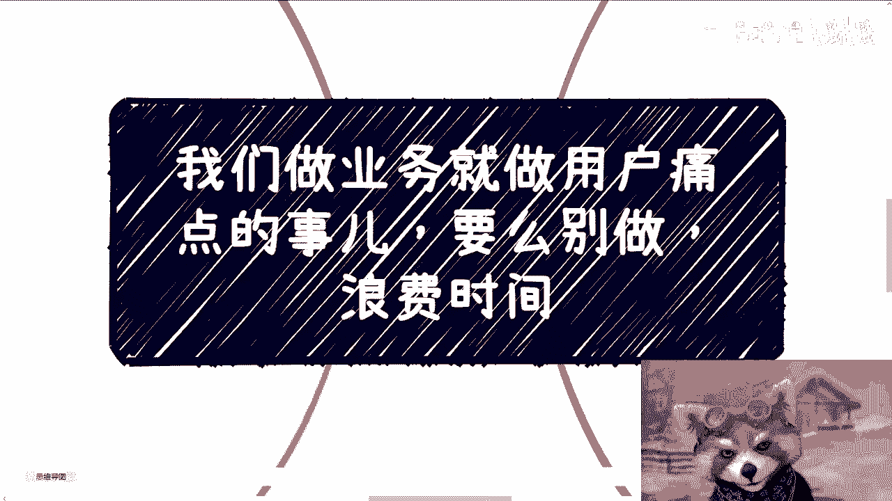
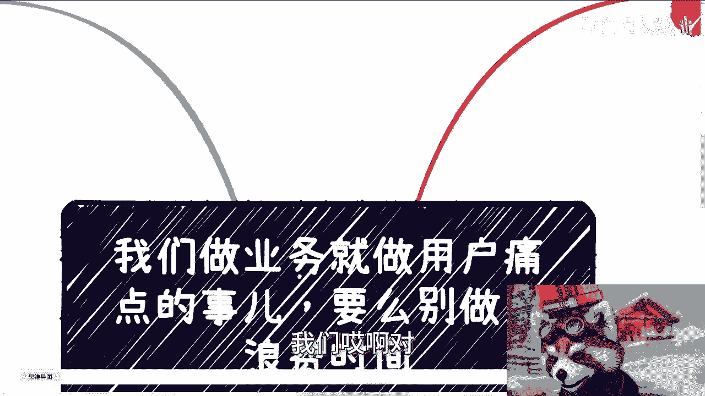
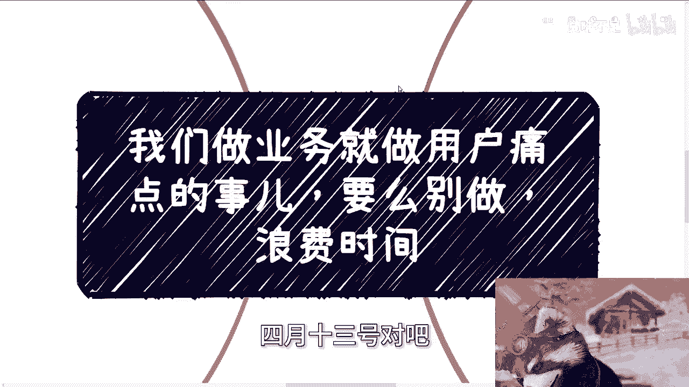
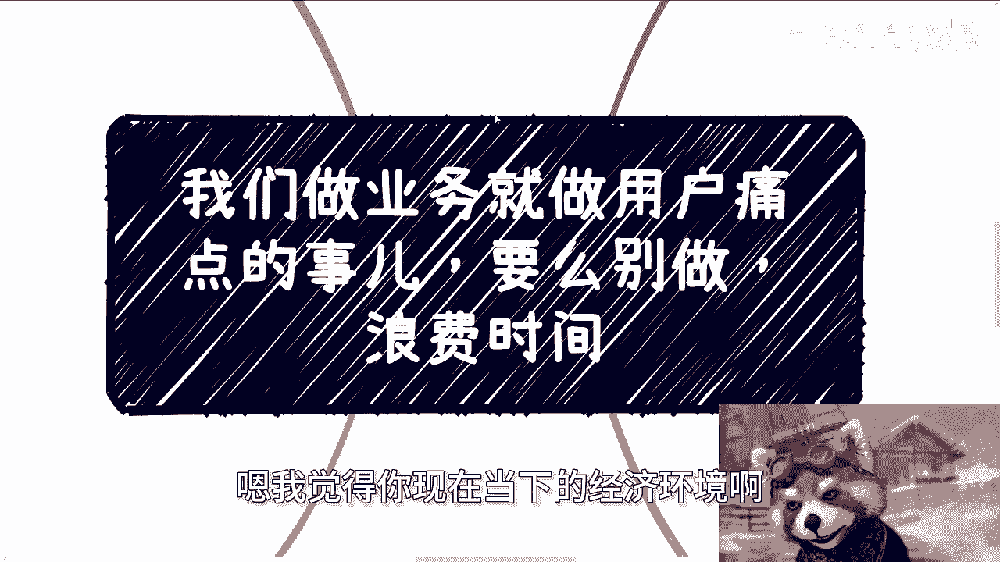
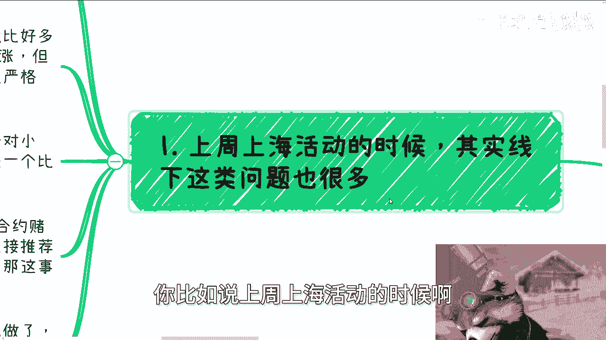
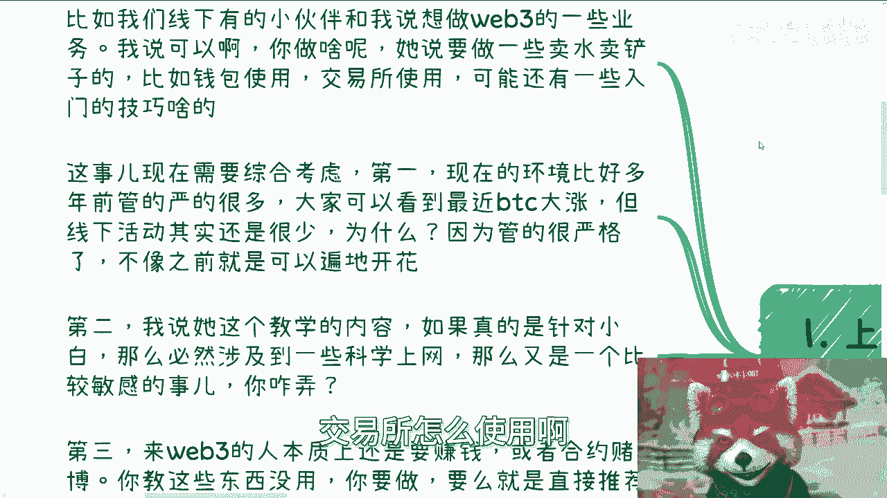
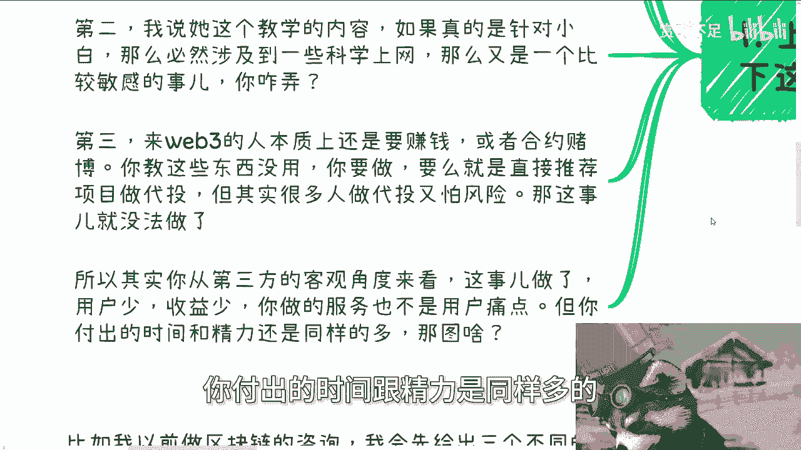
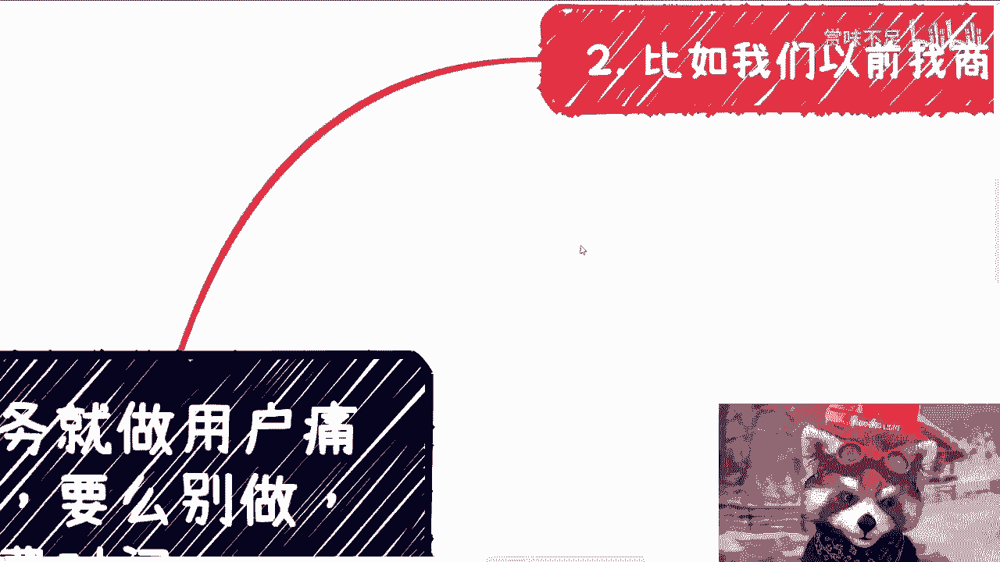
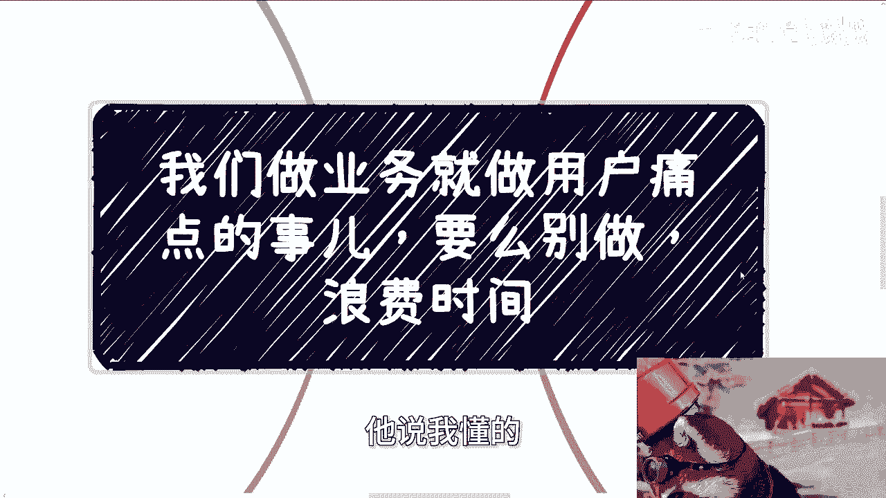
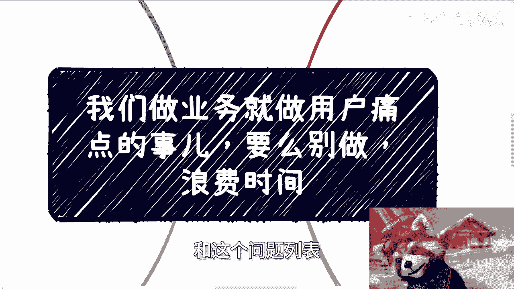

# 我们做就要直击用户痛点-否则就别做---P1---赏味不足---BV1A1421U7Jx

在本节课中，我们将学习一个核心的创业原则：**业务必须直击用户痛点**。我们将通过几个具体的案例，分析为什么在当下的经济环境中，偏离用户核心需求的项目难以成功，并探讨如何精准地找到并切入用户的真实痛点。

---

## 课程背景与活动通知

近期我们安排了线下活动。北京活动即将开始，广州活动也已定于4月13日。具体信息稍后发布，广州地区的朋友可以开始报名。

在当前的商业环境中，我发现许多创业者的业务方向过于分散。因此，我想强调一个关键点：**做业务就是做用户的痛点**。在当下的经济环境下，要么做痛点，要么就别做。

## 案例分析：为何偏离痛点会失败

上一节我们介绍了课程的核心观点，本节中我们来看看几个具体的失败案例，理解偏离用户痛点的后果。

### 案例一：Web3入门教学服务

上周上海活动时，一位小伙伴表示想做Web3相关业务，例如教小白如何使用钱包和交易所。

以下是需要考虑的综合因素：

1.  **监管环境严峻**：当前环境比前两年严格很多。即使BTC大涨，线下活动也因监管严格而很少。
2.  **教学内容敏感**：针对小白的教学内容本身比较敏感。教学过程中，如果小白提问，回答与否都是难题。
3.  **用户核心诉求错位**：进入Web3领域的人本质上是想赚钱。教他们基础操作并未触及“如何赚钱”这个根本痛点。

从第三方视角看，这个业务存在**用户少、收益低、服务非痛点**的问题，但付出的时间和精力却一样多。因此，这个方向难以成功。

### 案例二：面向企业的高端课程合作

以前我们与商会等机构合作，举办价格数千元的课程，每期都能吸引三五十人付费。

这说明了：**如果你的受众是创业者或企业用户，他们其实更容易付费**。

以下是切入企业市场的关键方法：

*   你需要寻找拥有私域流量的合作方，例如商会、协会。他们拥有会员单位，可以帮你一对多地触达客户。
*   本质是**你提供课程，对方提供流量，然后共同分润**。

然而，问题随之而来：企业用户的痛点是什么？如果像“数交所”那样提供高端合作与背书，我们无法做到。那么，我们的服务能提供什么？

企业并非只有一个痛点。你可以切入其他点，例如：

*   帮助对接资本。
*   提供前沿科技（如AI）支持。
*   协助招聘。
*   连接上下游合作方。

你的主题和服务，必须切入以上某一类真实需求。很多人不清楚企业痛点是什么，业务自然无人问津。

### 案例三：面向散户的消费模式

很多人认为面向散户（C端用户）就是做冲动消费，像直播带货那样。

这种理解并不全面。虽然直播带货、知识付费确实利用了冲动消费，但**商业模式和受众群体不同**。

如果你没有自己的私域流量和品牌积累，这种冲动消费几乎不会发生。用户为什么非要买你的东西？

因此，如果不是带货或直播打赏模式，基本上就不存在所谓的“冲动消费”。这时，你只剩下两个选项：

1.  告诉用户**你能做什么**（基于你的技能）。
2.  切入用户**默认的痛点**（基于用户当前的焦虑）。

在当前时代，创业需要差异化。虽然做自己擅长的事比硬切用户痛点更容易，但你必须审视天时地利人和。**第一优先级是生存，而生存意味着要切痛点、赚钱**。做擅长的事是为了实现自我价值，这是两个不同的目的。若想用“实现理想”的方式去赚钱，那往往行不通。

### 案例四：政企咨询中的需求摸索

我在做政企咨询时，通常会先提供三个切入方案：区块链技术、产业解决方案、宏观发展。

但客户往往不清楚自己具体要什么。这时，就需要通过沟通去摸索他们的真实痛点。

客户提出培训或咨询需求，背后动机各不相同：

*   有的只是为了“培训”而培训。
*   有的发起部门是基层，而非领导。
*   有的听课人员岗位混杂，内容难以定制。

你不可能因为这些原因就拒绝合作。因此，必须根据沟通挖掘出的需求，不断调整内容。最初提供的方案只是雏形，**最终方案应根据甲方需求而定，而非你会什么**。

我曾合作过许多老师，他们非常固执，只关心自己会讲什么，从不考虑用户需要什么。无论修改多少版方案，都从自身角度出发。结果方案让中间人和客户都无法接受。

与他们沟通时，他们嘴上说理解“目标是拿下项目”，但行动上依然故我。当你建议调整，他们会说“这个我不懂”、“我没讲过”。

**关键在于，所有人的努力都应该是为了拿下订单、赚到钱**。这种“象牙塔”内的打工思维非常致命。你会不会不重要，满足甲方需求才重要。

## 核心总结与行动指南

通过以上几个案例的分析，我们可以清晰地看到，偏离用户痛点的业务举步维艰。本节我们将总结核心结论，并给出明确的行动建议。

在当下经济环境中，政府、企业、资本、高校等都在大幅削减预算。如果你去做那些边角料、非核心痛点的内容，只要去尝试，就会听到同样的反馈：“没钱”、“做不了”。

因此，无论你做谁的生意，都必须牢记：

**一定要切入对方的痛点。不切痛点，索性别做。**

搞那些不痛不痒的东西，就是**花100分的力气，只产出20分的结果**，毫无意义。

今天早上咨询时，我还对一位创业者说：你应该开一个“上帝视角”审视自己。当下，你要么想办法赚钱，要么就安心打工。如果你思前想后，恐惧担忧，但结果就是没有踏出第一步，没有完成从0到1的突破，没有走出象牙塔，那么一切思考都是空谈。

希望大家做事情果断一些，不要瞻前顾后，不要纠结于细枝末节。**做出去，才是真的**。

---

本节课中我们一起学习了**“业务必须直击用户痛点”**这一核心原则。我们通过Web3教学、企业服务、散户消费、政企咨询四个案例，分析了偏离痛点的业务为何失败，并强调了在预算紧缩的时代，精准切入用户真实需求是生存和发展的唯一路径。记住，**花100分力气，必须追求100分的结果，而这结果只能来自对痛点的精准打击**。

**行动提示**：如果你需要商业规划、融资股权方面的建议，或不知如何发挥自己手中的技能牌，可以整理好具体的背景和问题列表，以便进行更深入的梳理和探讨。