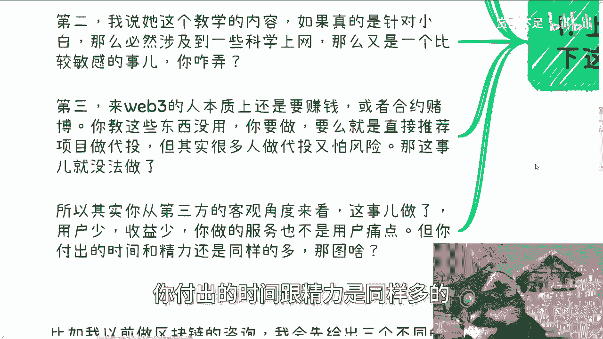
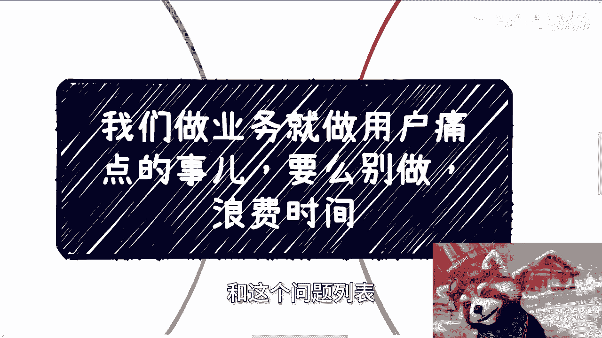

# 我们做就要直击用户痛点，否则就别做 - P1 - 赏味不足 - BV1A1421U7Jx

好大家好啊，我们诶啊对。

这两天后天就北京活动了啊，呃然后那个广州的活动我也定了啊，4月13号对吧。

具体我还没发好吧，4月13号，然后广州这边的小伙伴报名也可以开始报了啊，呃我们做业务啊，我今天说一个点啊，就是我们做业务呢就是做用户的痛点，因为聊下来发现大家做的都很散，嗯我觉得你现在当下的经济环境啊。

就要么就做痛点，要么就别做，你比如说上周上海活动的时候啊。

其实线下这类问题也很多啊，比如说我们线下有个小伙伴跟我说，他想做web3的一些业务啊，我说可以啊，没问题啊，可以做对吧，那我说你做啥呢，然后他说啊做一些卖水卖铲子的对吧，比如说钱包怎么使用啊。

交易所怎么使用啊。

啊包括一些入门的技巧对吧，我说对好，没问题啊，那我跟你讲啊，这事呢首先你得需要综合考虑，第一啊，现在的环境比前两年要管的严的很多啊，大家可以看到最近比如说BTC大涨，但是线下的活动其实还是很少。

为什么呢，因为现在管的很严格，你不像之前就是说有些风吹风吹草动，他妈满地都是活动，第二呢，我说我说你这个教学内容啊，如果真的是针对小白的，那么这个东西呢又是个比较敏感的事，那么你在教学的时候。

你怎么弄呢对吧，你说到时候那些小白问你，你回答还是不回答呢，嗯那第三啊，来5B3的人本质上还是要赚钱的啊，或者说就是赌徒，那么你我在我看来啊，就这些就我跟他说，我说你教这些东西没有用。

我说人家来是怎么赚钱的，人家来不是为了啊学技术或者学什么东西的啊，我说你要做，你要么就直接推荐项目，做带头就简单明了，对吧，你就你就你就相当于就是说帮帮项目方做流量，就这么简单啊。

但其实很多人做带头呢又怕风险，那我跟你讲这事就没法做了，嗯所以其实你从第三方的视角来讲啊，这事如果做了，我就跟他说啊，我说这事如果你做了用户少，收益少，你做的服务呢，还不是来的这些人的这个根本痛点。

但是呢你付出的时间跟精力是同样多的。

那我就说我说我不明白，那你图啥呢，对吧啊。

这是第一点，第二点啊，比如以前我们找双汇合作啊，比如说我们日常会组织一些，比如说几百几千啊啊几万的这种课程啊，以前啊对吧，就如我之前说书交所呢看课程是一样的，你觉得贵，你不会上啊，比如说6888对吧。

但问题是每一期都有56535十人，那我就问你们三五十人哪来的呢对吧，所以说也就是说啊，你的受众如果是创业者企业的用户，那么呢它其实更容易付费啊，如果来说你的这个受众啊，是你认为是企业或者创业者啊。

是这个受众目标，那么你就需要去找有私域流量的合作方，比如说商会，比如说协会，因为什么，因为他们都有会员单位，理事会单位，那么你就让他们一对多，你不要就是自己搞的，好像爱陈老师，我要去地推对吧。

我要一个个找，那他妈你找到什么时候去对吧，所以说就是说本质上你提供课程，对方提供流量，大家分钱就好了，结束了，那么问题来了啊，其实现在很多小伙伴做到现在呢，也做了类似的事啊，然后我就问啊，我说企业来的。

企业的人来了，痛点是什么啊，如果我们说塑胶所能够解决别人的痛点，是为了寻求数字经济时候的一些合作，或者一些背书，那这个东西塑胶所能提供你又不能提供对吧，那你如果你的这个那个服务。

针对的是企业家或者说创业者，那你能提供什么呢啊那么从我个人来讲，我们提供不了数交所那么高级的合作跟倍数，对不对，好，那么我就跟你们讲很简单，我们就不要切这个点啊，那你就切别的点啊。

企业又不是只有一个痛点，对不对，那你可以跟他切的是啊，我可以帮你对接资本，可以啊，这个帮你弄一些前沿的科技，比如说AI对吧，可以招人对吧，招牛马可以帮你找上下游的合作方对吧啊，你的主题跟服务。

你想想看你做的主题跟服务，总归要切这一块吧对吧，就我发现很多人来问我，他说爱陈老师，我做一个业务啊，这个业务你说有没有人来，我说他妈的有没有人来得，看你切不切他中切不切他的痛点啊。

我说你知道企业痛点是什么吗，不知道，那我说他妈的怎么会有人来呢，对吧哦，然后第三点就是散户的声音啊，那很多人会觉得散户的声音呢就是冲动消费，我跟你讲啊，你就这么理解啊，直播带货电商知识。

付费在线的这些东西都可以是变现，而且这些东西你自己去做，也是冲别人的这个冲动消费的，这没有错啊，但是你面对的人群不同，你的商业模式不同，虽然你的受众都是散户，但不见得都是冲动消费啊，什么意思呢。

你比如说如果你没有自己的私域流量，你没有品牌积累的时候，这种冲动消费不存在的，你就像我们以前说啊，这个买个东西，那人家为什么要去买小杨哥的，为什么要去买李佳琦的一个道理啊，我就跟你说，如果你不是带货。

你不是那种直播打赏的模式，那基本上也就不存在所谓的这种叫做什么啊，冲动消费，那也就是说如果不是冲动消费，那么基本上你还剩下两个选项，你要么就告诉用户，你能做什么，以及你去切用户默认的痛点。

那你觉得是前者容易还是后者容易呢对吧，什么叫你能做什么，你能做什么，就是很多人觉得哎我擅长做什么，我自己有什么技能对吧，切用户默认的痛点，就是说去找到用户到底现在焦虑什么东西，那你想现在这个时代。

你要做一个业务，你就要做差异化，那么很多人觉得啊，做自己擅长的，自己会做的事还是很容易的，总比硬逼着自己去切用户的痛点来得容易对吧，我跟你讲啊，这事我是同意的，但是你要看看时代，你要看看天时地利人和。

你得看看什么时间能做什么事情，你第一优先级是要生存吧对吧，那生存什么意思，就是你要去切痛点，你去切痛点是为了什么，是为了赚钱，你做自己擅长的事，是为了实现自己的价值，实现理想，这是两码事对吧。

你都是不同的目的，但是你非要用自己的价值和理想去赚钱，那我跟你讲，那就是你的不对了，你明白吧啊，那么第四个就是我在做政企咨询的时候呢，也是一样的，就是说你比如说以前我做区块链的咨询啊。

我会先给出三个不同的切入方案，比如说区块链技术，比如说区块链产业解决方案，比如说区块链宏观的发展，但是呢随着是那个社会跟这种时代的发展，我们就说啊，有的客户他就会反馈这三个东西他都不一样。

那你问他要什么时候呢，他也不知道他要什么，那这个时候就靠你去摸索，摸索他们的痛点，那首先你们你说啊，他们说啊这个要做咨询或培训，一定是有他们的需求，这没错啊，通过沟通。

就需要你从沟通当中去寻找到对应的线索，有的就是为了培训而培训的，有的就是发起部门不是领导，而是基础部门，有的呢来听的人什么岗位都都有，就是个大锅饭的内容，所以不好定主题，那你想想看，如果你是我对吧。

那你不可能说啊，因为这些原因我们就不接了啊，放在这边的钱你不赚不可能对吧，所以说你得根据你的沟通去摸索出来需求，再去改内容，也就是说我最早给的三个方案只不过是个雏形，根据实际情况。

并不是说最终的结果就是三选一啊，或者说根据你会什么来定，你会什么不重要，因为只有甲方要满足甲方的需求才重要啊，但为什么会说到这个东西，是因为我曾经合作过很多的老师，其中有非常多很死板的。

就是我跟他们说需求，我跟他们说用户要什么，他不管他，他就他妈关心他会什么，你知道吗，然后你让他们无论改多少版方案啊，他永远都从他自己角度出发，然后当你看到他们方案的时候，就说你不但吐水，客户吐血对吧。

然后你跟他沟通啊，就是说我们的目标是为了把这个项目做下来啊，他说我懂的。

然后呢他还是在那边讲这些东西，然后你跟他说哎你稍微调整一下，然后他就会跟你说，哎陈老师这个东西我不懂对吧，这个东西这个东西我没讲过，重要的啦，哎我就我我跟你们讲，真的很多时候很奇怪的。

就是我们所有的人努力都是为了把单子拿下来，都是为了把钱赚到，然后跟一些象牙塔内的这种打工思维，很强的人啊，你跟他说，他就会跟你讲创世这个我不会，我不会，你会不会重要啦，不重要啊，对不对啊。

所以我跟你们讲啊，就当下这经济情况呃，政府企业资本，高校等各方面都削减了很大很大的，这个叫什么预算啊，你所有的以前的边角料内容你们去碰，我跟你们讲，你们只要去碰，你们只要线下去做了。

你们就会知道我说的是什么意思，他们一定会告诉你没有钱啊，就是做不了，反正就是做不了啊，结果就是没有钱，就这么简单一件事情，所以说就是当下这种情况，不管你做谁的生意，你一定要去切对方的痛点，你不切痛点。

你就索性别做，不要搞那些有的没的，你搞那些有的没的叫什么，就是花100分的力气，只他妈产出20分的结果，没用的啊，没用的，我觉得就是说你包括今天早上我咨询的时候，我还跟他说。

我说你有空的时候仔细想想看你开个上帝视角，什么叫开上帝视角，就是你仔细想想看，你当下要么就是赚钱，你要么就好好躺平打工对吧，你你你但凡比如说你说啊，我我想了很多东西，我恐惧很多东西。

我担心很多东西没有用的，你无论你现在思前想过想什么东西，结果就是你没有踏出第一步，你没有0~1，你没有走出象牙塔，就这么简单，对不对行好，那反正今天这个东西啊，我就希望就是说哎呀。

大家做东西呢就是果断一点啊，不要思前想后，不要去想那些有的没的，你做出去才是真的好吧，行，那就先这么着，然后就是呃直接规划好吧，商业规划，然后就是啊融资股权啊，包括你们觉得自己有什么啊。

这个手上牌不知道怎么打的啊，你们觉得你们手上的这个技能啊，希望从我的角度更多的来帮你们啊，这个安排一下吧，或者说就梳理一下啊，那么你们可以整理好，具体的背景和这个问题列表好吧。

