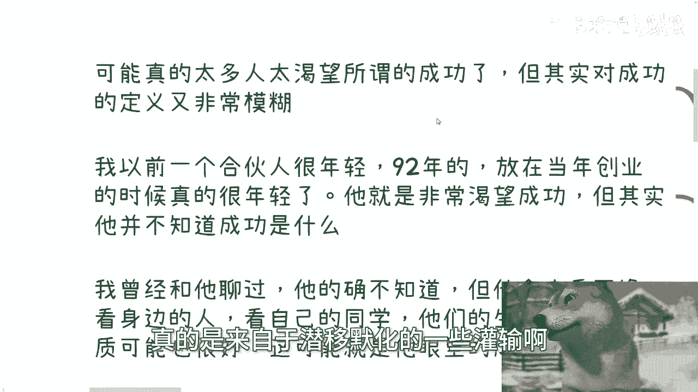
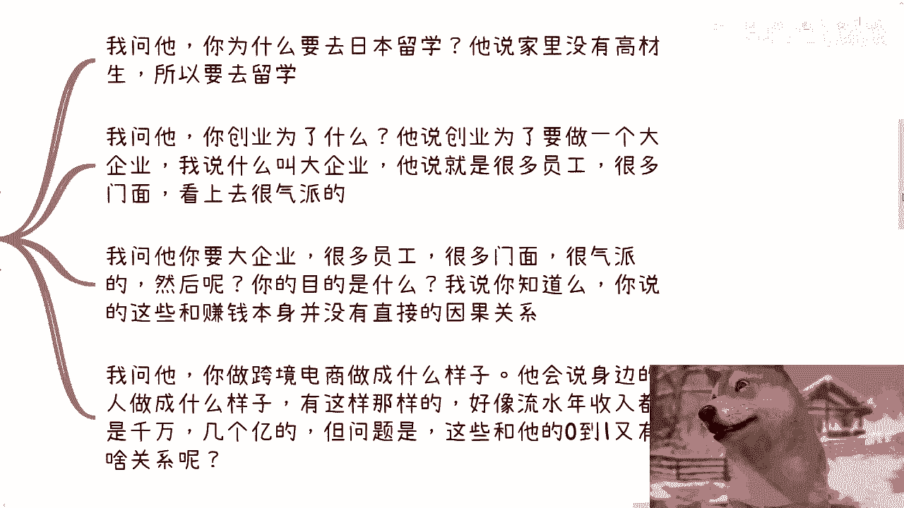
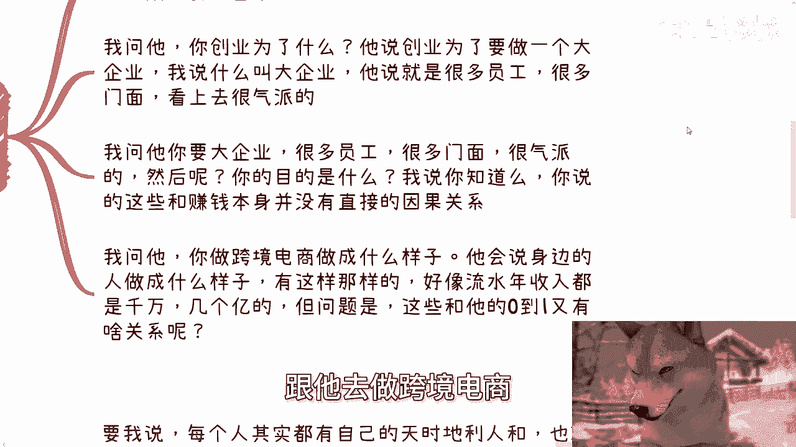
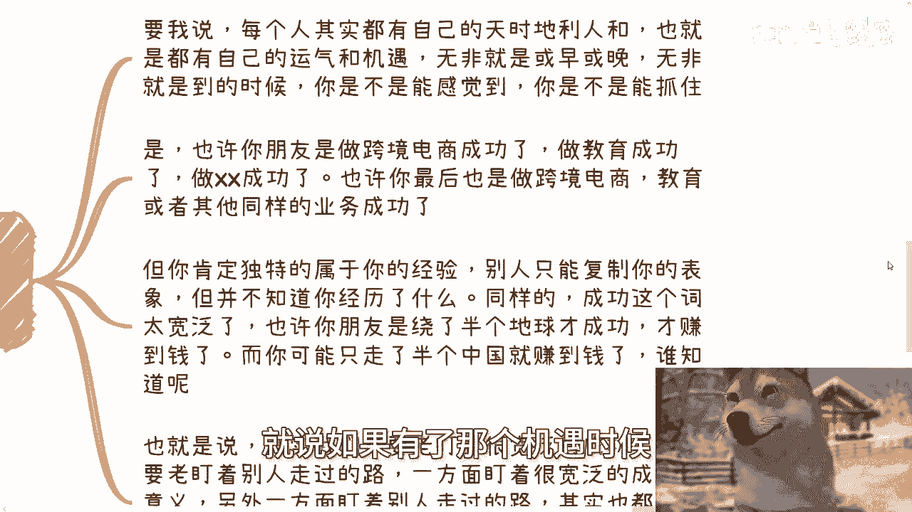
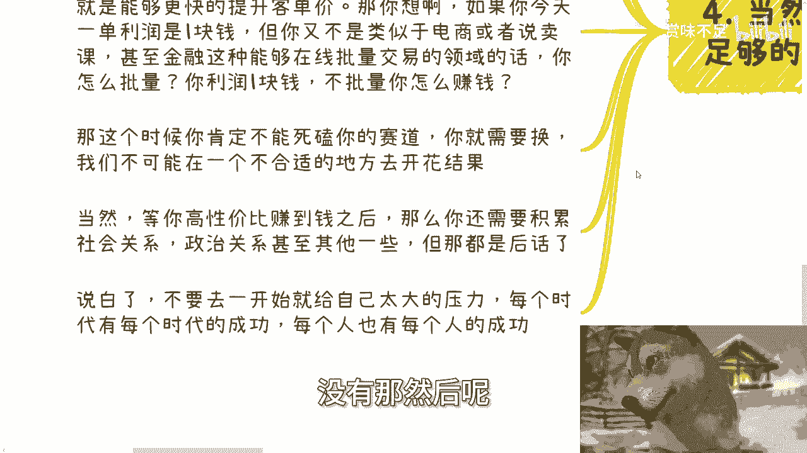

# 我们其实不需要成功-只需要自己的0-1即可---P1---赏味不足---BV16S411w7nx_n

在本节课中，我们将探讨一个核心观点：与其追求模糊而宽泛的“成功”，不如专注于完成从无到有的“0-1”过程。我们将分析为何过度关注“成功”会阻碍行动，并学习如何通过聚焦“赚钱”和提升效率来迈出坚实的第一步。

## 一、 “成功”的模糊定义与压力来源

上一节我们介绍了课程的核心主题，本节中我们来看看“成功”这个概念本身带来的问题。

许多问题的根源，来自于潜移默化的灌输。太多人过度关注所谓的“成功”，但对于“成功”的定义又非常模糊。

例如，我曾有一位年轻的合伙人。他非常渴望成功，但当我问他如何理解成功时，他自己也很模糊。他比较在意的是网络上、身边同学或同龄人的生活状态——比如他们是否有自己的事业、是否进入大公司、生活品质是否很高。这些在他眼中可能就是“成功”。

但很多时候，真的不需要给自己太大的压力和框架。正如我之前所说，很多人欠缺的或当务之急要做的，就是完成 **0-1**。他们本身可能做得到，而且我认为 **0-1** 本身并不是特别难。

**公式：目标 = 完成 0-1**

但由于他们往往太渴望“成功”，就会导致“步子迈得太大”，最终反而什么都做不了。

## 二、 脱离实际的“目标”案例

理解了“成功”带来的压力后，我们通过几个具体案例，看看脱离“0-1”的目标是如何不切实际的。

以下是几个常见的、脱离“0-1”思维的目标设定案例：

1.  **关于留学**：当我问一些人“为什么要去留学”，得到的回答是：“我家往上数三代都没有高材生，所以我要去留学。” 但当我再问“留学之后呢”，他们却不知道了。
2.  **关于创业**：当问及“创业为了什么”，回答是：“未来要做一个大企业。” 追问“什么是大企业”，回答是：“有很多员工、要融资、有很多气派的实体办公室，像大公司那样。” 然而，这些“气派”的表象与“赚钱”这个目的之间，并没有直接的因果关系。
3.  **关于跨境电商**：当问想做跨境电商做到什么样子时，回答往往是：“身边有人做到了几百上千万的流水。” 但问题是，别人的流水成绩，与他本人从零开始做跨境电商的 **0-1** 过程，没有任何关系。

这些案例的共同点是，目标都设定在遥不可及的“终点”，而完全忽略了从脚下开始的“第一步”。

## 三、 他人的“成功”无法复制

看到了不切实际的目标，我们自然会想到去模仿那些看似成功的人。但本节我们要明白，他人的路径很难复制。

我们太多人被别人的“成功”所蒙蔽。每个人都有自己的天时、地利、人和，也就是说都有自己独特的赛道、机遇和所遇到的人。

机遇无非或早或晚。区别在于，当机遇来临时，你能否明确感知并抓住它。

即使你和朋友最终都在同一个领域（比如跨境电商）取得成功，但过程必定不同。别人可能要“绕半个地球”才成功，而你或许“只走半个中国”就赚到钱。

因此，我们不应总是盯着宽泛的“成功”概念，也不要执着于复制别人走过的具体路径。你可以模仿和参考，但这只能作为辅助。

**核心宗旨是：专注于你眼前属于自己的路，也就是属于你自己的 0-1。**

## 四、 超越“赚钱”：效率与土壤

上一节我们明确了要专注自己的路，本节中我们来看看，完成“0-1”赚到钱之后，还需要考虑什么。

当然，并不是仅仅“赚到钱”就足够了。赚钱是有阶段性的。不要今天做了一个客单价一块钱的产品，就说“已经赚到钱了，这就够了”。这很离谱。

但是，能赚到一块钱，说明你在这个赛道有潜力，方向可能没问题。接下来，我们需要考虑能否在横向或纵向上更高效地赚钱。

*   **横向拓展**：指低成本、批量化复制。公式可理解为：`总利润 = 单笔利润 × 交易数量`。
*   **纵向拓展**：指提高客单价。公式可理解为：`总利润 = 更高单笔利润 × 交易数量`。

这取决于你选择的赛道和所处的“土壤”（环境）。你能赚到一些小钱，是你可以控制的；但想要大规模横向复制或纵向提价，就必须看环境是否支持。

例如，如果你的利润是一块钱，但你的业务需要线下地推、跑商务，这种模式批量复制的成本极高。这时你就不应死磕，而应考虑将你赚到一块钱的经验，迁移到那些更容易批量复制的领域（如某些电商、知识付费领域）。

同样，提高客单价也需要看产品是否还有包装空间，以及目标客户是否有更高的支付能力。如果你所在赛道的产品已无包装余地，或客户都是低净值人群，那么死磕也无法实现纵向突破。

说穿了，核心还是回到我们的主题：大部分人当下缺的就是 **0-1**。不要一开始就给自己太大压力。

## 五、 专注“0-1”，避免复杂开局

理解了效率和环境的重要性后，我们最后来强调为何必须从简单的“0-1”开始。

我观察过很多业务，无论是个人知识付费、活动，还是对接政府、企业的项目。我发现一个普遍现象：很多人根本没做过，但一上来就问非常宏大的问题。

他们明明连第一单都没做，却渴望直接操作一个复杂度极高（涉及复杂人际关系和项目流程）、利润号称上千万的业务。然后他们反而会抱怨：“为什么当中这么复杂？问题这么多？”

这就像你连走路都没学会，却想直接冲刺马拉松，怎么可能做得到呢？

所以，我的建议是：不要过度关注那些外界宣扬的“谁谁谁很牛逼”、“谁躺着赚了多少钱”。在业务层面，你可以模仿和学习，这没问题。但在赚钱这件事上，你必须一步步来，从完成你自己的 **0-1** 开始。

---

**本节课总结**：

在本节课中，我们一起学习了：
1.  “成功”是一个模糊且带来压力的概念，不应作为初始目标。
2.  许多宏大目标脱离了“从零开始”的现实，没有意义。
3.  他人的成功路径由独特机遇构成，难以复制，应专注自己的路。
4.  完成 **0-1**、赚到钱是第一步，之后需根据“土壤”考虑横向（批量）或纵向（提价）提升效率。
5.  核心行动指南是：**放下对“成功”的执念，聚焦于完成属于自己的那个从无到有的“0-1”过程**。

对于后续的职业规划、商业合作（如合同、分红、融资）或具体业务问题，如果需要结合我的视角给出更接地气的建议，可以整理好具体问题和你的个人背景。