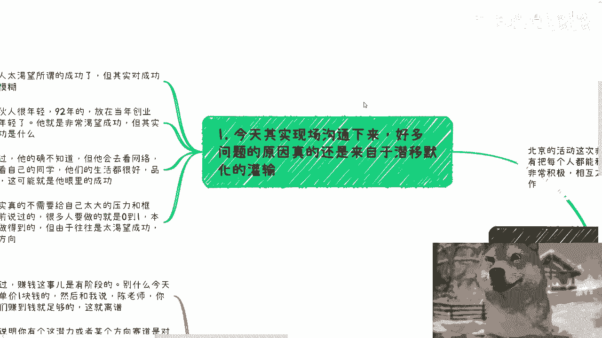
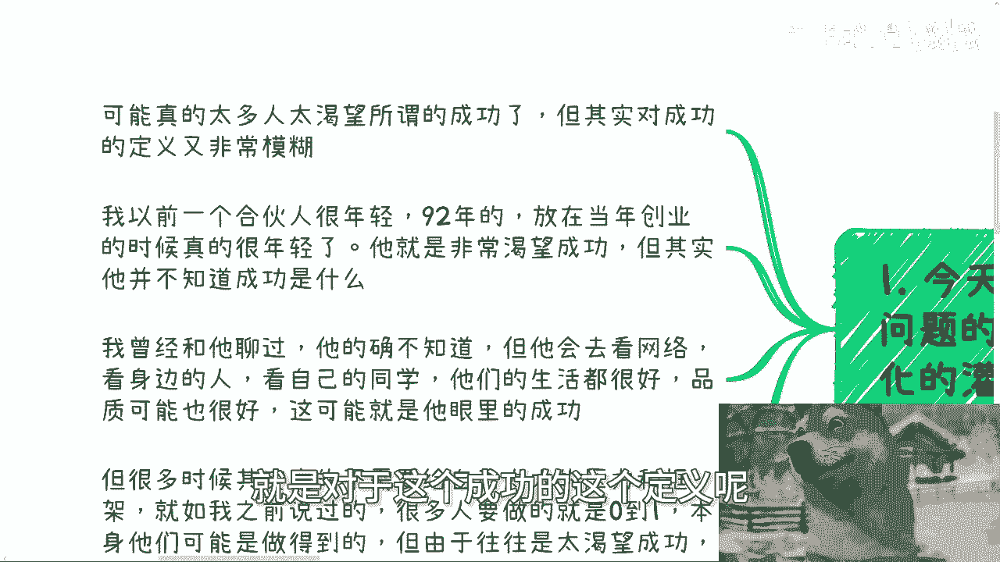
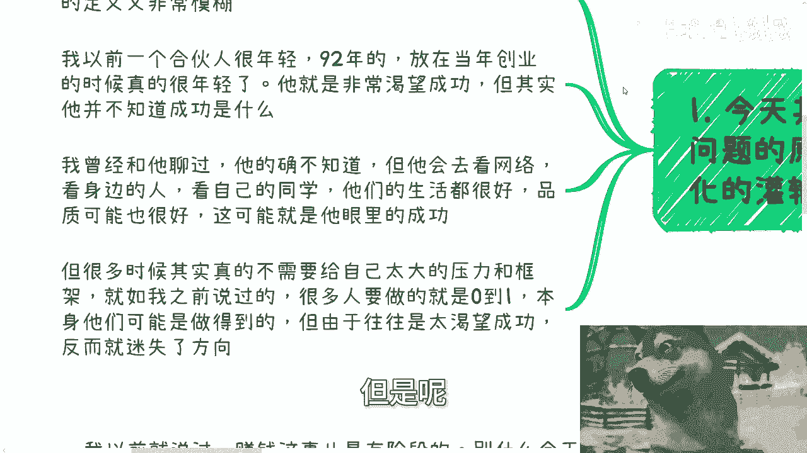
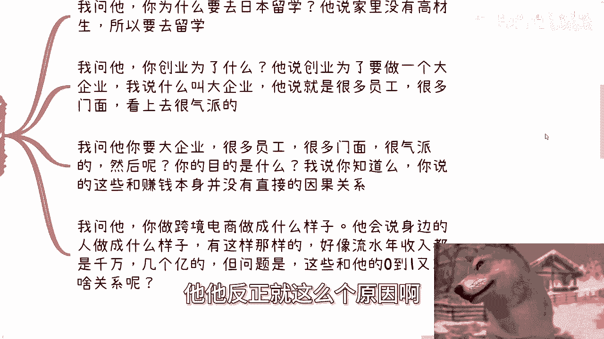
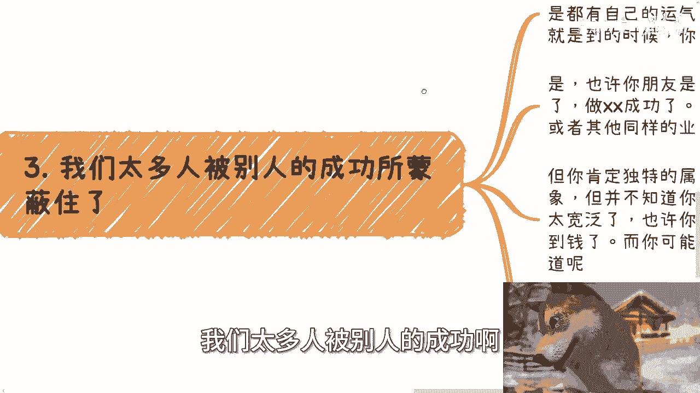
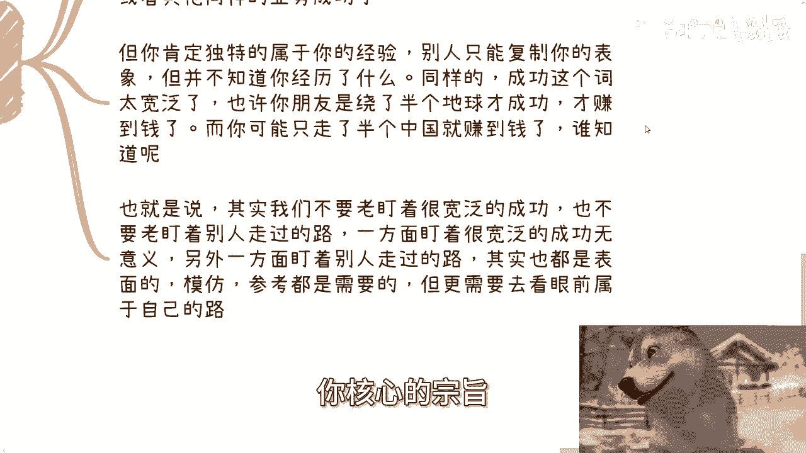
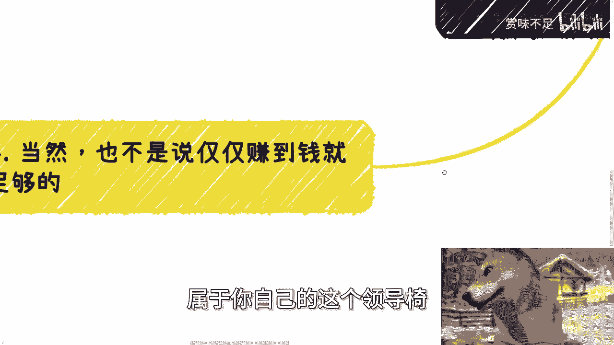

# 我们其实不需要成功，只需要自己的0-1即可 - P1 - 赏味不足 - BV16S411w7nx

哈喽大家好，然后我们今天这个北京的活动非常成功啊，呃虽然我没有把每个人跟这个微信都对上，但是我感觉到反正大家这个还是比较积极的啊，就线下一直在都在沟通，然后那相互之间也都能认识认识。

反正我做活动我都跟大家讲的很清楚，就是我来嘛啊，都是临时的，但是大家都是在一个城市，或者说都都可能就是说在周边嘛，所以就是你们认识之后，反正你们之后都会有非常多的一些合作机会好。

然后我们今天讲的这个主题呢叫做额，本质上我们不需要成功啊，我们只需要赚到钱，然后去提升这个赚钱效率，首先这第一啊，第一个我们先来说哎哎呀落差了啊。

好就这么讲啊，第一个呢其实今天现场沟通下来啊，好多问题的原因呢，真的是来自于潜移默化的一些灌输啊。

我觉得可能真的太多的人呢，嗯就是太关注这个哎啊，太关注这个所谓的成功啊，就是对于这个成功的这个定义呢。

那其实又非常模糊啊，你就比如说我以前有个合伙人啊，他很年轻在在在92年的啊，在当年那还是很年轻的啊，就是就是一起创业的呃，那当然了，最后没成功嘛对吧，那他就是说是非常渴望成功的那一类啊。

但其实呢呃我以前就是线下，因为大家毕竟一起做项目嘛，就线下的时候我其实也问过他，我说那你对于成功怎么理解的对吧，他说他其实也很模糊，也不知道啊，但是呢就是呃我聊下来哦，我会知道就是说他比较在意的呢。

就是说网络啊，在意的呢身边的人在意的呢，他的同学啊，同班同学啊，或者其他的，就他会觉得他们的嗯可能都有自己的事业对吧，然后呃生活比较好，或者说去一些什么呃大的公司对吧。

品质可能呃就生活品质可能也很好对吧，那么这些可能在他眼里就是所谓的成功啊，但很多时候呃，其实真的不需要给自己太大的压力，跟一些框架，他就如我之前如我之前说的啊，我说很多人欠缺的或者当务之急。

要做的就是0~1，那本身他们可能是做得到的，而且我觉得0~1本身并不是特别难啊，就可能是做得到的，但是呢你由于他往往太渴望成功。

你就会发现叫做什么叫做步子迈得太大啊，那他木子搬了他之后好了，那那反而就是说什么都做不了啊。

那么第二啊，你就比如说之前我问的那些问题，然后我得到的答案啊，就让我他妈的都很无语，比如说啊我说我问一个人，我问他，我说那我说你为什么要去日本留学呢对吧，或者你为什么要去美国留学呢对吧，或者怎么样子啊。

他就说他说我家里面没有高材生啊，我可能往上数三代都没有高材生啊，所以我要去留学。

然后我再问他，那你你留了之后呢，哎不知道了对吧，他他反正就这么个原因啊。

然后另外一种呢，就比如说我问他，我说你那你创业为了什么，那他说创业未来要做一个大企业啊，那我说什么叫大企业，他说就是要有很多员工啊，要融资对吧，然后要很多的门面，就是门很多的那种实体的这种什么大楼啊。

办公室啊对吧，就就比如说像拼多多啊，字节啊对吧这种啊，那他说看上去很气派嗯那然后我就问他，我说那你要大企业所谓很多员工很多门面对吧，很多这种实体的地方很气派，然后呢，那我说然后呢。

你今天有了你的目的是什么嘛对吧，那那我说当然啊，他后面也回我了，他说他的目的是赚钱嘛对吧，那我说好，那我说问题是你知道吗，你说的这些所谓的大企业，很多员工很多门面很气派，我说这些东西跟你所谓的赚钱本身。

没有直接的因果关系，你怎么就会认为这些东西就能给你赚到钱呢，对吧啊，那另外一方面啊，我问他，我说那你做跨境电商啊，做成什么样子，他会跟我说啊，比如说啊身边的人做成什么样子对吧，有有做成这样，做成那样的。

然后好像比如说流水对吧，可能一年都是几百几百万上千万几个亿的啊，但问题是以上这些东西跟他去做跨境电商。

跟他做跨境电商0~1有他妈任何关系吗，没有啊，然后第三我们太多人被别人的成功啊。

我觉得所蒙蔽啊，蒙蔽这个东西我觉得就有点有点模糊啊，就有点模糊，就是说你要我说啊，其实每个人他肯定都会有点自己的天时，地利人和啊，也就是说他都有他的这个赛道当中的，或者他所做的他碰到的人呢。

因为你每个人碰到的人啊，你说比如说你做计算机，我做计算机大家都是这行业，但是你碰到的人，我碰到的人不一样对吧，那么也就是说你有你的这个运气跟机遇，无非就是或早或晚。

无非就是呃就是说如果有了那个机遇的时候。

你是不是能够啊，比如说明确的感觉到，或者你能不能抓住对吧，我觉得就这个区别，那当然啊你说就拿我们刚刚说的例子，你说你朋友是做跨境电商成功的，做教育成功的，或者说做金融成功的啊，无所谓啊。

也许你做你最后也是做跨境电商这个成功的啊，也许也许你也是做教育成功的，或者你也是做其他的同样类型业务成功的，但是这就像什么呢，就是你肯定会独特的，有你的属于你的这个经验对吧，也就是说别人如果要来复制你。

他也只能复制你的表象，他并不知道你到底经历了什么，以及你的经验是什么，那同样的你说成功这个词就太过宽泛啊，我们就拿刚刚跨境电商来讲，也许你那个朋友是绕了半个地球才成功的，做跨境电商才赚到钱。

而你有可能只走了半个中国就赚到钱，那谁知道呢，对不对，那么也就是说，其实我们不要老盯着很宽泛的这种成功，也不要老盯着，就说你你你说啊，我我看到这个人不错对吧，我非要盯着他，看到他走过的路。

然后一方面盯着很宽泛的成功是没有意义的，那么另外一方面你盯着别人走过路呢，其实也没有太大意义对吧，其实也都是说你你盯着别人的成功，就是就是一些啊表象啊对吧，那没有问题。

但是另外一方面就是说你模仿参考要不要要，但是你模仿参考更多的只是给予你辅助，你核心的宗旨。

其实还是要去看你眼前属于自己的这个路，也就是我们说的属于你自己的这个0~1。

那么当然啊最后也不是说仅仅赚到钱就足够的，因为这个事情很复杂啊，我以前就说过，比如说赚钱这个事是有阶段性的，你不要今天他妈的做了一个客单价，一块钱的东西，然后跟我说爱陈老师，你说的呀对吧。

我们赚到钱就足足够了对吧，那么他妈的我赚到个客单价一块钱了啊，这就离谱啊，但是同样的啊，我们就拿赚一块钱的这件事情来讲啊，比如说你能赚到钱，说明什么，说明你有这个潜力，或者来说在某个赛道是对的。

你的选择是没问题的，但是我们能否在横向或者纵向上，更高效率的赚到钱，这就这就得看你到底选什么赛道，以及大环境是什么，以及土壤是什么，就是说有你要赚到一些小钱，你是能控制的。

但是你要赚到一些横向或或向纵向要拓展的，这些钱，你是要看土壤的对吧，要你说啊，我要赚钱，我他妈不看环境啊，我不看土壤，我不看，就是说城市我不看任何东西，我他妈要一个人牛逼的吧，就就就各个地方我都能去干。

那不可能的啊，不现实的啊，那么我们举个例子，横向就是所谓的可以低成本的去复制，去批量化复制，纵向就是能够更快的提高客单价对吧，那你想啊，如果今天你一一单利润是一块钱对吧，一块钱啊。

但你所在的这个赛道又不像电商或者说麦克，或者说金融这种能够批量化交易，或者说甚至能能够那种指数化交易的地方啊，这种赛道或者领域的话，那我就请问你怎么批量对吧，比如说你现在这一块钱的利润。

就是要线下去递推的，就是要去跑商务的哦，告诉我这种批量这种递推，或者说这种这种叫什么走商务东西，你要批量怎么个批量法，你成本得多高，对不对啊，那么这个时候你肯定就不能死磕你这三道啊，你就要去换啊。

你可以把你做这一块钱的经验去放到，我们说能够快速批量化，这个复制的那种领域里面对吧，那么你可能才有可能开花结果，否则你怎么做啊，那当然啊，等你高性价比的赚到钱之后，你还需要去积累那个社会关系啊。

包括其他的一些东西，但这个都是后话的啊，那么包括我们刚刚说的纵向，纵向就是说你要提高客单客单价，比如说你第一个月一块钱对吧好，那么第二第二个月你利润可能是两块啊，就翻倍，第第三个月可能是四块。

后面是八块16块对吧好，那么你要提升客单价也是一个道理，就是要么就是能够更好的去包装你的产品，要么就是能够更好的去筛选你的客户对吧，那么我们话又说回来，如果你所在的赛道，你的产品已经包无可包了。

你天花板级就在，那就那么低，你怎么做，你死磕吗，那不行啊对吧，那同样的你的那个所在赛道的用户，如果他们都是没有钱的对吧，都没有高净值人群，那你怎么办呢，你也死磕吗，那也不行对吧。

所以说就是这这些东西上面，其实你都需要灵活的去应对，那说白了呢，我觉得就是核心还是回到我们这主题嘛，就是说你要做一件事情，而且大部分人当下他就是缺0~1，那你不要一开始给自己太大压力对吧。

这就好像真的你你们知道吗，这就好像我我说的所有的业务，就不管他是个人做什么知识付费啊，知识变现啊对吧，活动啊还是去找政府合作，找高校合作，找企业合作做一些什么啊，拉皮条的或者怎么样子。

我他妈真的我我每次都会发现啊，就是你问你问他们，你们以前做过吗没有，那然后呢。

然后呢就你会发现他们跟你问的问题，每次问问题的时候。

他们所陷入的问题，跟他们所合作的人，以及他们所谓的那些大佬，或者说哎在我眼里就是那些比如说所谓的骗子，为什么他们能得逞，就是因为这些人他明明连做都没做过，但是上来就渴望着说啊，我今天做个业务。

我问他哎那这个业务多少钱，卧槽这个业务牛逼啊，他妈上千万对吧，那那那那那那你怎么搞对吧，就相当于是你明明连第一单都还没做，然后你就在那边说，噢，我要我我我要去做一个复杂度很高的东西，人际复杂度也很高。

项目复杂度也很高的一个东西，然后你反过来还要抱怨啊，说哎我的，为什么这个当中这么复杂对吧，为什么这个当中唉问题这么多，那你想呢对吧哦，你上来做一单，你不去做那种那个0~1的最低利润的那种。

你上来就想一口气吃成个胖子或者一口气撑死，那怎么会做得到呢对吧，所以说我是觉得不要太去关注于，就是说你们家长啊啊你你们父母啊，你们学校啊，你们老师啊，或者你们其他人啊，一直跟你们讲的。

卧槽这个人牛逼对吧，那个人怎么样子啊，这个人嘛躺着能赚多少钱，那个怎么样子，哎你不用去太去关心他，就是业务层面，你可以模仿，你可以去学习，你看看人家怎么做的，那没问题，但是你赚钱你还是得一步步来呀。

好吧，我觉得就这个东西我觉得得要怎么说呢，得要再强调一下啊，额行啊，那就这么着吧，然后下一期活动我还没想好好吧，反正就想到了我，我计划好了，我到时候再跟你们讲，那么剩剩下的话就是说你们啊。

比如说自己这个工作啊，或者你们跟其他一些小伙伴去合作呃，在商业上在呃叫什么，就是额合同啊，丰润啊，分红啊对吧，包括一些估值啊，项目计划书啊，白皮书啊，融资啊啊，包括就是你们现在啊这个当下有哪些业务。

或者你们觉得啊，有哪些这个职业规划或者商业规划，需要通过我的一些呃，试试以视角或者通过我的一些认知，能够结合你们的个人的一些情况，跟你们当下发展，能够给你们一些更接地气的呃，建议或者规划的话。

那么你们可以整理好对应的额问题跟个人背景，好吧。