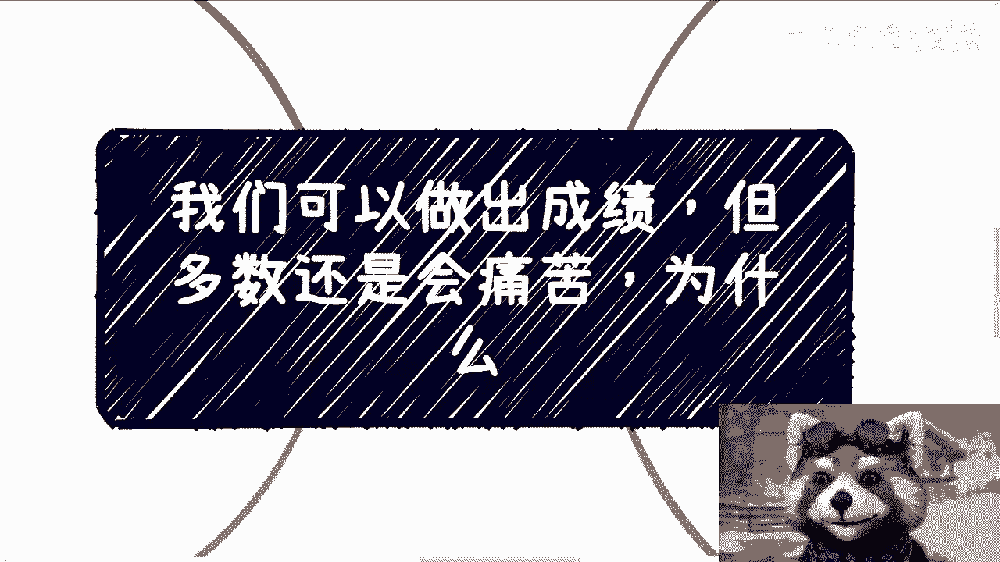
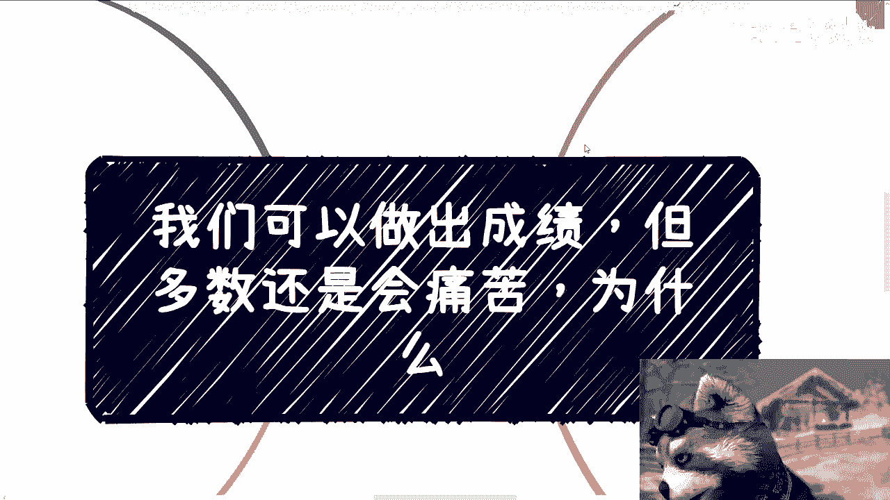
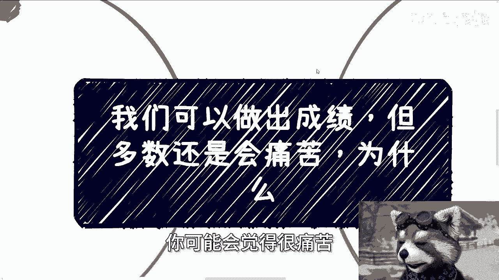
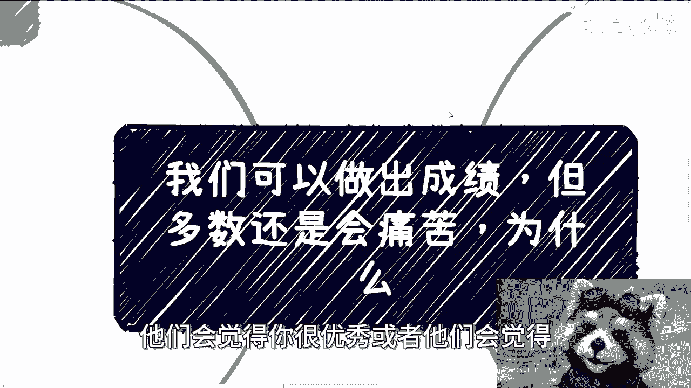
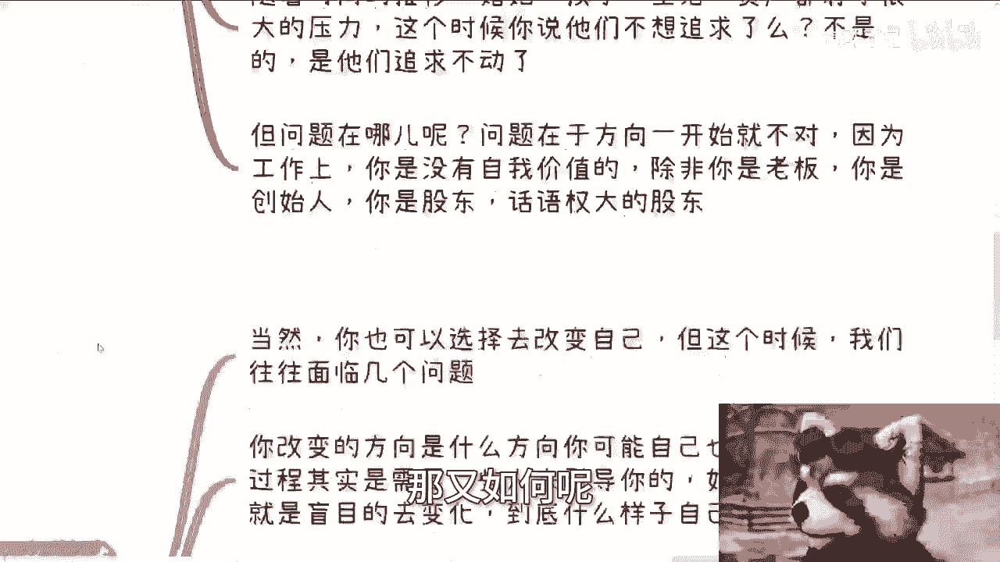
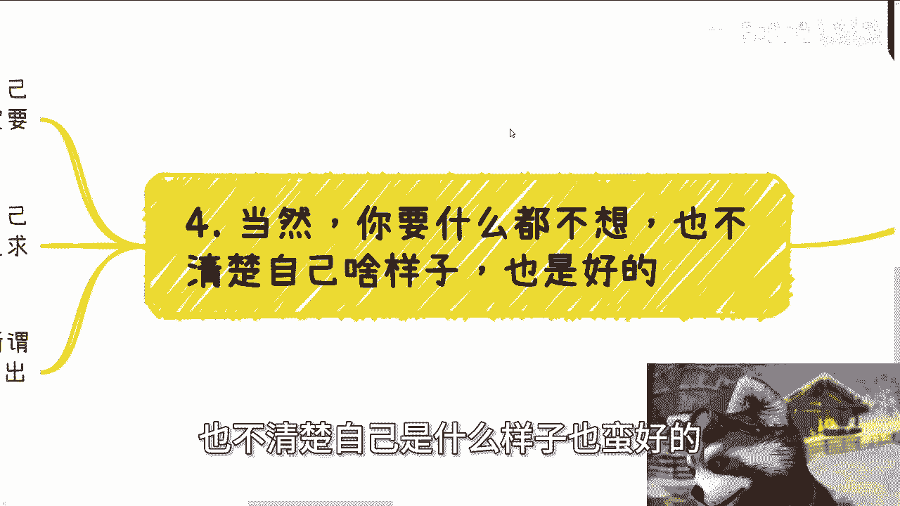
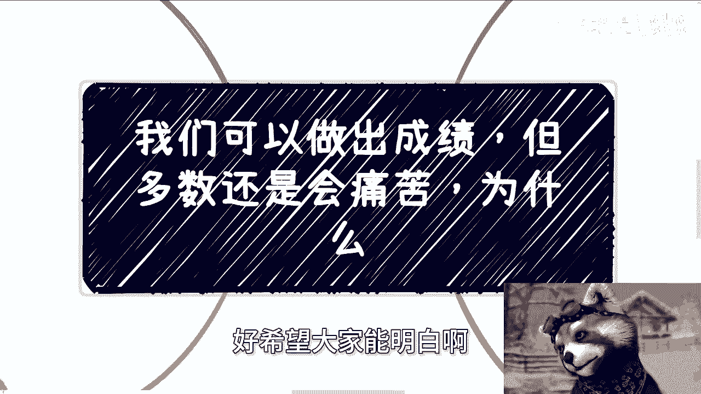
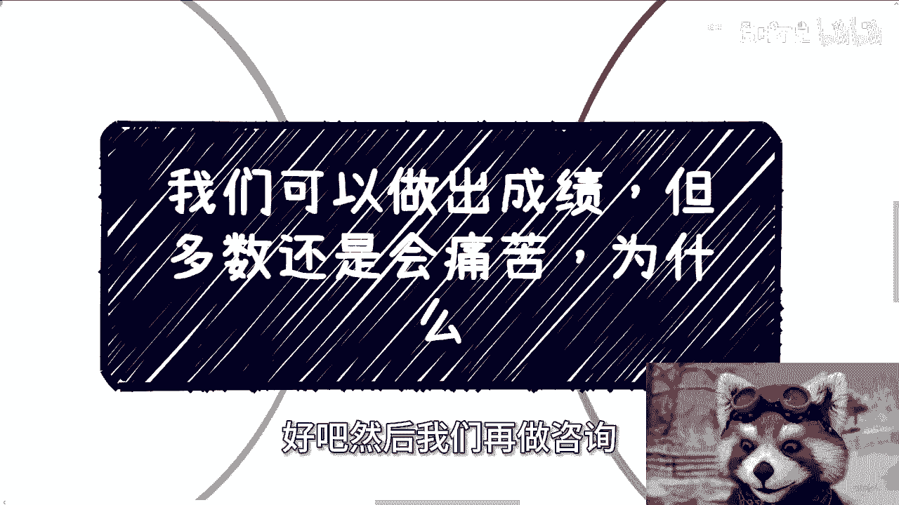

# 我们可以做出成绩，但多数还是会痛苦 - P1 - 赏味不足 - BV1ow4m117mA

好大家好啊，这个后天呃对后天后天济南这个活动报名了。

还能继续报好吧，4月20号下午在那个研究院好吧，然后我已经跟研究院打好招呼了啊，回头就是带大家把研究院参观一下啊。

呃今天这个主题呢主要是唉，我觉得可能所有的人都会面临这个问题，就是说我们可以去做一件事，那我们也可以做出一些成绩，但是呢呃就如果你是那个当事人的话，你可能会觉得很痛苦。

但是从周围的人的话，他们会觉得你很优秀，或者他们会觉得就是说嫉妒或者羡慕你。

但是怎么说呢，这种事情又有谁知道呢。

我在咨询的时候呢，经常会提到这个点，就说我问对方，我说你到底是想要干嘛，当然你什么也不想，你说我什么都不想干，那也是一种想法对吧，那就是说我们活了20多年，30多年自己什么样子。

我觉得你多多少少自己心里有点逼数的啊，也就是说呢你也许不一定一定能就是说确定啊，不一定能表达出来，但是你多多少少我觉得你内心是清楚的，你想不想说呢，这是你自己的事啊，那么有的人呢从小他可能就不循规蹈矩。

就可能与众不同，你现在让他去随大流，行不行，行啊啊，强行随大流没问题啊，但你会发现他能做吗，能做啊，他做的多多好呢，一般，但是他内心很痛苦，但每次我我就说嘛，我说他父母也好，或者其他人也好。

who care呢对吧，有人在乎吗，没人在乎啊，你比如说一个很追求自己价值的一个人，很希望做点什么事情啊，也很希望能让自己的想法去落地的人，你让他去上班，你让他去加班，你让他去做螺丝钉，行不行也行啊。

事能做吗，能做啊，绩效能做完吗，也能啊，但内心会很痛苦啊对吧，觉得这不是自己想要的，想要寻求改变，怎么说呢，对吧，就是这种事情我跟你这么说吧，很多时候呢其实只有自己知道，他很难跟别人去讲。

因为你跟谁说呢，谁又能理解呢，这才是最大的问题，不是没有人说是谁能理解你，朋友很多啊，你的就是闺蜜很多对吧或者怎么样，但又有几个人能明白呢，很难，而且这种在我看来呢。

你要么就是说很早去选择符合自己内心的方式，呃方向，你要么呢就强行改变，你让自己承受，完全完完全全的去承受痛苦之后去改变，你如果两个都不选。

那我跟你讲，你这辈子就困扰在这个这个困扰当中，就这么简单。

没有办法的嗯，那当然了，很多人其实在错误的方向上。

寻求自己想要的东西，这就好像很多人其实很想追求自己，追求自己的价值啊，很想做点什么啊，就是这种人啊，在我看来，我每次我都会跟他们说，我说你们的三观我很认可啊，我说我非常的认可，但是我很抱歉的告诉你们。

你们在这么一个扭曲的社会，扭曲的世界当中，你们的三观就是DEBUFF，我认可你们又如何呢，又怎么样呢，对吧，那他们很多人觉得在职场里面，在打工上能找到自己想做的事，比如说啊开发啊，产品啊，技术啊。

服务啊啊，他们给我的说法，就是说他们很想呃按照自己的想法，或者他们很想让自己能有一定的价值，那么所以说他们会选择一些所谓的大厂啊，所谓的这种创造性的岗位去做，但事实上是什么呢。

事实上是他们的想法并不重要，他们只不过是别人的螺丝钉啊，别人的螺丝跟工具，当然我相信他们不是那么容易被打倒的对吧，就是当他们面临一些困难或者呃坎坷的时候，他们会觉得啊可能是当下这个工作不行啊。

可能是当下这个环境不行，可能是当下自己不行啊，但是呢他们会呃就就所以说啊，他们会不停的跳槽寻求突破口，但是我就问嘛，人的一生能有多少次这种冲动，或者说换赛道，或者说这种跳槽的时间给大家呢没有多少了。

你随着时间的推移，婚姻孩子生活资产你都会有很大的压力，到那个时候我就问嘛，你说他们这些人是不想再追求了吗，不是的，是他们追求不动，但是正因为他们不是不想追求，所以说他们的内心跟现实产生了非常大的割裂。

所以才会内耗，所以才会抑郁对吧，那问题出在哪呢，问题就出在于方向一开始就不对了，因为有些人他就是适合当螺丝钉，有的人他就不适合当，有的人他就没有想法，有的人他就希望自己能有所价值。

你没有自我价值的时候啊，你你你在工作上面，你是不会有自我价值的，除非你是老板，你是创始人，你是股东，而且是话语权比较大的股东，那你说你在打工上面去追求，你，就算追求一辈子，穷尽你一生，那又如何呢。

又如何人，第三你能不能从也不一定从一个死板的人吧，就是你能不能就是说改过来啊，那当然我觉得你也可以选择去改变自己，但这个时候呢我们往往面临这个大问题，首先第一个点就是你改变的方向是什么方向。

你可能自己都不知道，那这个过程呢其实是需要有一些，我们称之为就是嗯三观正确的人来引导你的，那如果没有，其实就是盲目的去变化，到底什么样子，你自己也不知道啊，如果方向明确，那我们就拿资本家来讲好。

我们就拿资本家来举例子，比如说你要变成资本家，那么还有三种可能性，第一种可能性就是你变成了彻头彻尾的资本家，你变化了之后，那么你也失去了原本的你自己对吧，这是第一种，第二种就是那当然啊，我我评价一下。

第一种，你是成功的，我不得不说你是成功的，第二种你就是不合适不适合去改变的，你硬要改，那么当你硬要改的过程当中，很多人会抑郁，这种抑郁可能来自于自我的观念的冲击，也有可能来自于外界对自己的冲击。

但anyway整体来讲你会进入一种病态，那你说这种成功吗，这种不但不是成功，这种对你人生来讲也是失败对吧，那么最后一种是什么，就是你能改变，同时你还能保持原本的自己，那在我看来这种概率很低很低。

几乎很难，你需要有些天赋技能，而且这种天赋技能就是说不让你陷入抑郁，不让你陷入一些自我怀疑当中，我觉得这种概率是很低的，毕竟毕竟你存在的两种人格啊，这么一个思想跟内心，但同时呢你又能够完全的去理解。

完全的去成为资本家的这种方式，你两者共存很难啊，你用你其实或者这么说，共存其实并不难，难的是你共存并不割裂，对吧好，那么最后一个，当然你要是什么都不想，也不清楚自己是什么样子。

也蛮好的，你比如说在咨询过程当中，其实也有些人跟我说，他说我就是自己不清楚自己啥样子，那我说你不清楚什么样子蛮好的，你为什么一定要去搞清楚呢，我不明白呀，对不对，就是你我我跟他这么说的，我说你要搞明白。

你搞你想今天搞清楚你是怎么样的，这么一个人的原动力是什么，如果是你自己想搞清楚，那么你其实就是个想寻求改变的人，那么你一定就是有一定的追求的对吧，那么你就去摸摸，清清楚楚的去追着那个追求去就可以了。

你不要再去说，我不自己不清楚自己什么样子对吧，但是如果你没有原动力，你说你之所以要去改变，或者想要去摸清楚自己什么样子，是因为网络上的一些鸡汤，是因为你父母给的，或者所谓的大家都这样子对吧，你跟风。

那我跟你讲，你就别折腾自己了，你折腾不出来个屁的，你明白吗，因为你不是自己想要改变的人，你折腾什么东西呢，躺平不好吗对吧，尊者告诉你们，一无所有不好吗，对不对，你折腾自己干嘛呢，我不明白了呀。

就是我不管你有钱还是没有钱，也不管你家境好还是不好，你折腾是要你原动力，你自己触发内心出发，你去折腾你才有意义，你否则你去折腾不就是浪费时间吗，你你你你你你折腾的原因也不知道，你折腾的结果也不知道。

那你在干嘛呢，你你每天休息休息不香吗对吧。

或者说你当个螺丝钉，当个打工的不香吗，是不是啊，所以我觉得啊，就是其实嗯可能每个人都有自己的想法啊，我也不能看清楚每个人到底怎么想的，但是无非人的话归类就归归于那几类啊。

也就是说我们为什么说你说纠结啊对吧，包括内耗啊，包括抑郁啊，其实很多时候是自己造成的，就你说外界环境，外界环境是啊，但是你要这么想，对每个人来讲，外界环境都是一样的，对不对，那为什么今天就像就像。

比如说今天我们在一个有毒的池子里面，那为什么有的人中毒，有的人不中毒呢，对不对啊，那包括就是说你你或者我们换个比喻来讲，你在一个洗脑的池子里面，那为什么有的人能被洗脑的人不会被洗脑呢，对吧一样的道理。

也就是说，大部分的情况是出自于我们自己，跟现实生活的一个割裂，但这个割裂你得去想明白，是你想割裂还是你不想割裂，你不要就是说我明明明明自己没有目标，明明自己没有，就说这么多的焦虑哦，但是呢我还是很割裂。

我还是很内耗，为什么呢，因为大家很割裂，大家很内耗，那你吃饱了撑的，对吧啊，你就像这次那个广州线下，有一个小伙伴当时问我，他说陈老师，咱们有没有什么接地气的这个操作呃，能够去这个突破这个象牙塔。

他当时问题是这么稳的，我还一下子还真没想明白，你知道吗，我当但是我突然我我我就后来就反问他，我说你先告诉我，你做过哪些行为，或者你做过哪些事情去突破了，或者你做过哪些事情没有突破。

然后在过程当中碰到的问题，对不对，就是你之所以会问出，这就是他那个人物之所以会问出这个问题，是因为他肯定纠结，他肯定内耗，他肯定会困惑，但是问题是你没有在做任何事情之前，你所有的困惑。

所有的问题都是抽象的，对不对，就是说我跟很多人，很多人都说你的问题是抽象的情况下，你不要企图去解决它，因为你一个抽象的问题怎么解决呢，你要解决问题一定是一个具象化的，你今天拿出来一个抽象的东西。

我怎么解决它，或者你自己怎么解决它，你碰到给别人怎么解决的，没有办法解决它对吧，你就好像问我陈老师这个这个数学题为什么错，尼玛他妈哪道题呢，你倒是说对吗，哦你问我这个题目怎么出，我他妈。

我怎么知道怎么出啊，对不对，就很多人问出来的问题是抽象的，但是呢你问他你具象化，不过没有啊没有，那你为什么不具象化呢，哦因为我一直在思考抽象化的问题，不是吃饱了撑的吗，对不对啊，好希望大家能明白啊。

嗯后天活动反正报名的可以继续报啊，然后剩下的话就是职业规划，商业规划好吧，然后是一些股权啊对吧，包括合作啊啊合同啊对吧，这个这个这个合股份啊对吧，包括其他的一些分润啊，啊你们要是包括就是说你们有哪些牌。

你们觉得希望通过我的视角，通过我的视野，帮你们能够更好的去打或者怎么样子的，你们整理好问题好吧。

