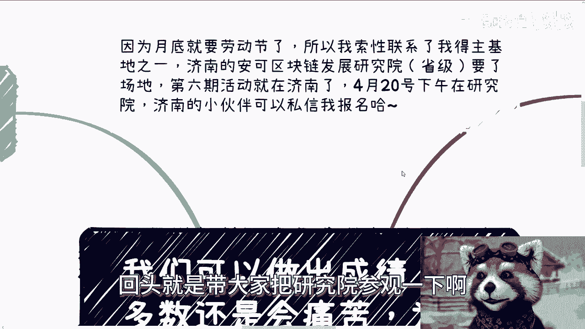

# 课程01：成就与痛苦的内耗根源 🧠

在本节课中，我们将探讨一个普遍存在的困境：人们能够取得成就，但过程却充满痛苦。我们将分析这种内耗的根源，并梳理出几种不同的人生应对策略。

## 活动通知 📅

4月20日下午在济南研究院有一场活动，报名仍在继续。届时会带大家参观研究院。

## 核心困境：成就与痛苦的割裂

许多人能够完成一件事并取得成绩，但作为当事人，内心可能感到非常痛苦。然而，周围的人却可能认为你很优秀，甚至对你产生羡慕或嫉妒。这种内心的挣扎，外人往往难以知晓。

在咨询中，我常会问对方：“你到底想做什么？”即使回答“什么都不想做”，这也是一种明确的想法。一个人活了几十年，对自己是什么样的人，内心多少是清楚的。只是不一定能明确表达出来。

## 不同人格的应对策略

以下是几种常见的人格类型及其面临的困境：

**1. 不循规蹈矩者**
这类人从小可能就与众不同。现在要求他们随大流，他们能做到吗？能。做得好吗？一般。但内心会非常痛苦。然而，他们的父母或其他人会在乎这种痛苦吗？通常不会。

**2. 追求自我价值者**
一个渴望实现自身价值、希望将想法落地的人，你让他去上班、加班、做一颗螺丝钉，他也能做。任务能完成，绩效能达标，但内心同样痛苦，觉得这不是自己想要的，从而寻求改变。

这种痛苦很难向他人诉说，因为很少有人能真正理解。朋友或许很多，但能明白你内心挣扎的寥寥无几。

## 人生的关键选择

面对这种割裂，你通常只有两条路可选：

*   **尽早选择符合内心方向的道路。**
*   **强行改变自己，完全承受改变带来的痛苦。**

如果你两者都不选，那么你很可能一生都会困扰在这种内耗之中，无法解脱。

## 在错误方向上寻求价值

许多人其实在错误的方向上寻求自己想要的东西。例如，一些渴望创造价值的人，试图在职场、在“大厂”的所谓创造性岗位上实现自我。但事实上，他们的想法并不重要，他们只是别人的螺丝钉和工具。

当遇到挫折时，他们可能会归因于当前的工作、环境或自身能力不足，从而不断跳槽、寻求突破。但人的一生中，能有几次这样换赛道的机会呢？随着时间的推移，婚姻、孩子、生活、资产都会带来巨大压力。到那时，不是不想追求了，而是追求不动了。正是这种“想而不能”的状态，导致内心与现实产生巨大割裂，从而引发内耗和抑郁。

问题的根源在于，**方向一开始就错了**。有些人天生适合当螺丝钉，有些人则不适合。如果你没有自我价值感，那么在工作中也很难找到，除非你是老板、创始人或拥有较大话语权的股东。否则，在打工的路上追求自我价值，很可能穷尽一生也无所得。

## 改变的方向与风险

如果你选择改变自己，首先面临的问题是：**改变的方向是什么？** 你可能自己都不知道。这个过程需要有三观正确的人引导，否则就是盲目变化。

以“变成资本家”为例，改变可能带来三种结果：

1.  **彻底转变**：你变成了彻头彻尾的资本家，但也失去了原本的自我。这算是一种成功。
2.  **改变失败**：你不适合改变却硬要改，过程中可能因自我观念或外界冲击而陷入抑郁和病态。这对人生而言是失败的。
3.  **艰难共存**：你能改变，同时还能保持原本的自我。但这种概率极低，需要极高的天赋才能让两种人格共存而不割裂。

## 不清楚自我状态的处理方式

在咨询中，也有人表示不清楚自己是什么样的人。对此，我的观点是：**不清楚，有时反而是好事。**

*   如果你想搞清楚的**原动力**来自于内心，那么你本身就是一个寻求改变、有所追求的人。你应该朝着那个追求去摸索，而不是停留在“我不清楚”的状态。
*   如果你的动力来自于网络鸡汤、父母期望或盲目跟风，那么我建议你别折腾了。躺平不好吗？当个螺丝钉、安心打工不香吗？没有内在原动力的折腾，只是浪费时间。

## 内耗的根源在于自身

人们感到纠结、内耗、抑郁，很多时候是自己造成的。外界环境对每个人都一样，就像大家都在一个有毒的池子里，为什么有人中毒，有人没事？在一个洗脑的环境里，为什么有人被洗脑，有人能保持清醒？

核心原因在于 **自我与现实的割裂**。你需要想明白：是你自己想要这种割裂，还是被迫割裂？如果你自己本无目标、无焦虑，却因为看到大家都在内耗而跟着内耗，那这完全是自寻烦恼。

例如，在一次线下活动中，有人问我：“有没有什么接地气的操作能突破象牙塔？”我反问他：“你做过哪些尝试？遇到了什么问题？”很多人提出的问题是**抽象**的，但在你没有具体行动之前，所有困惑都是抽象的。抽象的问题无法解决，必须将其**具象化**。就像问“这道数学题为什么错”，你总得先告诉我到底是哪道题吧？

## 总结与后续安排

本节课我们一起探讨了成就与痛苦并存的普遍现象，分析了其根源在于个人特质与所处环境的错配，以及由此产生的内心割裂。我们梳理了几种人格类型和应对策略，并指出**明确方向**和**具象化问题**是摆脱内耗的关键。

后续活动报名继续开放。此外，可以提供职业规划、商业规划咨询，以及涉及股权、合作、合同、股份分配、利润分成等方面的建议。如果你手上有某些“牌”（资源或机会），并希望从我的视角获得如何更好利用的建议，请提前整理好具体问题。