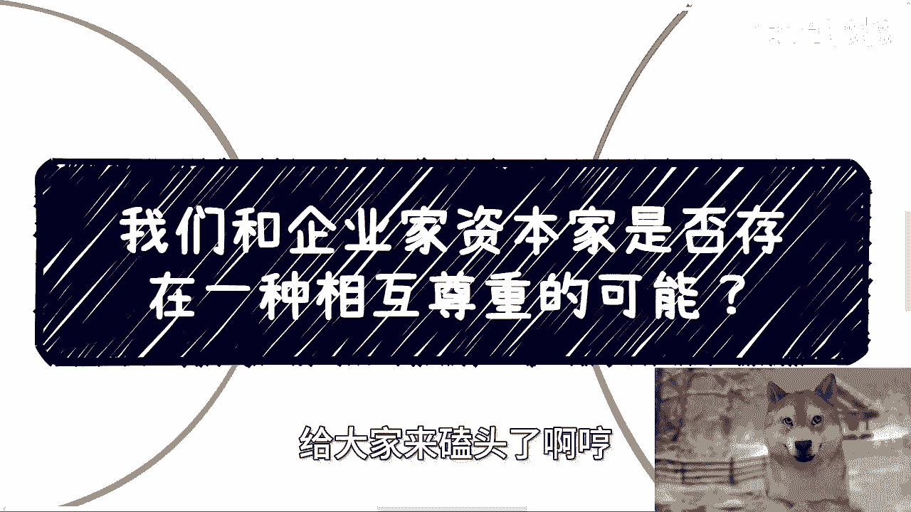
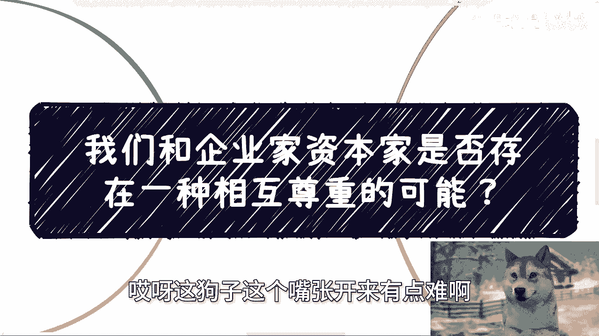
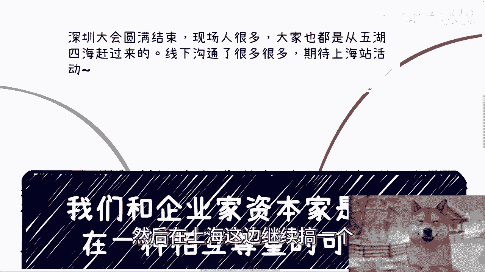
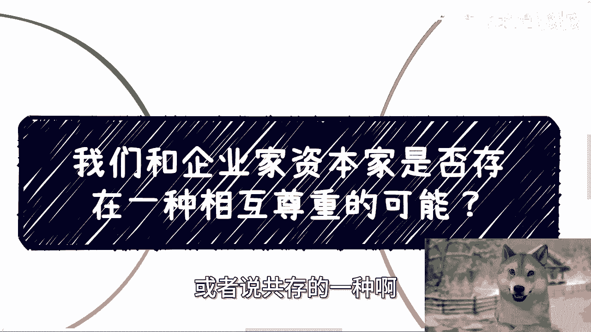
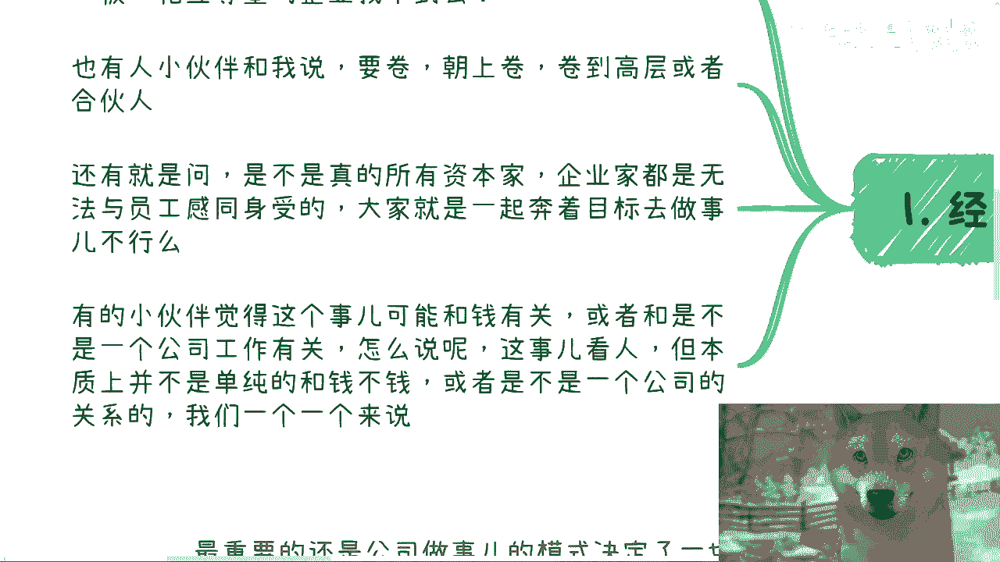
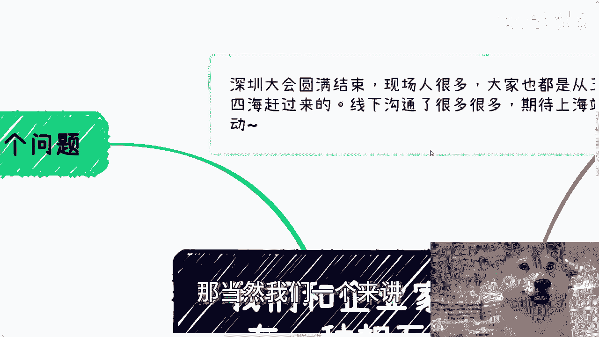
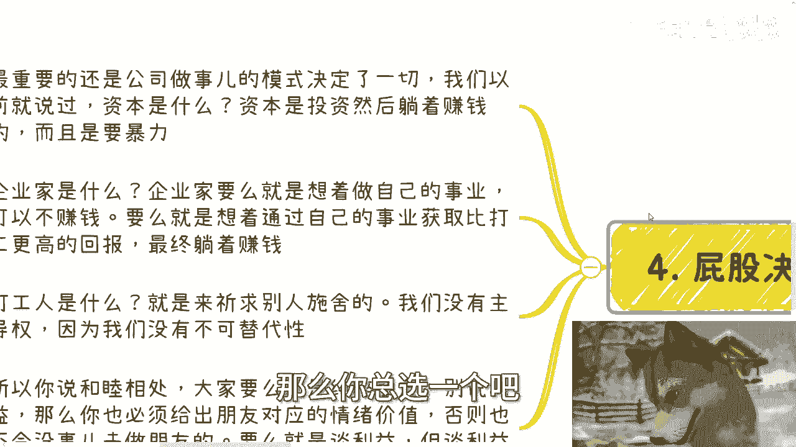
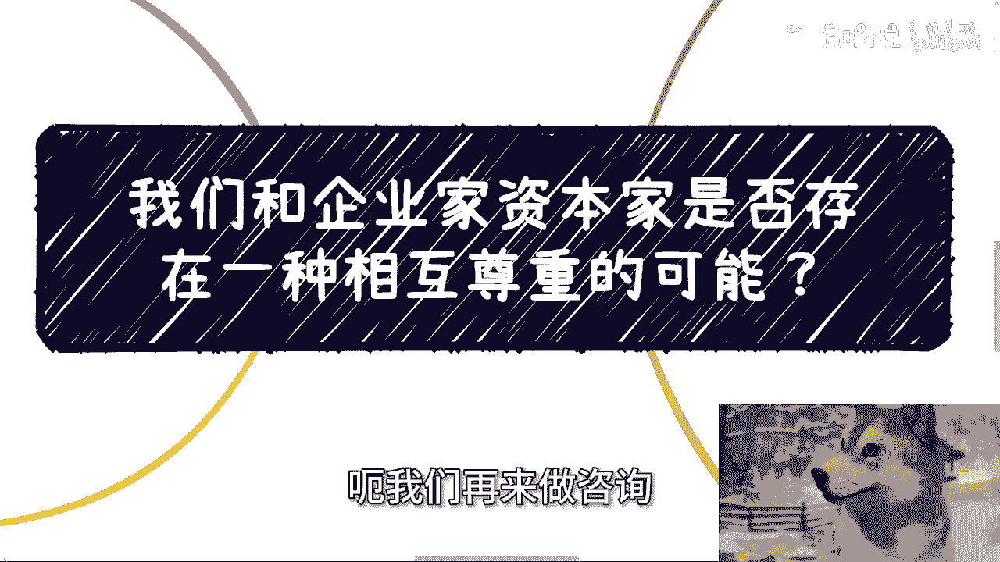

# 我们和企业家资本家是否存在一种相互尊重的可能 - P1 - 赏味不足 - BV194421U7Tn

好好好，大家好，这个我给大家来磕头了，给大家来磕头了啊哼呃停更了两天是吧。

因为这两天正好在外面对吧，刚刚开完会，哎呀这狗子这个嘴张开来就有点难啊。

呃首先啊这个深圳大会算是圆满结束了啊，我觉得现场人还是蛮多的，大家也呢从五湖四海赶过来，然后线下沟通嘛其实也排队排了好多好多，其实我觉得是蛮蛮好的，就大家见面多聊聊嘛对吧。

然后接下来的话我会在89月份吧，然后在上海这边继续搞一个。

好吧啊，那么这一期呢我们来讲的是呃，今天也不是今天嘛，就前两天吧就是也一直提到那个问题，就说啊我们跟这个企业家，资本家是否存在一种相互尊重啊，或者还是说共存的一种啊。

和睦相处的这种可能性啊，呃首先经常有这么几个问题，他说呃比如有的小伙伴问我，他说呃老板尊重员工啊，员工员工呢也尊重老板相互尊重的这种企业，找不到吗啊找不到吗啊这是第一个啊，第二个他说小伙伴跟我说要卷啊。

就是朝上卷，然后呢卷到高层，或者说所谓的这个企业的合伙人，因为我一直会问他们嘛，我说我说那你们打工对吧，那么你们的目标是什么，其实有不少啊，其实有不少这种小伙伴跟我讲的就是啊嗯对吧。

你要做合伙人或者怎么样啊，还有就是说是不是说真的所有的资本家，企业家都是无法这个与员工感同身受的啊，大家这个就奔着说目标去做事情不行吗，对吧啊，那么有的小伙伴呢，觉得。

以上这些事情的这个根本原因可能跟钱有关，就比如说你要钱要的多啊，要的少对吧，你是不是愿意更被压榨对吧，然后提供更多的价值啊，呃你们看我哎，看看看到没有，看我这个充满智慧的眼神，我给你们方法大啊。

嗯对吧哈，充满智慧眼神啊，那或者说跟额不是一是不是跟一个公司工作啊，这个可能会有些关系啊。

那么包括就是说啊是不是说啊，那当然啊我们一个个来讲。

你比如说往上卷的那种啊，首先我们首先先说一点啊，任何行业你们自己去看，做到top的，除了那种顶尖的啊技术类型的脖子的对吧，这种东西啊，啊我我我我还是要加加很多那个叠甲的对吧，否则妈的很多人要说啊。

长时间瞎说是吧啊，那么剩下的能力呢肯定是有的啊，但这我不质疑，但是呢很多别的行业走到一些top的位置，比如说前100啊，前200啊对吧，绝对不可能只靠能力啊，绝对不可能，那很多人在自己的领域里面。

其实有着很深的认知跟钻研，这这种我身边其实也见到很多，但是你说他们真的没有那些所谓的top100，top200或者所谓的那些专家牛逼吗，真不是，但为什么他们没有做到，就是说啊这个比较好的一些位置。

或者或者我说的直白一点，他们为什么没有赚到呃比较多的钱，或者说他们也没有走到比较高的一些，圈子里面呢，因为你朝上卷的时候，一方面你需要察言观色，你更需要通过更更多的时间花在阿谀奉承上，我跟你们这么说。

这事你没办法，为什么，因为世界不是围着我们转的哦，另外一方面就是说除了能力，除了察言观色以外，你其实还需要有更足够高的格局，因为有很多人，你说他专业能力强吗强的，但是他对整个全局，对于整个的一些呃。

真正做商业上或者做产业推动上面的一些认知，他没有，那那有些小伙伴就要说了，那我是一个技术性人才，我为什么要对他有认知呢，对吧好，那我就告诉你，你但凡要朝上走，你就需要综合能力强，你单纯的一个点能力很强。

那不好意思，能力比你强的人多了去了对吧，就就这么简单，因为没有办法，人太多了，可替代性太强了对吧，那么对于产业发展啊，那当然有些小伙伴也要说了，他说我所在的领域啊都是那种熬资历的，那也没问题啊，你熬呗。

你跟我说你熬20年，那我就这么问吧，中国这片土地上熬20年的人少吗对吧，一样的呀，啊那么所谓格局就是说你需要对公司的业务，对产业的发展，对国内外的发展，对各种前沿前瞻性的动态，他都要有理解。

那么你才有可能性，而且我在这个地方也说了，你才有很可能性，而且这可能性其实比较微乎其微，因为说白了很多人之所以会这样认，认为是因为他觉得只要努力就会有结果，但是这种想法其实只要接触过点社会都会明白。

对不对，有这种想法的就是什么，就是too young啊，就是图一样被保护的太好，反正你记住一点啊，你要朝上走，无论你在公司里面还是在产业里面，你要的是别人觉得你在综合能力上，在战略上。

在战术上都比别人强，而不是你觉得比别人强，你觉得没吊用对吧，因为你你nobody点你什么都不是啊，啊你就像很多人跟我聊的时候也会说啊，卧槽，他说我们投资人是，我们老板是，是啊可以啊，我我我是这么说。

我说我认可你的老板是，我也可以认可你的投资人是，但是不管他们傻不，但至少他们现在在你所在的这家公司上面，他们是占主导地位的，那怎么办呢，你要么你辞职，你开了他们，你还能怎么办呢，对不对啊。

那么第三和钱不钱的也没关系，你比如说啊，你说我可以要的少，甚至不要钱，这事其实我跟你讲就很离谱，你这样说啊，假设你默认你可以996，然后你还能倒贴着去上班，你觉得你老板会怎么想啊，你想想看对吧。

我跟你们这么说，老板其实还是会来观察你的个那个综合能力，那个合不合格，这就像什么，这就像你们找我合作，你说陈老师我不要钱啊，我能不能付钱来打工，我不会因为你付钱来打工，或者你付钱来来来合作。

我就愿意跟你合作，它不是一码事啊对吧，因为作为老板，他会明白，根本不存在免费的午餐，午餐，甚至倒贴的午餐，你一定是有所图的，对不对，那么这个时候我们就这么说，他之所以还要考察你的能力。

包括我还要考察你的你的一些，比如说背景啊，包括是不是有案例，为什么，因为他不知道你要干嘛，他认为你他不知道你要干嘛，这件事情是一个风险，但是只要你会这样要求，那就说明这个地球上会这样要求的人。

肯定还有对吧，就是只要你说你会免费的或者甚至倒贴来打工，那就说明这地球上会免费，会倒贴的人肯定多啊啊，那么老板自然而然会去找那些他能评估风险，或者他能够将将风险降到最低的，或者说明确对方要什么的。

同时能力还达标的人去合作，他为什么找你合作呢，对不对对吧，就是说所有的时候，他其实第一的脑子里面第一个反应是什么，就是你给出来的东西是不是别人给不出来哦，如果你给出来的东西妈的遍地都能给。

那那那那那有啥好合作的对吧，那第四屁股决定一切哦，对我们来分开来说，最重要的还是在商业层面，企业做事情或者商业合作这个模式决定的一切，我们以前就说过啊，资本是什么，资本就是投资，然后躺着赚钱。

而且需要暴利呈几何倍数的增长，这叫资本，对不对好，那么企业家是什么，企业家有两种，要么就是纯用爱发电，就是他只做自己的事业，要么就可以呃，就是他只做自己的事业，不赚钱对吧，要么就是想着通过自己的事业。

获取比打工更高的回报，和比打工更高的效率的回报，最终他的目的是躺着赚钱，对不对，好，那么打工人是什么，打工人就是乞求别人施舍的，你不要来跟我讲，你有什么能力，还是那句话，你再能力再强。

你还是祈求别人施舍的，为什么，因为还是那句话，明天早上能不能打这份工，不是你说了算的，是你们的老板跟投资人说了算的，关你吊事啊，啊你你你老板跟你说，哎你明天别做了，你总不可能跑过去说。

唉老板因为我很牛逼，你再牛逼，也得滚，对不对啊，所以啊我们就说啊，你说和睦相处，大家要么就是纯粹做朋友，别来谈利益，但是如果纯粹做朋友，你也必须给出做朋友的对应的情绪价值，为什么，因为谁没有朋友啊。

啊谁没有一些知心的朋友啊，我们缺朋友吗，啊如果你很缺朋友，那说明那说明你有问题，我就告诉你对吧，那么否则大家不会没事做去做朋友的对吧，那要么就是不做朋友，谈利益啊，但是谈利益就又回到我们刚刚说的三三种。

三种就是你要么资本，你要么就是企业家，你要么就打工人，你没力啊，你还有什么呢对吧，你就必须回到这三个价值点上面，那么你总选一个吧对吧。

那么你说啊，不管你选哪个，对方跟你要感同身受，对方要来理解你，对方要来说和睦相处，可能吗，可能吗，就是你知道这个里面就是有个悖论，我一直跟你们说的这个悖论，就是但凡他有记有案例做过内容的。

他就不会来忽悠你，他就不会给你画饼，但凡他给你画饼的，那就说明他自己没有做过，就是但凡你们能和睦相处，那就说明对方一定不是一个合格的企业家，资本家，但凡是个合格的，他就不可能和睦相处。

因为他目标性很明确，对不对，就这么简单啊，所以说最终结论也很简单，就是地球不是围着我们转的，我们千万不要去想着说啊，我们能不能去创造一个东西，不好意思，我不觉得我们创造的出来。

尤其你们跟我都是那种怎么说呢，就是就是实质意义上的普通人，我们能做什么对吧，我跟你们讲，我们能做的就是先让自己站起来，行好吧，额那么哎看我这个智慧的眼神，对吧啊，好那就这么着吧啊，然后那个职业规划。

商业规划啊，股权期权呃，项目计划书啊，白皮书啊，分红丰润啊，包括你们手上有什么牌，你们手上没有什么牌的啊，你们希望通过跟我的沟通啊，以我的认知跟一些观点啊，能够跟让你们接地气的去做一些事情的话。

那么你们可以整理好个人的问题啊。

