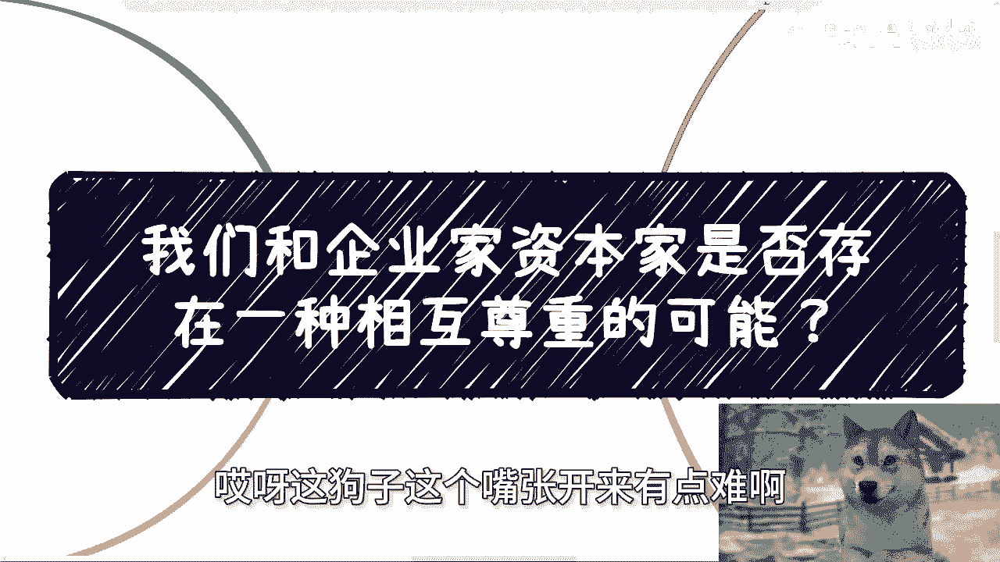
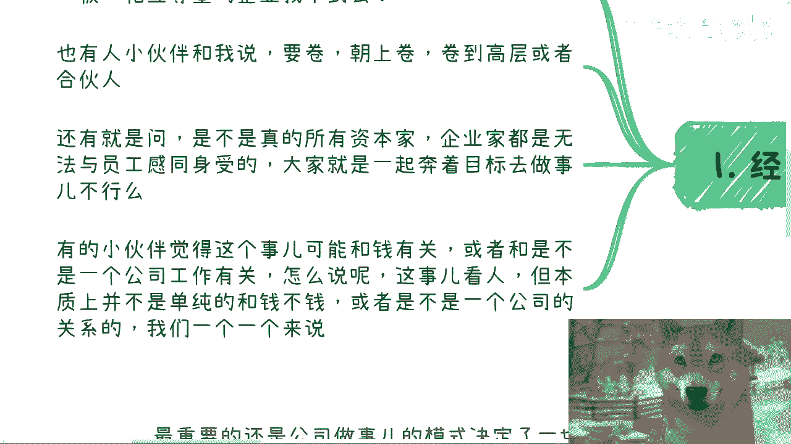
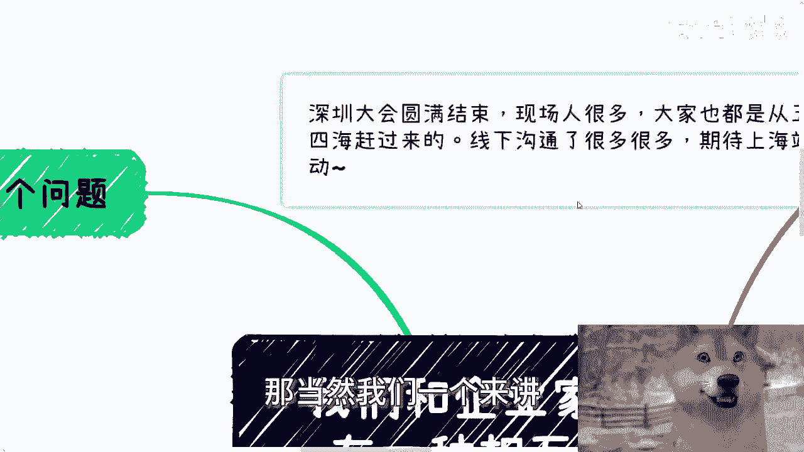
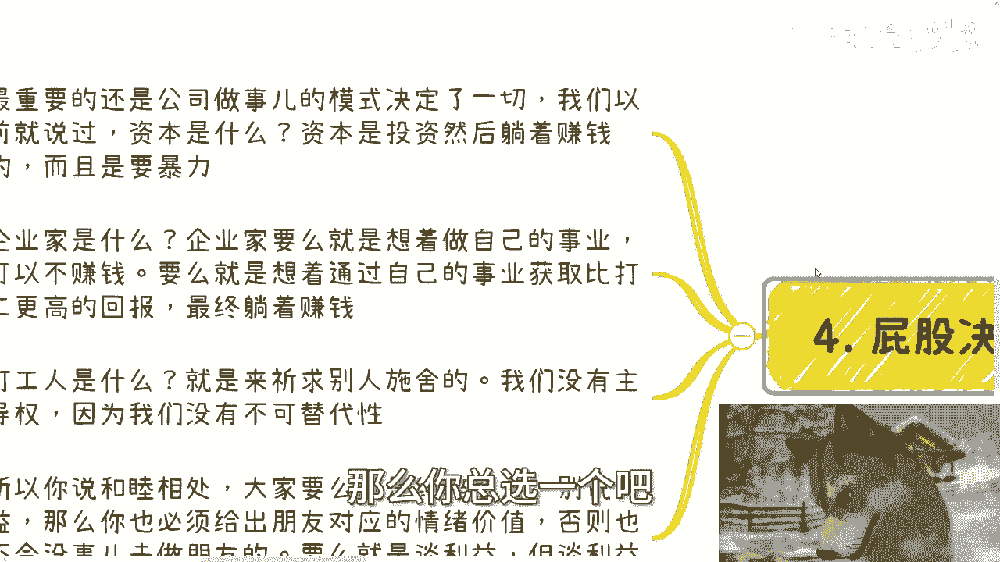

# 课程：我们与企业家/资本家是否存在相互尊重的可能？ - P1 🧐

在本节课中，我们将探讨一个常见的社会与职场议题：作为普通员工或个体，我们能否与企业家或资本家建立一种相互尊重、和睦共处的关系？我们将通过分析几种常见的观点和疑问，来理解其背后的逻辑与现实。

---

## 概述

课程开始前，先同步两则信息。深圳的线下大会已圆满结束，现场交流氛围热烈。后续计划于八、九月份在上海再次举办类似活动。

本节内容核心源于一个反复被提及的问题：我们与企业家、资本家之间，是否存在相互尊重或和谐共存的可能性？我们将拆解几个相关的子问题，逐一进行探讨。

---

## 对“相互尊重企业”的疑问

有观点认为，是否存在老板与员工相互尊重的企业？答案是，理论上存在，但实践中极为罕见。其根本原因在于双方关系的结构性矛盾。

---

## 对“向上卷成为合伙人”路径的分析

上一节我们提到了结构性矛盾，本节中我们来看看希望通过“内卷”晋升至高层的路径是否可行。

以下是关于“向上卷”的几个关键点：

1.  **能力非唯一要素**：在任何行业，要达到顶尖位置（如前100、200名），**绝对不可能只靠专业能力**。许多人在自身领域有深厚认知，但未能获得相应地位或财富。
2.  **需要综合技能**：向上发展需要**察言观色**和投入时间处理人际关系，因为世界并非围绕个人运转。同时，还需要具备更高的**格局**，即对业务、产业、商业全局的认知。
3.  **现实竞争残酷**：单一技能强的人可替代性高。即使愿意“熬资历”，同样资历的竞争者也不在少数。关键在于，**是别人认为你强，而不是你自己认为强**。
4.  **权力结构决定**：在公司或产业中，占据主导地位的是老板和投资人。个体能力再强，也无法改变这一权力结构。选择只有接受或离开。

---

## 对“降低薪资要求换取机会”的探讨

那么，是否可以通过降低经济要求（如少要钱甚至不要钱）来换取尊重或机会呢？答案是否定的。

这基于一个简单的商业逻辑：**根本不存在免费的午餐**。当个体提出远低于市场价值的条件时，反而会引起对方的警惕。

*   **老板的视角**：老板会认为这种反常行为背后存在未知风险或企图。既然有人愿意免费，那就意味着市场上可能存在更多类似选择。
*   **合作的基础**：老板倾向于选择那些**风险可控、意图明确且能力达标**的合作伙伴。个体提供的价值必须是**稀缺的、他人难以替代的**，而非仅仅是廉价的。

---

## 核心矛盾：角色与目标的根本差异

以上种种现象，根源在于不同角色在商业体系中的根本定位和目标冲突。这是理解一切问题的钥匙。

我们可以用三种核心角色模型来概括：

1.  **资本家**：核心目标是 **`资本投入 → 获取几何级数增长的暴利`**。本质是追求躺着赚钱。
2.  **企业家**：分为两类。一类是“用爱发电”，不计回报；另一类的终极目标同样是 **`通过事业获取远超打工的回报和效率，最终实现躺着赚钱`**。
3.  **打工人**：本质是 **`祈求雇佣方施舍工作机会`**。无论个人能力多强，工作的持续与否最终由资本方（老板/投资人）决定，公式为：**`雇佣关系存续 = f(资本方决策)`**，而非个人能力。

基于以上定义，所谓的“和睦相处”存在一个根本悖论：

*   在**纯粹朋友关系**中，双方不谈利益，只提供情绪价值。但这与商业合作无关。
*   在**商业利益关系**中，双方必然回归到上述三种角色之一。各自的目标（资本增值、企业成功、获取薪资）本质上是冲突的，难以达成真正的感同身受。

**结论是**：一个目标明确、合格的资本家或企业家，其首要任务是实现商业目标，而非与员工“和睦相处”。反之，如果一个资本家/企业家将“和睦相处”置于商业目标之上，他很可能不是一个合格的商业角色。

---

## 总结与行动建议

本节课我们一起学习了关于与企业家/资本家关系的几种常见迷思。核心结论是：在当前的商业结构下，基于不同角色的根本目标差异，实现真正的、平等的相互尊重与和睦共处极为困难。

地球并非围绕我们旋转。作为普通人，我们能做的不是幻想改变结构或创造不存在的乌托邦。

**最务实的第一步是：先让自己站起来**。这意味着提升自身的综合能力、稀缺价值和对世界的认知，从而在可能范围内为自己争取更多的主动权和选择空间。

---
**附：关于进一步咨询**
若你在职业规划、商业规划、股权期权、项目计划等方面有具体问题，并希望获得更接地气的分析与建议，可以整理好个人情况后进行咨询。