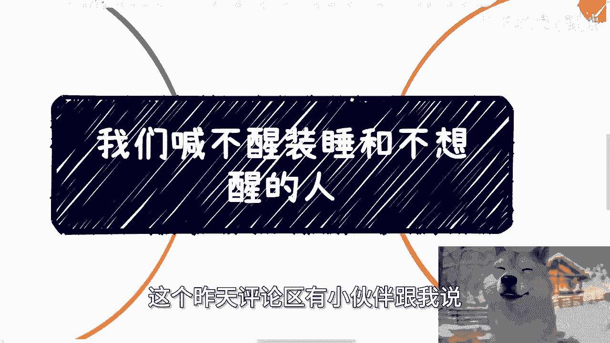
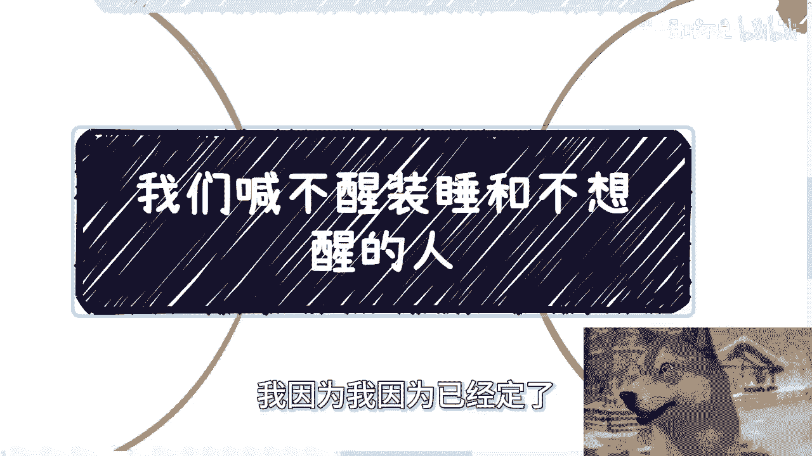
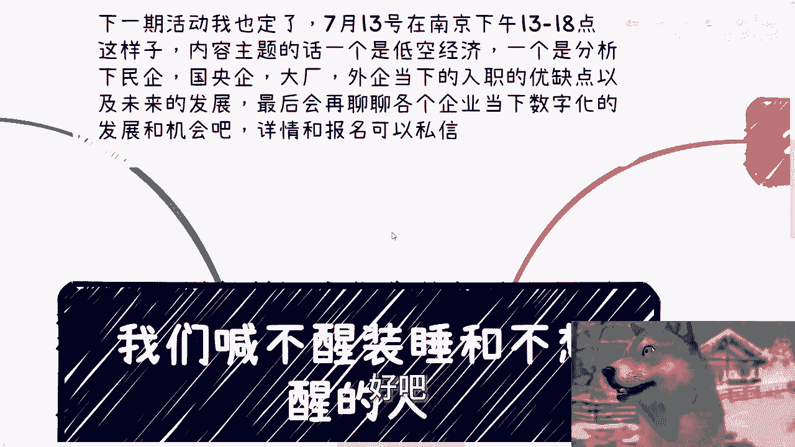
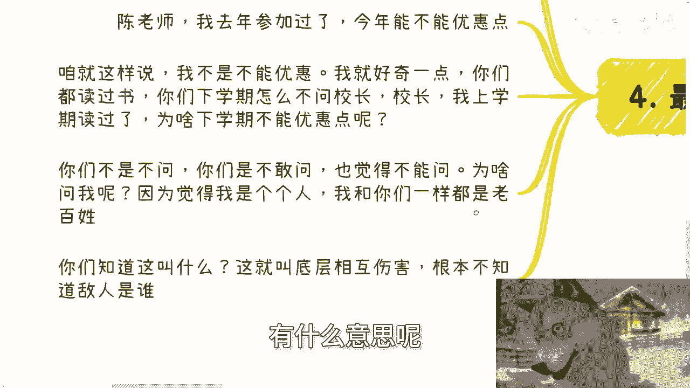
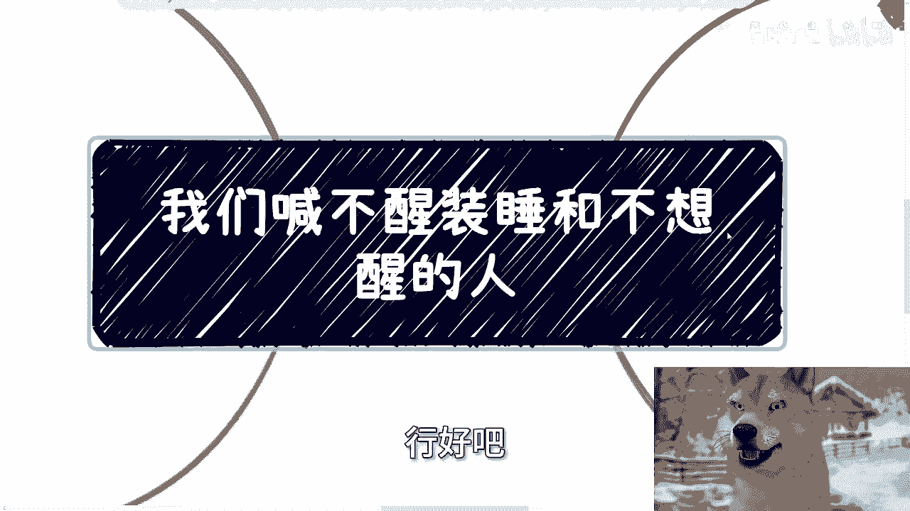
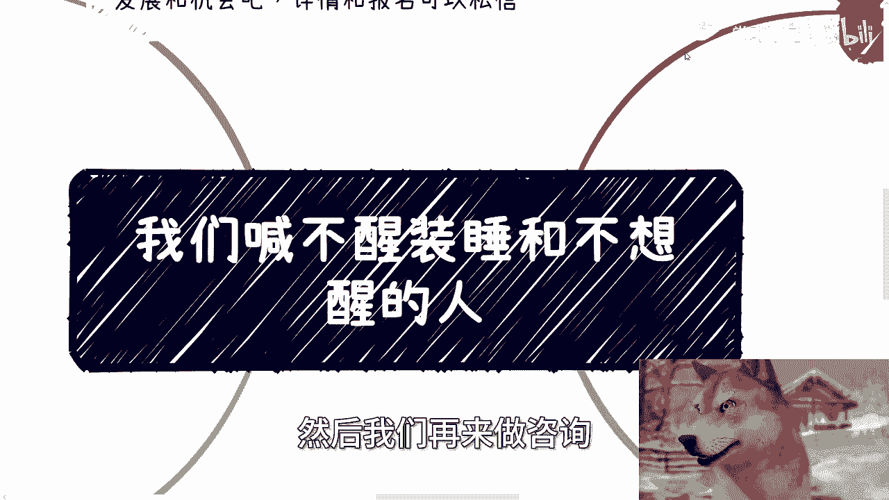

# 我们喊不醒装睡都不想醒的人 - P1 - 赏味不足 - BV141421k7vK

咳咳咳咳好好，大家好啊，今天嗯今天礼拜五了啊，呃今天我们讲的主题呢，叫我们喊不醒装睡跟不想醒的人啊。

那首先呢这个昨天评论区有小伙伴跟我说。

他说南京现在大小周特别多啊，然后说让我以后放礼拜六啊，礼拜天啊，呃那这次这个场地我因为我因为已经定了。

所以我也没办法，就就先先定礼拜六吧，好吧，先礼拜六吧，委屈一下，委屈一下啊。

那下一期活动我已经定了好吧，7月13号下周六啊，乃在南京下下午的这个一点到六点呃，内容主题的话，一个是低空经济，一个是分析一下民企国央企大厂，外企当下的这个入职的优缺点，以及未来的发展好吧。

最后聊一聊当下企业的这个数字化。

跟数字经济的发展跟机会好吧，详情跟报名可以私信我好啊。

然后昨天评论区啊也有小伙伴说啊，他说陈老师你很耐心啊，我跟你讲啊，跟我沟通过的人都知道我一点都不耐心啊，我只是无奈啊，我耐不耐心取决于对方是谁啊，那很多人觉得我很耐心啊，我跟你们讲。

我最多呢我觉得我也就是有个毅力啊，每天来更新，但我绝对不是有耐心的那种人，为什么，因为我是个商人，我是个资本家啊，我没兴趣跟不跟那种自己都不自救的人沟通，对吧，你你所谓那个要他人救先得自救对吧。

你自己自救都不救啊，那自己都没想法，你说你想让我跟你聊啥，我聊不出啥哦，我没兴趣跟那种不能赚钱的人沟通啊，那么其实视频本身呢，昨天那个评论区嘛也讨论了一下，就说我们这个视频啊能改变什么人。

其实视频本身呢更并不能改变任何的人啊，无非就是给那些有想法，原本就有驱动力，有想改变自己或者想改变社会的人，一些推动的力量啊，我和他们这么说，我说你们自信点啊，我不认为有谁是看了视频能改变的，不存在的。

好的，我说不好听点，那你们他妈的小学初中高中到高等教育，他妈的这么多年都不能改变哦，我能改变，哼哼，别别别别哈，别逗笑我啊，那很多人改变并不是改变，而是他们本来就是有这种天赋，有这种意识啊。

他只不过就是说因为我的是看到了我的视频，有一种契机对吧，可能就是诶点了一下，那么在他们人生当中，我呃就是会可能会有所改变，但是本质上这件事情跟看不看我视频没有关系，因为在他们人生当中，就算没有我。

他早晚也早晚也会醒悟，因为他就是这样的人好，那么另外一方面呢，在计算机当中啊，我们后端啊服务器我们这边有个名字叫心跳啊，我其实现在更新呢也间接的想告诉大家啊，我还在啊，那么我还在呢，这就是一种希望啊。

我觉得我们相互还在都是一种希望啊，那么第二啊我想说一下我想表达的信息啊，其实本质上我一直再传达给大家几个信号，当然最深层次的信号我这里不方便讲对吧，那一个呢是希望大家能为自己活着，大家呢都只活一次啊。

无论失败也好，成功也好，失败成功又如何呢，对不对，又如何呢，啊生不带来，死不带去，至少不要活的那么循规蹈矩，就是呃我们每一个人对吧，大家每一个人都是独立的个体，然后每一个人都被这个社会框住。

被这个呃以前的前人啊，所谓的一些呃这个什么天才啊，所谓的一些呃规则制定者制定出来一些东西，你去循规蹈矩啊，不要那么窝囊，当然啊看问题不能只看表面啊，陈老师说窝不要那么窝囊对吧，什么意思。

就是你别觉得世俗所定义的高低贵，贱都是就是对的，那他们怎么为什么对呢，对不对，那本质上只要我们自己看得起我们自己，我们自己还有往前冲的想法，还有去改变的想法，这就是好的，表面上做什么又不重要。

我他妈小学到初中，我还在外面摆地摊卖报纸呢对吧，那我毕了业，我还失了，失业半年，我还在那边给给市超市里面给别人做试吃员呢，怎么了呢，对不对，怎么了呢，我说不好听点，我要让你们现在跟我当年一样去做试吃员。

怎么样子，哎我怕不是你们一方面内心又觉得啊不好说，然后事情也做不好对吧，就你们知道就那句话，就我觉得一直得要记在心里，就是什么，就是一时三刻的荣辱，他不足为奇对吧，然后另外一方面就是一个就是说有合适的。

其实都欢迎找我合作，都为什么，因为至少我不会坑你们对吧，第一我就跟你们这么讲，找我合作，我不可能让你们出钱的，没道理的，你我一旦一一旦让你们出钱，我一定会告诉你们，你们出钱得到什么，包括就利润是多少。

我一定会明很明确跟你们讲的，该签合同签合同对不对，就至少我不会坑你们，我最多是什么就拒绝你们，对不对，那我觉得这个也是我要我要传达给你们的信息，那么最后一层我就不说了，这网络环境也不方便讲啊。

那么第三工作呢，恋爱呢，结婚呢其实都一样，很多人自己心里都有答案，或者还说呢他不愿意主动去改变，这可能跟性格跟认知，跟家庭的这种原生态的教育有关系啊，各种各样的原因，那么这种这种人啊，就大家平时聊聊天。

八卦一下无所谓，但你说会不会因为朋友之间的聊天，或者说网络上啊看到一些什么视频，他就有改变的想法，不可能的啊，我跟你讲自信一点，不可能，我可以跟你们讲这件事情，我他妈一刀切一棒子打死，就是不可能啊。

就我们一直说就说很多人不是蠢就是坏，什么意思，就是说就是你要明白，就是说无论蠢还是坏，它结果是不会改变的，为什么呢，因为蠢，他就是无法理解你说的，他没法get到你所说的这个点，坏就是他妈的。

无论你说的对不对，反正根本不管你说什么对吧，那这就像我一直说的，尊重他人命运命运，你为他好，他不觉得，然后你你跟他讲半天，你吃力不讨好，他还得反过来咬你，那么最后说个让我觉得也很很也逗逗乐的事情。

就其实到今今天为止，大概一年半的时间嘛，其实不少人啊参加活动啥的，跟我说说老师啊，我之前跟你聊过，你也回我了，是不是可以优惠一点啊，陈老师啊，我去年参加过了，今年能不能优惠一点啊，咱就这么说啊。

我不是不能优惠啊，我我也不缺这几百块钱，但是问题是什么，我就很好奇一点诶，你们问我的人，你们都读过书，对不对，哎你们都到超市里买过东西，对不对，你们都到各个地方都去，就是就是总归是啊付过钱，对不对。

那么我就想问了，你们读书的时候，你们下半学期有没有问过校长，哎，校长啊，我上半学期读过书了，那为啥下半学期不能优惠点呢，你有没有问过诶，我很好奇你包括你有没有问过全家问过7-eleven。

问过问过各种各样的超市，哎我昨天来买过东西，我今天来买能不能优惠一点对吧，我就这么说，你们不是不问，你们是不敢问啊，也会觉得由于这个社会制定的一些规则，你们不能问，但为什么会问我呢。

因为你们觉得我是一个个人，我跟你们一样，都是老百姓，你们知道这叫什么吗，啊这就叫做底层相互伤害，这就叫做根本不知道敌人是谁，有什么意思呢。

对不对，啊就真的我有时候就就你们看问题啊，真的得要把格局放大，就是我们不管你是一个呃有政治地位，有社会地位，还是说是一个人民群众，一什么叫一碗水端平，所谓一碗水端平，就是你做事情，不管对方是谁。

你都是一样的，你就比如说我今天跟你们这么讲，我也是这么讲，有什么区别对吧，我跟你们这么讲，我以前啊比如说201几年的时候，我做业务我还是比较就是那种求稳的，求缓的对吧，或者说很顾别人面子的。

但我跟你们讲，我大差不多两2020年之后，我再也不是这样子了对吧，我我之前就跟你们讲过，我我201几啊啊2021年的时候，我在北京的时候对吧，我跟对方讲的很清楚，你们想让我跟领导去沟通的话，可以的。

我说你们去做好一个准备啊，我说对方只有我们今天过去，只要聊不出个结果的，你们不要怪我他妈的，把这个领导按在桌子上摩擦，对不对，我我不管你呀，为什么，因为我又不是过去伺候他的。

我他妈只关心我们今天这个case能不能成，对不对，我来干嘛的啊，我他妈出差过来来来伺候领导的，那不是我，我做的事，谁愿意伺候谁伺候对吧，这叫一碗水端平啊，所以说你们真的自己心里有点逼数，我跟你们讲啊。

行好吧啊。

就这么着啊，然后那个活动7月13号啊，下午呃，然后有什么问题的，大家也可以线下多过来讨论讨论啊，另外一方面就是说职业规划，商业规划啊，股权期权分润分红呃，商业计划说白皮书啊，包括你们有什么呃未来的规划。

未来的建议啊，希望通过就跟我的沟通，希望通过我的一些视野，通过我的一些视角，能够给你们一些，更好的贴近于地气的一些建议和规划的话，那么你们可以整理好个人的一些背景，和详细的这个问题的列表啊。

然后我们再来做咨询。

好吧啊，不强求啊。