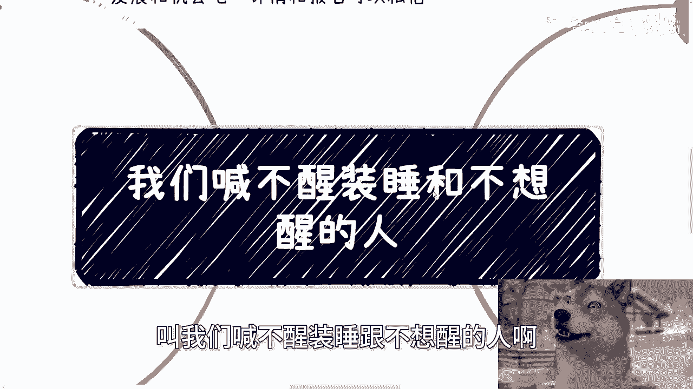
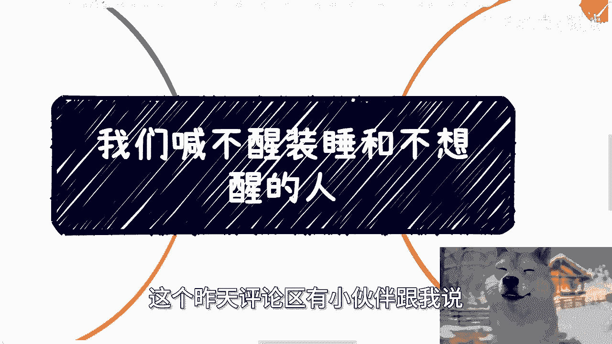
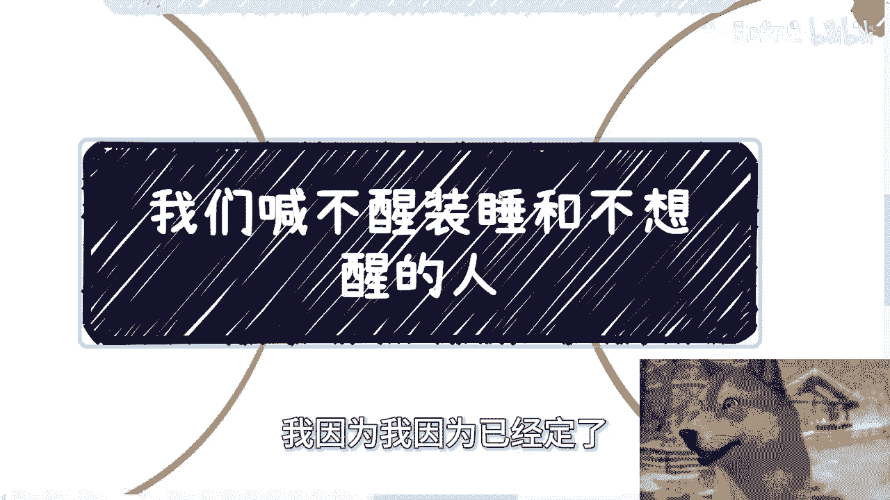
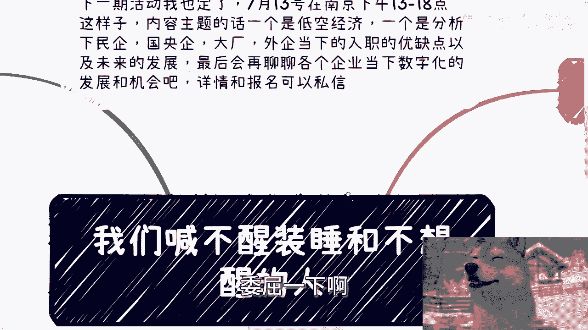
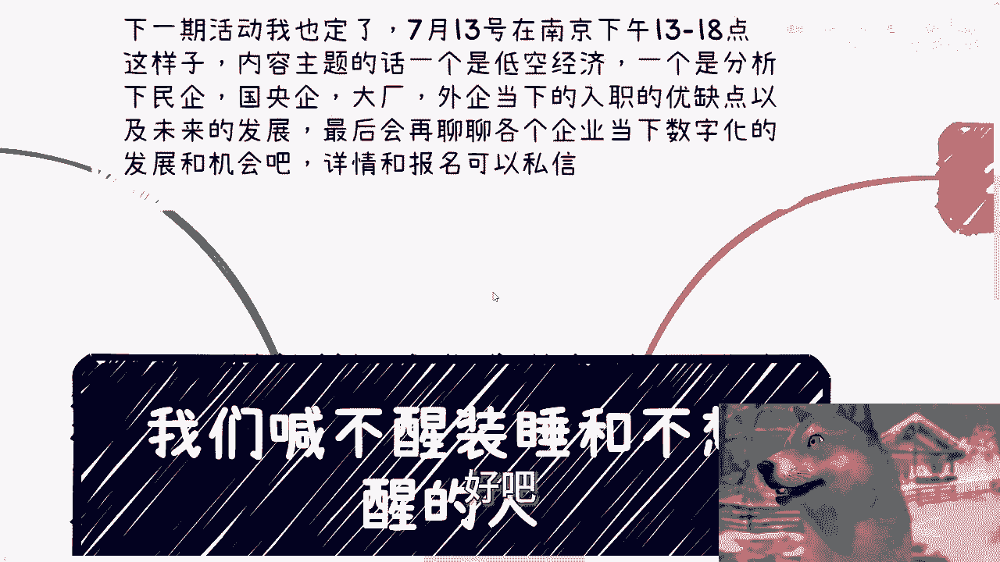
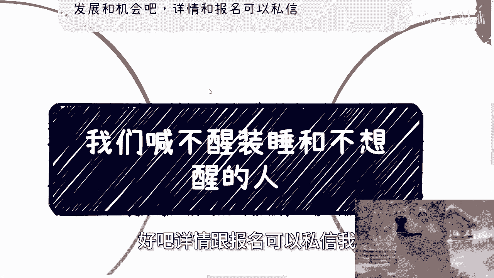
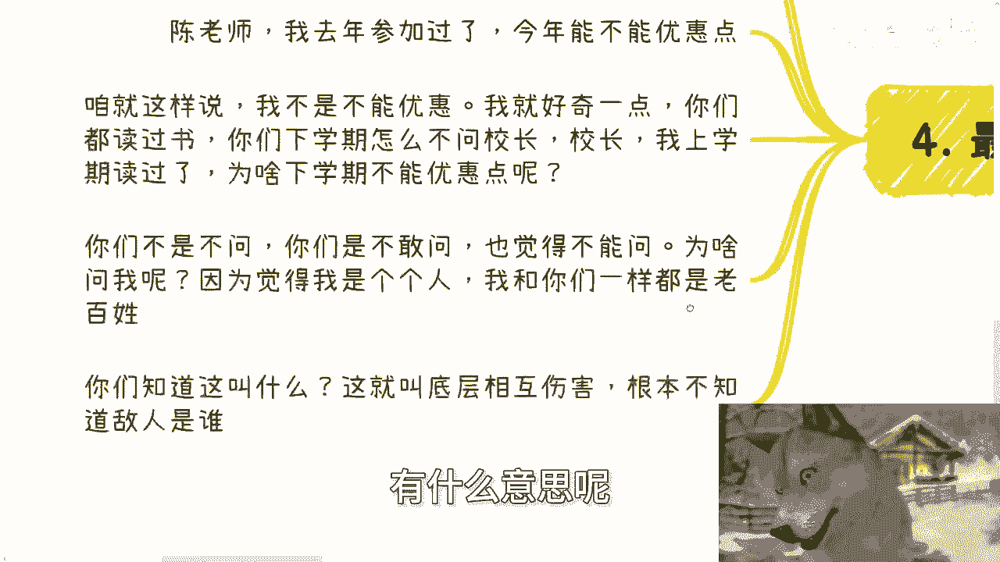
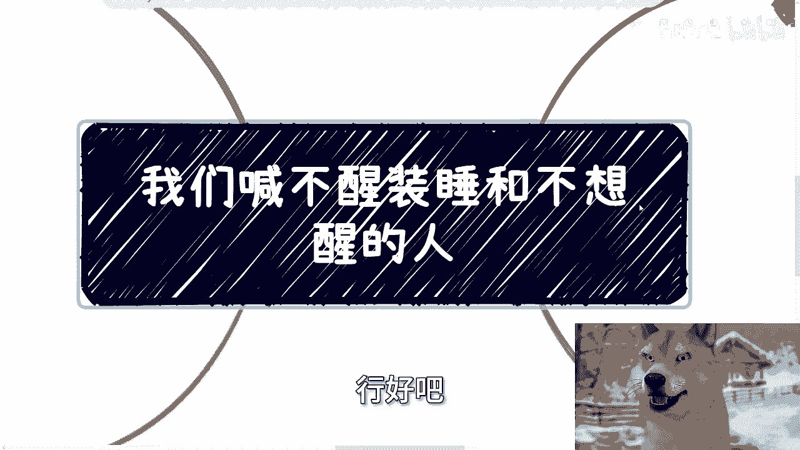
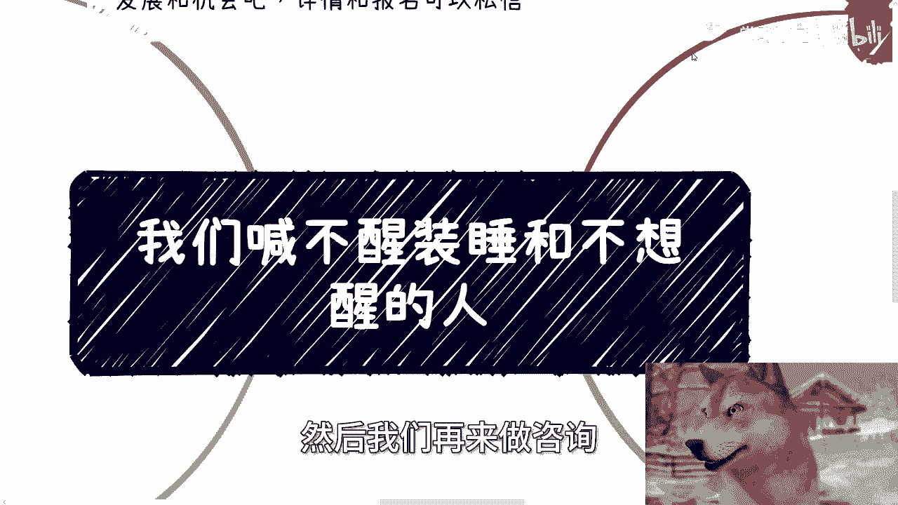

# 我们喊不醒装睡都不想醒的人---P1---赏味不足---BV141421k7vK

## 概述
在本节课中，我们将探讨一个核心观点：外部力量难以唤醒那些主观上不愿清醒的人。课程将结合个人经历与社会观察，分析这种现象背后的原因，并讨论个体应如何建立自我驱动力与批判性思维。

---

## 课程内容

### 关于活动安排的说明
上一节我们介绍了课程主题，本节中我们来看看课程相关的活动安排。

有评论提到南京目前实行大小周工作制，建议将活动安排在周六或周日。由于本次场地已经预定，无法更改，因此活动将定在周六。下一期活动已确定在7月13日（下周六）下午一点至六点于南京举行。

活动主题包括：
1.  低空经济。
2.  分析民企、国央企、大厂及外企当前的入职优缺点与未来发展。
3.  探讨当下企业的数字化与数字经济的发展机会。

活动详情与报名请私信联系。

---

### 关于耐心与改变的实质
上一节我们说明了活动信息，本节中我们来看看关于沟通与改变的本质。

我并不认为自己是一个有耐心的人。我的耐心程度取决于沟通对象。我最多算是有毅力坚持每日更新。作为一个商人，我对与那些不愿自我拯救、没有自主想法的人沟通没有兴趣。我的沟通原则是：**只与能创造价值的人进行有效对话**。

视频内容本身并不能改变任何人。它只能为那些原本就有驱动力、渴望改变自己或社会的人，提供一些推动力。没有人是单纯因为看了某个视频而改变的。多年的正规教育都未能实现的改变，一段视频更不可能做到。

真正的改变源于个体内在的天赋与意识。视频或许能成为一个契机，但本质上看与不看没有必然关系。这类人即使没有看到视频，也迟早会醒悟，因为他们是**具备觉醒潜质的人**。

在计算机领域，后端服务器有一个概念叫“心跳”。我持续更新视频，也是一种宣告“我还在”的方式。这本身代表一种希望，我们彼此的存在就是一种相互的希望。

---

### 希望传达的核心信号
上一节我们讨论了改变的内生性，本节中我们来看看我希望传达的几个核心观点。

我一直试图传达几个信号。最深层的信号不便在此讨论。其中一个核心信号是：希望大家为自己而活。人生只有一次，无论成败，最终都“生不带来，死不带去”。至少不要活得过于循规蹈矩。

每个人都是独立的个体，但常常被社会框架、前人制定的规则所束缚。我的建议是：不要那么窝囊。但这并非表面意思。

看问题不能只看表面。所谓“不要窝囊”，是指不要盲目认同世俗定义的高低贵贱。这些定义为何一定正确？关键在于我们自己看得起自己，保有向前冲、求改变的想法。这本身就是好的。**表面从事什么工作并不重要**。

我小学到初中时摆过地摊、卖过报纸。毕业后失业半年，曾在超市做试吃员。这并没有什么。我猜想，如果让你们现在去做同样的事，一方面内心可能觉得不体面，另一方面事情也未必能做好。

有句话值得牢记：**一时三刻的荣辱，不足为奇**。

另一方面，我欢迎一切合适的合作。至少我可以保证不坑害合作者。如果涉及出资，我会明确告知所能获得的回报与利润，并依法签订合同。我最多是拒绝合作，但绝不会设局欺骗。这是我要传达的另一个信息。最后一层信号因网络环境所限，不便阐述。

---

### 工作、恋爱与婚姻的共性
上一节我们探讨了自我价值，本节中我们来看看工作、恋爱与婚姻中的共同现象。

工作、恋爱、婚姻在这一点上是一样的：很多人心里早有答案，或者根本不愿意主动寻求改变。这可能与性格、认知、原生家庭教育等多种原因有关。

对于这种人，平时聊聊天、八卦一下无所谓。但若指望通过朋友聊天或观看网络视频就能引发他们的改变，那是不可能的。我可以非常肯定地说：**这绝对不可能**。

我们常说，很多人“不是蠢就是坏”。“蠢”意味着无法理解你所说的观点；“坏”则意味着无论你说什么，他们都根本不在乎。结果都不会改变。

这就像我一直强调的：**要尊重他人命运**。你为他好，他并不领情。你费尽口舌，最后吃力不讨好，对方可能还会反咬一口。这没有意义。

---

### 关于“优惠”请求的思考
上一节我们分析了不愿改变的心理，本节中我们通过一个具体例子来审视一些思维误区。

有一件让我觉得有趣的事。在过去大约一年半的时间里，不少参与活动的人问我：“老师，我之前跟你聊过，你也回复我了，能不能优惠一点？”或者“陈老师，我去年参加过了，今年能不能优惠？”

我不是不能优惠，也不缺这几百块钱。但我很好奇：你们都读过书，都在超市买过东西，都有过消费经历。那么，你们读书时，有没有问过校长：“校长，我上学期读过了，这学期学费能不能优惠？”你们去便利店或超市，有没有问过：“我昨天来买过东西，今天能不能便宜点？”

你们不是不问，而是**不敢问**。你们觉得社会制定的规则不允许这样问。但为什么敢问我呢？因为你们觉得我是一个个人，和你们一样是“老百姓”。你们知道这叫什么吗？**这就叫做底层间的相互伤害，根本不知道真正的矛盾所在**。

看问题真的要把格局放大。所谓“一碗水端平”，就是做事不管对方是谁，都秉持同一套标准。我以前做业务时可能求稳、顾及面子。但大约2020年之后，我不再这样了。

例如，2021年在北京，我明确告诉合作伙伴：如果你们需要我去和领导沟通，可以。但请做好准备，如果今天谈不出结果，别怪我可能会把对方“按在桌子上摩擦”。我不是去伺候领导的，我只关心项目能不能成。谁愿意伺候谁去。这才叫一视同仁。

所以，大家自己心里要有数。

---

### 服务与咨询说明
上一节我们通过实例探讨了思维格局，本节中我们来看看可以提供的具体服务。

活动在7月13日，欢迎大家线下前来讨论。此外，如果大家需要职业规划、商业规划、股权期权、分红方案、商业计划书或白皮书等方面的咨询，或者希望对未来规划获得一些更接地气的建议，可以通过我的视角提供一些参考。

有意者请整理好个人背景和详细的问题列表，然后我们再进行咨询。不强求。

---

## 总结
本节课我们一起学习了“我们喊不醒装睡都不想醒的人”这一核心观点。我们探讨了改变的内生性，强调真正的驱动力源于自身；分析了工作、恋爱中的被动心态；并通过具体事例，指出了在思维上需要打破的局限与误区。关键在于建立自我认同、保持前进的欲望，并以平等的姿态面对各种社会关系。