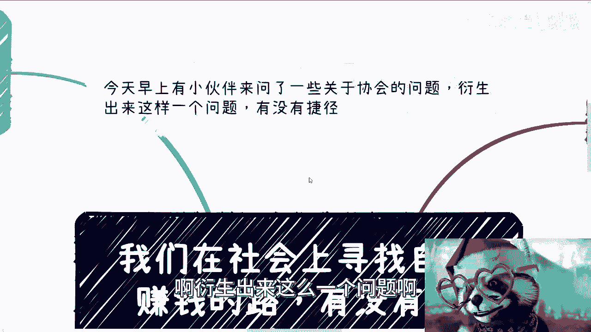
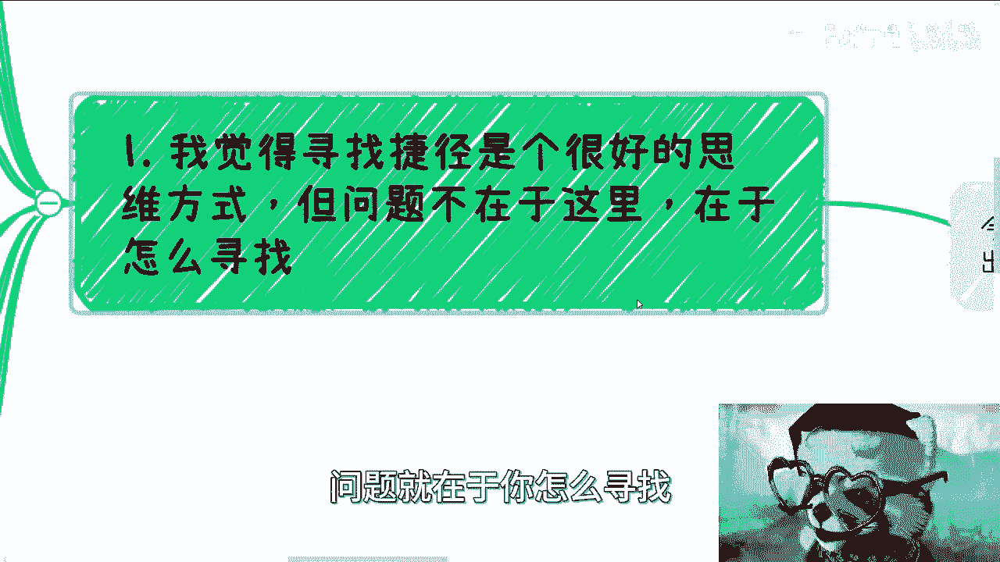
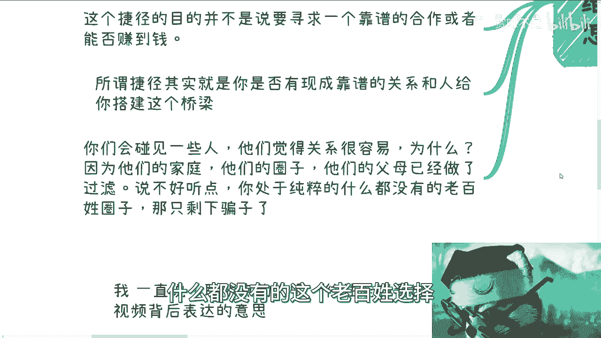
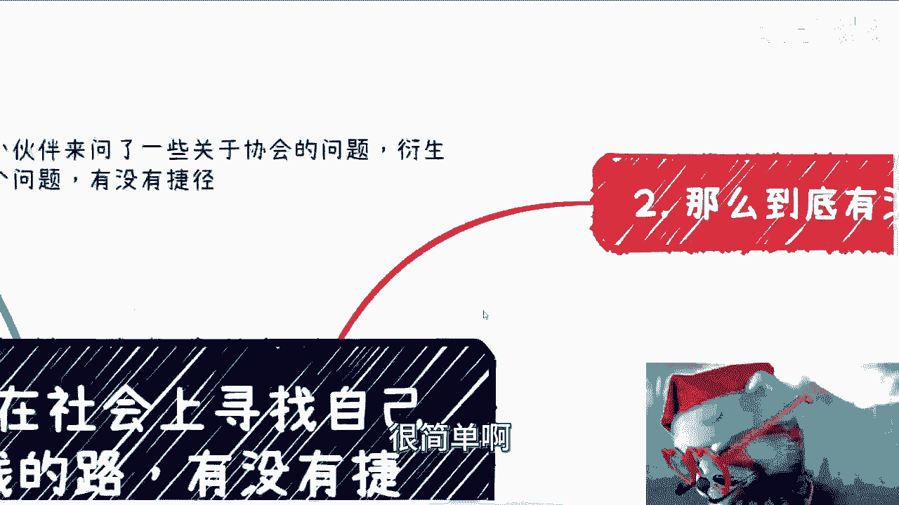
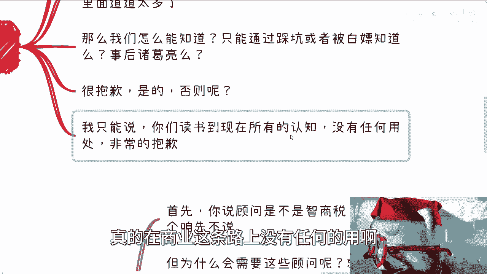
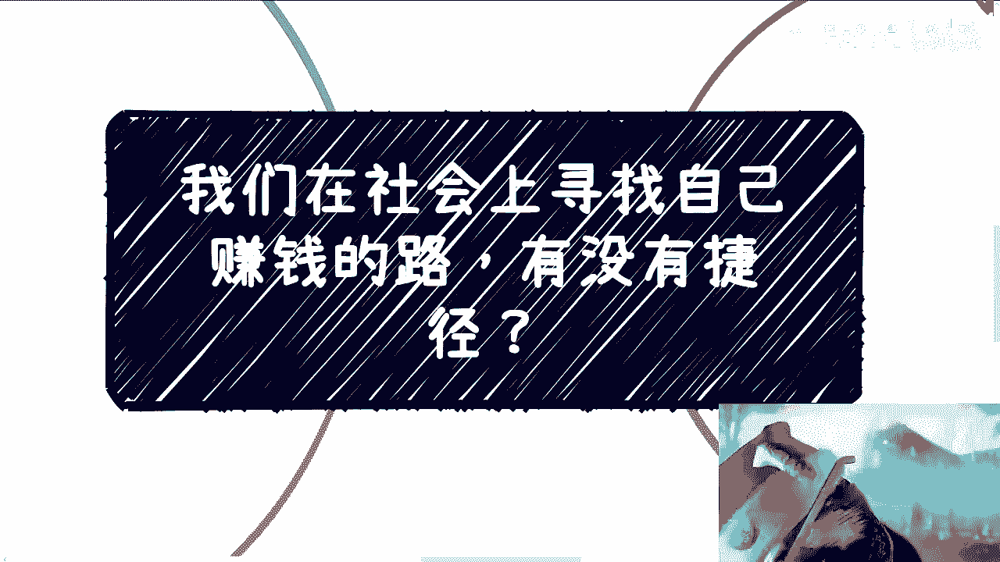

# 我们在社会上寻找自己赚钱的路，有没有捷径 - P1 - 赏味不足 - BV1Hj411L7oS

大家好，今天礼拜四呃。

今天呢是这样子的，早上呢有个小伙伴就是微信问了我，一些关于协会的问题啊，衍生出来这么一个问题啊。

就是说有没有捷径对啊，这个问题呢我觉得也蛮好的啊。

也蛮好的，那我们来看看有没有捷径啊，首先啊呃我觉得寻找捷径呢，它是一个很好的思维逻辑啊，但是呢问题其实不在这里，问题在于你怎么寻找什么意思啊。

因为呃首先啊我一直觉得投机，投机取巧呢才是常态啊，才是成功的关键之一，但重点是我们怎么去投机取巧，以及怎么去寻找这个捷径，至少捷径呢，就我觉得很多人呢，他对于捷径跟所谓的这个没有道德底线啊。

或者啥他就是有些混淆啊，他觉得呃怎么样怎么样啊，但是我跟你们讲啊，捷径呢不是说你到处骗，到处忽悠啊，或者到处抄去抄嗯，你问我有没有捷径，那我可以告诉你有，那肯定是有的。

这就好像你问我今天赚钱容不容易对吧，那么有的人会跟你说很容易，有的人会跟你说很难，那你怎么判断呢，你到底是觉得我得出结论是容易还是难呢对吧，也就是说这个捷径的目的。

并不是说我们要去寻求一个和靠谱的合作伙伴，或者我们说是否能赚到钱，这个不是我们的目标，我们的目标是什么，我们的目标是你的这个捷径，是需要能否有一个现在的靠谱的一个关系。

或者有这么一个人来给你搭建这么个桥梁，这个叫捷径，因为所谓的你有了这个捷径之后，并不是说你就一定能够就是我们刚刚说的，你是否一定能够有合作或者能否赚钱，你不知道对吧，但是现在是问题是。

你连可能前面一步你都走不到对吧，因为你并不知道你怎么去寻找到一个靠谱的，或者说呃比较不错的那个合作方啊，这个合作方可能是政府，可能是协会，可能是产业园，可能是一些资方，可能是一些其他有的没的对吧。

但是呢你其实找不到啊，所以说呢你需要有这么一个桥梁，那么在这个地方呢，我得说一点，就是我们可能会碰到一些人，就是他们呢会觉得关系很容易，为什么啊，你们不要就是一会儿就说觉得哎，我们碰到一些人。

他这样说的啊，一会碰到一些人哎他那样说的呃，你们要明白所有的人他的认知，他所讲出来的东西一定是跟他的生长环境，成长环境生长环境了，那么成长环境对吧，或者整个的关系圈是很有关系的，为什么。

因为他如果觉得容易，一定是因为他们所他们的家庭，他们原本的圈子以及他们的父母，已经做了所谓的过滤，什么意思呢，也就是说你本身的家庭，所谓的那些圈子，以及他们的父母在给他的资源对接上面。

就已经过滤出了那些所谓的靠谱的资源，或者说根本就是大家通过关系，而最终能达成合作的这么一个因素啊，而不是因为说啊这个人多么牛逼，或者这个人做的这么好，没有用啊，说的不好听点是什么呢。

就是大部分人处于一个纯粹的什么都没有的，老百姓选择。

那么我就告诉你们，你们剩下的只有骗子，很简单啊。

那你说到底有没有捷径呢，我们来看啊，捷径本身就是消除或者缩短信息差啊，那么大部分人呢，你们自己不可能通过看书或者看视频，去消除信息差的，我可以明确跟你们跟你们讲啊，不管你们看多少，看看谁的都没有用。

都没有用，这就跟早上说协会那个事是一样的，因为中国协会千千万，就是比如说我不会跟你们说啊，你们只要找到正规的，就一定能合作，不会那也不会说你们只要找到正规的，就一定能赚到钱。

也不会因为这里面的道道太多了，你协会下面还有管委会，还有委员会，哎呀这逻辑多了去了，你怎么知道你找的谁是谁啊对吧，那么有人就问他说，那按照你这个逻辑，我们怎么能知道靠不靠谱呢。

那是不是说只能通过踩坑或者被白嫖之后对吧，然后来做这个事后，诸葛亮，那我可以告诉你，很抱歉，是的呢，我就问你呢，你觉得如果不是这样的话，有没有可能性有对吧，但我相信聪明的小伙伴，那么你们肯定觉得有啊。

怎么会没有呢，我们可以找人带啊，我们可以找人有关系啊，我们可以找人怎么样，那我就问了人家为什么来带你们呢对吧，我说不好听的，如果你身上没有钱骗，为什么带你们脑子瓦特了对吧，那么我只能告诉你们。

就说你们读书到现在所有的认知没有任何的用，真的在商业这条路上没有任何的用啊。

非常的抱歉啊，那么第三点啊，你们知道为什么这么多企业或者个人。

会去找所谓的顾问，或者以前我们称之为在互联网里领域，还有一种角色叫教练啊，master啊，首先啊你说顾问是不是智商税或者割韭菜，这个我们先不去说它，因为没有一个东西是这个就完全是黑，或者完全是白的。

你说不清楚的对吧，你说他完全是智商税，那也不见得，你说他完全有用吧，那也不见得对吧，但为什么需要这些顾问，这是我们要去了解的，就是因为本质上这些人或者企业，他需要减少信息查，那我们打的我给你们举个例子。

比如说中国的四大行或者其他的商业银行，那些银行其实做很多东西，不无论是技术也好，流程也好，他们都会有非常多的这种嗯，怎么说呢，就是紧跟时代潮流吧对吧，但是他们其实不会说啊，我们今天要做个东西来。

比如说啊你说你说当时那个还没有手机啊，还不是还没有手机，还没有安卓IOS对吧，比如说他们要从塞班转到安卓OSIOS啊，然后难道说啊他们在那个市场上还招人啊，我们现在组个团队啊，开始摸啊，开始怎么样子。

会不来不会的，为什么，因为当银行去做这些事情的时候，他们自己也知道，整个市场其实已经摸了很多年了，他们一定是滞后的，那你想想看，作为一个正常的人，你会把别人踩过的坑再去踩一遍吗，不会那怎么办呢。

我们通过钱来弥补这个问题，对不对，好，那么这个时候他们就会付钱给这些顾问啊，然后让这些工人来告诉他们，以往的这些企业或者人到底踩过哪些坑啊，以以让他们不要再去踩这个坑，这个其实跟很多人呢去交几万。

读个什么啥啥啥玩意儿是一个道理啊，但是呢我们就这么说啊，真正能帮助大家减少信息差的很少啊，我们不能说没有，但很少，为什么，因为没有性价比啊，为什么没有性价比记录，今天早上这位小伙伴跟我说的对吧。

我就会告诉他，我说我能帮到你们的，也只是减少一部分的信息差，但是我能帮到多少呢对吧，事实上没有多少，为什么，因为你们去谈业务，你们去谈东西，我不会跟着你们一起去，为什么，因为我跟着你们一起去。

我没有好处啊，我也没有性价比啊，我跟你们去，我能得到什么呢，对吧好，那么小伙伴小伙伴又要说了，那我们可以跟这些企业一样对吧，这个这个这个那个交付顾问顾问费啊，我在这个地方说两件事情啊。

第一不是我看不起这个中国的老百姓，第一我觉得真正按照企业的顾问费，大部分人是不愿意付的啊，第二我也不愿意收这个钱，为什么，因为你看啊，我在这个地方写的很清楚，你要真的有人给我，我不要。

而且我我说实话到现在我印象当中有吗，有的起码可能有五六个哦，都是被我拒绝的，为什么，因为我也跟他们说的很清楚，我说我希望的是能和有一定认知的去聊，或者帮助有一定认知的人，否则你给我钱，我说了半天。

甚至我帮你，你理解不了啊，你们明白吗，我相信你们很多人也会有这种感觉，就是你可以收钱，你也可以帮助别人，但是他要领情啊，他得明白啊啊你不要说我这钱我收了，我也努力帮你做了，你最后就觉得哦。

其实我做的我做的东西跟就是我付出的努力，你是感觉不到的，那有什么用啊，那钱我要他干什么对吧，所以我跟你们说，这种钱我不想要啊，我也不缺这点钱对吧好，那么最后一点就是所以你说有没有捷径呢，我觉得有。

但往往很多时候就已经晚了，为什么，因为我一直说聪明点的人啊，往往能够通过文字或者视频背后呃，就通过文字和视频能够看出来就是其背后啊，就是呃我们说讲话讲一半嘛，对吧啊，其背后能这个想表达的这个意思啊。

因为其实很多东西讲透了或者讲明了呃，风险是一方面，另外一方面就是说嗯意义也不大啊，那么像我这样笨的人呢，基本上只能靠一次次去撞墙去领悟，所以我觉得呢所谓的捷径呢，无非就是说你是否能够快速的明白。

很多事情背后的真理，以及能否举一反三，就比如说聪明的人，他可能撞一次他就明白了，以及以后会避免，那像我这种傻叉对吧，那我可能得撞三次才能明白啊，而且同时以后还不见得能避免啊，那么当我们思考一下啊。

往往呢你们读完书，很多人就20多了，甚至还有就是接近30了啊，那么我就咱就直就直面事实嘛对吧，就是说还剩下多少时间跟激情留给大家，大家一出来就各种说哎呀，自己试错成本太高了对吧，老百姓没得选对吧。

然后怎么样怎么样，但事实上是真的高吗，不是事实上是大部分的人，他浪费了太多的时间啊，只不过当他们想要去进行一些探索的时候，在那个时间点试错成本已经很高了，这是事实，而不是说哦好像我们觉得怎么样怎么样。

那是因为你们觉得，或者你们能够有这个认知的时候，其实已经晚了啊，所以我今天跟小伙伴说的，就是说社会太复杂了，任何事情呢你只能一事一议，你说完完全全有没有一个东西可以照搬，他没有对啊，就像我刚刚说的。

我跟你们说啊，某某某一定是正规的，或者一定是政府直属的，或者怎么样就一定能合作吗，没有啊啊所以我才说所有事情都要谈，你就去谈了，你才知道对吧，你谈了之后，你才会知道接下来怎么走。

以及你才会知道你缺什么啊，所以说就是像这个视频也是一样的，就是你们要举一反三的是什么，就是本质上第一你们要去知道，所有线下的信息都跟它们的生长环，这生长环境都跟他们成长环境对吧。

或者其他东西都是有关系的，你你不要觉得这个人说的就不对，或者那个人说的就不对，就跟我昨天充电视频里面说的，就是说我拼那张拼图拼了一年多，如果我的认知是哦，我觉得就非对即错的话。

那我这张拼图这辈子拼不出来对吧，因为我必须是去容纳尽可能多的信息，然后呢，我到最后去判断这个人为什么会这么跟我讲，对吧，到底是因为他的认知有问题，还是因为他的成长环境有问题，还是因为他就是想骗我。

姑故意不跟我讲，你这样子才能最终有成长，而不是说哦我今天就接受一种信息对吧，这个人讲的是对的，那个人讲的不对的，我就不听，不是的，你知道吧，所以说所以说本质上就是说呃，你要去明白所有的人，所有的流程。

他为什么会这样子啊，那么回到你说这个捷径上面，就是我觉得还是那句话嗯，通过关系，通过钱肯定能够有帮助，但是是不是真的有帮助，你该交的学费可能还得交，你该踩的坑可能还得踩，没有办法的好吧。

我知道很多人为什么想要去寻找，就像我说的，大家都觉得时间不够，大家都觉得呃叫什么试错成本太高吗，不愿意就说啊，真的踩到一个坑浪费时间，但是怎么办呢对吧，我只想说，但是怎么办呢，每个人都这么想啊。

但是怎么办呢，对吧，嘶哈嘶唉行吧，就这么着吧，然后希望大家24年能够，都能够找到自己的路吧啊自己的一亩三分地嗯，行就这么着吧好吧，然后上海那个活动呢其实已经满了，但是场地其实也不限制呃。

你们要是想继续报名的，就继续报好吧，然后剩下的就是职业发展啊对吧，或者你们嗯觉得有什么一整套的问题想问的，或者想讨论的，或者你们觉得哎我跟跟父母啊，或者跟身边的小伙伴没有人可以聊的。

那你们也可以走咨询好吧。

