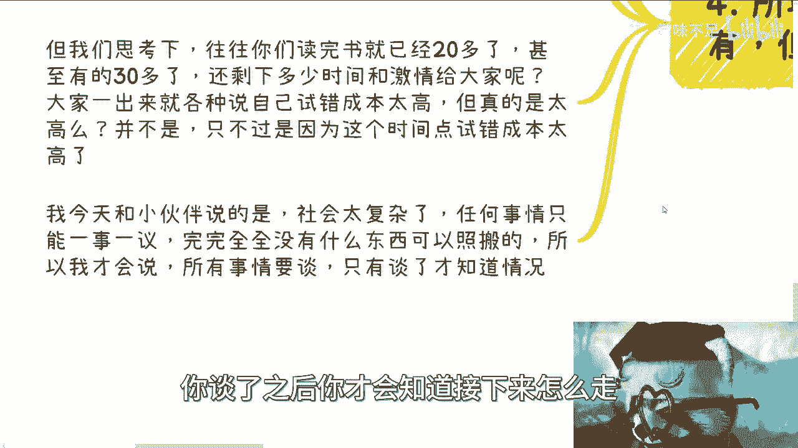

# 我们在社会上寻找自己赚钱的路-有没有捷径---P1---赏味不足---BV1Hj411L7oS_no

在本节课中，我们将探讨一个普遍关心的问题：在社会上寻找赚钱的道路是否存在捷径。我们将分析捷径的本质、寻找捷径的正确方式，以及普通人可能面临的现实挑战。

---

上一节我们提出了核心问题，本节中我们来看看“捷径”的真正含义。

寻找捷径是一种积极的思维逻辑，但关键在于如何寻找。投机取巧是常态，也是成功的关键之一，但重点在于如何正确地投机取巧。捷径并非指欺骗、忽悠或抄袭。

捷径的目的是**消除或缩短信息差**。其核心公式可以概括为：

**捷径 ≈ 可靠的关系桥梁 - 信息差**

然而，对于大部分普通人而言，仅通过看书或看视频无法消除关键的信息差。

---

理解了捷径的定义后，我们来看看普通人寻找捷径时面临的实际困境。

以下是普通人可能遇到的主要情况：

1.  **资源过滤的缺失**：有些人觉得建立关系很容易，这往往是因为他们的家庭和原有圈子已经为他们过滤并提供了可靠的资源与人脉。他们的成功合作更多依赖于既有的关系网络，而非个人能力。
2.  **充斥骗局的环境**：对于缺乏背景和资源的普通人而言，在寻找捷径时，最容易接触到的往往是各种骗局。
3.  **认知的局限性**：从书本和学校获得的知识与认知，在复杂的商业实战中往往作用有限。

---

既然个人摸索困难重重，那么市场上存在的“顾问”或“教练”服务是否是捷径呢？本节我们来分析这一现象。

企业或个人聘请顾问，本质上是**通过支付金钱来购买经验、减少信息差、避免重复踩坑**。例如，一家银行从塞班系统转向安卓/iOS时，更可能聘请顾问来借鉴市场经验，而非自己从头摸索。

然而，这条路径对普通人而言同样充满挑战：
*   **支付意愿与能力**：普通人通常不愿意或无法承担类似企业级别的高额顾问费用。
*   **效果的不确定性**：即使付费，能否找到真正能减少关键信息差的顾问仍是未知数。性价比是一个核心问题。
*   **认知匹配度**：即使获得帮助，如果自身的认知水平无法理解顾问的指点，那么付出与收获将不成正比。

---

综合以上分析，我们最后来总结一下关于“捷径”的结论与可行建议。

所谓的捷径，其核心在于**能否快速理解事物背后的运行逻辑，并做到举一反三**。聪明的人可能撞一次南墙就明白，而有些人可能需要三次。关键在于从每次经历中学习。

对于普通人，寻找捷径的现实路径可能包括：
*   **通过关系**：搭建人脉桥梁。
*   **通过金钱**：购买经验与服务。
*   **接受必要的试错**：该交的学费可能还得交，该踩的坑可能还得踩。

但必须认识到，**没有任何一套方法可以完全照搬**。社会非常复杂，所有事情都需要“一事一议”，必须亲自去尝试、沟通，才能知道下一步该怎么走，以及自己真正缺少什么。

---

**本节课总结**

本节课我们一起探讨了在社会上寻找赚钱捷径的问题。我们明确了捷径的本质是消除信息差，分析了普通人在寻找捷径时面临资源缺失、环境复杂和认知局限的困境。我们讨论了通过顾问购买经验的可行性及其限制。最终得出的结论是：捷径存在，但往往依赖于关系、金钱，并无法避免必要的实践与试错。最关键的成长在于，能够从每一次经历中提炼规律，举一反三，并理解所有信息背后的具体成因，而非简单地判断对错。真正的捷径，是提升自己快速学习和适应复杂环境的能力。