# 我们工作的时候应该怎么看待企业KPI - P1 - 赏味不足 - BV13D421W7MB

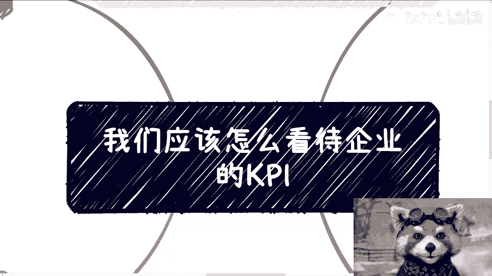

好大家好呃，这两天那个北京活动也非常成功啊。

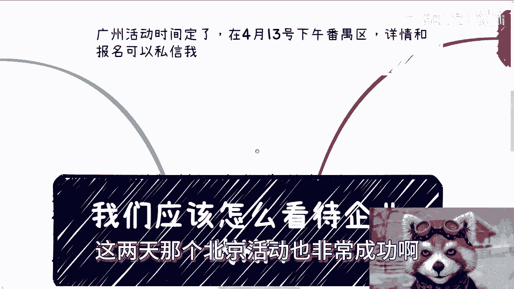

要不是场地限制我的人数，感觉还能再多一点啊。

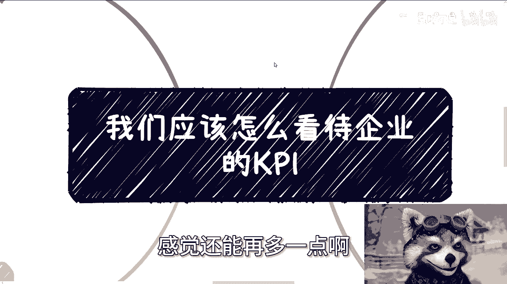

哎呀好累啊，这两天，然后那个广州活动已经定了啊。

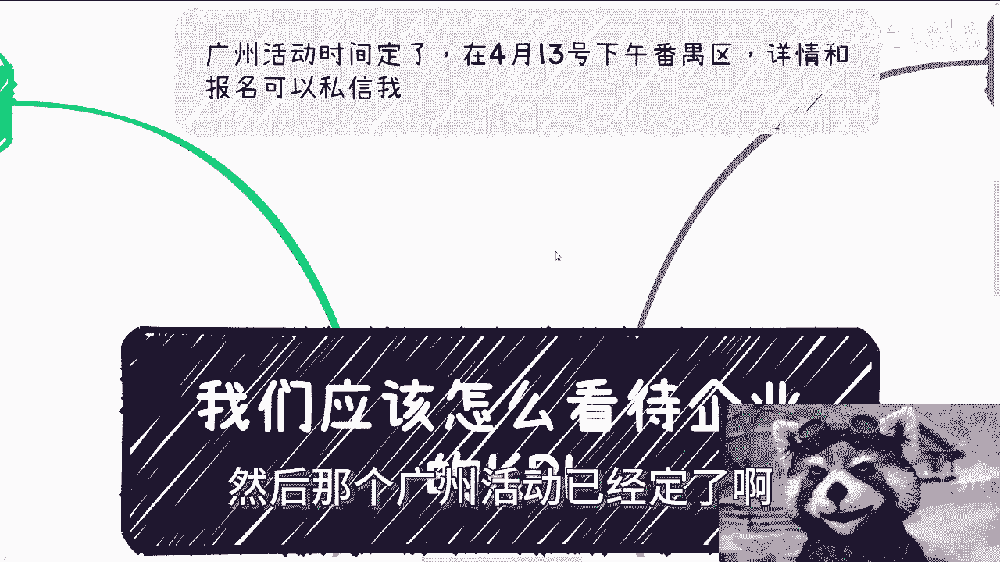

在4月13号下午番禺区这边啊，好吧，详情跟报名呢可以私信我啊。

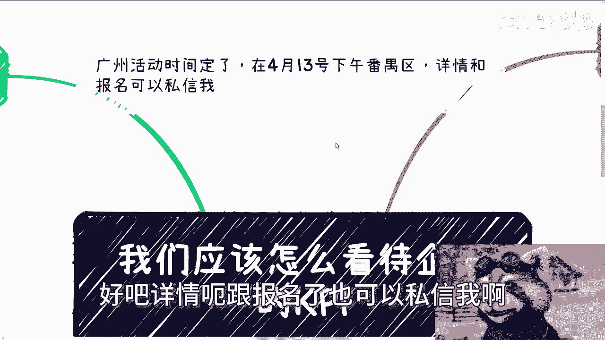

那么今天这个内容呢，是昨天应该有小伙伴私信我的。

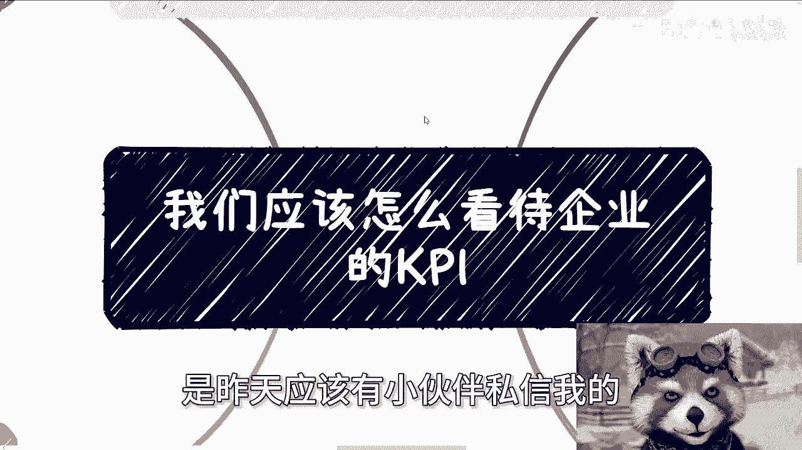

说让我讲一下啊，我就直接来开一个啊。

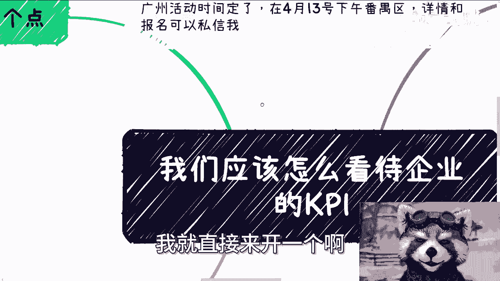

呃我比较随性啊，因为我不太会提前什么，把这个明天啊或者这一周啊内容定出来，我都不定的啊，我跟你们讲，我都是当天啊，这个空下来有在那边想啊，今天大概讲些什么，跟大家聊点什么，我就随便聊了好吧。

所以你们要是有什么觉得要我讲的或者怎么样，你们反正私信我对吧，我这个你们要不讲啊，那我就自己发挥，你们要讲，反正我就根据你们的想法走好吧，就当下情况呢，我说一下我态度啊。

我希望每个人对工作态度其实都一样，就是说我在我力所能及的范围内去做，你让我额外的加班，如果这个加班因为我的问题，那我接受，如果不是因为我的问题，因为别的事情偶尔我也可以接受，但如果还有别的情况。

什么经常加班或者什么，你给我PUA我或者给我饼吃对吧，不给我加班费的，就但凡不给钱的，你给我滚，就这么简单对啊，当然啊工作上也有也，我觉得工作上也不要有任何情绪，因为本质上你有没有情绪都是对自己内耗。

你有也改变不了什么，没有也改变不了什么又怎么样呢对吧，我觉得工作就是工作，你就是个无情的一个工作的机器人，就over了，就就这么简单，你要卷，我觉得你要明白本质，你要卷不是为你卷。

你要卷就是在帮助投资人和股东去赚钱，也不是为你自己赚钱，你有啥好卷的呢对吧，有啥可卷的呢对吧，然后每次说到这个问题呢，总有人会说啊，陈老师对吧，那我们要上班的，我们他妈的啊不去卷，你说不给我们加班吧。

我们就让他们滚对吧，那他们会让我们滚的，我们没工作对吧，那我奇了怪了，哎我就这么说好了，你就算舔，你就算没有工，没有加班费，你在那边做怎么样了呢，不也是苟且偷生吗对吧，你以为你这样做能持续几年呢。

未来不还是要背词吗，不未来不还是要被优化吗，没区别的呀，重要的是你自己是什么态度，你活成什么样子，而不是现在苟且偷生，你苟且偷生，你能苟几年呢，有什么区别，没有区别的呀。

问题不是在于我让你们说你们要去杠，而是在于你们自己要明白，你们到底要活成什么样子，就像我们就说所有的人都柿子拿软的捏，那你自己他妈的把你变成一个软的，怪谁呢，奇了怪了哎，人家捏不捏你，那是人家的事。

你能控制吗，那问题是你自己软的，他妈怪谁呢，就这么一回事，我跟你们讲啊，好，那我们来说KPI是什么啊，为什么要有KPI，首先啊KPI我认为它不是单纯存在的，他必须以奖罚一起存在，如果单纯的KPI。

这他妈就是PUA，没有任何意义，一点意义都没有啊，那么KPI的奖罚他也必须落到实处，当然一般从KPI或者说讲法角度来讲，签合同的，我说实话我没有看到过啊，我认为就可能签合同的还是比较少的。

但你可以多了解了解之前半年啊，一年啊，一个季度啊，有没有对吧，就如果来说，你们是第一个，你们是第一批小白鼠，那这个饼他妈的就没人吃到过，那我他妈凭什么相信你啊，你别说什么什么给我多少绩效。

给我多少工资对吧，怎么样子，之前这饼就没吃到过，我姑且听之，我姑且听之对吧啊，我之前就说过，你去工作，你只要签劳务合同，那一刻，你就是不平等条约，你懂吗啊，什么KPI，什么狗屁奖金。

甚至什么狗屁期权都他妈没用，到最后都是老板股东的一句话，你们去试试，你去试试，你就知道了，怎么了呢，你你认为你有反抗权吗，没有呀，你不是人，你懂吗啊，我跟你们讲，你们但凡去碰未来。

如果你们真的有机会多认识认识资本家，多认识认识那些有政治地位的，你们再反过来看看你们他妈是人吗，啊我是人吗，我们都不是人，你懂吗啊，但凡我们觉得自己是个人，我跟你讲太高估自己了啊。

所以没有合同或者没有历史可循，没有奖罚的KPI，就他妈纯粹画饼啊，这就好像我今天跟大家说，来我们一起合作啊，合作完了我给你们发钱啊，一起赚钱，然后呢你们到底赚多少，多久能赚到。

以及大家到底每个人能拿到手，能拿能拿多少，我不说了，然后你们问我老师，你之前有没有给别人付过钱啊，我也不知道啊，我说没有啊，你们就是他妈第一批小白鼠，那他妈不就是饼吗，有什么区别，是吧啊。

第三点我们应该怎么看待KPI，有句老话叫做什么叫得之我幸，失之我命啊，我希望你们每个人都真的一直要牢记，得之我幸，失之我命，什么意思啊，意思就是一切一切随缘，一切看命吧，我为什么要去纠结它。

就像KPI这个东西对吧，你表面上你可以我好你好我好，大家好，工作还是工作，你每个月还是领你的窝囊费，领你的工资，我们就是无情的工作人，对没有感情的工作人哦，工具人对吧，你正常该怎么做怎么做。

你到时候你看看KPI怎么打对吧，因为我很简单嘛，一个团队总有做得好，总有做得不好的，他但凡能落地，今天不落到你头上，也能落到别人头上对吧，一样的道理，所以说你就正常做，你这KPI对你来讲有用。

真的给你奖金了，得知是我之幸对吧，就是我的幸运对吧，那最后如果来说什么都没有给我画了张饼啊，我就继续工作，拿我的窝囊废没有，那就是我的命结束了，我不想我不希望大家因为这种事情去纠结，去内耗没有任何意义。

因为你的纠结内耗从从源头就不是为你自己，为的是股东跟老板，那跟你有什么关系啊，你活着为别人活着，是不是啊，那么KPI选存在的意义是激励，而不是惩罚，因为你去看啊，KPI的惩罚他是为了什么。

KPI的惩罚本身的目的也是为了激励对吧，那如果说今天KPI的存在就是为了裁员，就是为了惩罚，那他妈的他能有1万种定KPI的方式去踩你，无论他KPI怎么定，有意义吗，没意义的呀，哦他的出发点就是为了踩你。

你还在那边纠结，你还在那边被PUA说，爱陈老师，我这个东西怎么做怎么做，能做的比较好，怎么做都没有用，因为源头就不一样啊对吧，我跟你们讲中国什么公司没有啊，里面什么事没有啊，只有你们想不到。

没有他们做不到的啊，所以说你为了保住自己的工作，你我觉得你就我好你好我好，大家好，你就让子弹飞一会儿，不要去管什么KPI，不KPI他妈狗屁KPI对吧，当然你也可以用这个KPI。

你你当然你也可以评估这KPI本身，是否能够让你有所成长，比如说啊技术上你有实质性的提升啊，比如说客户资源的关系，你有实质性的这个这个拓展和积累，那么也就是说虽然你在努力做公公司KPI。

但实际上你在提升自己，你拿公司的钱去为你自己打工，有什么不好呢，对啊，那你顺便做一下，还有钱拿，有什么不好呢，对啊，否则你就当做没看到就好了，你为什么要拿公司的钱，除了原本的工作以外。

我还得为了你kph卷，唉凭什么哎奇了怪了。

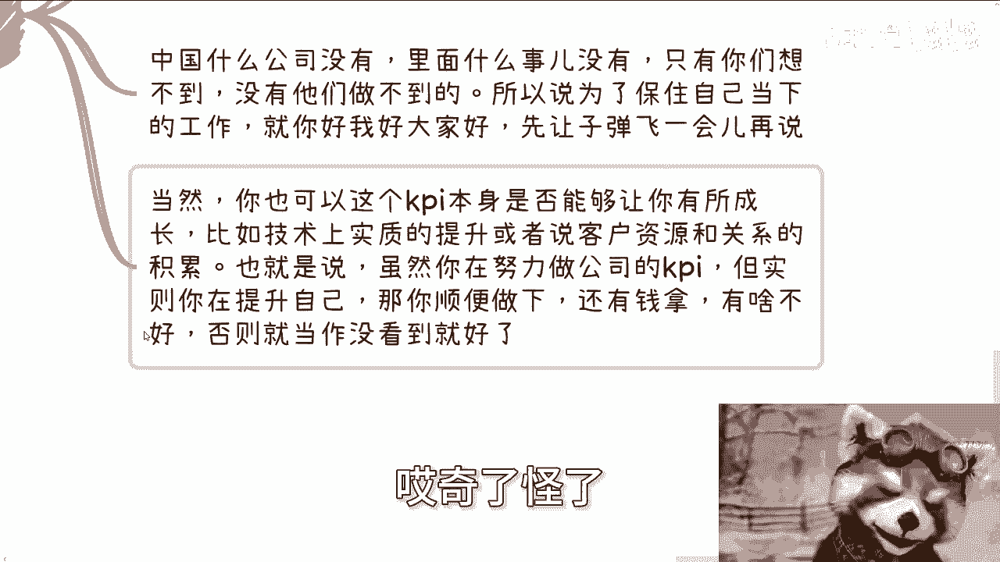

好吧，那么有人要说了。

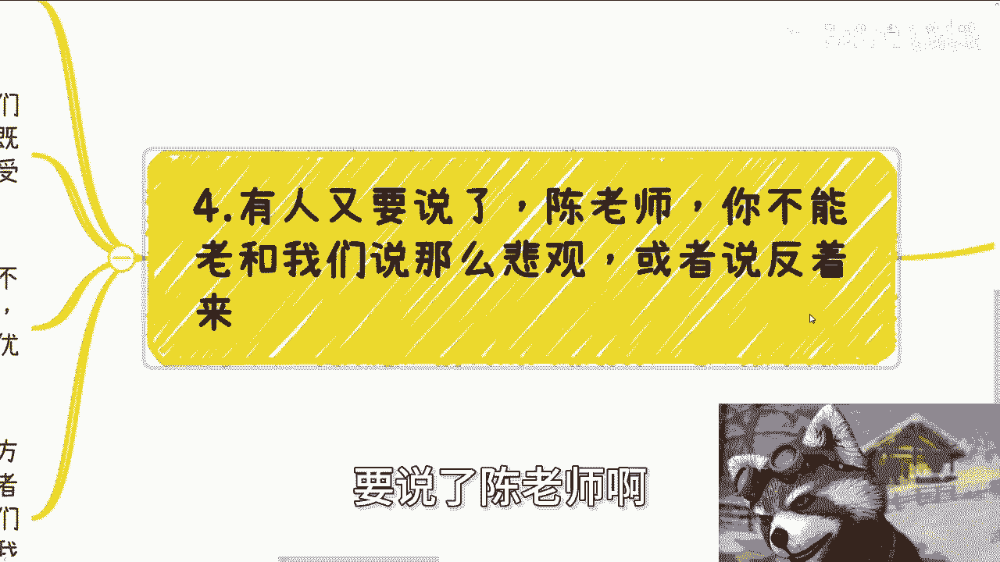

我说陈老师啊，你不能老跟我们说这么悲观对吧，或者说你老是跟公司对对对着来对吧，怎么样啊，我跟你讲啊，人与人的相处，人与公司相处都是一样的，我我觉得每个个体你们自己想明白啊，你们自己想明白就不要怪别人对。

就这么简单，就是你要么就为你自己活着，你要么就为别人活着，你不要到最后就说又没为你自己活着，为别人活着，然后还还还在那边抱怨说，别人为什么不为你着想，为什么公司要坑你，哎，奇了怪了，自己都不尊重你自己。

凭什么让别人尊重你对吧，我觉得我有活着的样子，不会因为我有钱或者没有钱或者被逼迫，就改变我活着的样子，这是什么，这叫尊严对吧，这才是自己活着的样子，你不能在乎外界的眼光眼光，我们与公司也是一样的。

为什么我们现在我比如说，我现在要跟你们这么说，因为他妈的公司不要脸的太多了，不把人当人的太多了，既然他们的三观跟出发点就他妈不正，不是从我们出发的，不是当我们是个人去出发的，那他妈凭什么我们要接受呢。

对不对，让他们滚远一点啊，怎么世界上公司倒闭了啊，我他妈我们难道有手有脚他妈的赚不到钱了，对不对，同样的原本的公司有绩效，我跟你们说啊，以前公司有绩效奖罚，其实都是根据不同的业务去详细定的。

都会有真正的考虑到每个岗位，每个人的成长，现在呢一刀切要么就是为了优化而优化，我们为什么要follow，我们为什么要去要去要去跟着他们走呢，啊另外就是说什么悲观不悲观的，我跟你们讲，我们乐观也好。

悲观也好，我们是否真正的去做，或者来说让对方是不是影响自己的情绪，这他妈要看对方值不值得，你懂吗啊，当一个人或者公司出发点，他不是为了你好，不是从你出发的，那我们没必要为对方去考虑啊，你你发钱。

我干活就他妈结束了，跟我逼逼，对不对，有啥好逼逼的呢。

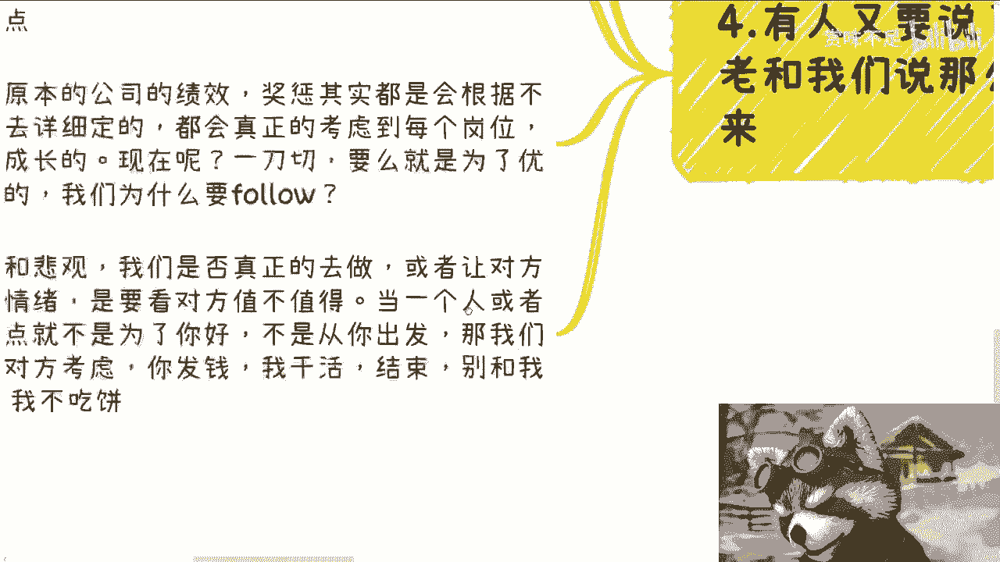

对吧，因为你从整个人生里去看，你得碰到多少人，你得碰到多少公司啊啊大家一码归一码不好吗，你给我钱，我跟我给你干活，我给你钱，你给我干活对吧，然后你给我钱，我给你咨询对吧，就大家一码归一码，别逼逼。

什么叫逼逼，就是的跟我谈理想，跟我谈感情对吧，别上来就跟我，你像最近还有些上来跟我谈对吧，陈老师能不能优惠一点，有什么好优惠的，我给你优惠，然后呢，别人不优惠了，那别人怎么说，我有什么好逼逼的人。

不要逼逼，你懂吗，你逼逼那一刻不是在看不起我，你是在看不起你自己，你懂吗，你在你其实就是在没有不清楚的定位你自己，你这样子怎么做，你这样子这辈子只会是个炮灰，就这么简单，关我吊事啊，你说难听点。

关我吊事，我又不差你这优惠的钱对吧，影响的是你自己，你不影响我，唉我就发现真的我有时候为什么说，我说我觉得有很多人啊，你不割他，真他妈对不起他，我在北京现场我也这么说，为什么。

因为你到最后就发现你为他着想没有用，他不领情，他不领情，只要你狠狠割他啊，他还在那说哦，谢谢哦，真他妈离谱，我跟你讲，真的很多人就是贱就是贱啊。

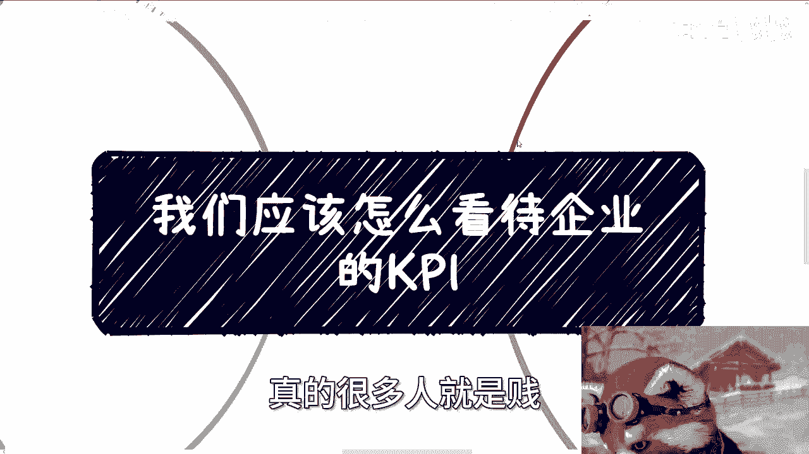

行那就做个小板啊，那个同样的好吧，商业规划商业计划对吧，职业规划职业计划，你们包括项目计划书啊，要融资的，要分股权的啊，包括你们就是说啊，就是你们手上有什么啊，有什么技能或者有什么牌。

你们希望啊就是说从我从我的视角啊，能够给你们做一些规划，或者做一些更好的一些想法或者更好的判断，那么你们整理好好吧，然后你们可以私信我们在做咨询啊。

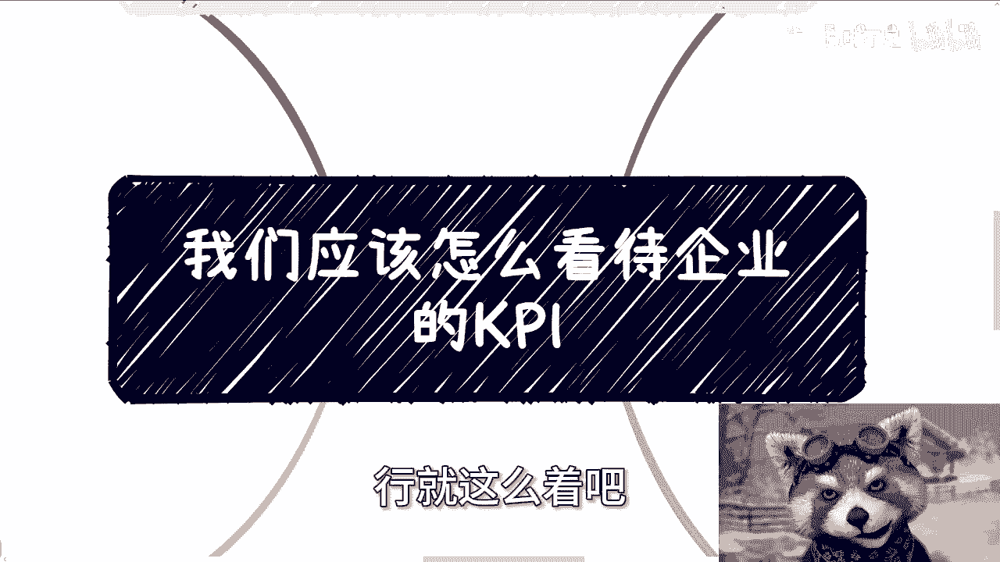