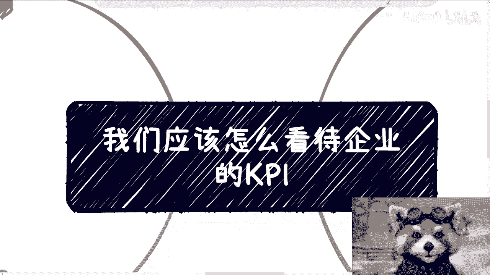
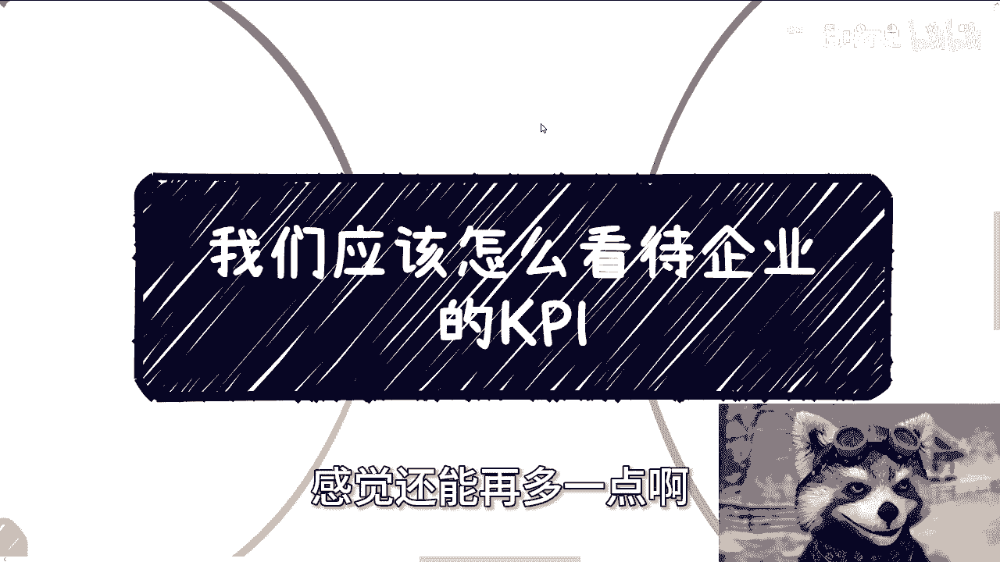
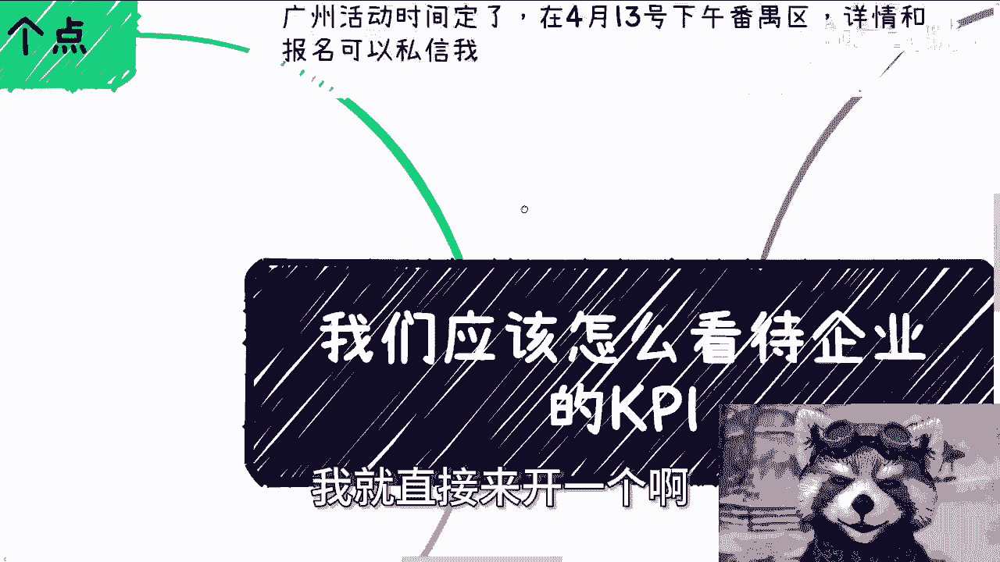
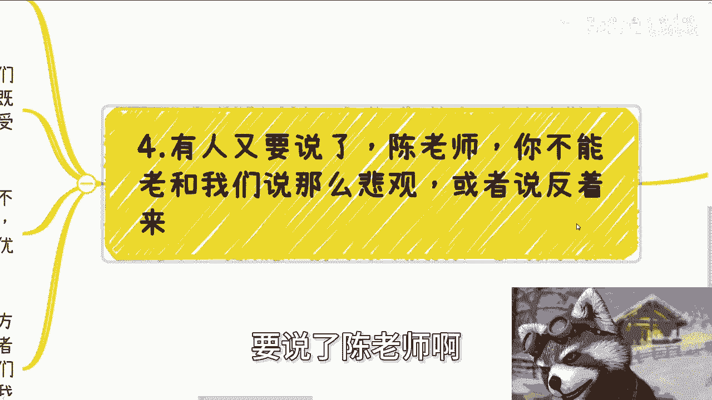
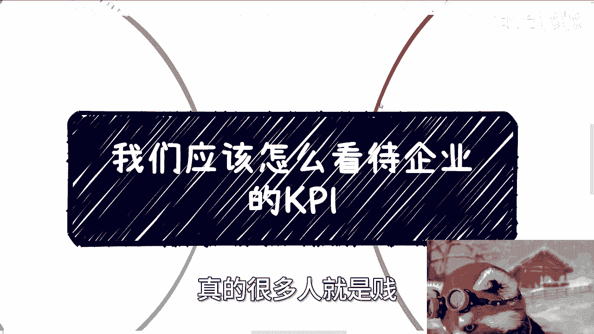
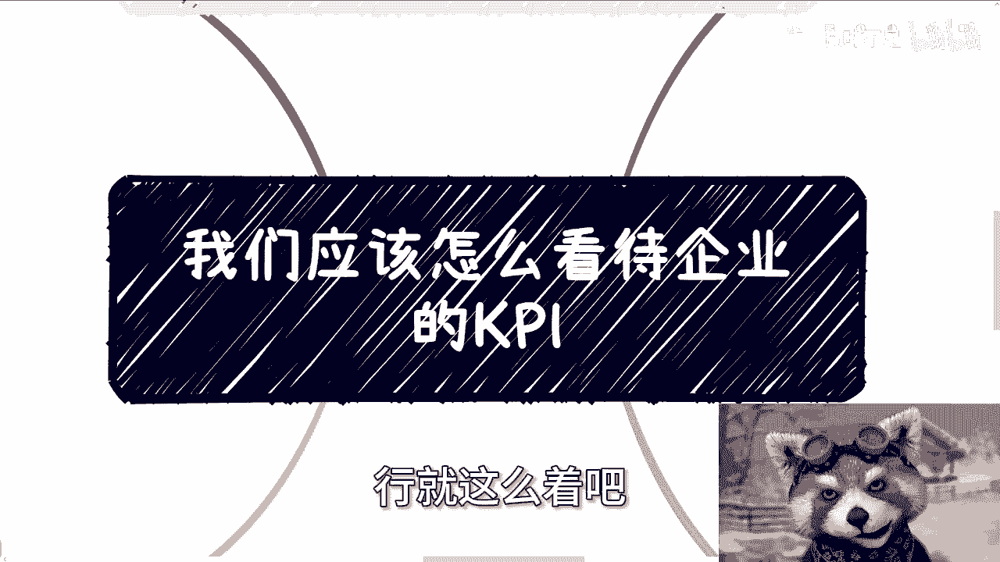

# 职场生存课 P1：如何正确看待企业KPI 📊




在本节课中，我们将探讨一个职场核心话题：如何正确看待和应对企业的KPI（关键绩效指标）。我们将从KPI的本质、其存在的意义以及员工应有的心态等多个角度进行分析，帮助你建立健康的工作观，避免不必要的内耗。


---


## 课程概述



KPI是现代企业管理中常见的工具，但其设计和执行方式往往对员工产生深远影响。本节课程旨在帮助你理解KPI的真实作用，并学会在复杂的工作环境中保护自己的利益与心态。我们将讨论KPI与奖惩的关系、如何识别无效的“画饼”行为，以及建立“得之我幸，失之我命”的从容心态。

---

## KPI的本质：必须与奖惩绑定

首先，我们需要明确KPI的本质。我认为，KPI不能孤立存在，它必须与明确的**奖惩机制**一同出现。

如果只有KPI而没有对应的、可兑现的奖励或惩罚，那么它很可能只是一种管理上的PUA手段，缺乏实际意义。

**公式：有效的KPI = 明确的指标 + 可落地的奖惩制度**

---

## 识别“画饼”：没有历史可循的KPI是空谈

其次，我们需要学会识别无效的KPI承诺。一个KPI奖惩机制是否可信，关键在于它是否有**历史先例**或**合同保障**。

如果公司是第一次推行此类KPI奖励计划，或者奖励从未真正兑现过，那么员工有理由保持怀疑。这就好比一个合作邀请：对方承诺未来会分钱，但具体金额、时间和分配方式都不明确，也没有过往的成功案例。这种情况下，承诺更像是一张无法充值的“饼”。

以下是判断KPI可信度的关键点：

*   **合同保障**：奖励条款是否白纸黑字写入具有法律效力的合同？
*   **历史记录**：在过去半年、一年或一个季度里，公司是否确实依据KPI发放过承诺的奖金？
*   **落地执行**：奖惩机制是具体、可执行的，还是停留在口头承诺？

本质上，当你签署劳务合同的那一刻，就处于一种不平等的关系中。KPI、奖金甚至期权，最终的解释权和决定权往往掌握在资方手中。

---

## 正确心态：得之我幸，失之我命

上一节我们探讨了如何识别不可信的KPI，本节中我们来看看面对KPI应有的核心心态。我建议秉持“**得之我幸，失之我命**”的态度。

这意味着，将工作成果与KPI奖励适度分离。你领取工资，完成本职工作，做一个专业的“工作机器人”。对于KPI奖励，如果有幸获得，那是额外的幸运；如果最终没有兑现，那也是常态，不必为此过度纠结和内耗。

你的内耗和焦虑，本质上是在为股东和老板的目标买单，而非为了自身的成长与幸福。

---

## KPI的真正意义：激励而非惩罚

那么，KPI存在的意义究竟是什么？其核心目的应该是**激励**，而不是单纯的惩罚。

即使惩罚，其最终目的也应是促使员工改进和成长。如果一个KPI体系从设计之初就是为了方便“优化”（裁员）员工，那么无论指标定得多么“合理”，其出发点都是恶意的。在这种情况下，员工无论多么努力，都难以达到其不断变化的标准。

因此，你需要评估一个KPI是否对**你自身**有价值：




*   **技术成长**：完成KPI的过程，是否能让你在技术上获得实质性提升？
*   **资源积累**：是否有助于你积累客户资源、行业人脉等对自己长期发展有利的资产？

**核心逻辑**：如果KPI能让你“**拿公司的钱，为自己打工**”，在完成公司目标的同时积累个人资本，那么它值得你投入。否则，你只需完成合同规定的基本工作即可，不必为额外的“饼”而过度消耗自己。

---

## 确立边界：一码归一码，拒绝情感绑架

经常会有人问，是否应该对公司抱有更“积极”或“忠诚”的态度。我认为，人与公司的关系，和人与人之间的关系一样，需要清晰的边界。

**代码逻辑示例：**
```python
if 公司支付报酬:
    我完成约定工作
else:
    没有义务提供额外劳动

if 公司尊重员工，出发点正向:
    可以考虑建立更积极的合作关系
else:
    保持纯粹的雇佣关系，拒绝PUA和画饼
```


当一家公司的管理出发点不是把员工当“人”来尊重和培养，而是当作可随意替换的“成本”或“工具”时，员工自然没有义务为其额外付出。工作关系应该简单明了：**公司付钱，员工干活**。

拒绝一切不必要的“逼逼”，例如谈理想、谈感情、要求特殊优惠而不尊重专业价值等。模糊的边界只会导致自我价值感的贬低。维护自己的专业尊严和清晰定位，才是长远发展的基石。

---

## 课程总结



本节课我们一起学习了如何正确看待企业KPI：

1.  **认清本质**：有效的KPI必须与可落地的奖惩机制绑定。
2.  **学会识别**：对没有历史先例和合同保障的KPI承诺保持警惕，那可能是“画饼”。
3.  **调整心态**：建立“得之我幸，失之我命”的从容心态，减少为他人目标而产生的内耗。
4.  **评估价值**：判断KPI是否能带来自身成长，实现“借事修人”。
5.  **确立边界**：与公司保持清晰、专业的雇佣关系，拒绝情感绑架和PUA，维护个人尊严与价值。



记住，工作的首要目的是为了自身的生存与发展。在完成本职工作的基础上，保护好自己的身心健康与长期利益，才是职场中最明智的生存策略。