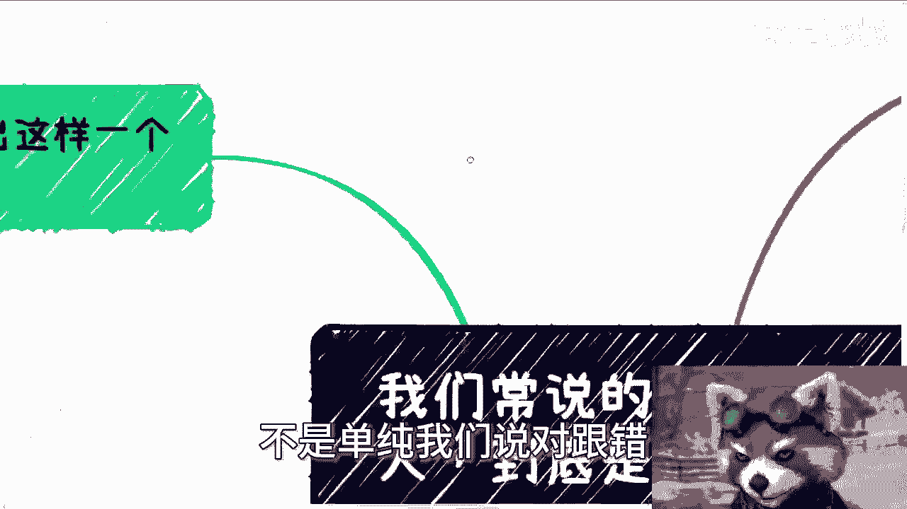

# 我们常说的对事不对人是什么意思 - P1 - 赏味不足 - BV14H4y1A7X9

好大家好，哼没有说过第二个视频一定是收费的是吧，或者一定是充电的是吧。

也可以是两个免费的是吧哈随缘啊，真的随缘，我们还来讲的呢，是叫做日常听到这句话叫做对事不对人啊，但到底什么意思啊，我觉得依我的判断啊，我觉得大部分人是不明白的。

所以我想就是把它详细说一下啊，什么叫对事不对人啊。

首先前两天有个小伙伴提出这么一个问题，他说如果商业合作上面几个人关系很差，行不行，是不是会影响合作啊，我们最后来说这个问题，先说对事不对人，这句话我相信大家听到过很多次，但这句话在我看来真的要做到很难。

非常的难，极其的难，为什么你要做到对事不对人。

主要有那么几点，第一你自己需要是一个强大的人，懂得什么是主要矛盾，什么是次要矛盾，懂得什么是大局对吧，第二你需要有很丰富的经验呃，很丰富的经验和阅历去判断对和对和错。

去分辨什么样的事就是问题是在事情上面，什么样的问题是在人上面对吧，你分辨不了你怎么对事不对人，你两边都模糊的，你对什么鬼东西对吧，第三你需要足够的果断，懂得断舍离，那这第三点可能很多人也不明白啊。

我们后面举例子你就知道了，如果做不到这些呢，你就不停的告诉自己，要对事不对人，那只有无尽的痛苦跟无尽的矛盾啊，这就是条死路，或者说这就是个错误的方向啊，就这么简单，那我们举个例子啊。

比如说我们无论交朋友还是商业，本质上都是一样的，打个比方，我们今天约了见面，无论朋友还是合作伙伴，对方放了你鸽子，你怎么看这个事啊。

你怎么看这个事好，对方肯定会给你一个解释，当然也有可能是个借口啊，什么叫对事不对人，那就是说从事情本身去分析，你判断下来他对你的态度以及他找出来的借口，跟所做出来的这个解释合理不合理，比如说地震了。

飞机延误了不可抗力，OK那没问题，那么你接下来就要问他为什么不提前说对吧，好，手机掉了，手机坏了，那也行，下不为例对吧好，那么问题来了，我们对所有问题不能一刀切，不能说他放我鸽子，不能说他放我鸽子。

不提前说他就是对吧，但是他放我鸽子不提前说，基本上就是跟没什么太大区别吧，但是呢解释跟理由总有例外的啊，但是你怎么判断对和错呢。

这需要你的阅历跟经验来做支撑，很多小伙伴会觉得啊，对事不对人的意思就是要讨论事情。

尽量不要去针对人，你说对不对对，但是需要拓展一下的是什么，不针对人的意思是说，并不是只是说不要去攻击他人啊，同时也要在乎这个人并不重要，就是同时也要做到这个人并不重要，也就是说我们只看事情。

人是谁不重要，不管你们什么关系不行，就是不行，断舍离就可以了，因为什么，因为事情很重要，我们要找到一起做事情的人，而不是说因为这个事情，然后因为我们的感情，因为一些别的事情啊。

因为一些别的各种各样的感性的原因，我们说啊，我们就要跟这个人怎么样怎么样怎么样怎么样。

那么第二点，这件事情里面其实还有另外一个角度啊，对事不对人，如果大家地位同等来讲，很多人可能能明白，或者很多人能做得到，但是放到一些看似不对等，或者说你比如说你就是个跪舔的，你就是个慕强的。

你就是个比如说别人说什么信什么，别人title大，你就会觉得自己好像啊这个唯唯诺诺，唯唯诺诺，畏畏缩缩对吧，这样子我跟你讲你就不行，你就如我一开始说的所谓对事不对人，这话容易吗，挂在嘴上是容易的。

但是做到很艰难，如果对方是个教授，是个院士，甚至是个局长，我就问嘛，能有几个人做到对事不对人啊，能有几个人做到对吧，你就像我以前在北京跟领导吃饭，或者跟领导去讲话，他但凡只要有任何让我觉得的地方。

我就直接喷了，我不管为什么，因为我知道我喷也好，不喷也好，我们都合作不了，因为这种就想白嫖，你有啥好，有什么好忍的了，没什么好忍的，就我跟你讲，很多人开始觉得要跪舔，无论对方做什么，他都觉得可以原谅。

都都都可以谅解，然后他所抱有的这个初衷，就是不要去得罪人家啊，那我之前就说过这句话，我告诉你们，所有你们不愿意面对的问题，你们不会不想直面的问题，选择逃避，你就像比如说很多人跟我说，老师我们做不到对吧。

我们可能不嗯不太可能去喷领导，对我们不太会把脸撕破，那我就告诉你，你现在不撕破，早晚都会撕破，你逃不掉的，你明白吗，就是你这辈子早晚都要撕破，那你为什么一定要一定要当鸵鸟，一定要去拖呢对吧。

因为你最终你会明白所有的问题，只要你不直面它，你你逃不掉的，你害怕的事情终究都会发生，你想要得到的东西终究都得不到，因为你没有去争取啊对哦，所有对方在欺负你，对方拿你当软柿子捏，你就是逆来顺受。

你能得到什么，你能得到的只有白嫖对吧，因为你要追求的东西只有靠你自己筛选，靠你自己的态度去得到，而不是说靠逃避，靠跪舔。

靠谄媚都没有用的啊，那么我们就说对事不对人的核心目的是什么。

核心目的是为了避免那些没有必要的矛，盾和问题，不要自己给自己营造问题，也不要自己给自己埋雷啊，不要自己给自己去呃，增加难度啊，一切以大局和自己的目的为主，理性看待一切问题，就如我们刚刚举的那两个例子。

你要学不会真正对事不对人，那么你就是仁慈对吧，你比如说你朋友说放你鸽子，你说啊可以可以算了算了，下一次对吧，下不为例，怎么样，那你就是仁慈，你以为他不会再放你的吗，照样放对吧，你比如说对方是个领导啊。

对方白嫖你或者怎么样，你想想算了算了算了，我就拍两句马屁对吧，就是就是当当舔狗对吧，你以为当舔狗kiss就是你的吗，也不是，你以为当舔狗关系就是你的吗，也不是对吧，你包括就是有些人，比如说背后戳你两刀。

背后说你两句坏话对吧，你想想哎呀，算了算了，不要撕破脸对吧，怎么样子一样的呀，你就是在给你埋雷啊，他为他现在能说你这样，他未来就可以说你更大的问题还就能造谣，你对吧。

你觉得你这样的态度问题就不会发生了吗，你觉得你仁慈做舔狗做，给自己埋雷对吧，所有的东西问题自己拦下来，问题不会发生什么一样会有什么意义呢，没有意义啊对吧，所以等到了你觉得无法收拾了。

实在对这个人失去信心了，自己伤透了，你可能就会啊这个做一个决定，就是说啊我跟这种人可能不合作了，或者不做朋友了，但解决问题吗，没有解决，因为你核心问题不在别人身上，是在你身上。

你要学会处理，你要学会判断，你要学会断舍离你，但凡学不会等待你的只有无尽的痛苦，对吧好，那么我们回到最早的这个问题，他说如果商业上几个人关系很差行不行，那我们你仔细想想看啊，第一几个人关系很差。

为什么会很差，一定是因为有别的事情呢，价值观或者有别的事情，上面的一些观点是冲突的，那么你会发现啊，我跟你们讲核心还有一点是什么，就是你就算是很牛逼的人，你就算是一个懂得对事不对人的人，那么你要明白。

你就是这个世界上，你能碰到几个真正懂得对事不对人，有大局观的人，很难很难，什么意思呢，也就是说你们关系可以很差，但是你们前提是，如果你们几个人都是格局很大的，你们几个人都是懂得对事不对人的。

那么你们是可以合作的，但是你觉得可能吗，这种概率能有多少，微乎其微，而且你会发现这当中有一个现有机现有的问题，就是如果你们几个人都懂得对事不对，人格局都很大，你们几个人关系不会很差的，你明白吗。

因为大家都知道核心矛盾在什么地方，主要矛盾在什么地方，不会为一些鸡毛蒜皮的事情而搞得关系很差，如果搞得关系很差，并不是因为鸡毛蒜皮的事，鸡毛蒜皮的事情大家早就各奔东西了，对就这么简单。

所以你觉得影不影响呢对吧。

就这个事情里面很多事情的判断啊，不是单纯我们说对跟错。

不是单纯零跟一，不是单纯合作不合作对吧，这就像我跟你们说的，我今天讲一个这个内容，100个人听出来是100个人，100种理解，为什么，因为你们每个人的阅历不一样，你们每个人的理解不一样。

你们每个人的想法不一样对吧，所以说我就像我刚刚说的，你听到你说啊，我要对事不对人对吧，我懂你懂不懂啊，懂啊，你懂个屁，对不对，你懂个屁，因为你没有足够的阅历，你没有足够的经历。

你根本你甚至都没有非常理性的去看待问题，你怎么对事不对人，你单纯给自己去下这种PUA，就是下这种就是说啊念紧箍咒一样的，给自己念有用了没有用的呀对吧，啊好吧，所以我觉得你们想想看真的仔细想想看啊。

行就这么着吧啊那个同样的就是职业规划，商业规划啊，然后那个呃融资对吧，股权股份啊，合同啊，包括你们自己手上有什么牌，你们希望通过我的这个呃视角啊，通过我的一些这个观点啊，能够给你们这个提供更好的一些。

这个未来的规划的，你们可以整理好自己的问题好吧，整理好之后，我们再来做咨询啊。

