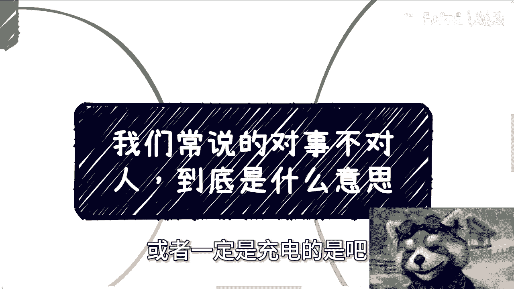
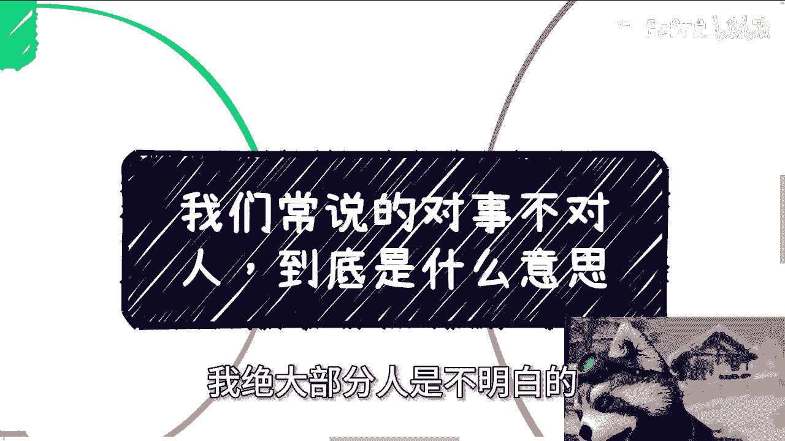
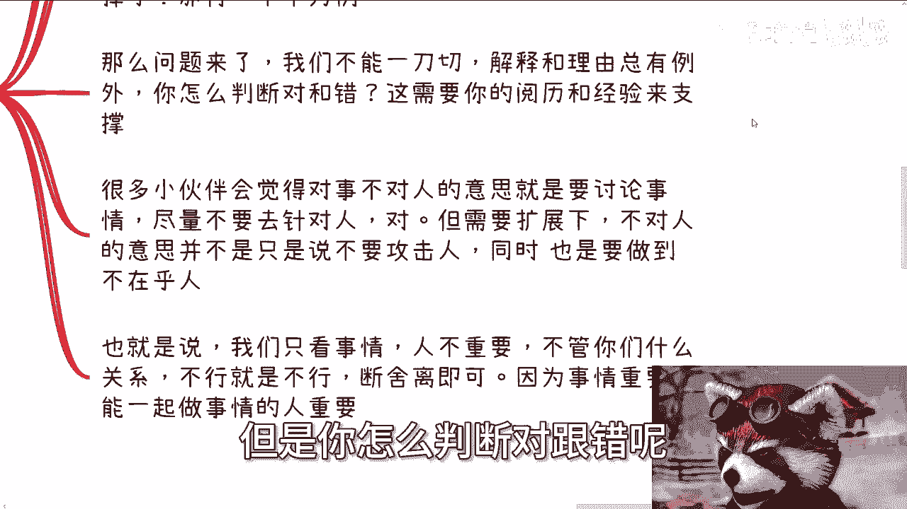
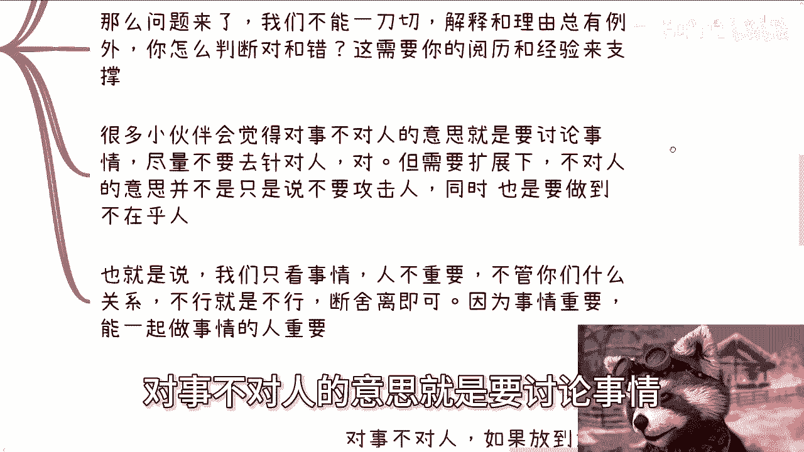
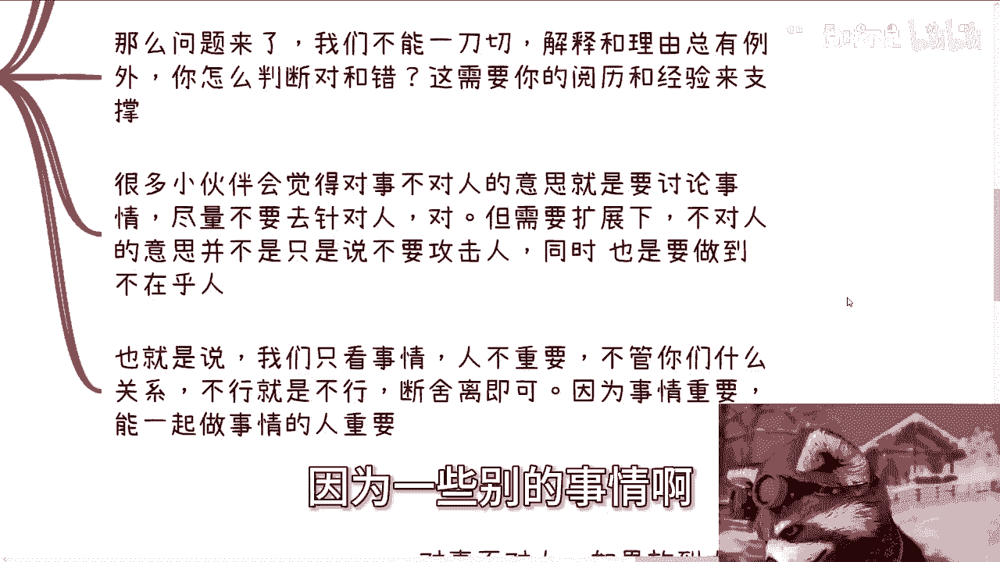
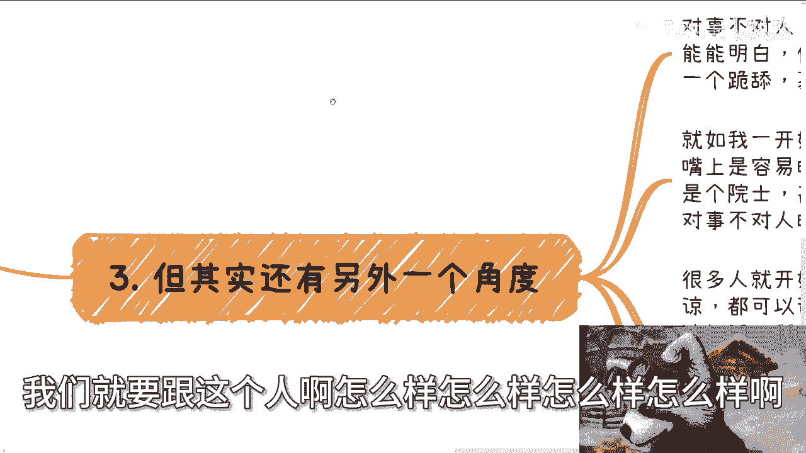
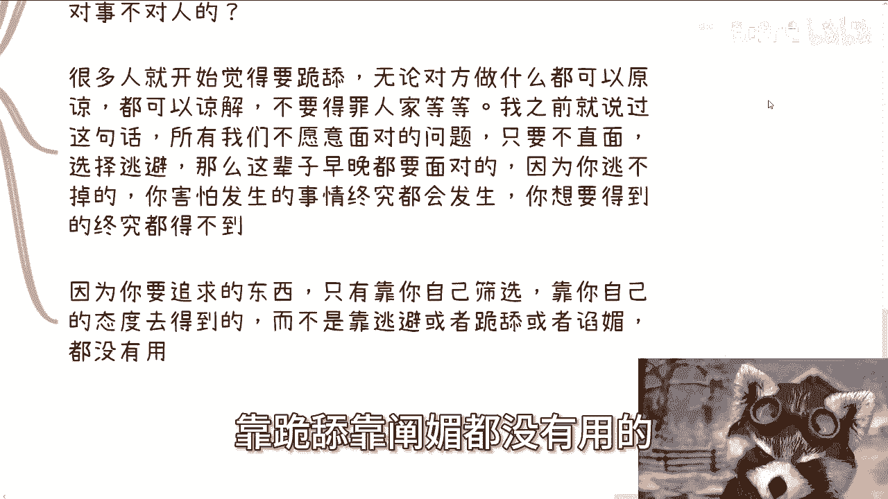
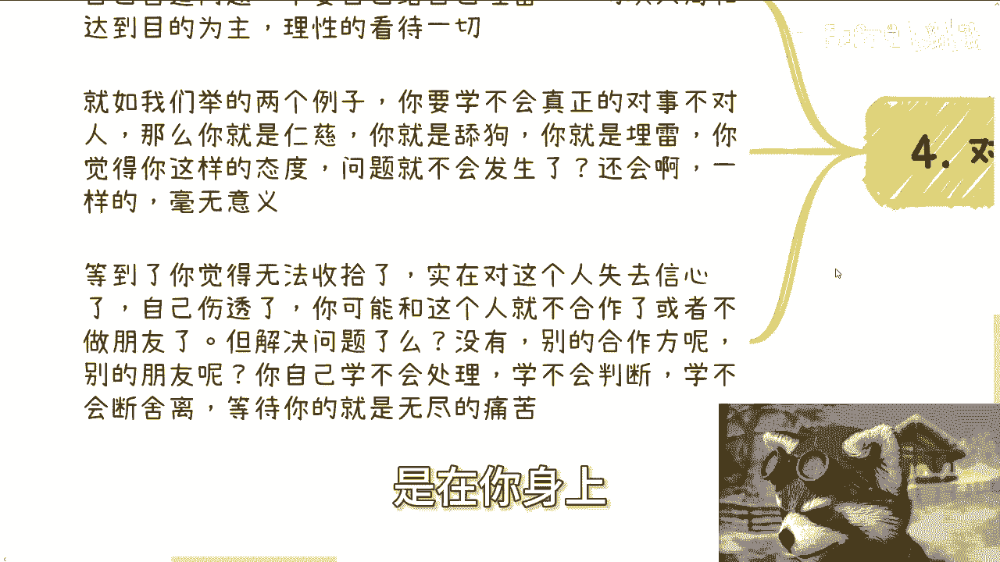
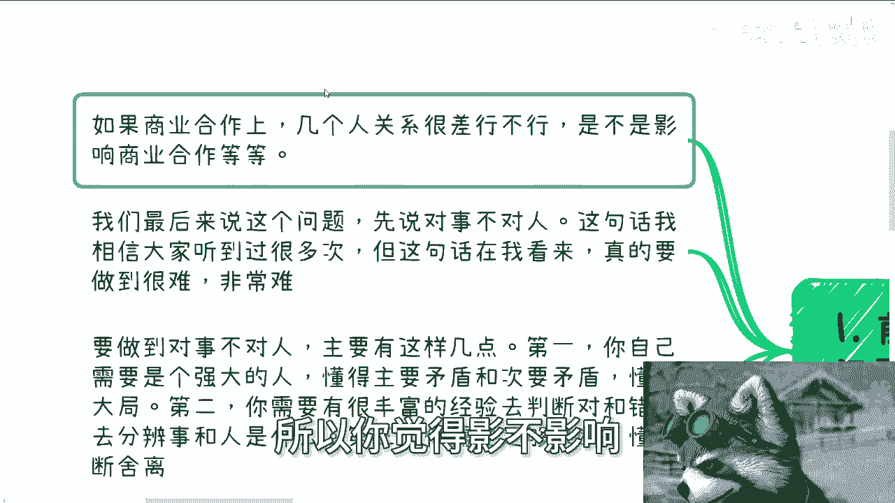

# 我们常说的对事不对人是什么意思---P1---赏味不足---BV14H4y1A7X9

在本节课中，我们将详细探讨“对事不对人”这一常见说法的真正含义、实践难点及其在商业和人际关系中的应用。理解并践行这一原则，对于建立健康的合作关系和避免不必要的矛盾至关重要。

## 概述

“对事不对人”是一句常被提及但鲜有人真正理解并做到的准则。它要求我们聚焦于问题本身，而非针对个人，但这需要强大的内心、丰富的经验和果断的决策力。本节我们将拆解其核心，并通过实例说明。

## “对事不对人”的实践难点

要做到“对事不对人”极其困难。上一节我们概述了其重要性，本节中我们来看看具体有哪些难点。

以下是实现这一原则所必需的核心能力：

1.  **个人素质**：你需要是一个内心强大的人，能够分清主要矛盾和次要矛盾，并具备大局观。
2.  **经验与判断力**：你需要丰富的阅历来判断对错，并准确分辨问题是出在“事”上还是“人”上。如果分辨不清，就无从“对事”。
3.  **果断与决断力**：你需要懂得“断舍离”。如果无法做到以上几点，仅仅告诉自己“要对事不对人”，只会带来无尽的痛苦和矛盾，这是一条错误的道路。

## 核心概念解析：什么是真正的“对事不对人”

理解了实践的难点后，我们通过一个具体例子来深入解析其核心概念。

假设在商业合作或朋友交往中，对方爽约（放鸽子）。真正的“对事不对人”意味着从事情本身进行分析：

*   **分析解释的合理性**：评估对方给出的解释或借口是否合理。例如，`理由 ∈ {地震，飞机延误，手机故障...}` 属于不可抗力或意外，可以接受。
*   **关注行为模式**：接下来要判断对方是否提前告知。`行为 = “未提前通知”` 通常意味着态度问题。
*   **依据经验判断**：不能对所有情况一刀切。你需要依靠自己的经验和阅历，去判断这次爽约是偶然的“事出有因”，还是反映了对方一贯的“人品问题”。

许多人的理解停留在“讨论事情，不攻击人”的层面。但这还不够，真正的“对事不对人”还包含一层更重要的含义：**“人”本身并不重要**。

我们只看事情是否符合标准，`if (事情不符合标准) then 终止合作`。无论对方是谁，与你有何关系，不行就是不行。我们必须懂得“断舍离”，因为我们的目标是找到能一起“做事”的人，而不是让感性因素干扰理性决策。

## 在权力不对等关系中的应用

在平等关系中践行此原则已属不易，在权力看似不对等的关系中则更具挑战。例如，当对方是教授、领导或权威人士时，许多人便难以坚持。

核心逻辑是：**所有你选择逃避的问题，最终都无法逃避。** 如果你因为对方地位高而选择忍受被白嫖或被欺负 (`态度 = “逆来顺受”`)，那么你得到的只会是更多的剥削。你追求的东西必须靠自己的态度和筛选去争取，而非靠跪舔或谄媚。

`逃避问题 ≈ 埋下隐患`，它不会让问题消失，只会让问题在将来以更严重的形式爆发。

## “对事不对人”的核心目的与常见误区

践行这一原则的核心目的是：**避免不必要的矛盾，不为自己制造问题和埋雷，一切以大局和自身核心目标为导向，理性处理一切。**

常见的误区是“仁慈”和“当鸵鸟”。例如：
*   朋友爽约，你轻易原谅，以为下次不会，但对方很可能再犯。
*   领导白嫖，你选择奉承，以为能换来好处，但往往不能。
*   同事背后中伤，你选择隐忍，以为能维持和平，但这只会鼓励对方变本加厉 (`行为 = 造谣`) 。

这些行为都是在为自己埋雷。等到你忍无可忍、伤心透顶时再绝交，问题并未解决，因为核心问题在于你**没有学会及时判断和果断处理**。`不果断 ≈ 无尽痛苦`。

## 回到初始问题：商业合作中关系差可行吗？

最后，我们回到课程开头提到的问题：商业合作中，几个人关系很差，是否影响合作？

这取决于一个关键前提：**关系差的各方是否都是真正懂得“对事不对人”、有大局观的人。** 如果都是，那么理论上可以合作，因为大家能聚焦于共同目标 (`目标 = 商业成功`)。

但现实中，这种概率微乎其微。一个更现实的逻辑是：如果几个人都格局很大、都能对事不对人，他们**根本不会让关系变得很差**。因为大家能抓住主要矛盾，不会为鸡毛蒜皮的小事纠缠。如果关系已很差，往往意味着在价值观或核心利益上存在根本冲突 (`矛盾 ∈ {价值观，核心利益}`)，这种合作基础非常脆弱。

因此，答案是：**通常严重影响合作。** 事情的判断并非简单的0或1，它高度依赖于每个人的阅历和理解力。

## 总结

本节课我们一起学习了“对事不对人”的深刻内涵。它绝非一句简单的口号，而是需要强大内心、丰富经验和果断决断力来支撑的高级处事原则。其核心在于**聚焦事情本身、理性判断、敢于断舍离，并且不因权力或关系而妥协**。掌握这一原则，能帮助我们在商业和人际交往中有效筛选伙伴、避免内耗，从而更高效地达成目标。