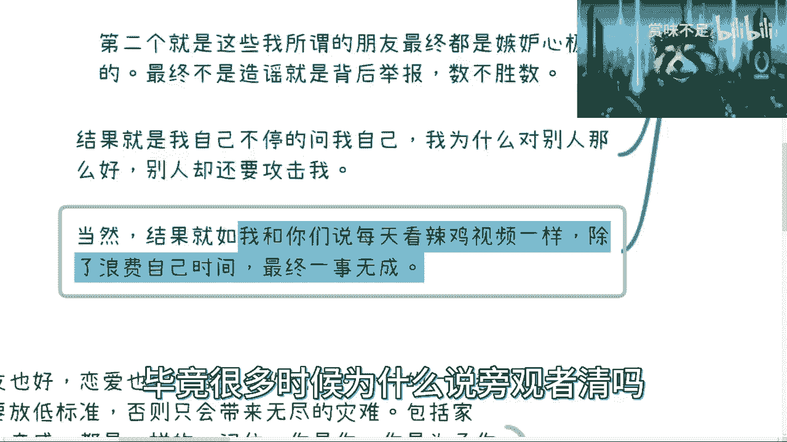
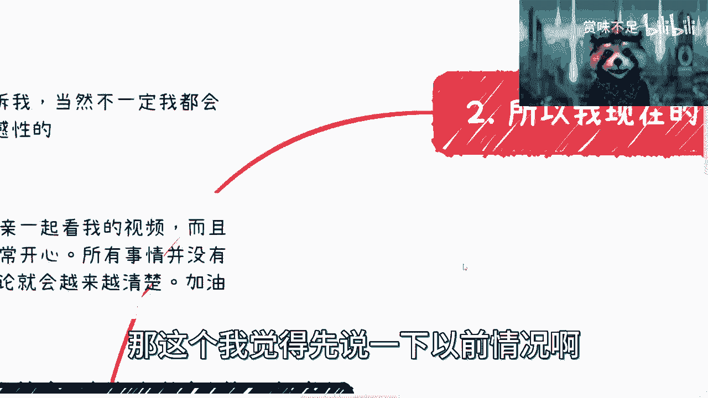
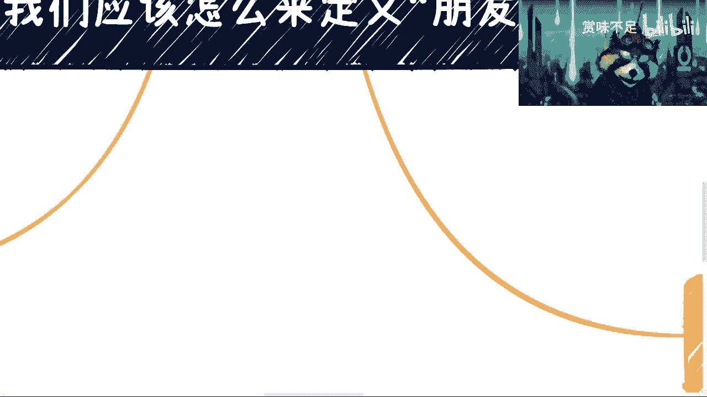
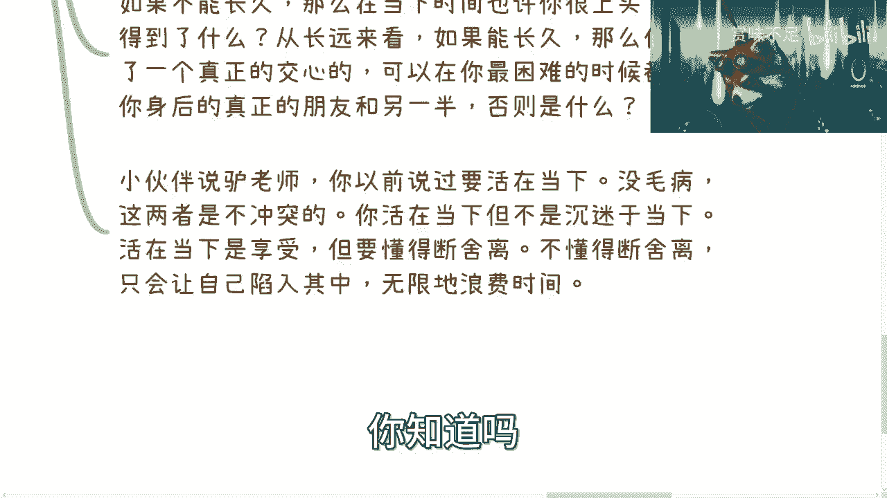
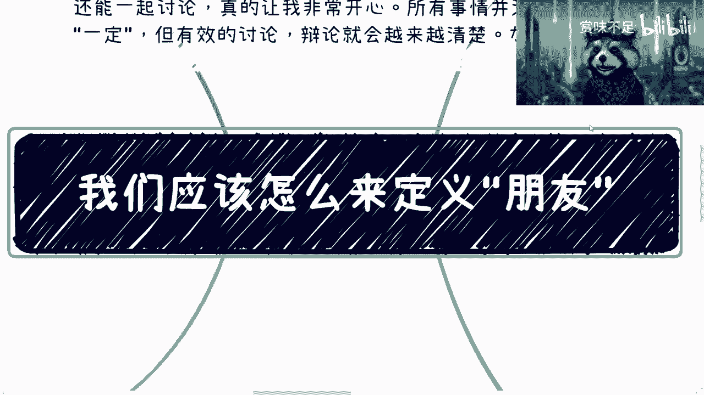

# 我们应该怎么定义”朋友“ - P1 - 赏味不足 - BV1Za4y1G7dh

哦大家好啊，对以后就是看到我白天没空，就是我出去赚钱了是吧啊，然后这两天呢因为有小伙伴私信啊，就让我来说一下这个朋友的这个问题啊，尤其是呃可能还涉及到了像公司里面啊。

要不要啊就作为朋友啊或者其他一些东西呃，但是今天这个内容呢，我主要可能还是从一个，稍微宏观一点的角度先去说啊，回头如果细节上面要再补充的话，我回头再做一个视频再补充，然后一两个事儿啊。

第一个就是说欢迎大家把想了解的一些内容呢，可以告诉我啊，当然我不一定都会选这个，因为要去看普适性或者敏感性对吧，你选了一个只有你关心的啊，那那我觉得也没法讲哦，那另外一个呢就有一个小伙伴说。

能够和他的母亲一起看我的视频对吧，我表示非常开心啊，非常开心，因为所有事情呢本身就没有一个定论对吧，就是我也我所说的，可能也只是受限于我所看到的，但是大家自己经历自己的一些呃，这个客观的情况啊。

或者说这个各种各样的讨论啊对吧，就能得出一些呃自己的一些想法，那至少就是说我说的东西，可以给大家一定的参考对吧啊，然后还有就是我这个麦克风调了一下，我不知道是不是大家听上去有什么区别。

反正我现在听出去没什么区别对吧，首先我先说说我以前我刚毕业的时候，就大概56年这个时间啊，我对朋友的认知是什么呢，就是我会友善的去对待每一个人，让我看看这个会不会被挡住啊，会被挡住，我往下弄一点对吧。

就是我会有善对待每一个人，然后呢就是就跟现在游戏一样的，本身我并没有对这些朋友去做分级对吧，然后我觉得大家其实开心最重要对吧，玩的开心最重要是吧，我觉得可能现在很多人也跟我一样啊，然后但是问题是什么呢。

就随着你的这个成长，随着你的这个发展啊，你会发现几个问题，第一个就是说这些朋友呢其实无法商业合作，为什么呢，因为你会发现要么就是你们可能很熟了啊，但是我觉得这个比不是主要原因，主要原因还是因为。

只是大部分人可能跟我以前一样，就不是一个很强势的人对吧，就是不能就事论事对吧，你可能碍于说哎呀，我们以前关系很好啊对吧，我们以前这个吃喝拉撒啊是吧，能出去玩对吧，你就觉得哎呀。

我好像一下子对你态度改变了，你知道吧啊，然后这个我觉得很多人都这样子啊，当然你们现在觉得我很强势，是因为我被被逼无奈哦，就说我给你们举个例子吧，你就像以前我跟我朋友做生做事情的。

我就属于那种就算是呃闹得很僵很僵，我对他都是很客气的，但是后来大概大概到前两年开始，我就属于什么呢，就是你跟我以前关系很好是吧，可以的，但是在商业上，你单纯让我觉得你是，那再见。

拉黑删除别人没什么好说的是吧，然后这是第二点，第三呢就是说啊就是你会发现啊，就是我所谓的，就是我以前定义的这些朋友的这个定定位吧，最终呢其实你会发现机动性都很强啊，而且不单季度性强，玻璃玻璃性也很强啊。

最终就是不是造谣呢，就背后去举报啊，然后呢就反正各种各样的事情，反正数不胜数，嗯就反正乱七八糟的事情很多很多，怎么说呢，就是那当然了，其实这个事情呢也跟我我跟你们讲，也跟就是说这个朋友的定位有关。

就是无知，正因为就说我是这么个定义吗，所以说你会发现如果按照这个定义来讲的话，你的朋友很多很多啊，这个遍地都是你朋友是吧，但是这些人啊，大部分的因为你从金字塔的这个理论来讲，或者八二开的角度来讲。

其实大部分的人嫉妒心都是强的，大部分的人都是玻璃心的，大部分的人都是二极管，这个是没有办法的事情对吧，就这个是一个基本盘，你说哦这个我要否定基本盘，那就没意义了对吧，所以说呢就是我们能做的就是。

尽可能的远离这些基本盘是吧，那我觉得这个是一块，所以说呢结果呢我觉得如果你们跟我一样，那么你们可能就会不停的问问你们自己，就说哎我为什么对别人这么好，别人却却还要攻击我，或者别人为什么对我不好。

就你回头想想看啊，我不管你们现在是不是跟我以前一样，或者是不是跟我现在一样对吧，但是你们自己想想看，就是这种问题问了有意义吗，没有意义，就是一你改变不了现实，二你也改变不了你自己是吧。

所以说我在这地方也写了，结果就是如果每次都跟你们讲的，我说就跟你们每天看了这视频是一样的对吧，或者看那些有的没的朋友圈是一样的，就是除了你羡慕别人，除了你就是可能哎呀自己很烦躁对吧，很很焦虑。

除了你在浪费自己的时间，你最终一事无成，就跟我以前一模一样对吧，就是你回头但凡想明白，你就会发现你在浪费时间，你如果不觉得你浪费时间，仅仅是因为你在上头啊，仅仅是因为你沉迷在其中，这个是没有办法的。

毕竟很多时候为什么说旁观者清嘛。

就这个意思吧是吧，那这个我觉得先说一下以前情况啊。

第二个呢我觉得就是说所以我现在三观啊，我来倒推啊，来倒推是什么意思呢，就是朋友在我看来现在就两类，一类呢是你可以一起赚钱，你可以从一起赚过钱的人，或者来说他能够有赚钱能力的人。

或者说有独立能力的人当中去选出来对吧，你过滤出来啊，你觉得哪些人，你也不能说所有的人都你朋友是吧，那也不现实啊是吧，那这第一类第二类呢就是可以交心的，那当然这个可能门槛比较高，就看你自己怎么定位了。

因为就是你跟他交际没有问题，但他能不能跟你交际呢是吧，这个就是问题啊，但是从定义角度来讲，我觉得就这两类没了好，那么第二点呢，就是这个时候就有人问了，他说啊，包括我以前群里面小伙伴看到就要问我了。

他说上总，那是不是我们跟你不算朋友，我跟你们说算啊，但是就是一，就是以我以前对朋友的定义来讲的话哦，就是如果按照我以前的定义来讲是算的，但按我现在的定义来讲，就是说我们可以按照广义角度。

从你如果从你们的角度，你觉得我们是朋友没问题，但从我角度不是啊，就是大家嘻嘻哈哈，大家聊，或者你们有什么问题问我，我在力所能及范围里面帮到你们，这个我觉得说实话这个是我做人的一个原则。

不代表我跟你们是朋友，当然你们在世界上能找到跟我这样原则的人，可能也很少，但不管怎么样，就从我的角度来讲，我是怎么样一个人嘛，对不对，那么有的小伙伴要问了，他说哎呀这个为什么你在说朋友这个事情对吧。

还要去跟赚钱挂钩，我跟你说为什么啊，你自己想想看啊，几点，第一不管他自己能赚钱还是跟你一起赚过钱，能赚钱的人，至少是有一定自律能力的对吧，这毫无疑问啊，第二有至少它有一定的执行能力跟落地能力吧，对吧啊。

第三至少他能避开一部分的杂音，他的关注点是在自己身上的，不至少不是每天怨天尤人，在那边浪费时间吗，是吧啊，第四至少它有一定的商业认知，换而言之呢，至少是有一定的察言观色的能力吧对吧，当然这些就是富二代。

咱先不是说他因为这种就是说不是靠自己，是靠一些这客观条件呢，咱们不去说他啊，就这里的这个这个这个这个定义呢，是说靠自己能力的，那么剩下你比如说关于三观啊，或者关于人品啊对吧，或者关于其他的。

我觉得就按照你们每个人的定位对吧，去求同存异就可以了是吧，就是你想想看为什么要挂钩，是因为这些人里面，至少相对我们说这个靠谱率会高一点是吧，所以说其实本质上就是这个原因，就是就是你想嘛。

就说我们说学历这个事情也是一样的，以前为什么说要读本科，为什么说要读研啊，为什么说要读博啊对吧，是因为本来这种人就少对吧，相对基本盘来讲，它的比例就少，第二就是说，为什么很多人觉得这是一个香饽饽是吧。

这是因为就是因为就觉得就是说啊，从这类人里面他能挑出来靠谱的人，相对比例比较高啊，不就是我以前也说过这个问题，就是并不是说本科就一定比专科好，或者研究生就一定比本科好，没有这个道理的。

但是他的就是基本盘里面，基本盘里面你的比例相对高啊对吧，那么这个其实是用人单位，或者说你去找一个这个朋友，就是你想要的这么一个结果嘛，是吧啊，那么这个是二对吧，三三在哪啊，三在这啊。

三就是千万别对别人放低要求，什么意思呢，就是说呃按照我们刚刚讲的啊，就是不管是朋友也好，恋爱也好，商业合作也好啊，一切的一切你都不要去放低标准，就是说你现在比如说已经跟我一样对吧。

有一个这个底线红线在这个地方了，你不要去，因为比如说他是你的家人啊，他是你的亲戚啊，或者他可能是你以前的小伙伴啊对吧，或者怎么样怎么样，就是就是你就得放弃这个要求啊，放弃这个标准，否则我跟你讲。

你只会带来无尽的灾难，就这个事情但凡经历过的人，心理都会很明白，你知道吗，而且这个事情我觉得屡试不爽，就百分百都这样子哦，然后呢我在这个地方强调一点，就记住你呢是你自己对吧，你是为了你自己活着的啊。

这个地方呢我觉得又有小伙伴要来杠了对吧，这个有人就要说了啊，就跟你这样说不对对吧，我这个也以后要给我父母养老的对吧，我要怎么样怎么样的，那我觉得养老也好，怎么样也好，这个是你作为一个。

这个就是你父母的孩子的一个基本盘，就是资本的一个要素吧对吧，这个我觉得你你你你去养老也好，你去孝顺也好，这也是为了你自己活着，有什么问题呢，对不对，那那反反过来说，你说你要是分的这么清楚。

我反而觉得你其实是有问题的，你知道吗，那这是第一点，第二点呢就是说啊我们刚才已经说了对吧，你放低这些标准，不能因为啊就是你们以前是个小伙伴啊，或者你们以前谈过恋爱，或者你们以前这就是家人或者亲戚。

这些都不行啊，不管什么原因，你不能心软，你一旦心软，只会给你自己造成更大的问题啊，那么紧接着呢就是如果你放低标准了啊，那怎么办呢，呃你会发现啊，就是要么你自己就后悔对吧，就擦屁股对吧。

要么呢你就是给你自己捅娄子，就反正就是说呃要么呢你就是给他做宝妈，就是他就是个巨婴，你就是一个这个保姆对吧，就不管你是谈恋爱还是做商业对吧，谈恋爱嘛，你就会觉得哎呀好像什么都你自己来对吧。

然后这个合作嘛就好像什么都你自己在做对吧，对方就是就是那种叫什么就商业化，叫什么拨一拨动一动是什么意思呢，就是你推他一下，他懂但不推，反正就不动对吧，然后呢你就会对自己说。

我他妈的为啥当时自己要作孽是吧，这就是不好意思，的确是自己在作孽，你知道吗啊，然后最后一块呢就是因为这种事情呢，我已经是经历了太多太多了，呃，呃从某一次开始呢，我就就就怎么说呢，就只能逼不得已逼成逼。

把我自己逼成了一个断舍离的状态，就是说我就现在分的这么清楚，我也不想这么样，为什么，因为我已经受够了，没什么好说的对吧，就是从某一次呢，就是我有一个朋友跟我合作的，然后呢就是啊反正造成了很大的矛盾啊。

嗯当然过了一段时间呢，他就是也跟我道歉了，也写了很长一段的内容啊，然后我我觉得我也相信他认识到自己的问题，但是我还是拉黑对吧，我还是删掉，因为从这次开始，我就我就决定就是说OK世界上不缺了，谁也不赚。

我也不缺，我也不是说一定要有这么一个朋友，无所谓对吧，我不想再给自己带来更多的一些问题对吧，何必呢，没有必要，因为因为你们一定要明白，就是所有人啊，就是你们但凡想赚钱，其实你们一定要明白一点。

就是赚钱这件事情啊只是一个结果，你们在在这当中，也有很多事情是要给自己带来高效，也就是你们所有的事情都要有高效率去做事情，对吧，那么这些高校是怎么来的，是从各种各样的三观，各种各样的做事情方式里面来的。

你们但凡浪费时间在任何一件事情上面，你们就不会打到高校。

高效率做事情，你知道吗，啊那么四是吧。

就是结论，就是说我们其实真的不需要这么多朋友，首先呢我先说清楚，不需要这么多朋友，并不代表我们不孤独，我们不伤心，我们不难过，而这两者没有因果关系，别去就是曲解，首先这么一个意思啊，第二就是说嗯。

而是因为我们明白了，所有的事情最终是需要自己去面对的，别人是帮不上忙的，不管是谁，你知道吗，就是正因为明白这件事情，所以不要去怨天尤人，不要去浪费时间，没有意义的，你说你今天就像很多人考研。

我说不好听点，你们考研只是为了拖延两三年时间，对吧，但是最终你还是要去面对的，有什么意义呢，没有意义的，浪费的是你们自己的时间，当然你现在听不懂你，或者你现在觉得这不是一个很大的问题，是因为你没有。

你还没有到一定的这个这个这个这个岁数也好，或者你没有到一定的level，你到了那边你自己展览，你自己只会给就是就自己删你自己，你知道吗，哈哈啊，然后这是第二个，第三个呢就是我一直说看问题，看视频。

你要放长线放，放长时间线去看，因为某一个节点的事情根本就不值一提啊，每一个节点事情也不值得你去呈，现在里面你知道吗，你比如说我们举个例子，你比如说你今天谈了个对象对吧，或者有一个商业合作伙伴。

你说如果不能长久，那么在当下的时间里面，也许你很上头，但是你请问你得到了什么，就从长远的角度来讲，如果你能长久，那么你得到了一个是真正可以交心的，可以在你最困难的时候。

站在你身后的一个真正的朋友或者你的另一半，否则你得到了什么，nothing对吧，那很多人又要说了，他说怎么会拉呢对吧，他说我我也成长了对吧，我也怎么样了，我觉得没问题，但是问题在于你不能呈现在里面。

你不能成就是沦陷在里面，你也不能纠结在里面，你也不能就是每一次踩同样的坑对吧，所以说你会看啊，就是我以前说过要活在当下，没有毛病，这两者是不冲突的，就是说你活在当下，你要去你要是去享受，你要懂得断舍离。

你要懂得自己去进步，你要懂得自己去总结对吧，不是说沉迷于当下，就所谓沉迷于当下是什么，就是要么就是啊这个玻璃心对吧，要么就是嫉妒别人，要么就是呈呈现在哎呀，为什么自己没有进步对吧。

哎呦为什么自己好像老师找不到方向，想半天没有意义的呀，你让你自己呈现当中只有无限的浪费时间，结束了的，的的的对吧，没了你得不到任何东西，你知道吗啊。

所以呢我在这个地方，最终最后啊我再总结一下。

就是呃还是那句话，就是但凡你们想要嗯，怎么说呢，就是能够比就也不叫比一般人吧，就是能够改善你们的生活，或者能改善你们做实验方式，或者能够更往上去走，我不管走到什么样的一个一个一个一个程度啊，就是。

就是不管是什么样子，你终究是要将你这个人的所有的很多习惯，约束起来，或者达成一个高效高效率的一个方式，你知道吗，你你绝对不可能用你现在的做生意方式和三观，然后呢慢慢慢往上走，没有办法的啊，就是就是两点。

第一点，因为你要是不改变你的这种效率，是根本不足以支撑你往上去走，你根本不足以支撑你去学到很多东西，或者或者说看到很多东西，第二就是说你就算能够接触到别人，比如说我，比如说其他人，但是你放心。

我们也不可能跟你合作，我们也不可能跟你去，就是拉你或者怎么样，因为很多事情我们自己很清楚，这些事情是靠你们自己的，靠我们没有用的啊，你就算付钱，你付10万20万给我，我也告诉你没有用。

你付200元给我都没有用，没有用的，你知道吗，因为所有事情在我看来，你付200万给我，他也只是一个节点，怎么怎么滴了呢，我以前我以后是不赚钱了，还是你以后不火了，还是我以后不火了对吧。

就是你放时间线到10年来讲，这个钱对我来讲有意义吗，没有这个钱对你来讲有意义吗，也没有，为什么，因为你得不到成长对吧，所以其实是一个道理啊。

啊行吧，那就先这么着吧好吧，然后有什么问题，反正呃有细节的啊，就结合你们的个人自身，如果有任何的创业副业啊，职业对吧，职业规划，任何细节问题，反正你们私信可以走那个付费的咨询找我好吧。

