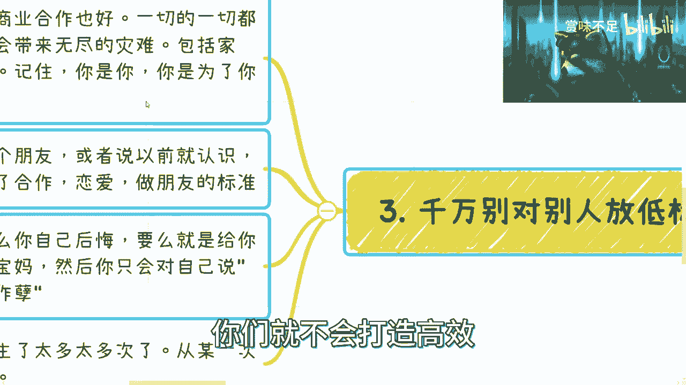
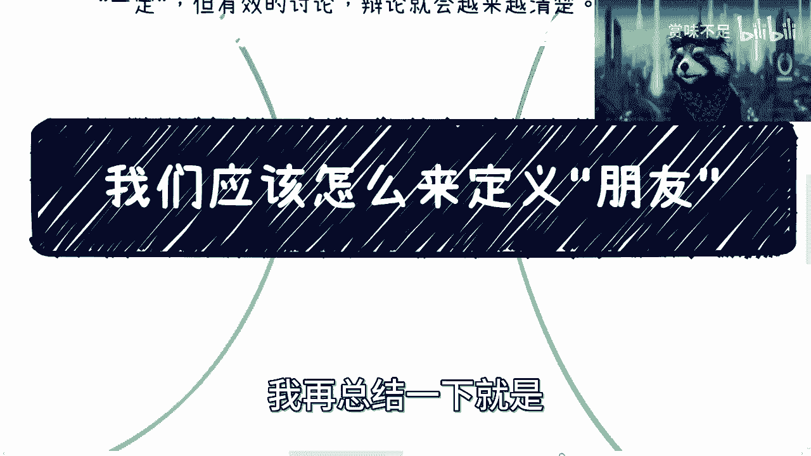
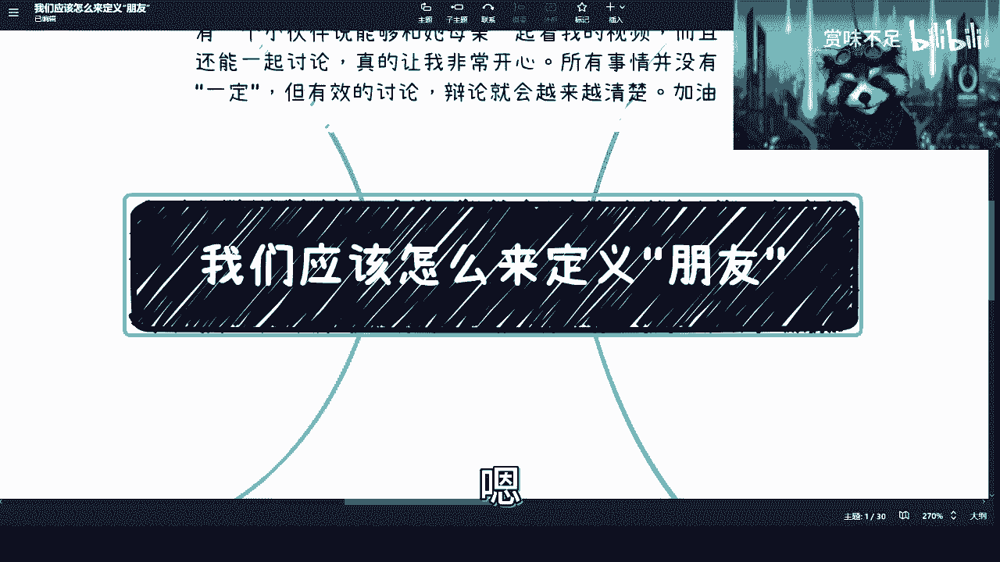

# 课程 P1：如何定义“朋友”？🤔

在本节课中，我们将探讨“朋友”这一概念的定义。我们将从个人经历出发，分析传统交友观念的局限性，并提出一种更高效、更现实的朋友分类方法。课程旨在帮助初学者建立清晰的人际关系边界，提升个人效率与生活质量。

---

## 概述：为何需要重新思考“朋友”？

随着个人成长与环境变化，许多人会发现，基于“友善对待每个人”和“开心最重要”的传统交友方式，可能带来诸多问题。例如，难以进行商业合作、关系脆弱易变、甚至遭遇背叛。本节将引导我们反思，为何需要重新定义“朋友”。

---

## 第一节：传统交友观的局限性

上一节我们概述了重新思考“朋友”的必要性，本节中我们来看看传统交友方式的具体问题。

我毕业约五六年时，对朋友的认知是：友善对待每一个人，且不对朋友进行分级，认为开心最重要。这与当前许多人的想法类似。

然而，随着成长，我发现了几个核心问题：

以下是传统交友观带来的三个主要问题：

1.  **无法进行商业合作**。主要原因并非关系过熟，而是多数人（包括过去的我）性格不够强势，无法就事论事。碍于旧情，难以在商业场合转变态度，这会影响决策与效率。
2.  **关系脆弱且易生事端**。以往定义的朋友，往往“机动性”强（易变）且“玻璃心”强（脆弱）。最终可能导致造谣、背后举报等各类负面事件。
3.  **陷入无意义的内耗**。如果对“朋友”定义过于宽泛，你的“朋友”会遍地都是。但根据“二八定律”，人群中大部分可能具有嫉妒心强、玻璃心、思维极端等特点。这属于基本盘。

结果就是，你会不断自问：“为何我对别人好，别人却攻击我？”这种问题没有意义，因为你既无法改变现实，也难以改变自己。最终，除了羡慕他人、感到焦虑、浪费时间外，你将一事无成。正所谓“旁观者清”，沉迷其中只会让你无法看清真相。

---

## 第二节：现代交友观的两类定义

上一节我们剖析了传统交友观的弊端，本节中我们将建立一个新的、更高效的朋友定义框架。

我现在通过结果倒推，将朋友分为两类：

以下是两类朋友的核心定义：

1.  **能共同赚钱或具备独立能力的人**。你可以从一起赚过钱、或展现出较强赚钱能力与独立能力的人中筛选。并非所有此类人都是朋友，但这是重要的过滤池。
2.  **可以交心的人**。这类门槛较高，取决于双方能否达成深度的精神共鸣与信任。

就这些，没有第三类。

这时常有人问：“上总，那我们（观众）算你的朋友吗？”

我的回答是：如果按我过去的定义，算。如果按现在的定义，不算。从广义角度，你们觉得我们是朋友，这没问题。但从我的角度，我们不是。我与大家交流、在力所能及时提供帮助，这是我做人的原则，不代表友谊。世界上遵循此原则的人或许不多，但这是我的立场。

---

## 第三节：为何要将“朋友”与“赚钱能力”挂钩？

上一节我们明确了朋友的两类定义，本节中我们来深入探讨为何第一类定义要与“赚钱能力”关联。

有人会质疑：谈朋友为何要挂钩赚钱？原因如下：

以下是具备赚钱能力者通常拥有的四项特质：

1.  **有一定自律能力**。
2.  **有执行与落地能力**。
3.  **能避开杂音，关注自身成长**，而非整天怨天尤人。
4.  **有一定的商业认知与察言观色能力**（此处特指靠自身能力者，不包括纯靠家庭的富二代）。

至于三观、人品等其他方面，大家可以在此基础上求同存异。

**本质原因**：从这类人群中，筛选出“靠谱”个体的**概率相对更高**。这类似于用人单位的学历筛选逻辑：并非学历高就一定更好，但在基本盘中，高学历群体里“靠谱”的**比例相对更高**。这是一种提高效率的筛选策略。

---

## 第四节：切勿对他人放低标准

上一节我们解释了筛选逻辑，本节中我们要强调一个关键原则：在任何关系中，都不要轻易放低自己的标准。

无论是交朋友、谈恋爱还是商业合作，都不要因为对方是家人、亲戚或旧相识，就放弃你的底线与标准。

以下是放低标准可能带来的两种后果：

1.  **你会后悔并疲于“擦屁股”**。你会成为对方的“保姆”或“宝妈”，无论是在情感还是商业中，对方都可能变成“巨婴”（推一下动一下，不推不动）。你会懊恼：“我当初为何要作孽？”
2.  **给你自己“捅娄子”**，带来无尽的麻烦。

经历太多此类事件后，我被迫进入了“断舍离”状态。例如，曾有一位合作的朋友造成很大矛盾，事后他道歉并写了长信，我相信他认识到了错误。但我依然选择了拉黑、删除。因为从那时起我明白：**世界不缺这一个人，我也不缺这一个朋友**。我不想再给自己制造问题。

**核心**：赚钱是结果，而高效是达成结果的前提。高效来源于正确的三观与做事方式。在任何事上浪费时间，都无法达成高效。

---

## 第五节：结论与最终建议

上一节我们强调了坚守标准的重要性，本节中我们将总结核心结论，并提供长远的人生视角。

结论是：我们其实并不需要那么多“朋友”。

以下是三个关键点：

1.  **“不需要很多朋友”不等于“不孤独”**。这两者没有因果关系。不要混淆。
2.  **因为最终一切都要自己面对**。明白这一点，就不要怨天尤人，不要浪费时间。例如，有些人考研只是为了拖延进入社会的时间，但这最终仍需面对，浪费的只是自己的生命。
3.  **用长远的时间线看问题**。单个节点的事件不值一提，也不值得你沉溺其中。例如，一段不能长久的感情或合作，从长远看，如果你不能“断舍离”并继续前进，那你得到了什么？什么也没有。

**“活在当下”与“长远视角”并不冲突**。“活在当下”是指享受过程、懂得断舍离、持续进步与总结；而非沉溺于情绪、嫉妒、玻璃心或空想。沉溺其中只会无限浪费你的时间。

---

## 总结

在本节课中，我们一起学习了如何重新定义“朋友”。

最终总结：若你想改善生活、提升层次，**必须约束旧有习惯，建立高效的行为与思维模式**。

原因有二：
1.  旧的、低效的方式不足以支撑你向上成长、学习与见识。
2.  即便你接触到高层次的人（如我或他人），我们也很难与你合作或提携你。因为成长终究靠你自己。即便你支付巨额费用，若自身不改变，从十年的人生时间线来看，这笔交易对双方都意义有限。

所有事情，终究要回归到**个人效率与成长**这一根本。

如有关于创业、副业、职业规划等具体问题，可通过私信付费咨询联系我。

