# 课程 P1：如何判断一个人是否值得合作？🤝

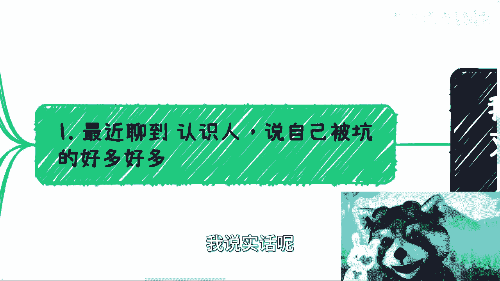

在本节课中，我们将学习如何理性地认识一个人，并判断其是否具备合作价值。课程将重点分析常见的认知误区，并提供一套可操作的验证方法，帮助你避免在人际交往与合作中受骗。

---

## 概述：为何我们需要学习识人？

近期，我收到多起关于在合作中被坑骗的咨询。同情之余，我认为问题的根源往往在于个人缺乏判断力。当前社会环境复杂，未来可能更加严峻，而传统教育并未教会我们如何判断他人。许多人成年后缺乏基本的社会生存与判断能力，容易成为欺骗的目标。因此，掌握一套科学的识人方法至关重要。

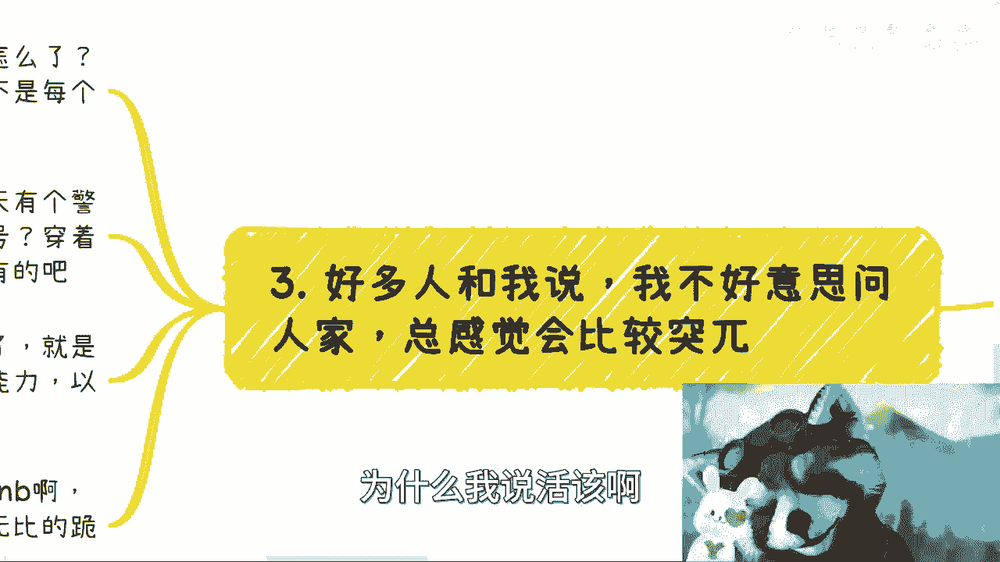

## 第一节：破除“慕强”心理，建立平等视角

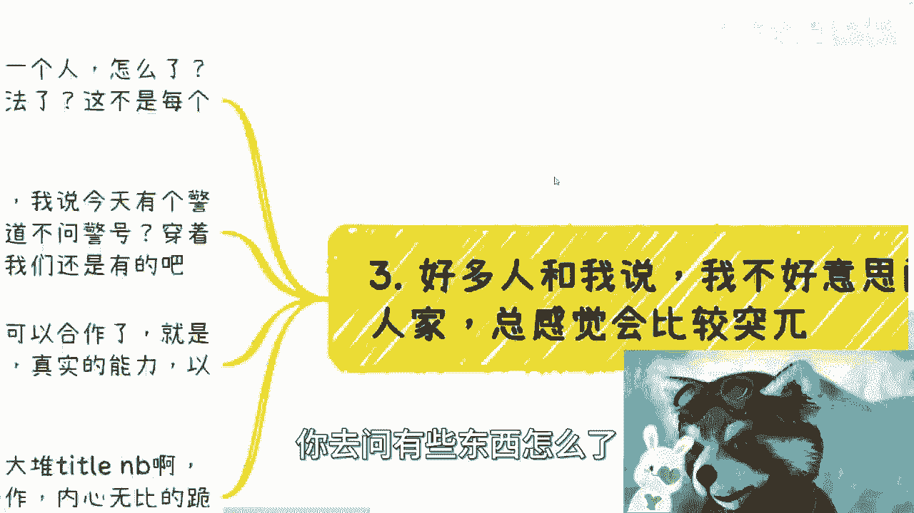

上一节我们指出了缺乏判断力的普遍性，本节中我们来看看第一个关键障碍：“慕强”心理。

许多人下意识地将他人分为三六九等，尤其是面对那些拥有光鲜头衔或背景的人时，容易产生崇拜心理。这种心态会蒙蔽你的判断力。请记住一个核心原则：**在人格与权利上，所有人都是平等的**。对方是一个人，你也是一个人。他的头衔或过去成就，与你当下的合作并无直接关系。

关键在于关注对方“现在的认知与观点”。例如，无论对方是教授还是领导，如果其观点存在明显错误，你都应该基于事实提出质疑。合作的基础是当下的能力与认知是否匹配，而非对方的历史光环。

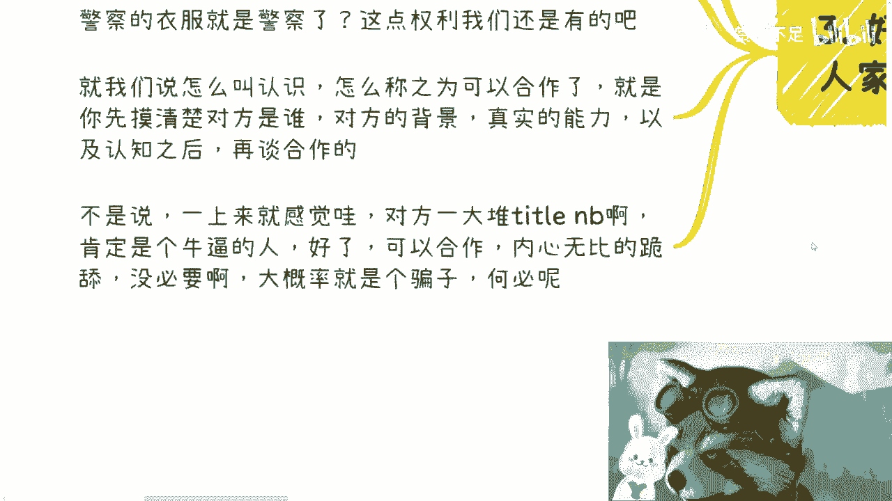

## 第二节：勇敢行使“求证”的权利

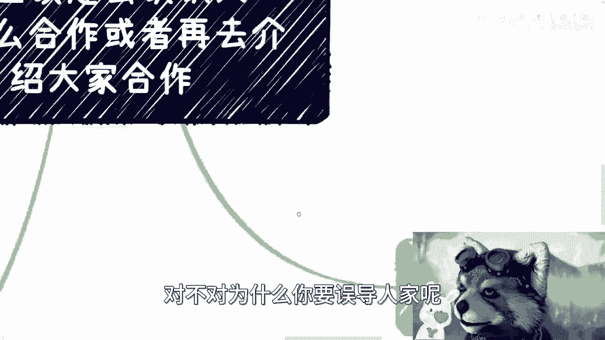

在建立了平等心态后，下一步就是主动获取信息。很多人因为“不好意思”而不敢向对方提问或求证，这恰恰是导致被骗的重要原因。

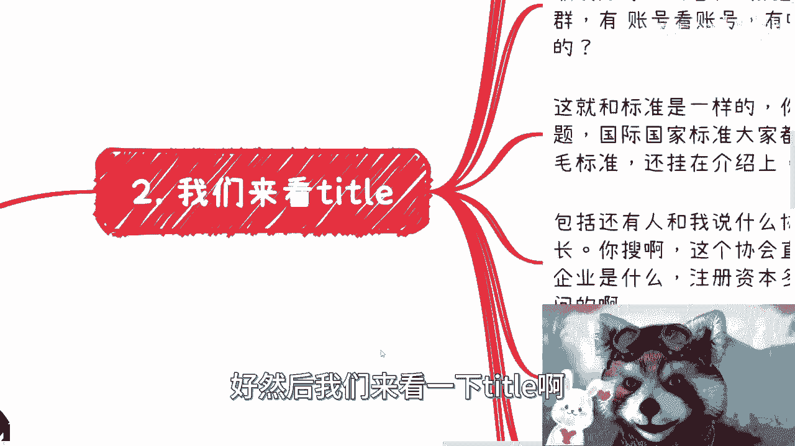

**求证是你的固有权利**。就像警察查验身份时，公民有权先核对警号一样，在合作前，你完全有权要求对方提供证明来证实其声称的背景与能力。不必预先替对方判断“他会不会觉得我在白嫖”，提问是你的权利，如何回应是对方的事。

以下是几种常见头衔或说辞的验证思路：

*   **声称参与过某大型项目**：询问其具体负责的模块与贡献。项目参与和项目主导是两回事。
    *   `验证问题：“您在项目中具体负责哪一部分？取得了哪些可量化的成果？”`
*   **声称拥有自媒体/私域流量资源**：要求查看相关账号、社群的后台数据或运营证据。
    *   `验证要求：“方便看一下这个账号的后台数据或创作记录吗？”`
*   **声称拥有某项“标准”或“认证”**：区分是公认的国家/国际标准，还是其自创的、无权威背书的“标准”。
    *   `核心概念：**国家标准(GB)** 或 **国际标准(ISO)** 是可公开查询的权威认证。`
*   **声称是某协会会长、理事等**：查询该协会的直属主管单位、注册信息、成立时间与注册资本。
    *   `操作步骤：通过“天眼查”、“企查查”等工具核实社会组织背景。`

请记住，以上验证是合作前的“基本动作”。如果对方连这些都无法或不愿提供，那么后续关于人品、认知的考察也就失去了基础。

## 第三节：理解合作的互惠性与现实风险

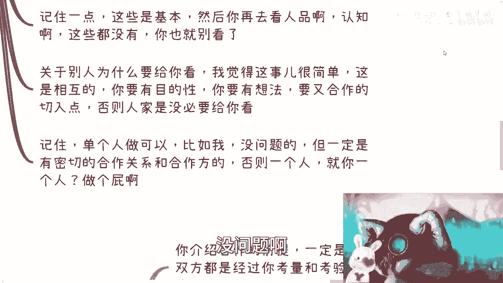

在初步验证的基础上，我们来探讨合作本身的性质。合作是双向的，要求对方提供证明的同时，你也应准备好展示自己的价值。这是一个相互筛选的过程。

关于合作，你需要理解三个现实：

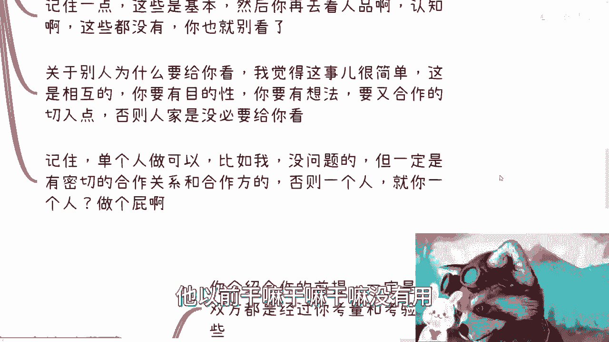

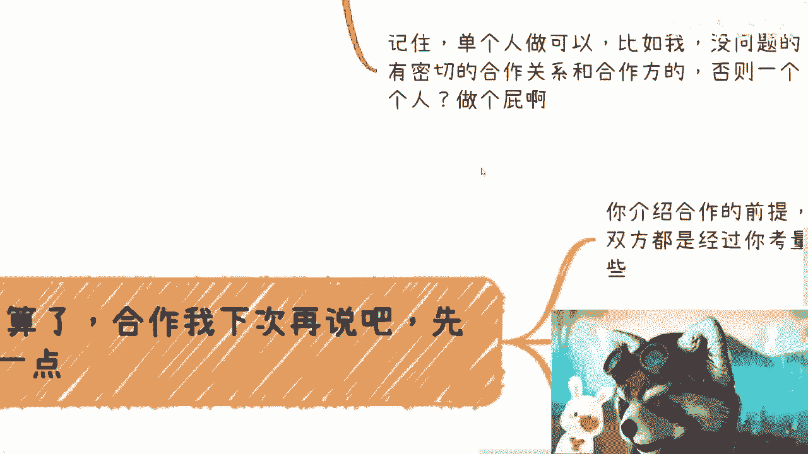

1.  **合作前提是双方均通过考验**：可靠的合作建立在双方都经得起上文所述的背景、能力验证之上。
2.  **“跳单”是常见风险**：在缺乏契约精神和格局的环境中，合作方绕过中间人直接对接（即“跳单”）的情况时有发生。
3.  **推荐合作可能形成“三角关系”**：作为中间人推荐合作，最终可能面临两种结果：合作成功但与你无关；合作出现问题，你却成为被指责的“背锅侠”。

正是由于面对个人（C端）合作时存在诸多不可控的风险和大量无谓消耗，我的建议是：**如非必要，尽量远离那些不靠谱的“垃圾人”**。将精力更多投向经过组织背书的（B端或G端）合作，或至少与认知水平在同一层次的人交往，才能更有效地接触真实的商业世界，避免陷入低效的内耗与纠纷。

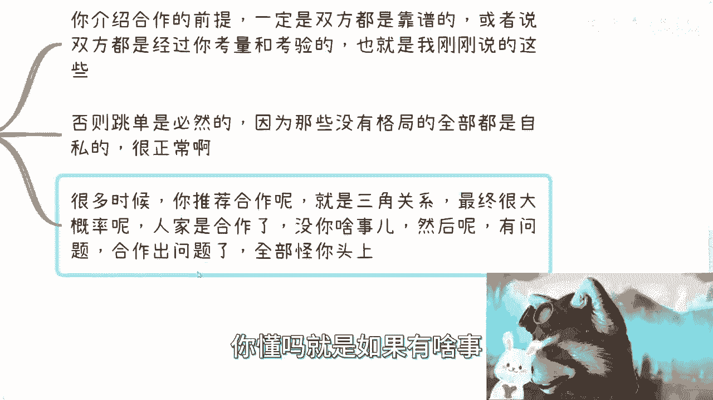

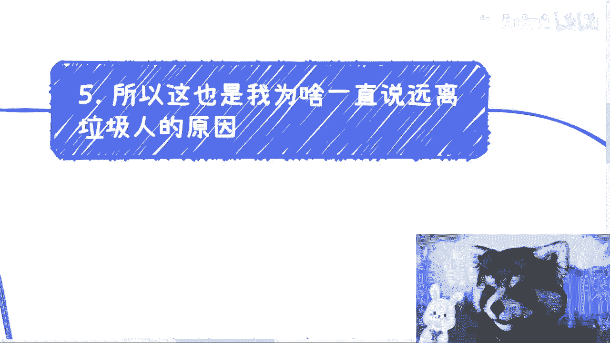

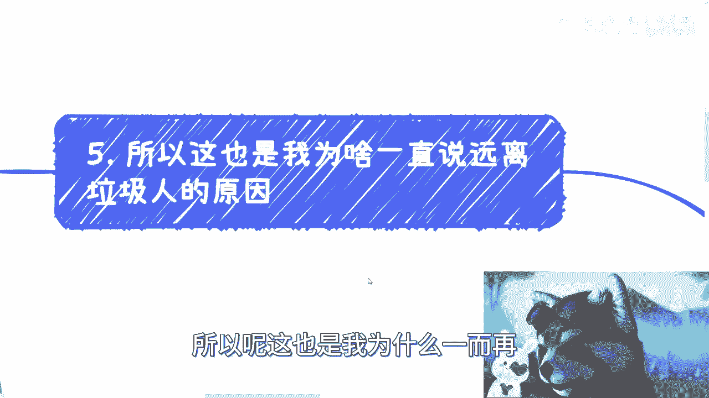

---

## 总结

本节课我们一起学习了如何系统性地判断一个人是否值得合作。我们首先需要**破除慕强心理，建立平等对话的立场**；其次要**勇敢行使求证的权利，对对方的头衔、背景进行具体验证**；最后要**理解合作的互惠本质与现实中的各类风险**，并学会优先选择更优质的合作伙伴圈子。

希望你能运用这些方法，在未来的商业与人际交往中，保护自己，做出更明智的决策。