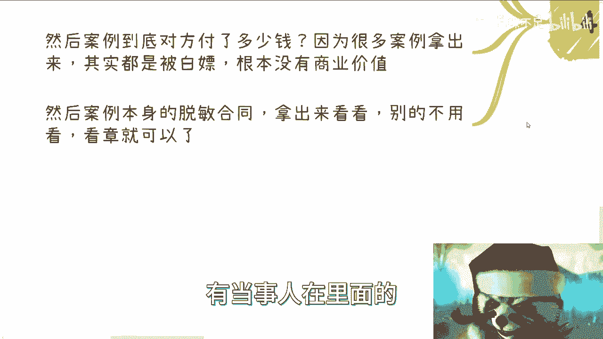

# 我们怎么判断一个人能不能赚到钱 - P1 - 赏味不足 - BV1RM411Z7za

哈喽大家好啊，今天礼拜二嗯。

昨天有小伙伴提出这么一个问题啊，我觉得这个问题很好啊，非常的好。

呃，他的问题是说，我们怎么判断一个人能不能赚到钱，对吧好呃，这个有的好说了啊，但有的好说了，但是呢我觉得在我这个内容当中呢，我也不可能面面俱到，呃我就当讲故事啊。

给大家给大家去讲了啊，首先啊首先我们先来定一下赚钱对吧，什么叫赚钱，你去看对方这个人嗯，他是赚大钱还是赚小钱对吧，客单价多少啊，我们先要看格局啊，他的客单价多少，一年流水多少，利润多少。

你总要去了解点对吧，哦你了解下来，你说你说我客单价就他妈两三百啊，然后一年你说可能就赚个十几20万，那那你这叫赚钱吗，你这叫打工，对不对，你赚得到啥钱，你一个盘子如果就十几。

20多万或者或者小几10万对吧，你说你要跟他合作，那你们两个分吗，每个人在1/2对吧，他十几万二十几万可能是纯利润嘛，也不可能呀，对不对，你要从他的整个量上面来判断，他到底能不能赚钱对吧，对吧。

首先这是第一点，第二点你case by case，他的赚钱是怎么赚的，比如说是那种一个一个单子的产品赚，还是服务类赚钱对吧，你得看他的赚钱模式啊，还是属于那种投资赚钱对吧，然后投入产出比多少，本金多少。

利润多少对吧，然后你比如说他还说那种躺着分红啊，你说我可能不干活对吧，那我一个月我每年能赚多少钱啊，还是说是快速的进行收割，啊，那么还是说有一些不可拿到台面上的，这种方式啊，但是不管怎么样，无所谓啊。

以上这些我们都可以认为是赚钱啊，就是说从属性上，从形式上来，我觉得大家不用太过苛刻对吧，你赚钱嘛，赚钱嘛，你在商业上面你再去谈良心，再去谈道德，我觉得就不合不合理对吧，那当然了，这个我觉得看人啊。

我只是告诉你们就是这是一个客观的情况，但你们有没有良心，你们有没有道德，看你们每个人啊，不是说我要教你们说你们没有良心。

没有道理啊，我只是告诉你们客观是什么情况，所谓防人之心不可无，我要是跟你们讲啊，商业这个行业，商业这个环境对吧，很好非常好。

那他妈这个叫P，这叫PUA，你们啊好，那么我们来具体来看啊，你看这人怎么看啊，第一你先看他商业逻辑通不通啊，什么意思啊，呃很多咨询的时候，我跟你们说，我在咨询的时候，其实我我也不是说我对大家态度不好啊。

我很强硬的啊，就是说很多咨询的时候呢，我也会问这个问题来判断大家逻辑通不通啊，逻辑都不通啊，那你装个屁对吧啊，比如说啊你看今天有个咨询人啊，跟我说我要做自媒体，那我就问他，你做自媒体。

你客户是谁啊啊呃C端企业政府啊，还是说谁，对不对，你说清楚嘛对吧，那你同样的你跟你我在问你啊，他们为什么付钱呢，啊怎么付呢，稳定吗啊，呃比如说有多少转化率呢对吧，你都得把这个问题了解清楚啊啊啊。

他但凡跟你说啊，比如说我先问出来，我说你怎么赚钱呢，啊他跟我他比如说跟我说哎，这个东西就看我广告投放啊，看我接下来怎么做啊，看我能吸引到多少人啊，那他妈屁话对吧，就你说这些东西对我来讲就是没有。

就是nothing，对不对，你说这话就跟我就再跟我说，我赌博，我用100块钱想去翻个1万块钱，不是有什么区别，有什么区别，你赚个屁啊，你比如说你说他要卖产品，对吧好，那你产品卖给的是政府，而是企业呢。

而政府企业为什么来买呢，对吧啊，你你跟我说啊，我要看怎么宣传合作方是谁，谁来背书啊，那可以啊，那但凡这么回答我的去谈的对吧，去什么找商务的，看商务谈下来情况的，那不就跟我说的一样吗，这不是屁话吗。

啊你任何一个人今天站他妈100个人，站他妈1万个人都是这样回答我的，那凭什么你赚不到钱，对方赚不到钱呢，你逻辑不通啊，你知道吗，就是我我跟你们讲过很多遍，就很多人他讲一个故事啊，他说他要去赚钱。

他整个逻辑就不同，包括他要去，他要去创业，你知道吗，你们知道吗，前两天还有个私信我的，我后面就不想回来，你知道吧，就那个私信我的说哎我们现在做什么东西，做什么东西啊，我们碰到瓶颈了，你不是屁话吗。

你们做任何的创业，连钱从哪里来，连谁会付钱，连这些人为什么会付钱，为什么付给你们钱都想不清楚，你创什么业啊，这莫名其妙嘛，你我跟你们说，你们但凡没搞清楚的，也别创意了，这你们还不如叫赌博啊。

别老说创意啊，那个动不动就创业，这他妈是每个人都能创的嘛，对吧，你就是我跟你们讲，就赚钱这个事儿啊，你去判断很容易判断什么意思呢，就是你就告诉我，你为什么能赚，而对方为什么会买单，有没有硬的逻辑。

你讲出来就是告诉我，比如说我这么做，对方一定会买单，有没有这么硬的逻辑，你你你没有，你赚个屁啊，不就是赌博吗，诶我发现很多人对赚钱其实非常的不理解，你知道吗，就是很多人会问我，他说安娜吕老师。

按你这么个说法，他说我们就是没有关系啊，就是我们称之为啊，比如说没有关系啊，没有去就是通过一些套路或者怎么样子啊，包括就是我之前教大家的说去好补贴也好，怎么样也好，他说我不是这么做。

我单纯的去正常的做一个产品，做一个服务，做个业务，我赚不到钱吗，那不好意思，我就告诉你就赚不到钱，就这么简单，因为你在赌博啊，你让我怎么说呢，我跟你说你赚多少钱，这叫这叫他妈的骗你，对不对。

就是就是怎么说呢，就是说人清醒一点对吧，你你你说我们就像我昨天那个那个那个主题，上面写的，就是我们有很多东西骗骗别人就算了，你别自己骗自己啊啊然后这是第一个，第二个，第二个就是看上下游关系逻辑。

什么意思啊，呃你看啊，很多跟我咨询人啊，他上来都会这么说，他说哎我要去做合作啊，然后呢说哎我有个亲戚啊，这个关系很好啊，我有个什么什么合作方，关系很好，然后我就开始问他，我说第一你要合作，那我就问你。

你的主体是什么，对不对，你你你说我要判断你会不会赚钱，对吧好，那你主体是什么，你总不可能告诉我，他妈的，你没主题，你就是个人哦，你是个人，你觉得你告诉我你能赚钱，你想屁吃，对不对啊。

好那如果你主体是公是公司，OK那什么属性，公司民企外企，私企还是混啊，还是说国企央企什么属性呢，股东是谁呢，对不对，你说啊，然后这是第一个第二个背书啊，谁可以来背书，谁可以来合作。

那么这些合作跟背书的主体又是什么，又是谁，又是什么属性的，对吧啊，你但凡跟我跟我讲了半天啊，你自己的属性是加名企合作的，也都是些民企，然后我搜下来都是一些有的没的，就阿猫阿狗，大家过家家的。

那你怎么指望让我觉得你能赚钱呢，对不对，就我还是那句话嘛，就是大家做朋友可以，但是你碰到商业上面去，这何必呢，就是自己人干嘛骗自己人呢对吧，你赚不到就赚不到呀，我非要跟你们说赚得到是啊，然后这是第二点。

第三点你说有关系的吧，好没问题，那你跟我说这个人叫什么名字，是什么关系，什么职级，什么社会地位对吧，科级干部，初级干部还是还是还是还是什么对啊，你比如说是什么政治地位，什么社会地位，如果是公司的。

那么他公司是什么，是COFOUNDER还是CCEO，还是说打工的还是怎么样子，有没有股份，你说清楚，你别一句话就跟我说关系到位，就以上这些话就是我咨询的时候一直问大家。

因为有很多人会跟我说哎我这个关系很好啊，包括说哎我这个导师关系很好，我说那什么关系，你倒是说啊，对不对对吧，然后就说啊，我可能跟跟这种政府里，那是政府什么县的科委还是经信委，还是农业厅。

还是什么地方还科技司，还是哪里，你说啊，你别老跟我说，你关系到位啊对吧，几乎可以说100个人里面他妈100一个人，我问下来就跟我说，不知道，那我不知道做个屁啊啊，你想屁吃，对不对啊。

然后同样的目前合作协议签署的有多少，框架协议签署有多少，这些是正常的商业逻辑，他总不能说没有吗，没有你赚什么钱，像peach对不对，那很多人要问了，是不是一开始问这些东西不合适，那我就这么跟你们讲。

你你要去赚钱，你想要去做商业，你早晚都要问你早死晚死都得死，你自己去考虑你什么时候死，对不对，这就随你嘛，你觉得一开始不适合我，没问题啊，你后面总归要问的呀，对不对，你浪费的是你自己时间呀。

有什么意义了啊，那么我们来看还有一点也是最重要的，就是看以前的案例，当然啊我在这个地方还说一点啊，案例不是去看PPT的，那很多人很搞笑的，他咨询的时候会把一个对方的PPT给我看。

我说这个东西有法律效益的，有没有啊，没有的呀，就像你现在一张纸上面写，我是MIT毕业的，有法律效益了，没有的呀，我说你拿个PPT给我看干嘛呢，唉我也搞笑了，真的是对吧，你案例不是看这种东西的。

案例是怎么看的啊，我跟你们讲啊，案例是看谁跟谁合作，甲乙方或者甲乙丙或甲乙丙丁对吧，那合同上是几方合作，同时很多案例他根本就不是他们自己做的，都是狐假虎威的，所以你要明白是甲乙方是谁。

别到最后他拿出个案例，他妈的跟他没半毛钱关系对啊，然后然后对吧，就是这个案例啊，对方到底付了多少钱啊，那么包括服务到底服务多久对吧，你不你别跟我说什么，他妈的对方就付了1万块钱，我服了一年。

他妈脑子有毛病啊，然后因为很多案例啊，我告诉你们拿出来的其实都是被白嫖的，就是甲方你要你，你说有没有这个案例，有的，但是甲方根本就没付钱，然后他就拿这个案例出来忽悠你，那有用的啦，没有商业价值的呀。

这说难听点，你不会赚钱，你赚不到钱呀，你跟我说这个按钮有屁用啊，对不对啊，还有一点就是我需要案例本身的脱敏合同，拿出来看呀，对不对，我我别的也不用看，我就看章就可以了，我只要我只需要知道你现在拿出案例。

你说什么什么什么这个地方的，那个地方的牛逼啊，那你合同拿出来看，有不对不对，要么就是你比如说有没有现场的照片，有你在里面的对吧，有当事人在里面的。

有没有啦，你怎么有证据的，你空口无凭啊，对吧好。

那么我们回过头来讲啊，你说我们怎么判断。

我们怎么判断一个人能不能赚到钱，很简单啊，你只要开始去问他，你只要相互相互交流，你从他的各种各样的逻辑上面去看呀，不要就是不能有任何模棱两可的东西，你要去问你问他，你你可以往往任何细节问有没有操作过。

有没有做过，有没有签过合同，有没有怎么样，你一问便知，对不了你，你你你自己不能脑子糊涂啊，你自己不能在那边说哦，你比如说卢老师啊，你这个东西怎么赚钱的，我跟你说，的，我上面有人哦，你自己觉得哇牛逼啊。

那那我只能说你，那怎么办呢，就是你得先有基本的判断条件，不判断的能力啊，你不能对方说两句，忽悠两句啊，你就忽悠过去啊，怎么样怎么样对吧，就是我跟你们说现在对吧，咨询我的人，甭管我不管对方是谁。

他只要跟我说到想要有商业关系的，或者想要去商业合作的，我就是问这几个问题，一你主体是什么，你主体是谁对吧，二他有什么关系，他背书是什么，他们之间有什么关系，你以前做过什么，然后你跟我说。

你跟我说有社会地位好，什么社会地位，你讲清楚，什么都说清楚对吧，你跟我说是什么什么居委会好什么，什么地方的居委会，区居委会还是什么东西，它只属离直属直属的这个部门是什么，你都说清楚啊，哦你你想想看。

你作为一个就是就是想要去判断对方，赚不赚钱的人，你自己对所有东西都不了解，那你那你赚什么钱对吧。

啊你你而且另外一方面，我觉得这些东西是必须要去学习的，因为这些东西你们在学校里面是学不到的，而学不到你们最终结果只有一个就是被骗对吧，你说怎么判断，就是实打实去判断我，我跟你们讲。

我也发现一个很神奇的东西，就是就是大家都是以前写过论文的啊，甚至还在国际上面发过论文，理论上逻辑应该非常严谨的，但我不明白为什么到了商业上面，到了人与人沟通的时候，他就毫无逻辑性。

就感觉就是对方像一个五六岁的小孩子，随便骗对吧，就是大家作为一个高材生，对吧，因为我觉得你们你们在同样的年龄肯定比我强，我在你们同样年龄，我他妈还在挖土，真的挖土啊，真的挖图。

我毕业的时候就是就是一个月就四五百工资，真的在挖图，我觉得你们都比我强，那么你们跟别人沟通的时候，你们就要有逻辑性，好吧行啊，那就这么装吧啊呃有任何问题，你们反正有商业上任何问题好吧。

包括就是说你们手上牌怎么打，包括未来你们觉得就是说不知道怎么走的啊，你们想希望我能够通过你们手上的牌，通过你们的背景给你们来这个做一些规划的，那么你们整理好我们再做咨询好吧。

