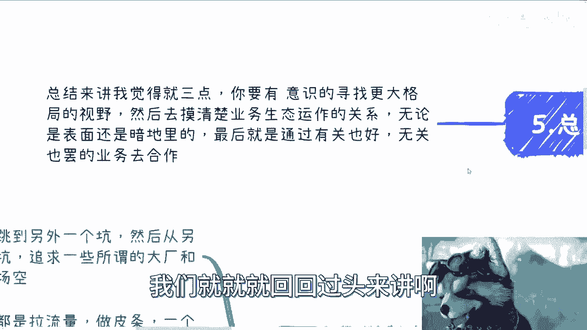
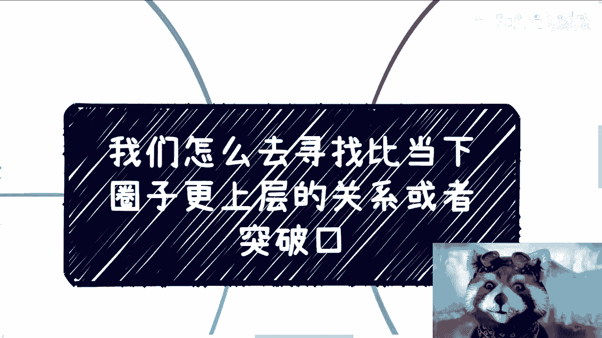

# 我们怎么去寻找比当下圈子更上层的关系或者突破口 - P1 - 赏味不足 - BV17N411u7QK

嗯好啊，我不知道这个内容，我咳咳咳，我能不能讲得清楚啊，因为我觉得蛮复杂的，尤其是通过这种表达方式，我不一定能描述的清楚，但是试试看啊，呃就是我们怎么去寻找，比当下这个圈子跟上层的关系或者突破口啊。

是这么个内容呃，首先大部分的时候呢，我觉得是这样子的，就是说呃不管是我们跳槽，还是从一个坑跳到另外一个坑啊，从另外另外一个再跳到另外一个坑，其实本质上呃在我看来他就是平跳。

我不管你是从小公司跳到大公司还是大公司，跳到哪里，其实都是平跳，因为这没有突破任何的瓶颈，也没有任何的质上面的变化，那么你们当然了，其实现在我相信大家是有成就感的，但是有了一段时间之后。

你会发现这终究是一场空，就是说你能不能赚到钱呢，能但是你往后比如说你35岁，往后，40岁往后，你又不是不活了对吧，你之前赚到的钱能否cover住你后面所有的东西，我觉得不太可能啊，几乎是不可能的。

那么首先这第一个，第二个呢就是说我们做一些业务，基本上都是拉流量做皮条对吧，比如说一个人赚几十赚几百的利益，当然了，很多时候我相信大家这个小问题也一样，就是说有那总比没有好啊，甚至有的时候做的还不错啊。

你觉得就是说呃一个礼拜或者一周对吧，这个能赚一点钱，你其实心里很开心，呃，也没毛病啊，也没毛病，但这始终这个还是在过家家哦，还是在国家家，而且很多时候呢就是就是我们做事情，我们会上头，因为我们做了难。

你会陷入到你的那个那个赚钱的当中啊，也就是说呃我就这么讲，就说很多人其实格局不够高，就是他只关心赚钱，他其实不太关心赚多少，他也不太关心耽误时间内赚多少，你跟他讲呢。

就是他就觉得哎呀这个我不关心这些对吧，我比如说我现在这叫什么，人家叫做今朝有酒今朝醉，他属于比如说一个月能赚一两万，我就是他妈的爽一两万对吧，但问题是你要有长远的目光啊，你做所有东西。

你得你得往上走啊对吧，那么你就像昨天我咨询的时候，跟那个年轻人对吧，一个小男孩，我当时就跟他说，我说的是这样子的，因为当时我跟他讲到一个话题，就说啊，他一年六七十万，其实觉得蛮舒服的，我说对的没有错。

但是我说你要想想一件事情，就是你的成长过程不是A到B这样子的，也就是说，如果你希望未来单位时间内能够赚更多的钱，或者说你也希望你拥有更高的社会地，位和政治地位的话，那么你要明白。

就是如果来说这个时间是10年对吧，那么你在这10年里面，一定是每一年甚至每半年或者每一段时间，你有一个台阶是往上走的啊，不是说你今天比如说一年赚60万，明年也是一年赚60万，后年也是一年赚60万。

然后等到第10年的时候，你说啪一下子，你说诶我能够更更高性价比赚钱了，不存在的，你懂吗，就是就是我们去思考这个问题的时候，你一定是一个有过程的哦，因为我发现很多人对这个东西，可能没有什么概念啊。

那么其实呢我觉得这个东西有三点啊，但是说实话我我没有自信，能说我表达的清楚，你们姑且先听啊，呃我觉得第一个呢就是说你做任何一件事情呢，这件事情一定是一个圈套，另外一个圈呢啊，就比如说我们随便打个比方。

比如说今天你做招生对吧，你说我要发一个证书，对不对好，那么你这个圈是什么，你的这个圈就是你是分销方啊，或者分销方之一对吧，然后还有你的培训方，就提供培训内容的，提供师资的对吧，提供证书发放的。

发放的没有了对吧，这个是你的权，但是你再往外面那一层看看看什么东西呢，你比如说啊，你说你从几个切入点，第一你的培训方他是只做这个东西呢，还是说有别的东西，因为大概率他不可能一棵树上吊死的。

对他可能还有别的东西，那别的东西是什么，然后他有没有别的合作方对吧，或者他有没有更大的股东对吧，那同样的那些课程课程的老师又是谁啊，那么这些老师你不管他全职兼职，但他一定也有自己的业务对吧。

那么你再往外去拓，你就会发现这个东西，它一定外面还有更大的一层东西包着，那么你比如说从证书角度来讲，这个证书是谁签订的，与这个证书有没有，就除了你你现在这个渠道以外，有没有别的这种发放的渠道对吧。

那么跟你这个证书相类似的，在整个中国还有哪些，还有没有，比如说更正规的，或者说倍数更高的，那么更正规的又是谁发的，他们又是怎么做的等等等对吧，就相当于是你现在这个权，虽然跟别人可能没有交集。

同时呢你跟他们的业务也有冲突，但是本质上从整个高度来讲，从整个的量来讲，就是那个更高的高度的那个圈，是套在你现在这个很小的业务之外的哦，那么更像一个两层外的象牙塔，或者三层外的象牙塔对吧。

那么再比如说你今天带一个货跨境电商啊，那么比如说你带货对吧，好那么你想货本身也有来源对吧，来源上面还有供应链对吧，供应链上面还有品控对吧好，那同样的你做分销，你是这样做的，那么同样做分销的。

人家怎么做的对吧，包括还有MCN对吧，那么也就是说你做任何一个业务，我不管你今天这个业务到底赚多少钱，也不管就赚了多少多那么多多少，你从整个制度往外扩的时候，他总会有跟外面的东西，你包括你包括什么。

你包括就是说有很多人说我考研对吧，考研也是一样的，你现在对接的可能是培训机构，那么我们就说往更外面扩，你能不能对接学校呢对吧，那么学校里面也分啊，你学校里面有职校，技校，有私立公立，你你一层一层往外扩。

你会发现外面有很多东西啊对吧，不是说单纯考研啊，那那考研还有呢，留学也是考留考研，留学也是考研对吧，考研填志愿是考研，你会发现你一层一层，其实每一层里面它都有独立的一个生态圈，独立的东西。

而你要做的第一件事是什么呢，就是第一件事情就是说你做事情，你做什么东西都无所谓，你整个业务是什么也没有关系，但是你得你得有足够大的格局，去了解整个一个圈是什么样子的，就相当于说你今天在一个象牙塔里面。

如果你外面有十层，我不指望你了解到十层，你比如说往外了解到五六层，那我觉得第一步你基本上就做到了对吧，那么你说怎么了解，我觉得方法总归是有的，因为五只要他就是跟你的这层商业它有关系。

那么它无非就是说要么在法律上对吧，要么就在商业上，就他一定是会有一种隶属关系，在那边的这种隶属关系有可能是股东，也有可能是合作，但无所谓，这种东西一定是网上查得到的，那当然这个东西。

我觉得就可能看每个人的本事了对吧，比如说你到底是怎么查的啊对吧，每个业务关系啊，你总归能看到一些端倪的，包括你可以通过网上查，你也可以跟别人喝酒吃饭去聊一些八卦，聊一些八卦，对不对，就说你第一步。

你总归要知道外面的几层象牙塔，大概的轮廓是什么样子啊，这是最重要的一步，然后第二个是什么呢，就是说你得定位好你的角色，就比如说你现在所在这个象牙塔对吧好，这个象牙塔里面你一次业务赚1000块钱。

你的角色是A对吧好，那么在外面五六层象牙塔的这个情况之下，你会发现外面其实角色可以，可能比你现在这个圈子里面角色要复杂很多，对外面可能比如说比如说A和B的关系，B可能有C分销方，C可能还有C。

C可能还有D的分销方对吧等等等，你会发现外面越外面，他的关系呢其实越复杂对吧，那么你同样的外面既然关系越复杂，就意味着切入的点就越多，你明白吧，因为你不可能我跟你讲。

我你基本上不太可能出现一种说你越往外面，他的关系变得越简单，不可能的简单，只不过是你面上没看到简单，它的水面下是不可能简单的好，那么我们说在这种关系里面，你得通过了解之后。

先去定位自己的自己的这个定位啊，就是说你要先去看，虽然你现在没有突破第一层象牙塔，对不对，但是你要先去看我在第二层，第三层，第四层的这个象牙塔里面，你能扮演个什么角色对吧，你得先去看。

就是因为每个人的资源，每个人的属性，每个人的技能点不一样嘛，你得先去看你想扮演什么角色，然后你再去反推，你需要手上有什么牌，然后再去积累，我们随便举个例子，比如说比如说你定位以后，你说我就做某个领域。

比如说互联网大数据，你说我就是想去赚政府这边的，比如说什么大数据局吧，或者农业厅对吧，这个相关的这个钱对吧，好，那么做某个城市的这个这个，大数据项目的供应商或者供应商的供应商对吧，好没问题啊没问题啊。

那么这个时候你在第一步了解了，比如说五六层象牙塔的这个，大概轮廓的情况下面，那么你就要去看你在整个的逻辑里面，你到底做的是什么一个角色对吧，就是说因为你越往外扩，你会发现就是没有哪个业务是很简单。

说哎我就是拉皮条这么简单对吧，因为你打个比方说，你说哎我可能就是跟大数据局对吧，这边的一个小喽啰，一个公务员，一个基层的底层员工，我跟他有关系，然后呢我通过他的关系，我可能还有更多的这种分销方啊。

我给他们分销方呢可能是找供应商对吧，然后或者说分销方面可能没找供应商，找的是咨询公司，咨询公司可以解决方案啊，然后解决方案如果通过了，那么咨询公司再去找供应商对吧，就是他可能当中有非常多。

一层一层一层的这种合作关系，那么你就要去想你的属性，你的技能，你的这个关系链，你现在手上已有的牌，你到底适合去做哪一个这个节点或者哪个角色，就像我们刚刚说的，你要是觉得你适合跟那个小喽啰打交道的。

那么你就这个想办法往那边去靠对吧，你要是说我觉得我就适合做一个咨询公司，就出解决方案对吧好，那么你也想办法往这上面靠，就说你要找到你的合适的定位，然后你再去反推你到底要什么样的牌啊，那么磨好第三点。

最后一点是什么，最后一点就好像说你不停的在往上跳，有的时候呢你看到一些光景，有的时候呢你可能会摸到一些关系，但始终你会发现没有达成合作，我跟你讲这个事情是常态，为什么，因为在我看来这是必经之路。

这就好像我们说啊，你说你要做供应商的供应商对吧，或者说或者说你想直接做这政府企业的白名单，供应商对吧，好那么你想想看啊，你的前提一定是认识了已有的，就是比如说现在的。

我们称之为现任的供应商和供应商的供应商，或者上一任的供应商或供应商的供应商对吧，你必须是先跟他们有一定的隔离这个关系，或者说认识他们相关的人，那么你才有可能往下去切嘛对吧，那么也就是说你可能已经看到了。

有一部分的东西，比如说你知道我知道了，就这家公司，但虽然我跟这家公司现在没有关系，但是你已经知道了哦，这家公司其实就是他的供应商，或者就是他的供应商的供应商对吧，那么这个时候你接下来要想的就是说。

我怎么跟这家公司有关系嘛，对不对，那么你想啊，我们就需要有很多时候，我们就需要去做曲线救国，也就是说你今天的目标是做大数据对吧，没有问题啊，但是呢那家无论哪家公司，就像我们刚刚说的。

它的业务其实是很复杂的对吧，就是我甚至可以说，你今天哪怕是通过给他们食堂去做白名单的，供应商对吧，你说我来承包你们的食堂，或者说我来承包你们的培训，我承包你们这家公司的任何一个别的东西。

哪怕是我给你们做一个呃呃呃呃市场宣传对吧，做个短视频，那么你的第一个目的就是，先从这家公司撕一个口子，你至于这口子塞进去是谁不重要，你知道吗，你塞进去之后，你再通过人介绍人，再通过喝酒吃饭。

再通过组局对吧，或者怎么样子，你终究能够找到，比如说大数据啊，或者说这个这个每一年去申报大数据的人，或者相关负责人的这么一个人嘛，然后你再去攻克，对不对，就是很多时候我们的点不是直笔直的往那边走。

我们不一定走得动，而且还有一件事情是什么，就是我们所说的这些事情，不是说你做了就一定成功，就像我们说的，你可能在不停的往上跳，但是终究能不能成功，不知道这个得看天时地利人和，但是你正常来讲。

你只有这种方式往上走，没有别的方式了，你知道吗，所以说我总结来讲啊，总结来讲我觉得就三点，第一呢你得有意识地寻找更大格局的视野，就是我们说的，你虽然在第一层，你得看到23456甚至789对吧。

然后去摸清楚外面这些这个象牙塔的这个，生态运作的关系啊，然后记住无论是表面还是暗地里的对吧，那么最后就是通过有关也好，无关也好，各种各样的，就是我们说边角料也好，曲线救国也好，这种业务去合作。

就是你要想办法先往上搭对吧，怎么搭不重要，对不对啊，所以说就是说嗯，所以说就是说我们就就就回回过头来讲啊。

比如说就像我们以前说高校对高校这边，我跟你们说的，找的最多的就是院长，高校校长副校长对吧，但是问题是你说我直接找不到，没毛病啊，那我就说啊，你可以去找找那个你可以找学生会呀对吧。

你你可以找那个什么这个这个就业办啊对吧，你可以找那些这个这个学校对外的，就你甭管他对外干什么，因为每一个学校总有对外东西吧，你说他的公众号，你搜他的活动，或者你说他什么东西，他总有对外。

你别怪他对外是什么啊，你先去切啊，对不对，就是你要的其实是关系，但是这个关系不是说一定是院长副院长，校长副校长，你只能一层层往上套，那你怎么办呢，对不对，但是不管怎么样，我觉得，核心点是什么。

核心点是我们可能现在能赚钱，但是你们千万不要把眼光只看在，比如说单位时间内，比如说五六百七八百一两千对吧，或者每一年赚了多少钱，这些没有用的，你要的是在提升单位时间的，单位时间赚钱的这个方式的同时。

你还得往上走，也就是说你的合作方就是我昨天跟那个人说的，就是他你相当于是你的合同的甲方，他的label要往上提，要无限的往上提，那么你才可能会有更高的，就是单位时间的赚钱的可能性，以及未来更高的稳定性。

否则没有可能性啊，你说你现在就是打这个小打小闹对吧，哦这边能赚个几万，那边赚了几万没毛病啊，那我就说嘛，10年后你能保证吗，你不能保证，你不说10年后了，一两年后你都不能保证对吧，我希望我讲明白了。

我只能这么讲啊。

嗯行吧。