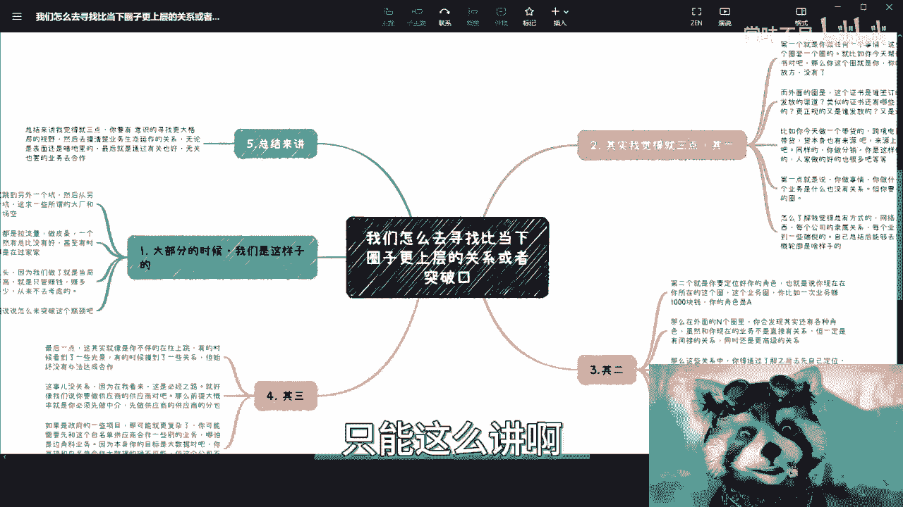

# 我们怎么去寻找比当下圈子更上层的关系或者突破口---P1---赏味不足---BV17N411u7QK

在本节课中，我们将探讨如何突破现有的社交或业务圈层，寻找并建立更上层的关系网络。我们将分析为何简单的“平跳”难以带来质变，并提供一个三步走的实践框架，帮助你系统地向上拓展视野、定位角色并采取行动。

---

## 概述

许多人通过跳槽或更换业务，实现了收入的增长，但这往往只是“平跳”，并未触及更核心的资源或带来质变。本节课旨在提供一套方法论，帮助你有意识地突破现有圈层，构建更具深度和广度的关系网络，从而实现单位时间价值的持续提升和事业的长期稳定发展。

---

## 为何“平跳”终将遇到瓶颈？

上一节我们概述了课程目标，本节中我们来看看为何仅仅满足于当前的成功是不够的。

大部分时候，无论是跳槽还是更换业务领域，本质上都是一种“平跳”。这意味着你从小公司跳到大公司，或从一个项目换到另一个项目，并没有突破根本性的瓶颈，也未带来质的变化。

短期内你可能有成就感，也能赚钱。但长远来看，例如到35岁或40岁之后，之前积累的财富很难覆盖未来的所有需求。

许多人从事的业务本质是“拉流量做皮条”，单次利润可能只有几十或几百元。虽然比没有好，甚至短期内收入不错，但这始终像是在“过家家”。

一个关键问题是，人们容易陷入赚钱的细节中“上头”，只关心“是否在赚钱”，而不关心“单位时间赚多少”或“长期能赚多少”。这种“今朝有酒今朝醉”的心态缺乏长远目光。

真正的成长不是线性的（从A直接到B）。如果你希望未来单位时间内赚更多钱，或拥有更高的社会地位，那么你的发展路径应该是一个**台阶式上升**的过程。公式可以简单表示为：
**成长路径 ≠ 线性增长 (A→B)**
**成长路径 = 阶梯式上升 (A→A₁→A₂→...→B)**

你不能指望今年赚60万，明年、后年依然赚60万，然后在第十年突然实现飞跃。持续、阶梯式的进步才是关键。

---

## 向上突破的三步框架

理解了“平跳”的局限性后，本节我们将深入探讨实现向上突破的具体方法。这是一个系统性的过程，主要包含以下三个核心步骤。

以下是实现圈层突破的三个关键步骤：

1.  **拓展视野，洞察更大格局**
    无论你当前从事什么业务，它都只是更大生态系统中的一个环节。你需要有意识地去了解包裹在当前业务之外的、更上层的“圈层”。
    *   **例如**：你从事证书培训分销。你的直接圈子包括培训方和发证方。但更外层可能包括：培训方的其他业务、其股东、授课老师的其他业务、证书的签发机构、其他发放渠道、全国范围内更正规或利润更高的同类证书等。
    *   **行动指南**：你的目标是看清外面多层“象牙塔”的轮廓。不必了解全部十层，但应力求了解外面的五到六层。方法包括商业查询、法律文件检索、行业八卦交流等。核心是理解外层的商业隶属与合作关系。

2.  **定位角色，明确向上目标**
    在了解了外部更大格局后，你需要根据自身资源、技能和属性，预先定位自己在更上层圈子里可能扮演的角色。
    *   **例如**：你的目标是成为某市大数据局的供应商。在了解了相关生态（如：大数据局 -> 总包商 -> 分包商/咨询公司 -> 具体解决方案供应商）后，你需要判断自己适合哪个节点。是擅长与基层人员打交道，还是擅长提供解决方案？
    *   **行动指南**：先“纸上谈兵”，设想在第二、三、四层圈子里，你的理想角色是什么。然后反推，要胜任这个角色，你需要积累哪些资源、关系或能力（即“手上的牌”）。

3.  **曲线救国，实现关系切入**
    看到了目标，也明确了定位，但直接建立合作往往很难。这时需要采取“曲线救国”的策略。
    *   **核心逻辑**：你的首要目标是与你锁定的上层公司或关键人建立任何形式的连接，这个初始连接的业务本身是否完全相关并不重要。
    *   **例如**：你想接触目标公司的数据业务负责人。直接敲门可能无效。但你可以先尝试成为该公司食堂的供应商、承办其员工培训、或者为其制作宣传视频。只要成功“撕开一个口子”进入该公司体系，你就可以通过内部引荐、饭局等方式，逐步接触到目标人物。
    *   **行动指南**：接受“过程漫长且不一定每次都能成功”的现实。通过任何可行的、哪怕是边缘的业务合作先建立连接，再逐步向核心目标渗透。关键在于先“搭上线”。

---

## 核心原则与总结

在详细拆解了三个步骤后，我们最后来提炼一下贯穿始终的核心原则。

无论具体策略如何，核心原则是：**不要只盯着眼前单位时间能赚的几百几千元**。你要追求的是在提升单位时间价值的同时，让你的合作方（甲方）的层级不断上提。

这意味着你的合作伙伴标签要越来越高端。只有这样，才能获得更高的盈利可能性和未来的事业稳定性。否则，当下的“小打小闹”难以保障一两年甚至十年后的发展。

就像拓展高校关系，最终目标可能是院长、校长，但起点可以是学生会、就业办或任何对外活动的负责部门。关键是通过一层层关系，逐步向上套。

---

## 本节课总结

本节课我们一起学习了如何系统性地突破现有圈层：
1.  **识别了“平跳”的局限性**，认识到阶梯式成长的重要性。
2.  **掌握了向上突破的三步框架**：**洞察更大格局** -> **定位自身角色** -> **采取曲线救国**。
3.  **明确了核心原则**：持续提升合作方层级，以实现单位时间价值的增长和事业的长期稳定。

记住，突破是一个有意识的、持续的过程，而非一蹴而就。从今天开始，用更广阔的视野审视你的事业，并一步步向上搭建你的关系网络。