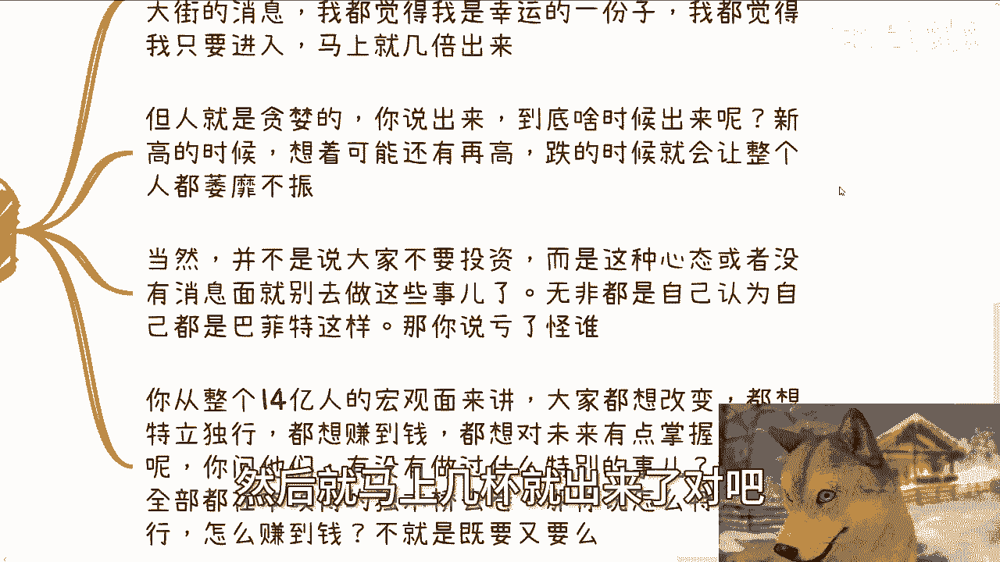

# 我们总是因为自己的各种意淫而伤害或者耽误自己 - P1 - 赏味不足 - BV1k1xXeVEb1

好大家好，呃，今天已经放假第三天了啊。

呃我们今天讲的这个主题呢，叫做我们总是会因为自己的各种意淫啊，也就是YY而伤害和耽误自己啊。

我不知道有多少小伙伴啊，从这个主题能不能明白我想表达的意思。

但但是能不能明白并不重要啊，呃反正我会跟你们解释明白的啊，首先呢先用大白话解释一下。

就是很简单，太多事他是没有因果关系的，但是呢你从普罗大众会默认有因果关系，当然到底怎么会让大众会有这种怎么说呢，有这种错觉，或者有这种所谓的意淫的这种想法，我也是不知道的啊。

最大的一个我觉得意淫的一个点是什么呢，就是学历，我觉得就很简单，就是就是到今天为止，整个普罗大众我们就这么说，普整个普罗大众大部分的人都会认为，我有一个好的学历，我就能找到好的工作，我有一个好的工作。

我就能赚到钱啊，这因果关系成立吗，成立不了一点啊，那么一直以来呢我自己也是啊。

你比如说以前一直被灌输啊，考试是唯一的出路，要有好的工作啊，要至少是一个比如说坐办公室的office的工作啊，觉得呢学校就是个很干净的地方，神圣的地方不可侵犯的地方啊，就应该是一个告诉大家。

教育大家真理的一个地方，你就比如说碰见一些机关单位啊，就感觉人家是有背书的，人家是不会欺骗我们这种普罗大众老百姓的，再比如啊我们做项目签合同对吧，这么长时间啊，多少年多少钱就应该履行的。

甚至我们财务做账的时候，比如说一年后应该给我们100万，我们就会把一年后这100万作为应收账款，就是做做成我们的计划啊，作为这个应收账款，做到我们的这个财务规划里面。

对不对，好以上，这是我说的，就或者说从我以前认知角度，我认为的有因果关系的地方，对不对，好，那么第二啊，其实这一切它没有任何因果关系，或者客观的说本身就不存在因果关系，都是我们自己意淫出来的。

如果我们吃了亏。

我们怪谁呢，对吧，我和朋友是这么说的，我说我对于人类社会的信任度是做减法的，就是每当啊就是你们也好，他们也好，问我对于某一个问题的看法的时候，或者还说问我为什么这么看一个问题的时候，我都会这么告诉他们。

我说我以前对所有的人，所有的机构，所有的事情都是抱有百分之百的信任的，无论合作也好，朋友也罢，都是一样的，就是他说什么我都信啊，我就是说我是朝着一个很多人认为的，乐观的角度。

或者作为前提基础去去去去判断事情的，然后呢我随便举例子啊，我融资的时候被合伙人坑了，政府合作的时候不停的被欠款，然后公司倒闭了，融资的时候呢，投资人还不停的把我们这种项目方，就把我们啊当成工具人。

以及跟相关机关单位合作的时候被压价，压价到倒贴啊，当然啊我做高空维修的时候，那就更别说了对吧，以上这些都是我亲身经历过的，而且这些事情在这么多年以来比比皆是啊，那么说白了一次一次的在做减法。

减到最后就像现在只剩下了这仅剩的一丝，我认为我还是老百姓，我还想为老百姓做点事情的，这么最后一丝人性没了，消失殆尽了，能明白吗，哦所以说你们在想着说哦，有很多因果关系，你们仔细想看有因果关系吗，有吗。

有不了一点，但是如果你跟我一样，在年轻的时候觉得有。

那怪谁呢，对吧，我也是默认很多事情有因果关系，但他们事实上没有啊。

啊第三其实啊大家走的路其实都差不多，你比如说投资或者进入一个风口行业，这感觉就是什么，就是我知道啊，虽然虽然你们比如说你们跟我一样啊，听到的都是些小道消息，什么网网网上群里面啊啊，或者某一个大佬啊对吧。

或者说给你们讲了一个消息烂大街的啊，那么你们会跟我一样，都会觉得自己是幸运的一份子哦。

然后呢我们都会觉得卧槽他妈的，我只要马上进入了啊，我们机会来了，卧槽这辈子翻身就他妈就就在于此了。

all in了对吧，一把梭哈的吧啊然后就马上几倍就出来了。

对吧好，但问题来了，人都是贪婪的，谁跟谁都是一样的，就是我一直跟你们讲，在我的认知里面，不存在谁比谁强，谁比谁弱，不存在的，大家都一样，你说出来你说出来对不对，到底什么时候出来呢。

新高的时候还是想着更有，就会想着可能还有更高的时候，跌的时候就会让你整个人萎靡不振，你都不会出来，当然啊并不是说你们不要投资，我们不是这么这种二极管的思维对吧，而是说告诉你们这种心态。

或者来说你没有真正消息面的时候，你就别去做这些事儿对吧，你既然没有拥有这种怎么说呢，韭菜心态又没有真正消息里面，你还非要去做这个事情，那你在做这个事情的时候，还要认为自己是巴菲特，那的说怪谁呢，对不对。

你从整个14亿人的宏观面角度来讲，大家都想改变，大家都想特立独行，你们这么去思考一个问题啊，你们现在是在2024年对吧，这么一个时间关口啊，但是你要明白，每一年都有22岁的人，每一年都有18岁的人。

每一年都有25岁的人，每一年都有30岁的人，每一年都有那个所谓对自己关口的人好，那么我们就这么问，如果你觉得今年对你来讲比较特殊，或者当下这个时间对你来讲比较特殊，那么问题来了，你凭什么对你比较特殊。

而不是对整个普罗大众都很特殊呢，如果来说仅仅就仅仅是对你有特殊的话，那么你有没有问过你自己，为什么，如果不是对你比较特殊，对普罗大众都很特殊的话，那么又反问你们以前这么多年，为什么老百姓没有财务自由呢。

对不对，那只有一个结论，就是你们所谓的风口，你们所谓的所认为的这种叫什么，就是机会都是你们所认为的而已对吧，你这样很多人大家都想改变，都想特立独行，都想赚到钱，都想对未来有有点掌握，然而呢你问他们。

那你到现在有没有做过什么特殊事情呢，没有全部都在本硕博独木桥上面去卷，那的跟我谈什么特立独行，谈什么赚钱啊，对不对，那么奇了怪了嘛，这不是啊，第四关于悟性高低啊，我觉得悟性高低在于什么呢。

在于你跟别人有拥有同样的经历，同样经历过同样的事情的情况，下，面一个人能不能找到整个事件的核心点，而不是被表面所迷惑，或者说必对于表面的东西执迷不悟对吧，这就好像我告诉大家，C端的生意永远是冲动消费的。

因为C端来看你这个东西只有5~10秒，你怎么跟他说明你这产品好坏呢，你怎么都说明不了啊对吧，所以说C段事情本身就是包装营销没了，这就是核心矛盾点哦，那么悟性高的人，其实就很清楚他到底应该学什么。

应该解决什么问题，应该把力往哪个方向上使对吧，而悟性低的人，或者说自认为悟性高的人，就属于那种一直纠结哎呀，我产品要做好，服务要做好对吧，好不好，重要吗，不重要，重要的是客户觉得好不好对吧，你不要来。

你不要去刚这个理论嗯，你没什么好杠的，因为你只要做C端生意，C端就是一个没有集中力的对吧，无论是抖音还是拼多多，还是所有的C端产品，已经向你们证明了C端就是没有集中力的，一切靠营销。

你你你你告诉我哪个C端的产品很好，不靠营销能做起来的有吗对吧，这就好像我告诉你们，弊端的声音永远都是靠关系攻克，关系就是你唯一要做的事情，怎么做都行，方式方法有很多种，你靠前靠叫什么姑娘对吧。

靠别的各种各样方式随便你，但是结果只有一个，就是你得把关系搞好，那么我们就这么说啊，当然啊，这个走我们要一碗水端平对吧，你你找呃姑娘，你找牛郎都行，随便你啊，那么一个聪明人，一个聪明的媒体。

一个聪明的机构，一个聪明的政府啊，那么我们就这么说啊，假设你今天就是这么个聪明人，你会怎么做，你会无限放大你的核心竞争力吗，不会的，因为你只会无限去放大表面的东西，然后去告诉大家，这些东西很重要。

比如说雪梨，比如说产品的好坏，比如说你的认知对吧，而掩盖你核心竞争力，为什么，因为你一旦把你的核心竞争力无限放大，对你有什么好处呢，你们想想看，尤其你是一个怎么说呢，你是一个就是说有社会地位。

有政治地位，机构也好对吧，那么如我们再反过来说，如果这个社会这个世界如果真的这么真实的话，宣传都是真的对吧，整个的这个宣传面里都是核心竞争力，那么你们往前看看人类社会的历史，也不用看历史，我跟你们讲。

你就往前推20年对吧，你看看2000年到2020年的这个发展历史，他就是相悖的。

有什么核心竞争力啊。

对不对，所以说我觉得你们一定要明白啊，就是，如果你们要去做一件事情没，千万不要用你们自己的因果关系去判断它，因为你们如果来说悟性也不叫悟性低吧，就是如果钻牛角尖，非要通过撞南墙的方式才能明白。

这个因果关系是不存在的话，那么你们就浪费了太多的时间对吧，你就像一个博士出来30岁了，然后他可能在还没读完的时候，博一博二的时候就已经明白了哦，可能没有这个因果关系，然而呢。

然而呢一方面是他已经浪费了大好的青春，另外一方面是他已经骑虎难下，你让他怎么办，放弃吗，不可能不放弃吧，3年后就是个电池，就是个标品，能怎么办呢，对不对，那你们到底要不要变成这个样子呢。

没了我觉得就就就这么简单，所有东西都是open的，就整个社会的所有东西我觉得都是公开的，都是透明的，但是问题是大部分的人他视而不见啊，你跟他讲他不信啊，啊行啊，就这么着啊，然后那个一样的好吧。

就是商业规呃，就职业规划，就工作上面商业规划啊，包括你们跟别人做副业啊对吧，跟别人一起呃创业或者做些别的东西啊，你们觉得有任何的呃问题需要跟我沟通，或者是说呃，就是从我这边能给你们一些接地气的建议。

能让你们少走点弯路的话，那么你们可以整理好对应的个人问题，跟个人背景好吧。

