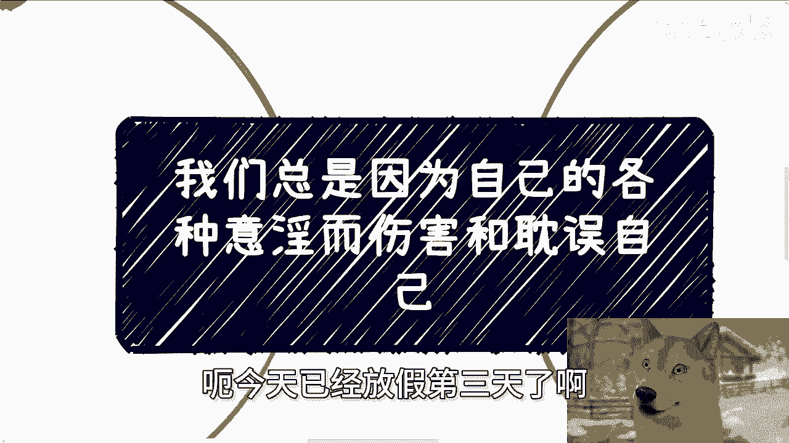
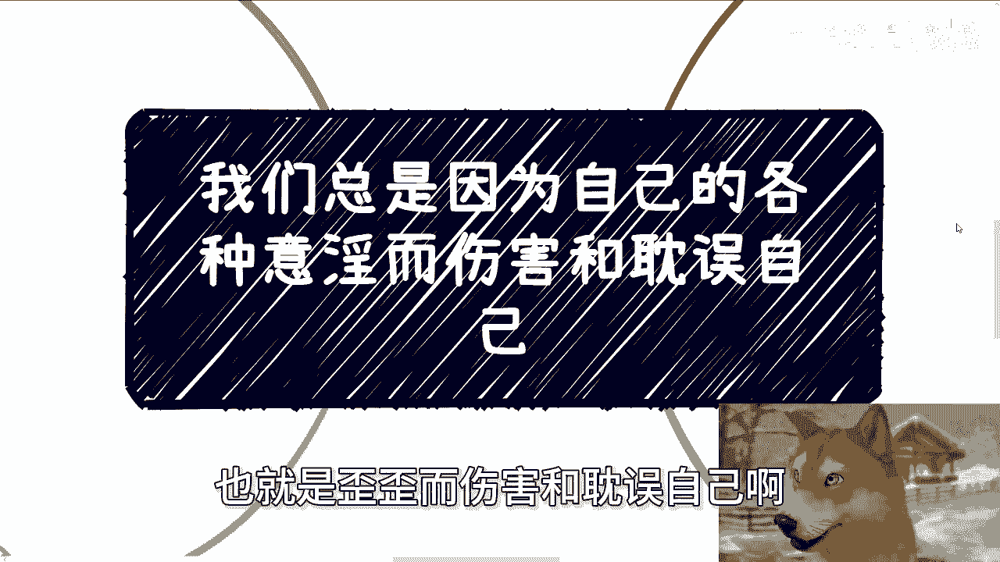
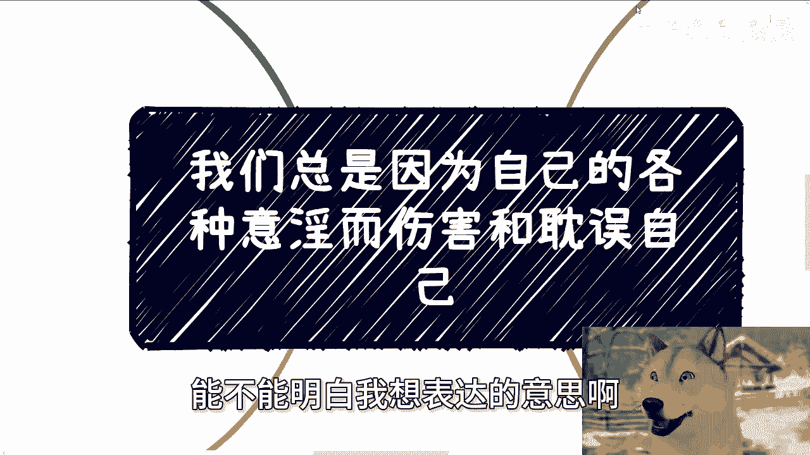
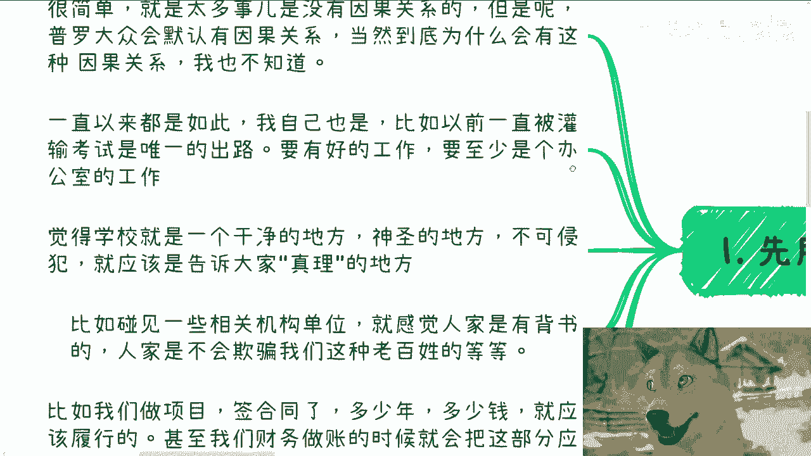
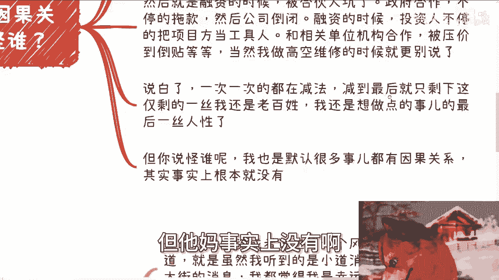
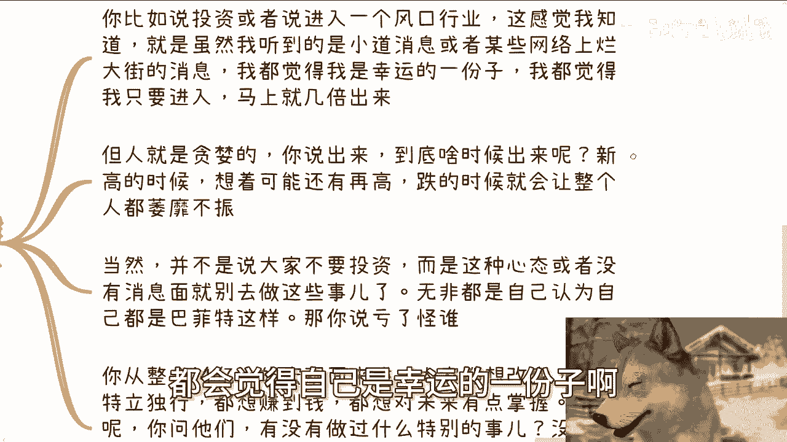
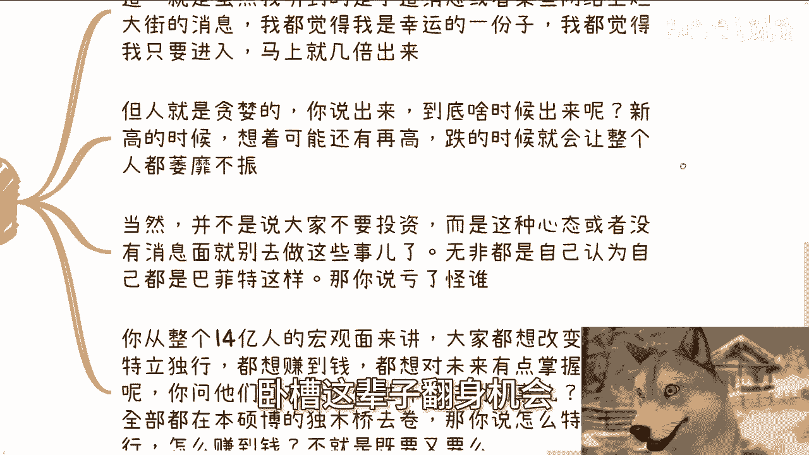
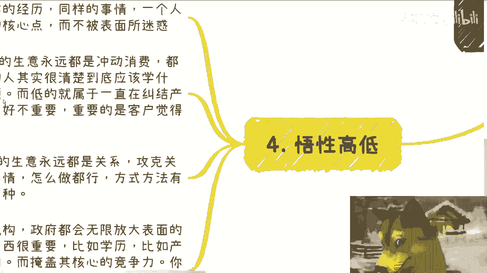
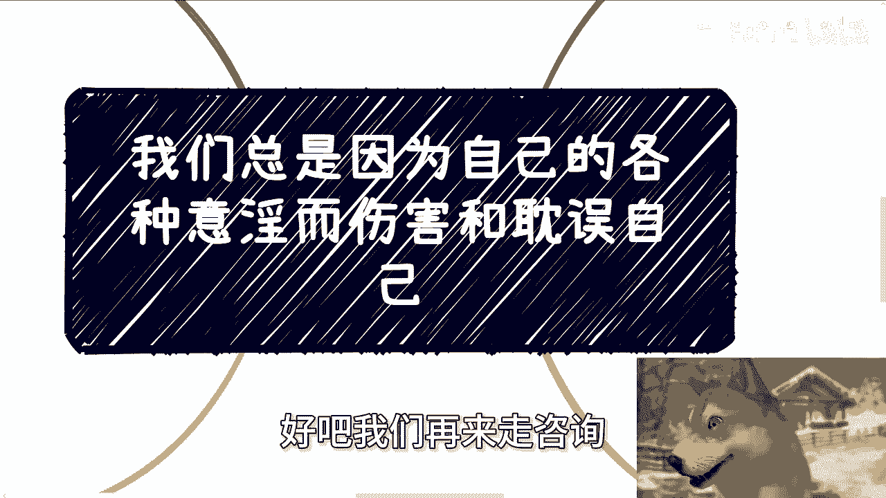

# 我们总是因为自己的各种意淫而伤害或者耽误自己---P1---赏味不足---BV1k1xXeVEb1_

在本节课中，我们将要学习一个普遍存在的思维误区：人们常常因为自己虚构的因果关系（即“意淫”或YY）而伤害或耽误自己。我们将通过具体例子，剖析这种思维模式的成因与危害，并学习如何避免它。

## 概述：什么是“意淫”？

首先，我们用大白话解释一下核心概念。太多事情本身没有因果关系，但普罗大众会默认它们存在。这种默认的、缺乏事实依据的因果联想，就是我们所说的“意淫”。

上一节我们介绍了“意淫”的基本概念，本节中我们来看看一个最典型的例子。

## 一、典型“意淫”：学历与成功的虚假链条

最大的一个“意淫”点就是学历。至今，大部分人会认为：**好学历 -> 好工作 -> 赚到钱**。

这个因果关系成立吗？**成立不了一点**。

一直以来，我自己也被灌输了许多类似的观念：
*   考试是唯一的出路。
*   要有好的工作，至少是坐办公室的工作。
*   学校是神圣的、传授真理的地方。
*   机关单位有背书，不会欺骗老百姓。
*   做项目签合同，约定多少年多少钱就应该履行。
*   财务做账时，会把一年后的应收款 `100万` 计入财务规划。

以上这些，都是我曾认为存在的因果关系。

## 二、因果关系的真相：信任的减法

然而，第二点需要明确：这一切大多没有因果关系，或者说本身就不存在严格的因果关系，都是我们自己意淫出来的。

如果我们因此吃了亏，能怪谁呢？我对人类社会的信任度是做减法的。我曾对所有人、所有机构抱有百分之百的信任，并以乐观为前提去判断事情。

以下是我亲身经历的一些让我做“信任减法”的例子：
*   融资时被合伙人坑害。
*   与政府合作时被长期欠款，导致公司倒闭。
*   融资时，投资人将项目方当作工具人。
*   与机关单位合作时被压价到倒贴成本。
*   从事高空维修行业时的种种经历。

这些事情多年来比比皆是。信任一次次做减法，减到最后可能所剩无几。年轻时我也默认很多事情有因果关系，但它们事实上没有。

## 三、普遍的认知偏差：风口与特殊性幻觉

第三点，其实大家走的路都差不多。例如，投资或进入一个风口行业时，虽然听到的都是小道消息，但都会觉得自己是幸运的一份子。

我们会认为：**我只要马上进入 -> 机会来了 -> 此生翻身在此一举**。

于是 all in，一把梭哈，期待马上获得数倍收益。但问题在于，人性贪婪，大家都一样。新高时期待更高，下跌时萎靡不振不愿退出。这并不是说不要投资，而是指出：在没有真正内部消息时，却抱着“韭菜”心态行动，还自认为是巴菲特，这能怪谁呢？

从宏观角度看，每一年都有18岁、22岁、30岁的人，都觉得自己处在特殊的时间关口。但你需要自问：**为什么特殊的是你，而不是所有人？** 如果对所有人都特殊，为何过去这么多年，大部分老百姓并未财务自由？

结论就是：你们所谓的风口和机会，很可能只是自己认为的而已。很多人都想改变、想特立独行、想赚钱，但问他们做过什么特殊的事？大部分仍在“本硕博”的独木桥上内卷。这谈不上特立独行，也谈不上把握机会。

## 四、悟性的关键：洞察核心矛盾

第四，关于悟性高低。悟性高低在于：经历同样的事情后，能否找到事件的核心矛盾点，而不被表面现象迷惑或执迷不悟。

例如，我告诉大家：**C端（消费者）生意永远是冲动消费**。因为消费者判断一个产品只有5-10秒，你根本无法详细说明产品好坏。因此，C端生意的核心就是：**包装 + 营销**。

悟性高的人清楚应该学什么、解决什么问题、力气往哪使。悟性低或自视甚高的人，则会一直纠结“产品要做好、服务要做好”。这重要吗？不重要，重要的是客户觉得好不好。所有成功的C端平台（如抖音、拼多多）都已证明，C端注意力分散，一切靠营销。

同理，**B端（企业）生意永远靠关系攻克**。关系是唯一要做的事，方式方法多样。但一个聪明的个人、媒体或机构，不会无限放大自己的核心竞争力（如关系），反而会无限放大表面的东西（如学历、产品、认知）来掩盖核心。因为暴露核心竞争力对自己并无好处。

如果社会宣传的都是真实的核心竞争力，那么回顾过去20年的发展历史，你会发现这与现实是相悖的。

## 总结与行动建议

本节课中我们一起学习了“意淫”思维如何让我们虚构不存在的因果关系，从而在学历、投资、创业等方面伤害和耽误自己。关键在于，不要用自己的意淫去判断事物。

如果你非要通过撞南墙才能明白某些因果关系不存在，那将浪费大量时间。就像一个博士生到30岁才明白，但已浪费青春且骑虎难下。

社会的许多规则其实是公开透明的，但大部分人视而不见，或被告知后仍不相信。

最后，在职业规划、商业规划、副业或创业方面，如果你有任何具体问题，或需要一些接地气的建议来少走弯路，可以整理好个人问题与背景进行沟通。