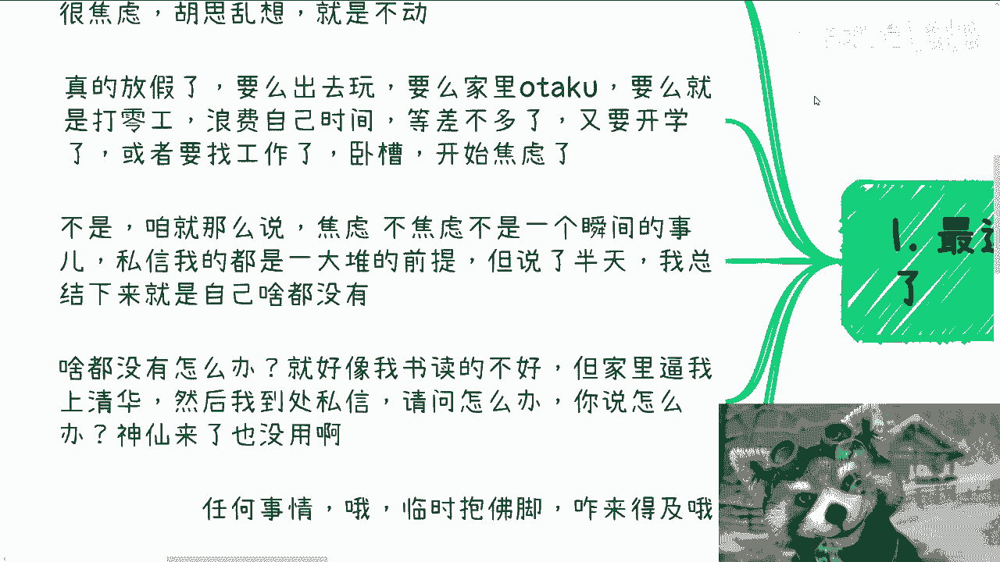
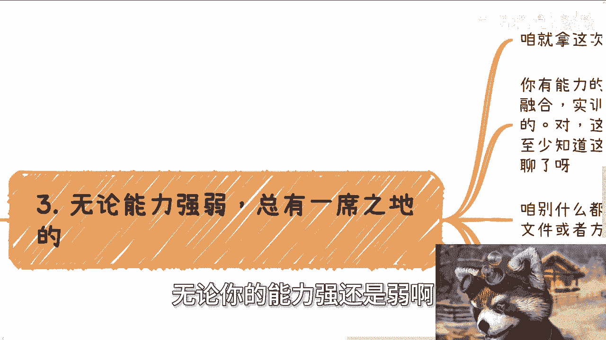
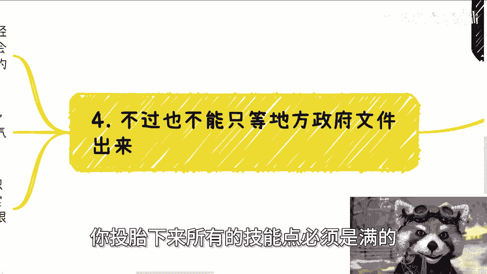

# 我们日常要学会看政策和积累关系，才有可能掌握先机 - P1 - 赏味不足 - BV16E421w7Mu

好大家好啊，呃今天这个视频呢，跟那个充电视频也是对应的啊，充电视频讲了8月3号新发的这个政策文件啊，那么今天我们来讲的呢，就是说呃关于这个看这个政策文件相关的一些，怎么说呢。

一种嗯看门卷的这种思维思维吧，啊呃主题就是我们日常学会看政策啊，积累关系，然后才有可能掌握先机啊，呃首先这个下一期活动已经定了，就本周日啊，本周日8月11号在长沙，那么大概主题的话呢，一个是围绕不同的。

比如说民企啊，呃呃国央企啊对吧，外企啊这种相对应的offer的选择，那另外一个呢，就是围绕自媒体跟跨境电商的这种选择，另外一个就是说啊，最后帮大家也展望一下这个未来发展吧，啊那么报名或者了解详情的呢。

你们可以私信我啊，那么首先第一个啊最近私信我的呃，就是问我怎么办的人啊。

开始哼变多了啊，呃为啥呢，因为秋招啊，因为秋招，那当然啊我跟你们讲，我从去年到现在我已经摸的很清楚了，就是读书或者上班的时候呢，大家很焦虑啊，胡思乱想啊，但是他妈的就是不动啊，就不实践，真的放假了呢。

要么出去玩，要么家里家家里面有他哭啊，要么就是打零工啊，就就很多人会跟我说啊，我们到什么麦当劳，到什么地方打个零工，卧槽真的我我有时候就每次我都跟他们说。

我说你们最宝贵的是时间，但你们把时间他妈浪费在这种哼，怎么说呢，就是说既学不到东西，又赚不到钱的东西上面有，那我就不太明白啊，那么额等差不多了啊，就差不多要开学了，或者要找工作了，卧槽他妈开始焦虑了啊。

我跟你们这么讲啊，咱就这么说啊，焦虑不焦虑，他不是一瞬间的事啊，当然对你们来讲，对大部分普通人来讲，他可能就是一瞬间的事，但是我们要明白，我们不要让它变成一瞬间的事，那因为你那一瞬间的事情没有用啊。

你解决不了问题啊对吧，你私信我都是一大堆前提，就我跟你们讲啊，他们写了一大堆前提，你说我回也好呢，回是回还是不回呢，我也不知道对吧，因为他们说的很大一堆堆起一一大堆前提啊，说了半天。

我总结下来就是他吧屁都没有对吧，那然后他总结下来这个问题是什么，就陈老师我屁都没有，我应该怎么办，哎屁都没有，我能怎么办呢，对不对，你就好像我跟你说，哎我读书读的不好，但家里面逼我上清华对吧。

我他妈马上就要高考了，但是我他妈考不进啊，然后我就到处私信问别人，我说他妈的我该怎么办，你说怎么办，他妈神仙来了都没用啊，对不对，就任何事情，尤其是这种社会上的。

就是我们活在这个世界里面，社会上的这种事情，你临时抱佛脚来不及的啊，第二结合今天充电视频的这个政策来说啊，核心记住几点，第一呢政策永远是宏观的，你要看完了，就是或者来说你指望看完了知道怎么做。

那可能他妈不是你牛逼，是中央的人牛逼，为什么，因为他妈的他竟然可以有一个通用的内容，涵盖所有的省市区以及所有的行业，他妈可能吗，你觉得对不对啊。

第二政策是战略方向，但是战术落地时候，每个地方落地都是不一样的，而且每个落地地方的细节也会很多，我们作为一个个体，或者作为一个小老百姓，我们要做的呃，我们要的不就是前瞻方向嘛，对不对。

那么你说前瞻方向是什么，这就是前瞻方向，那么各地方怎么落，我给你们讲细节来讲，就看两个东西，一个是各地方的政策，比如说这次我们在充电视频里面也说了嘛，写的里面有夯实人才培养对吧，包括养老，包括旅游对吧。

好那么这些地这些地方会出地方的政策啊，包括你比如说各个城市啊，各个省市区啊，都会有地方的政策，那么到时候我们再来看啊，那么另外一方面呢，就是我们这个需要平时多去积累一些，政府相关的这个从业人员的资源啊。

不管咱先不说他他是做什么的，无所谓啊，还没关系啊，那么呃你像现在比如说8月3号，就我这次充电视频说的这个政策嘛对吧，你比如说8月3号啊，这个这个政策出来，那你就可以开始出来聊了呀，就开始准备了呀。

我的政政策出来，你你现在不准备什么时候准备啊，等到明年上半年下半年又来跟我抱怨爱车20，这他妈的哎我们怎么不知道应该什么时候，我们我们去年哎呀，太那个没有前瞻性，不知道去签，那政策出来。

你还不签吗，对不对啊，那么第三无论你的能力强还是弱啊。

你不用担心总有一席之地的，为什么，咱就拿这次8月3号这个政策里面提到的教培。

还有养老来讲，你有能力的，那你就做这些文件里面所提到的校企合作，产教融合实训基地实验室，这不是我说的啊，对这些词你本身可能就还不知道怎么做，对不对，好但是你至少知得知道这些切入点啊，对不对。

那你就拿这个东西，拿着这些东西跟学校人去谈啊，你甭管是找学这个老师，找里面的这个这个就业办对吧，还还找什么东西无所谓啊，你想想昨天我还在跟你们提对吧，继续教育学院对吧，MMBAMEM都可以谈啊。

有什么不能谈呢，对不对啊，咱别的比如说咱啊，咱别什么都觉得，就是说能有什么细节的文件或方向，有细节跟文件跟方向，他妈的轮得到你们去做了，哎呀妈搞笑嘞，对不对，包括就是说旧的场地的再利用啊。

包括护工的培养啊，老人的保险啊对吧，这些都是切入点啊，你要有能力就去做上下游的服务啊，对不对，或者你就找一个当地的要做，你随便在里面切一个小的点也可以啊对吧，那如果你能力不行，再不济。

你可以做C端的生意啊，比如说养老护工的培训可以做吧，对不对，那你你可能不能跟学校合作，那你可以卖卖课吧对吧，你卖点课总行吧，卖卖软件总行吧，做个兼职销售总可以吧，怎么不能做呢，我就这么问啊。

你你你说你跟学校合作有门槛好，我认了啊，你说你跟这个这个政策啊，你跟这个政政府相关人去合作有门槛好，我也认了对吧，那的给C端卖卖课，卖卖软件，做个兼职的销售，你告诉我有什么门槛啊。

你告诉我有什么门槛，如果你跟我讲，艾川老师是因为我的性格原因或者怎么样子。

那他妈的你我只能这么说，那你你的意思就是说你投胎下来。

所有的技能点必须是满的，六边形战士，你才可以去做妈的，作为大家都作为一个普通人，谁没有一点缺点啊，对不对，嗯不嗯，那不多说啊，第四额，不过啊。

也不能说只等地方政策文件出来，这也是我为什么说日常要去勾搭关系，因为按照历史的经验，这种东西呢你就这么想啊，一个文件它不是今天晚上炒你完了啊，然后什么啊，明天审核，后天就发布，政府不是这样做事情的。

你一个文件草拟讨论到各方面，风吹风吹草动，这他妈当中时间长了，你像我们以前写个标准，他花了一年半两年啦，对不对，那么也就是说草拟的时候就有人会知道信息，或者说对应的这个口子，比如说文旅啊。

或者说这个这个这个这个交通啊对吧，智慧是城市啊对吧，这个口子多多少少总有认识的人吧，你不认识不代表别人不认识啊对吧，那么也就是说多多少少总有认识的人，或者认识的团队可以做，那么那么什么意思呢。

意思就是说你真的通过官方的渠道，看到文件出来了，你再去申报，怎么说呢，你可以你可以这么去申报，但是你说有没有概率能申报成功，有但这概率多高，你自己想想看，对不对啊，所以这事儿我一直说你说难的地方难有吗。

有的就是在于日常的沟通跟关系积累，你说简单吧，也简单的，因为你们仔细自己去看看地方政策，因为真的到了地方政策上面，所有的申报条件，12345678写的很清楚哦，就是你就照着他去做，就这简单明了啊。

你明白吗，就是你要去问政府要这个钱，大几百万是男的，但是小几10万我我真的我咱不夸张的说。

小几10万是容易的，真的是容易的，你们大部分人就是没做过，而且你们会觉得卧槽这种东西老百姓做不了，有什么做不了的，莫要搞笑嘞，对不对，你们我我就这么说，大部分人没见过大钱，就觉得好像小几10万。

大几10万很牛逼了，但是你们你们要明白，我的，一个省一个市一个地方，你单纯的一个人才培养，你就拿前两年，就是现在因为经济不好嘛，我们就拿经济好的时候，一年的人才培养一个单纯一个产业园。

他的补贴就可以上百万。

这算什么呢，对不对啊，行好吧，我就能讲就讲这么多了啊，那个活动在8月11号长沙好，长沙有时间的，有兴趣的啊，继续找我报名，剩下的话就是说你们自己工作，或者还是说这个呃跟别人合作呃。

做一些副业或者做什么的，在这过程当中涉及到合同啊，涉及到就是什么分红分润，涉及到一些合同额。

那个商业计划书啊，股权啊，期权啊对吧，那么你们希望通过我的一些视野，通过我的一些认知，结合你们个人的一些背景跟情况，能够给你们一些更接地气的啊，这个建议或者规划的话，那么你们可以整理好对应的这个呃。

个人问题跟个人背景好吧。