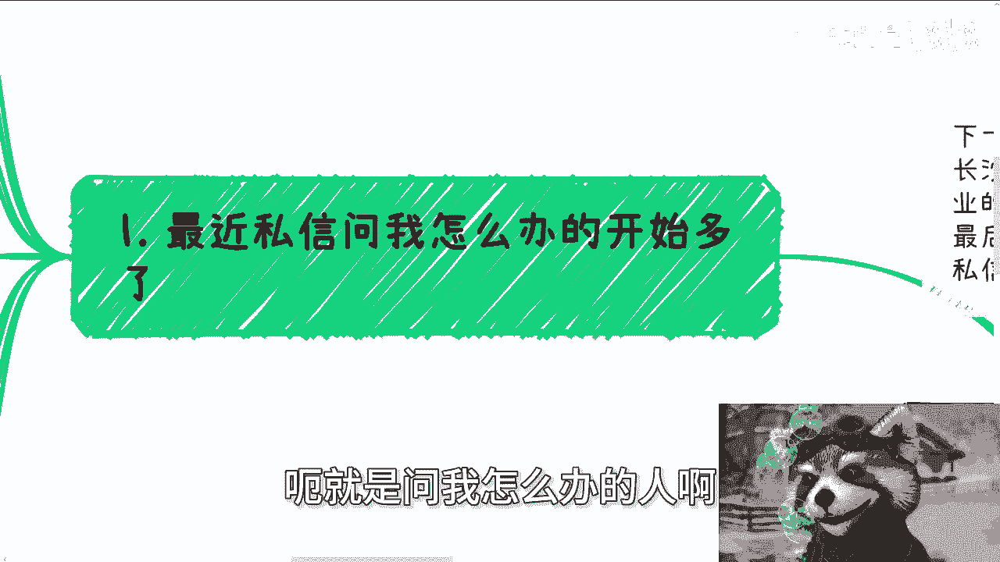
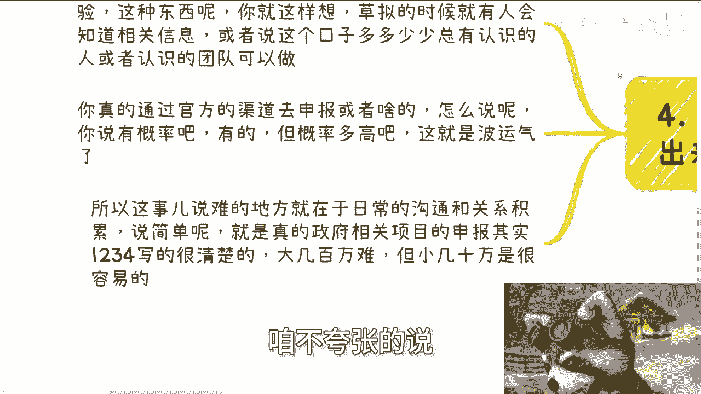
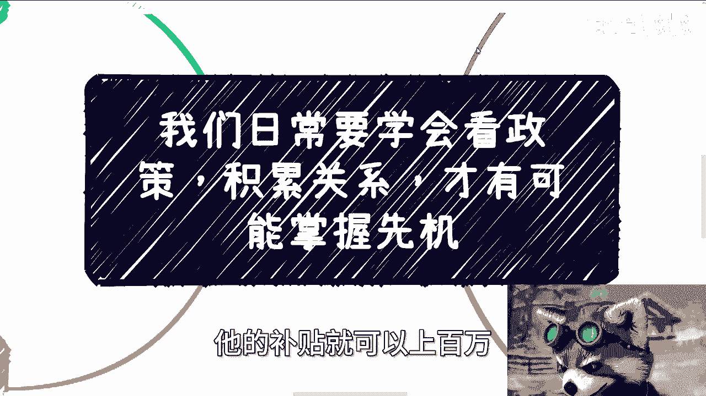
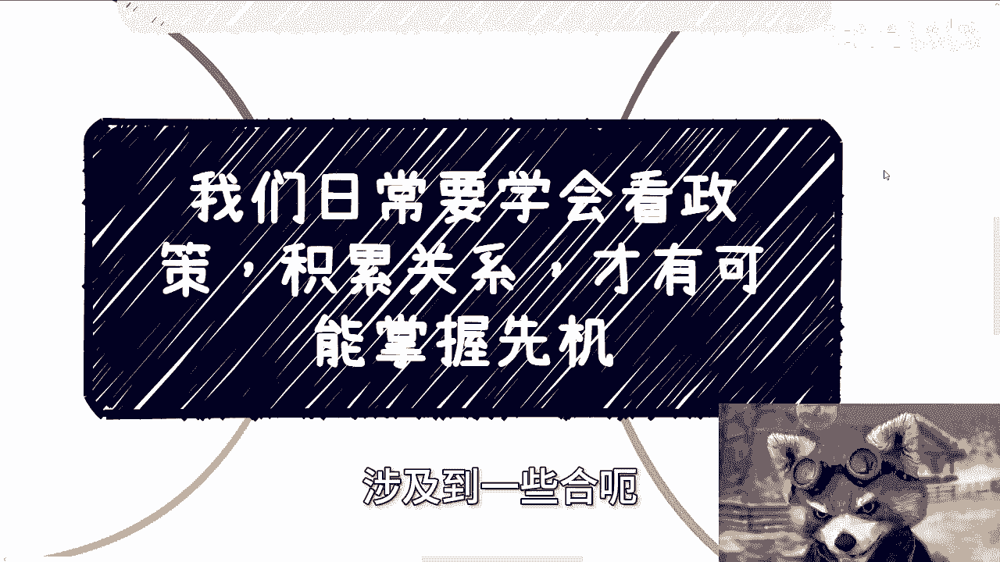

# 课程01：掌握先机——学会解读政策与积累关系 📚

在本节课中，我们将学习如何通过解读国家政策和积累人脉关系来把握个人发展机遇。课程将拆解政策的核心特点，并提供可操作的行动思路。

---

## 概述

本节内容对应充电视频中提到的8月3日新政策文件。我们将探讨解读政策文件所需的一种“看门道”的思维方式。核心主题是：日常学会看政策、积累关系，才有可能掌握先机。

下一期线下活动已定于本周日（8月11日）在长沙举行。活动主题将围绕不同类型企业（民企、国央企、外企）的offer选择、自媒体与跨境电商的路径选择，以及对未来发展的展望。如需报名或了解详情，可私信联系。

---

## 为何临时抱佛脚无效

最近，因秋招临近，咨询“该怎么办”的私信开始变多。

一个普遍现象是：人们在读书或上班时常常焦虑、胡思乱想，但缺乏实际行动。真正到了假期，要么出去玩，要么忙于家事或打零工。许多人将宝贵的时间浪费在既学不到东西、又赚不到钱的琐事上。等到临近开学或求职时，焦虑感才瞬间爆发。

然而，焦虑并非一瞬间产生的问题。对大多数人而言，它可能表现为瞬间的恐慌，但这种瞬间的情绪无法解决问题。私信中常有一大堆前提描述，但总结下来核心问题是：“我什么都没有，该怎么办？” 这就像在高考前才意识到成绩不佳，却指望能上清华一样，临时抱佛脚是来不及的。

社会中的机遇，尤其需要长期准备。

---

## 理解政策的三个核心要点

结合充电视频中讨论的政策，我们需要记住以下几点。

### 1. 政策具有宏观性

政策永远是宏观的。指望读完一份政策文件就知道具体怎么做，那几乎不可能。因为一份政策需要涵盖所有省市区及行业，不可能存在一个放之四海而皆准的通用细则。

**核心公式：**  
`政策 ≈ 宏观战略指导`

### 2. 政策落地存在差异

政策指明了战略方向，但战术落地时，每个地方的具体执行方式都不同，且细节繁多。作为个体或普通百姓，我们需要的是**前瞻方向**。政策本身提供的就是这种方向。

具体落地细节需关注两方面：
*   **地方政策**：例如，充电视频中提到的“夯实人才培养”、“养老”、“旅游”等领域，各省市会出台相应的配套政策。
*   **人脉资源**：需要平时积累与政府相关部门从业人员的联系与资源。

以8月3日的新政策为例，政策发布之时就是开始准备和行动之时。如果等到明年再抱怨“没有前瞻性，不知道何时行动”，则为时已晚。

### 3. 能力不论强弱，皆有切入点

无论个人能力强弱，在政策导向的领域中总能找到一席之地。

以8月3日政策中提到的“教培”和“养老”为例：

*   **对于能力较强者**：可以瞄准文件中提到的“校企合作”、“产教融合实训基地”、“实验室”等方向。即使不清楚具体操作，也应先了解这些切入点，并以此为基础与学校（如老师、就业办、继续教育学院等）进行洽谈。
*   **对于能力一般者**：可以关注更具体的点，如“旧场地再利用”、“护工培养”、“老人保险”等，提供上下游服务或切入一个小点。
*   **对于能力不足者**：完全可以从事面向消费者（C端）的生意。例如，开展养老护工培训、售卖相关课程或软件、担任兼职销售等。这些方向门槛相对较低。

如果以“性格原因”等为由认为自己无法从事这些工作，那无异于要求自己必须是“六边形战士”才能起步。作为普通人，每个人都有缺点，关键在于行动。

---

## 行动的关键：日常积累而非被动等待

不能只等待地方政策文件正式发布。历史经验表明，一份文件从草拟、讨论到发布，周期可能很长（例如，制定一个标准可能耗时一年半到两年）。

这意味着，在文件草拟阶段，相关领域（如文旅、交通、智慧城市）就可能已有风声或知情人士。如果你真的等到官方文件发布后才去申报，虽然仍有成功可能，但概率较低。

因此，难点在于**日常的沟通与人脉积累**。但这件事也有简单的一面：地方政策文件通常会将申报条件（1、2、3、4…）写得非常清楚，只需按图索骥即可。

向政府申请大几百万的资金固然困难，但申请小几十万的补贴**相对容易**。许多人因未曾尝试，便觉得“老百姓做不了”。事实上，在经济状况较好时，一个地方产业园单纯在“人才培养”一项上的年补贴就可能达到上百万。

---

## 总结

本节课我们一起学习了如何通过解读政策和积累关系来把握先机。我们明确了政策的宏观性和落地差异性，并探讨了不同能力水平下的具体行动切入点。关键在于，不能临时抱佛脚，而需在日常中主动积累人脉、关注风向，并在机会出现时果断行动。

对于在个人工作、合作副业中涉及合同、分红、商业计划书、股权期权等问题，并希望获得更接地气的建议或规划的朋友，可以整理好个人背景与具体问题，进行进一步咨询。

---
**课程结束**