# 我们是需要有责任心的-但千万别越界---P1---赏味不足---BV18142127vk

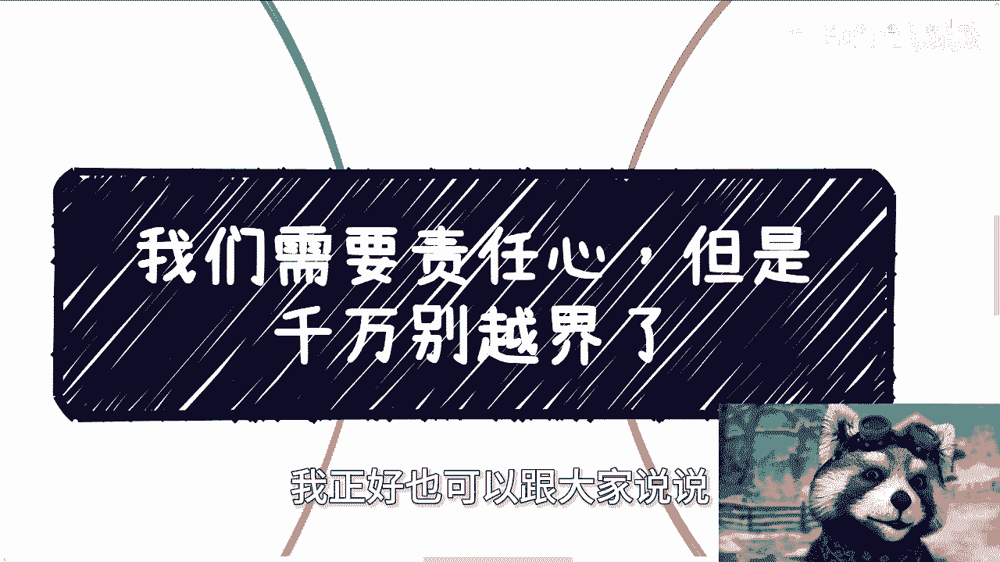

在本节课中，我们将探讨一个在职场和合作中至关重要的主题：**责任心**。我们将通过具体案例，分析什么是恰当的责任心，以及如何避免责任心“越界”带来的负面影响。理解并把握责任的边界，是保护自己、高效合作和健康发展的关键。

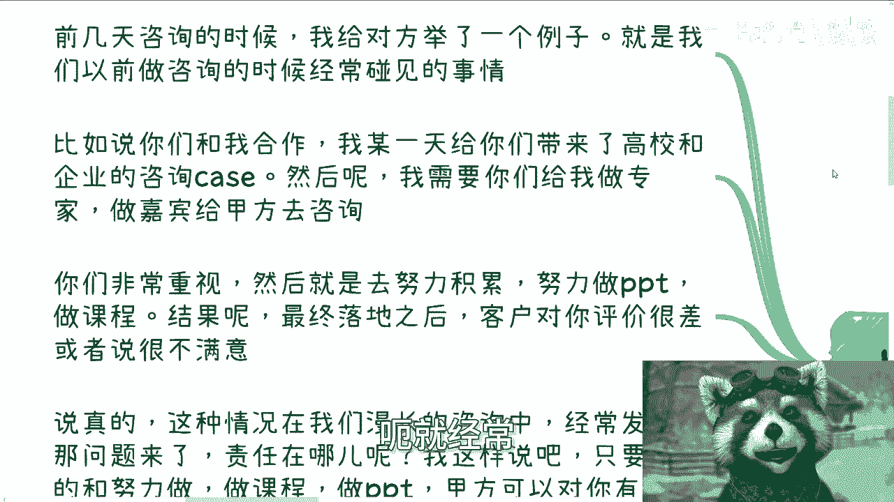

---

## 案例分析：南辕北辙的咨询项目

上一节我们介绍了课程主题，本节中我们来看看一个具体的案例。这个案例来自一次真实的咨询经历，清晰地展示了责任归属的问题。

假设我作为中间人，为一家企业（甲方）和一位专家（乙方）牵线合作。我的职责是准确传达甲方的需求给乙方。乙方非常重视，努力准备了详尽的课程和PPT。然而，项目最终落地时，甲方对乙方的评价却很差。

在这种情况下，一个有责任心的乙方通常会首先反思自己的问题：是不是PPT做得不好？是不是经验尚浅？

但事实是，如果乙方确实努力准备了内容，甲方即便有改进意见，也**绝不可能给出“差评”或劈头盖脸的指责**。唯一的可能性是：**我在中间沟通时，错误地传达了甲方的需求**，导致乙方准备的内容与甲方的期望南辕北辙。

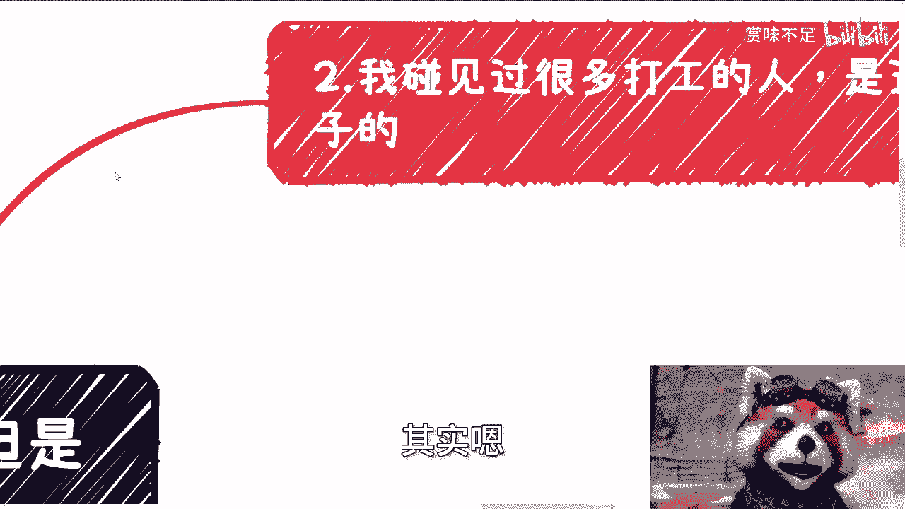

核心问题在于：即使乙方从道理上明白问题出在沟通环节（即我的失误），内心仍会感到愧疚，将大部分责任归咎于自己。这就是典型的**责任心越界**。

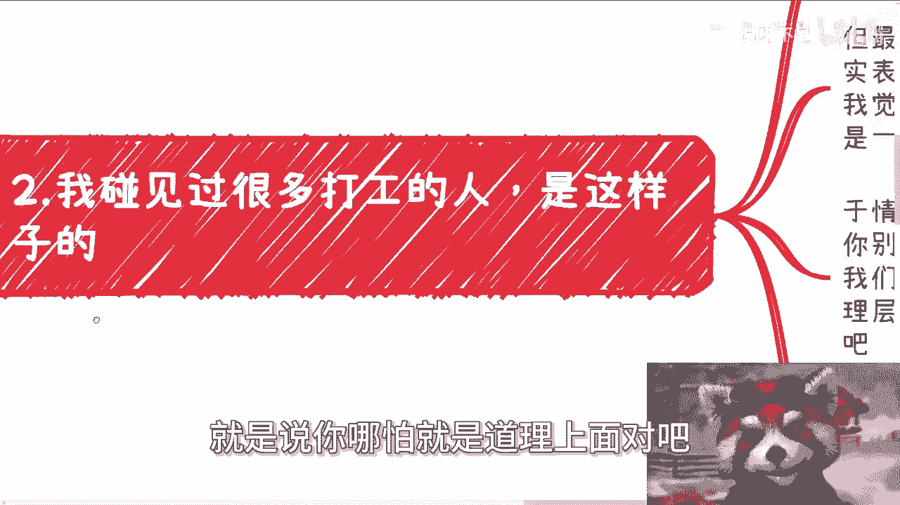

> **责任边界公式**：`你的责任范围 = 你直接可控的工作产出 + 你被明确授权的决策`。超出此范围的后果，不应由你主要承担。

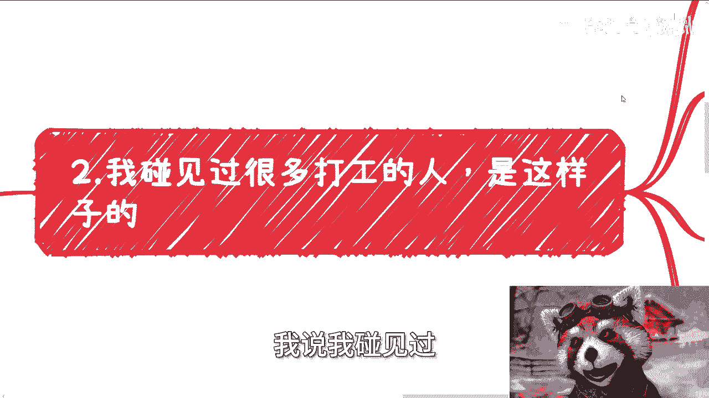

---

## 职场中的“背锅”现象

理解了责任错位的案例后，我们来看看职场中更普遍的责任心越界现象，即“背锅”。

以下是许多打工人的常见状态：

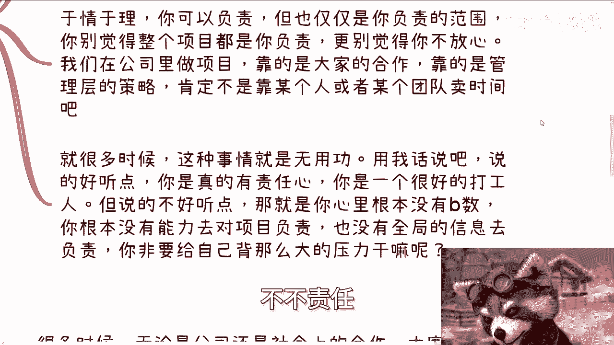

*   **现象**：长期加班，身心俱疲，感到抑郁。
*   **矛盾心态**：抱怨工作强度大的同时，却认为“我应该对项目负责”、“我对项目不放心，总觉得哪里会出问题”。

我们需要理性分析这种心态：

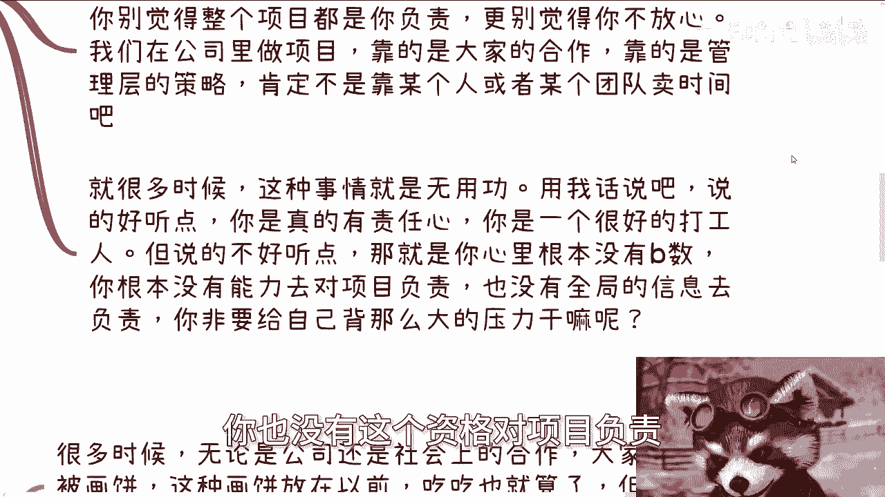

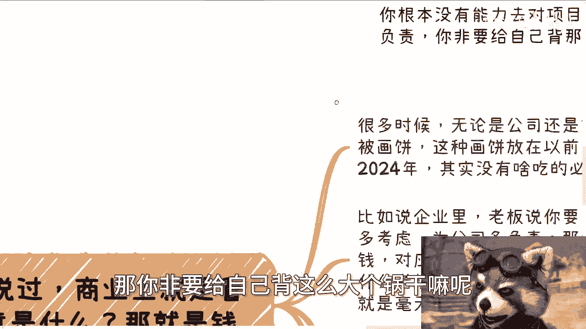

1.  **于情于理，你只能负责你的职责范围**。你不是项目经理，不是决策者，更不是公司股东。
2.  **项目的成功依赖体系，而非个人**。公司项目的成功依靠的是团队合作、管理层的策略和正确的决策，绝非靠某个人或某个团队无限度地“卖时间”。
3.  **缺乏全局信息，却背负全局责任**。如果你对项目的全局信息缺乏了解，却要为自己无法控制的部分负责，这既不合理，也无必要。

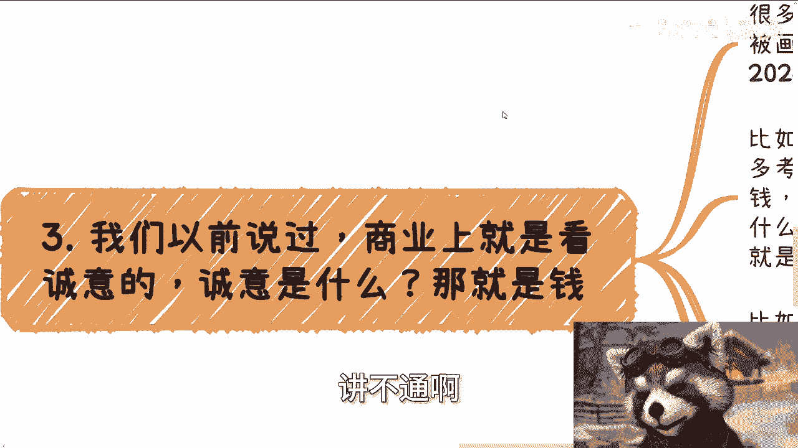

这种越界的责任心，说得委婉是“有担当的好员工”，说得直接些，就是对自己能力的边界“心里没有数”，主动背上了一个不属于自己的、也背不起的“锅”。

---

## 商业世界的诚意：超越语言

在讨论了个人心态后，我们需要将视角转向外部环境。商业合作中，如何判断对方的诚意，从而决定自己投入多少“责任心”？

一个核心原则是：**商业上的诚意，首要体现是实际的利益，尤其是金钱**。空头承诺和“画饼”在2024年已经越来越没有市场。

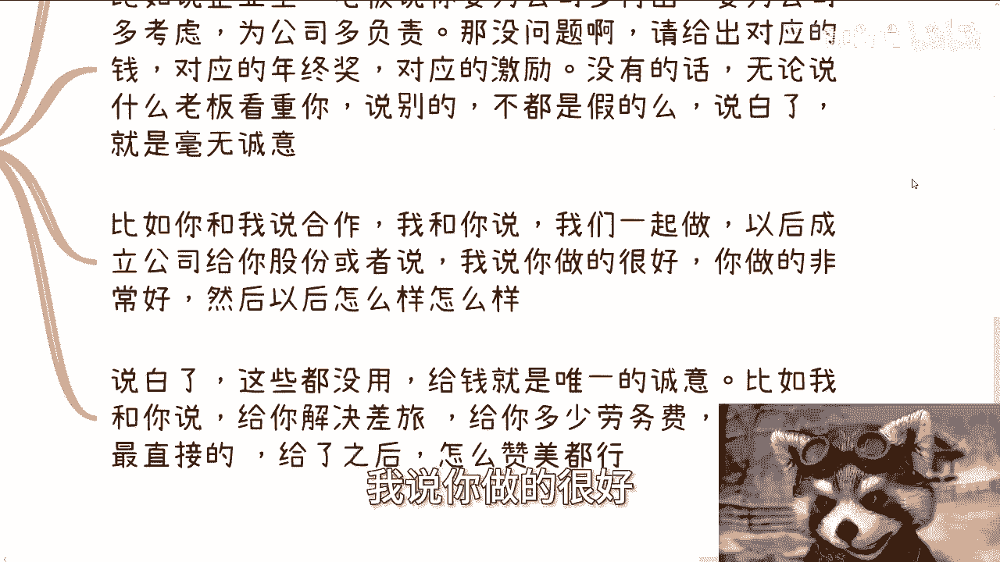

以下是判断诚意的简单方法：

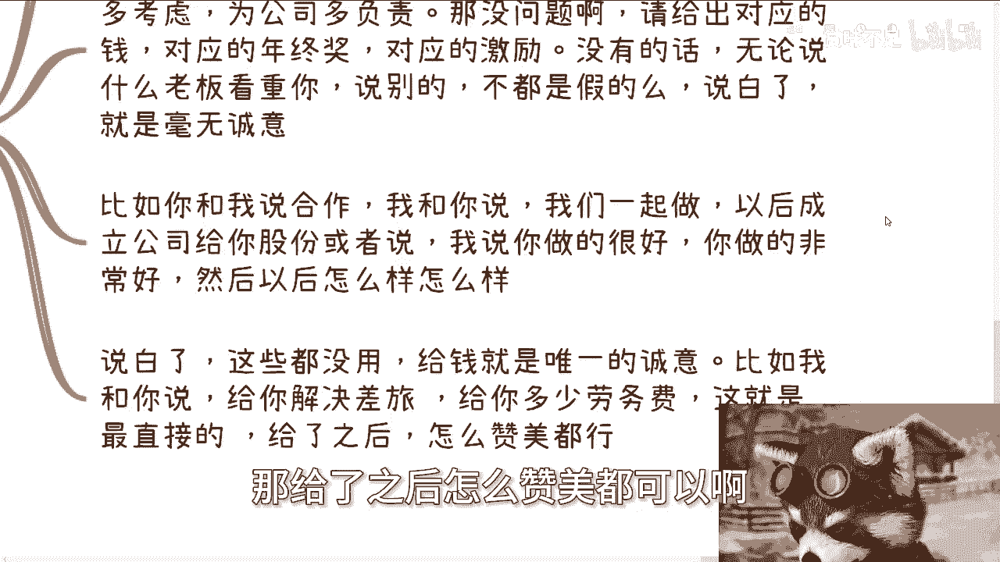

*   **老板/合作方说**：“公司很看重你”、“未来给你股份”、“这个项目成了大家都有好处”。
*   **你的判断标准**：这些话语本身没有问题，但它们是**权利**，而非**诚意**。诚意需要当下或短期内可兑现的**价值**来证明。
*   **诚意公式**：`诚意 = 当下或近期可兑现的价值（如：加薪、奖金、预付劳务费、明确的分成比例）`。没有这个等式的右边，左边的一切话语都可能毫无意义。

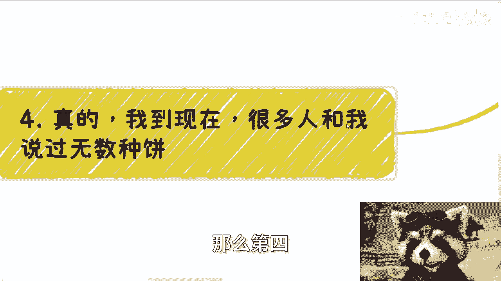

这就好比一个人不断说欣赏你、喜欢你，却连一顿像样的饭都不愿意请你，其诚意自然存疑。在商业中，**给予实际的报酬是最直接的诚意**，在此基础上的赞美才是锦上添花；反之，任何赞美都可能只是低成本的管理话术。

---

## 如何避免被“画饼”？

面对各种来源的“饼”（导师、老板、朋友甚至家人），最有效的自我保护策略是 **“一刀切”原则**：在见到实质诚意前，默认所有“饼”都不存在。

为什么要采取如此绝对的策略？

*   **逻辑反推**：如果对方所谓的“未来利益”是真实可靠的，那么他**现在**就有能力且愿意给出部分诚意作为“定金”。如果连这一点都做不到，那未来的承诺大概率是“纯扯淡”。
*   **警惕复杂套路**：例如“期权”和“代持股份”。许多期权协议设计复杂、兑现条件苛刻，本质是留住员工的工具而非真实激励；“代持”则意味着你的权益不在明面上，缺乏法律保障，这本身就体现了对方的不信任。
*   **心态调整**：不要抱有“有总比没有好”的心态去额外卖命。正确的理解是：“有”也就那么回事，不必当真；“没有”则拉倒，绝不因此投入超额、无回报的精力。你的额外付出，很可能只是在被“白嫖”。

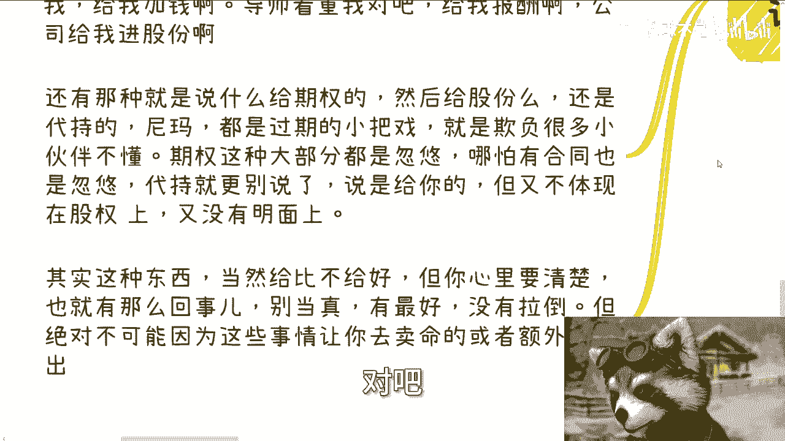

有时候，老板之所以特别“表扬”你，可能正是因为你“足够容易被PUA（精神操控）”，而其他人则不易被影响。认清这一点，有助于你摆脱过度责任感的束缚。

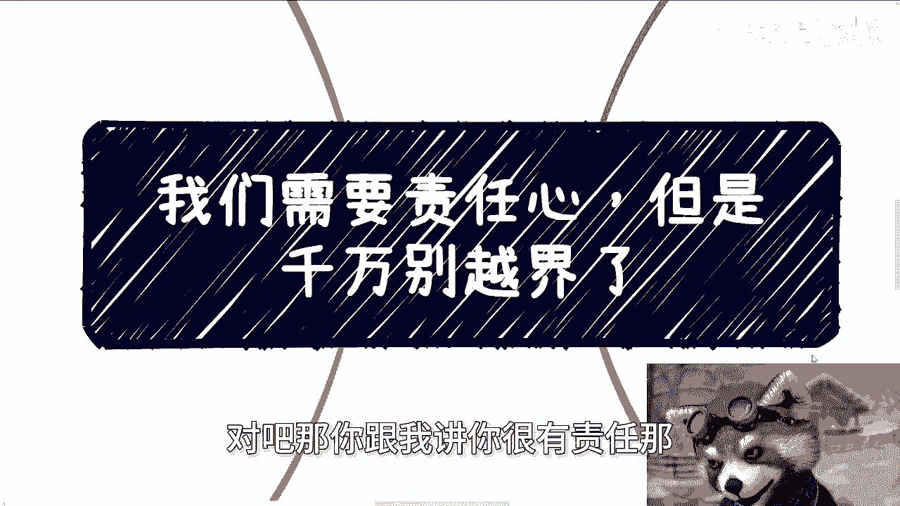

---

## 总结与行动指南

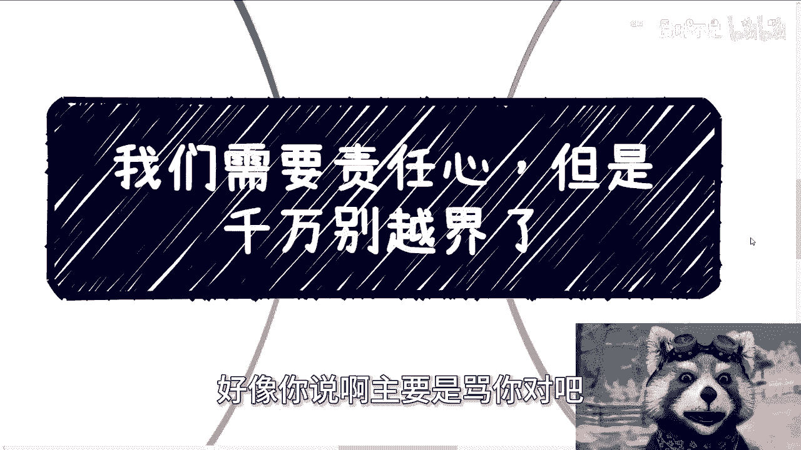

本节课中我们一起学习了“责任心”与“边界感”的平衡艺术。

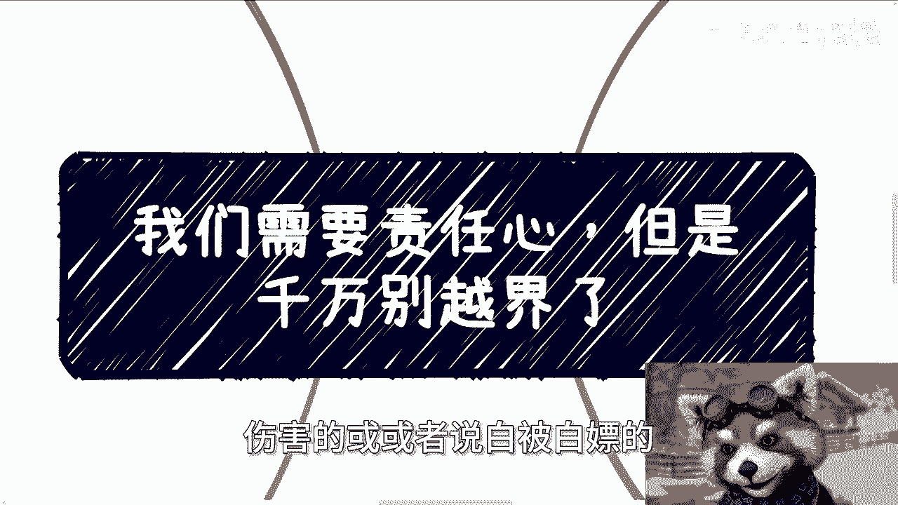

**核心要点总结**：
1.  **明确责任边界**：只为你直接可控和授权范围内的工作结果负责。不要为沟通失误、他人决策或全局性问题背负主要责任。
2.  **认清体系力量**：职场成功靠系统协作，而非个人英雄主义式的“卖时间”。不要错把团队责任当成个人使命。
3.  **用金钱衡量诚意**：在商业合作与职场晋升中，将对方当下愿意支付的**实际价值**作为判断其诚意的首要标准。对未来的空口承诺保持警惕。
4.  **拒绝情感绑架**：对所有的“画饼”行为采取“一刀切”的谨慎态度。保护自己的时间和精力，避免被“白嫖”。

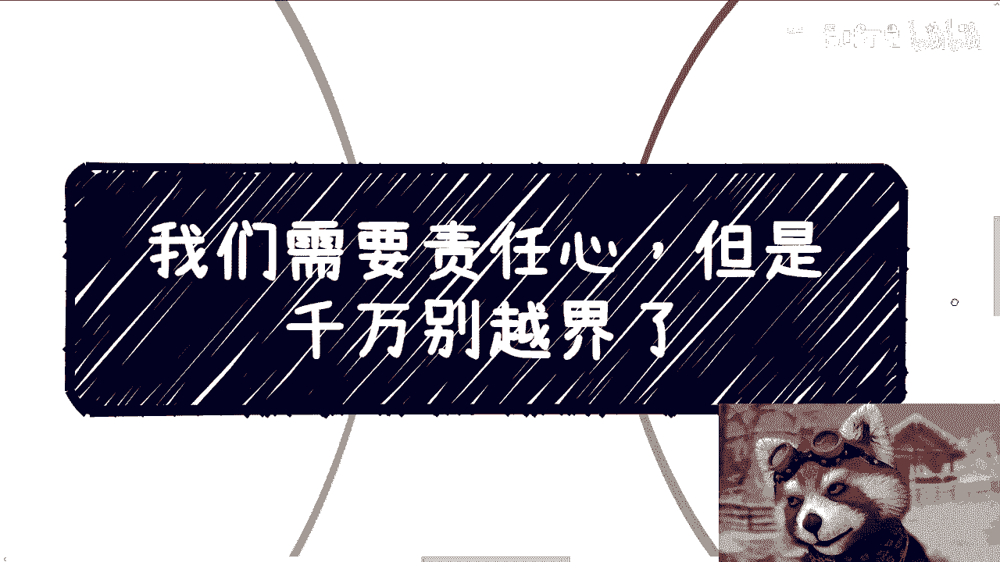

**行动指南**：当你感到压力巨大、身心俱疲，并伴有强烈的“我必须负责”的愧疚感时，请停下来问自己三个问题：
*   这个问题是我职责范围内**直接造成**的吗？
*   我有权力和资源去**解决**这个问题吗？
*   我为解决这个问题付出的额外努力，有**明确的、对等的回报**吗？

如果答案多为“否”，那么你可能正在经历责任心越界。适时后退一步，厘清边界，才是对自己真正的负责。

---

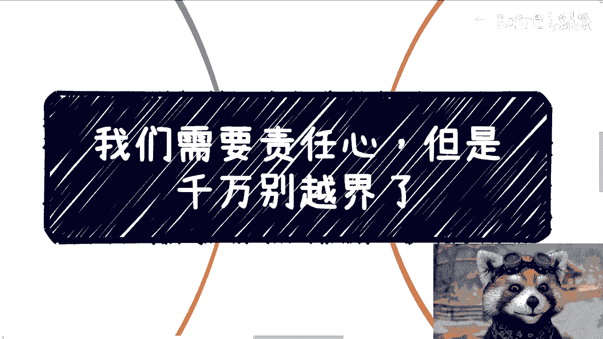

**注**：关于职业规划、商业合作、股权设计等具体问题，需要结合个人背景与当前社会经济状况进行个案分析。任何寻求“手把手教学”或要求他人为所有选择承担最终责任的想法，都是不切实际且不利于自身成长的。