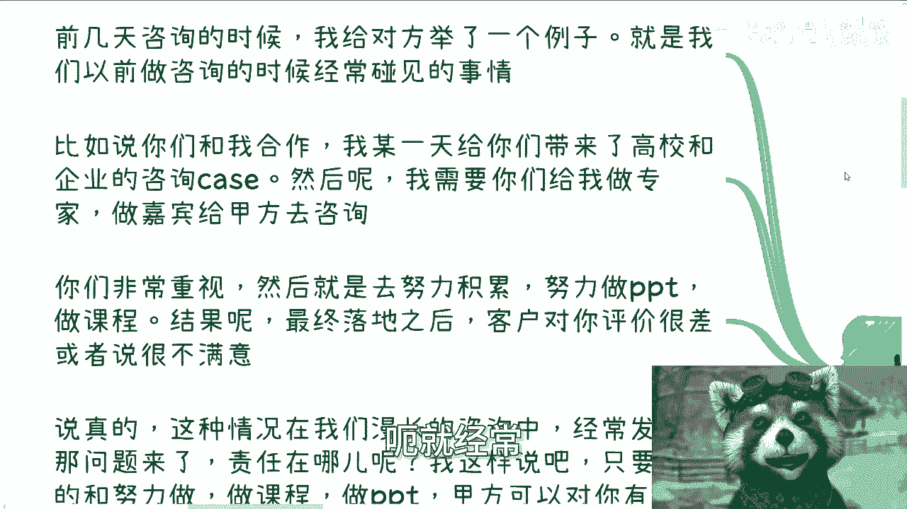
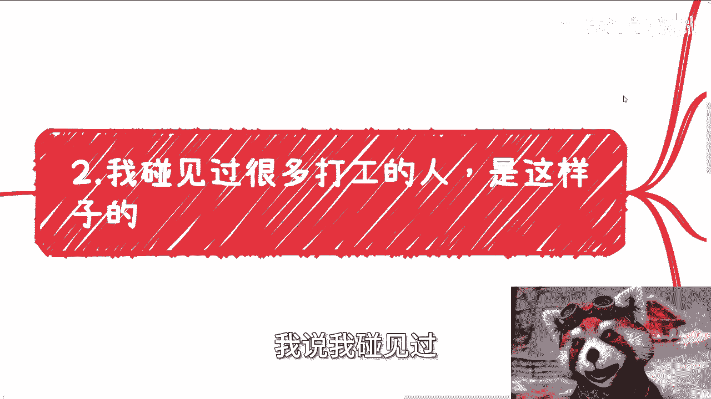
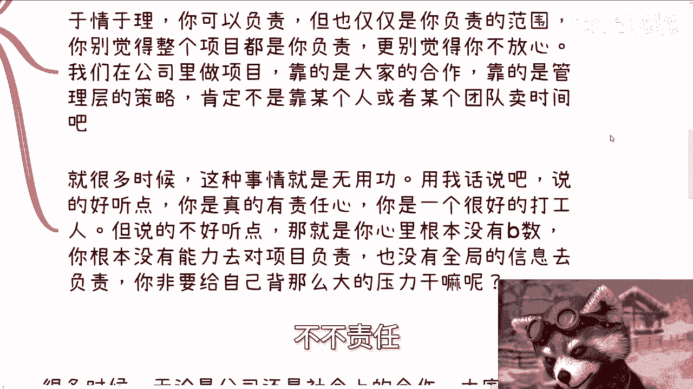
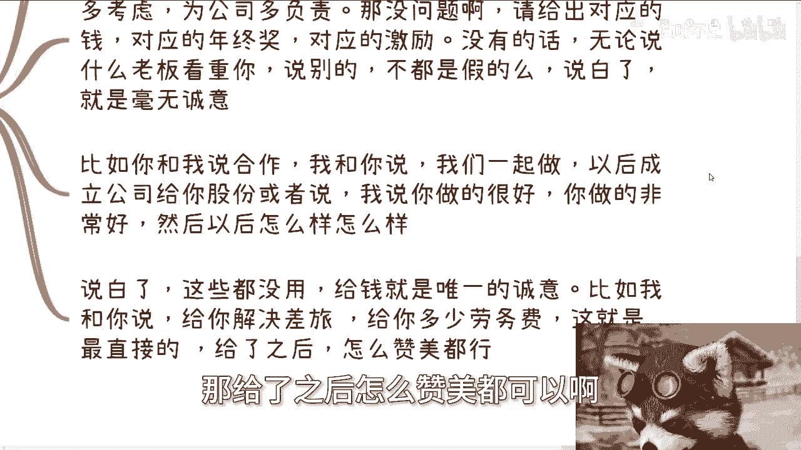
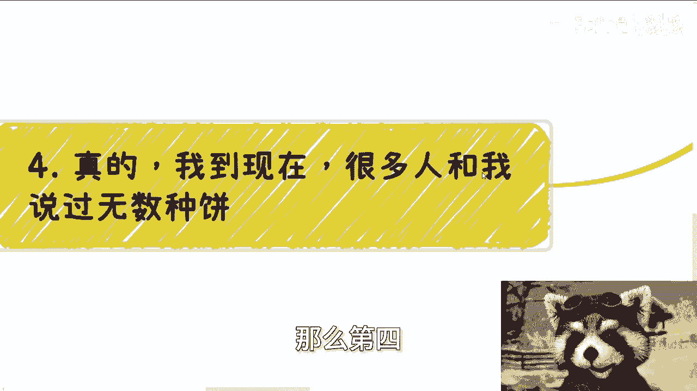
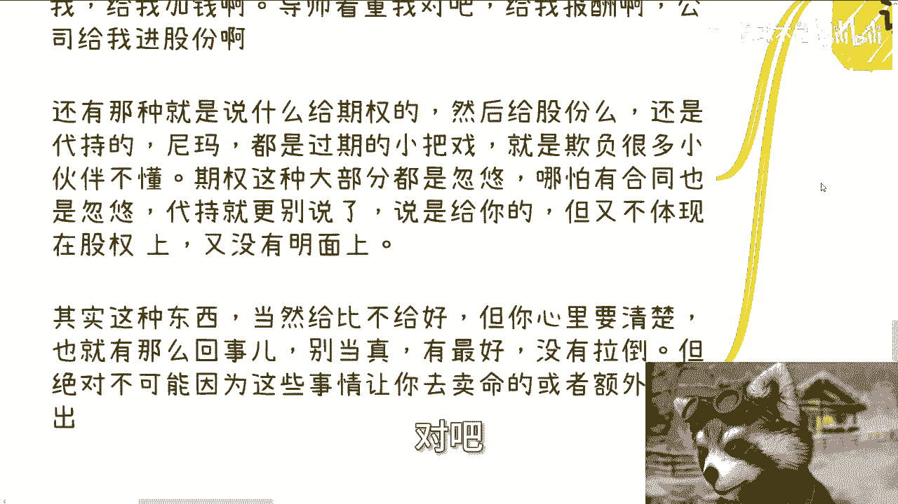
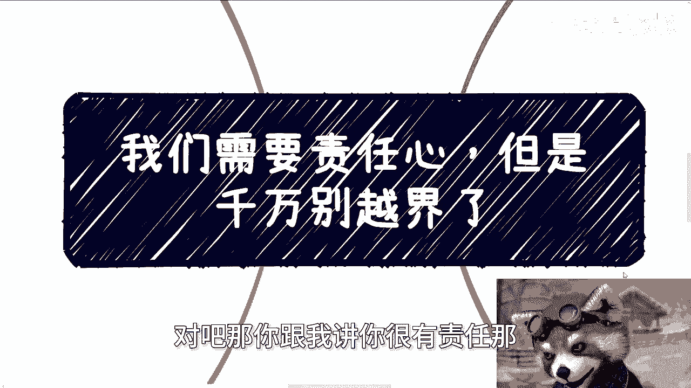
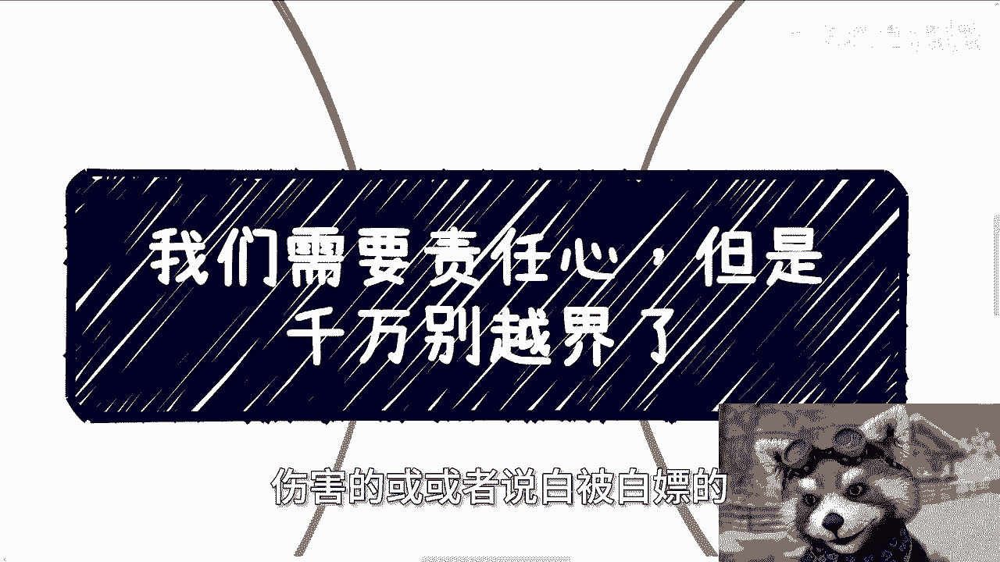
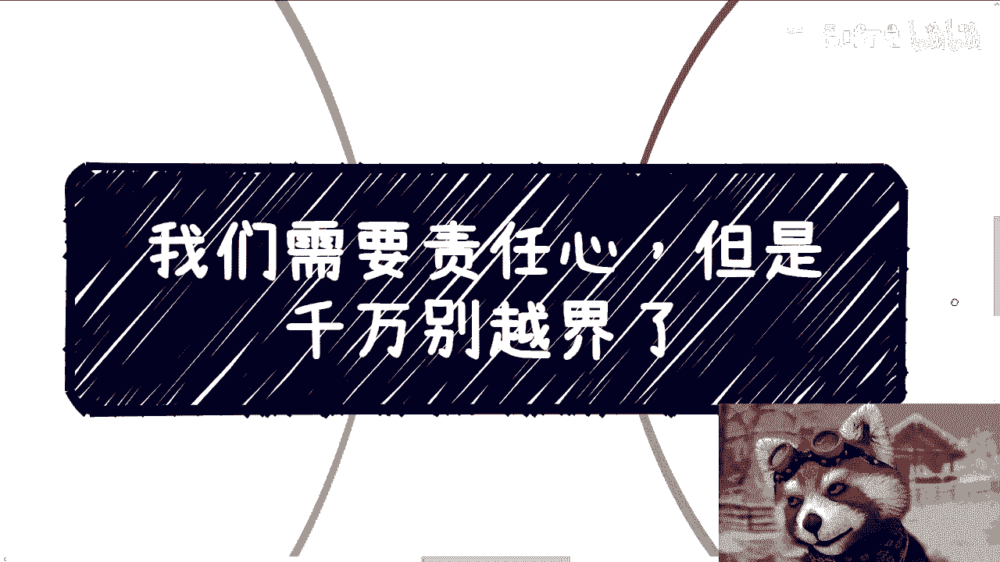
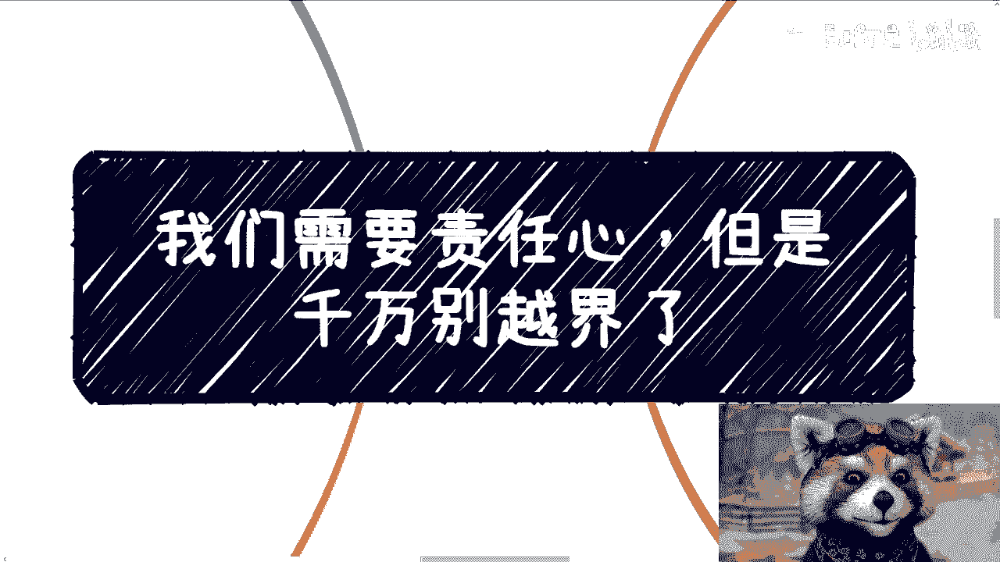

# 我们是需要有责任心的，但千万别越界 - P1 - 赏味不足 - BV18142127vk

好大嗯好大家好啊，今天稍微早一点，因为今天双休日嘛对吧，稍微有点空啊，呃我们今天来讲的这个呢，主要是这个需要责任心啊，但是呢千万别越界呃，这个主题其实之前有讲过，但是嗯正好嘛。

我那个时间也也也隔了蛮长时间了嘛，我正好也可以跟大家说说。

这个最近的一些情况啊，那么首先呢我们来举个例子啊，就是前两天咨询的时候，我给对方举过这么一个案例啊，我说我们以前做咨询的时候呢，呃就经常就是或者说给政企做咨询的时候。

经常碰见一件事情，就比如说啊你们现在跟我合作啊，我某一天呢给你们带来了这个高校跟企业的，这种咨询的case啊，然后呢我就需要你们给我去做专家啊，给甲方去做嘉宾啊，做咨询啊，那么你们非常重视啊。

然后就去努力积累啊，努力做PPT做课程，结果呢最终落地的时候呢，客户对你的评价很差啊，或者是很不满意啊，那么这种时候我首先先这么说啊，这种时候我敢说啊，只要你是一个有责任心的人。

你肯定会觉得是你自己的问题，你可能会觉得比如说这个东西啊，我是不是哪里做的不好，PPT做的不对对吧，或者我可能经验尚浅，对吧啊好，但是说真的啊，我跟你们讲啊，这种情况在漫长的咨询当中经常发生。

那么问题来了啊，如果是你的问题哦，或者如果就是因为你我我举这个例子，你的这个角色就像我以前嘛对吧，我就我就是这个角色嘛，就是如果这种情况是因为由于我们的失误啊，我们的这个能力不足对吧。

我们的各个方面的能呃问题导致的话，那么我就这么说，就是一定会改进，那么这个问题不可能一直发生对吧，但是呢就像我刚跟你们说的，就是这种情况在我们这种咨询的行业当中呢，很常见啊，那么问题来了，责任在哪啊。

我这样说啊，嗯只要啊你是一个努力做的，同时，比如说努力做内容，做课程，做PPT的甲方啊，可以对你有很大的意见，或者说有改进的想法，但绝对不可能差评，或者来说劈头盖脸的去去说你啊，那么如果来说啊。

就是甲方是这种情况啊，唯一的可能性是什么，就是我跟你沟通的时候，我跟你沟通的是甲方的需求，同时呢我给你传达讲甲方的需求的时候，出现了偏差啊，往往是因为我的不专业，或者说我的这个角色的垃圾导致了是什么呢。

就是你你的准备的内容跟甲方南辕北辙，那么如果是你啊，我就说就算呃你知道是我的问题，不是你自己的问题，你是不是还会将大部分的责任归咎你自己呢，啊其实这就是我说的很多，就是很多人有责任心。

但是呢越界你知道吗，就是很多人其实嗯我不知道怎么讲法啊。

我觉得这可能是个病态，就是说你哪怕就是道理上面对吧。

或者怎么样，他觉得他已经知道了这个事情不是他的责任，但是他内心还是很愧疚，那我觉得这就完全没必要对吧，那你比如说包括第二个啊，我说我碰见过很多打工人啊。

是这样子的，就是很多人啊他经常呢会跟我说啊，他说啊比如说呃加班很严重啊，然后什么一两个月都在加班，然后非常累啊，非常的抑郁，但是我跟你讲啊，最奇怪的地方是什么，就是我跟他们沟通的时候。

他们跟我的表达其实是表，就是他可能抱怨了一大堆啊，但是说了其中的，就最不应该表达的一个观点是什么呢，就他说陈老师我觉得我应该对项目负责任啊，我是有责任的，所以呢我就一直在做。

总感觉这个项目呢我不太放心对吧，就这里出问题，那里出问题，但是你仔细想想看啊，于情于理，你可以负责，但是你也仅仅是负责你负责的范围嘛对吧，那你又不是这个项目的管理，你也不是这个项目的。

最终的这个这个这个决策人对吧，你也不是这个项目的股东对吧，就是你别觉得整个项目都是你负责的，你更别觉得你不放心，就是我们在公司里面做项目，你要明白一点，就是不管是大公司小公司啊。

你在公司里做项目靠的是什么，靠的是大家的合作，靠的是管理层的策略，绝对不可能靠的是某一个人，或者某一个团队卖时间吧对吧，你告诉我你看到过哪个项目哦，就是不需要就是战略，不需要策略，不需要就是说是决策的。

而不需要做什么东西的，就单纯大家卖时间就能做的，有吧啦没有的呀，不存在的呀，你要是说单纯卖时间做的话，那这个东西就不存在什，更就更不存在什么责任不责任了，你比如说外包外包，很多公司就是卖时间的。

那那你你都外包了，跟我谈什么责任不责任不责任。

你说对不对啊，那么就很多时候这种事情呢其实是无用功，就你用我话来讲啊，说的好听点，你是真的有责任心，你是真的一个很好的打工人，你是真的一个很好的牛马啊，但说的不好听点，那就是你心里根本就没有逼数对吧。

就是你根本没有能力对这个项目负责，你也没有这个资格对项目负责。

你也对全局的信息缺乏认知，那你非要给自己背这么大个锅干嘛呢。

对不对对吧，但是很多人你知道吗，就就讲不明白，讲不通哦。

然后第三我们以前说过，商业上呢是看诚意的，诚意是什么，那就是钱，别的他妈的别跟我逼逼，你懂吗，就是很多时候啊，你会发现，无论是公司上还是社会上的合作，大家都会被画饼，这种画饼放到以前吃吃也就算了。

但我跟你讲，放到2024年没啥好吃的对吧，你比如说企业里面老板说啊，你要为公司多付出，你要为公司多考虑，你要为公司多负责对吧，这话没有错啊，你单纯说这话有没有问题，没啥问题，就是这与他怎么说。

这是他的权利啊，我们没有阻止他说这些话的权利，但是你说这些话对吧，我可以不听啊，我为什么要听呢，如果你要我听的话，可以的呀，那给我对应的钱呀，那对应的奖年终奖还对应的激励啊，那没有的话。

你跟我说屁啊对吧，你没有的话，你还跟我说，哎你看中我，你跟我怎么样子，这不是屁话吗，有什么用啊，这就好像一个一个男生追你啊，我不说性别啊，容易挑起争端啊，比如说一个人追你对吧，说哎我怎么喜欢你。

怎么喜欢你，怎么喜欢你啊，我觉得我觉得就是说啊，我愿意付出给你付出很多，怎么样怎么样好，来连顿像样的饭都不愿意请你，连像样的礼物都不愿意买，那你说个屁啊，对不对，你你说个屁对吧，比如说你跟我合作啊。

我跟你说，我说哎这个我们一起做啊，以后成立公司给你股份，或者说我说哎你我表扬你啊，我说你做的很好啊。

你做的非常好对吧，你特别优秀对吧，百里挑一对吧，怎么样怎么样啊，那说白了这些屁话有什么用呢对吧，给钱就是唯一的诚意，比如说我就跟你讲，OK你很优秀对吧好，那么我给你解决差旅，我给你多少的劳务费。

比如说你这你这次给我啊讲一个topic，或者你跟我合作，我给你百分之多少，这就是最直接的，那么给了之后怎么赞美都可以啊。

那么不给怎么赞美都他妈屁话呀，对不对啊，那么第四我跟你讲。

真的啊，我到现在很多人跟我说过无数种病，卧槽无敌了，我跟你们讲，就是有导师画的，老板画的，管理层画的，朋友画的，画小画画的对吧，本本父母画的尼玛什么病都有，我跟你们讲啊。

你不踩坑或者说避免踩坑最好的方式就是什么，就是一刀切，什么饼都不吃，我因为什么，因为我我那我反过来问你，你为什么要吃饼呢，哎那么奇了怪了对吧，就是你要明白任何的丙，如果他真的是有诚意的。

或者说这个丙不是个丙的话，那么他现在一定能够给出一定的诚意，如果给不出来，那就是纯扯淡，这就好像，比如说他说几年后给你什么什么东西对吧，或者很看重你，没问题啊，那你看中文怎么了。

那比如说你说几年后给我加2万，给我加3万，或者几年后我是一个合伙人，没问题的呀，那你现在先给我加钱啊，我不指望你现在给我加一两万，你给我加一两千，你加呗对吧，包括你说导师很看重我，那给我报酬啊，你给呗。

你不给他妈的说个屁了，你你导师公司给你进股份啊，进啊对吗，还有那种什么说什么给期权给股份啊，然后给了股份还是代持的，我靠我给你妈，我跟你讲，这他妈全部都是过期的小把戏哦，就是欺负很多小伙伴不懂。

就期权这种东西大部分都是忽悠你，你真的我跟你讲，你签过合同的，就知道大部分都是忽悠啊，然后代持就更别说了，代持什么意思，就是好像给你了，但又不体现股份上，而又不体现在股权上，那有什么用呢。

也不在明面上有什么用呢，就说白了你还是防着我，那你跟我谈什么诚意呢，对吧，就其实这种东西我跟你讲，很多人心里面就是这么想的，就是给一总比没有好对吧，没有错没有错，这句话没有错。

但是你心里要清楚什么叫有总比没有好，就是有也就是那么回事，别当真，有最好没有拉倒，而不是说用这种，就是说绝对不可能用这种，就是说友好有比没有好的这种想法，或者这种这种事情，让你再去卖命或者额外的付出。

这就好像就是说你觉得哎呀老板很看重我，老板很赞美我对吧。

我我我别人都得不到老板的赞美，或者得不到他的这个青睐对吧，那么我就愿意更额外的付出，或者要是去卖命，但是本质上有什么意义呢，你额外的付出，额外的犯命卖命不就是白嫖吗，就被白嫖吗，对吧。

那你跟我讲你很有责任。

那那那那那那那我又要说了对吧，就话糙理不糙啊，就是就说的好听点是你有责任，那说的不好听点不是吗对吧，那有时候我说真的啊，你有没有发现有没有可能有，也是不是这种可能性，就老板之所以表扬你，是因为你足够。

你足够被能被PV，所以他表扬你有没有这种可能性，有没有可能性是因为别人不不不好，容易不容易被PUA，所以别人得不到他的青睐，对吧啊，就是哎就是就是我还是那句话啊，就是不是说哦好像你说啊陈老师骂你对吧。

或者怎么样子，就事实就是这样子，你得改，因为没有必要，你懂吗，就是无论是做人还是说你要赚钱，你你想不想赚钱都无所谓，但是你你有没有发现你如果有责任心越界了，伤害的，或或者说白被白嫖的。

或者怎么样的，不还是你自己吗，你说是不是啊。

行啊，那就这么着吧啊这个双休日快乐啊，嗯行那我们继续啊，就是职业规划，商业规划啊，分红啊，分润啊，股权啊，商业计划书啊，白皮书啊对吧，合同啊等等等啊，你们要是觉得有任何问题的，你们可以来来找我啊。

然后呢你们自己手上有什么牌的，或者没有什么牌的，你们希望通过跟我的沟通，能够嗯这个让我，我只希望我能够结合目前当下的整个的社会情，况跟经济情况，给你们一些比较贴合于社会发展的，这个建议的话。

你们可以整理好那个问题的列表，和对应的个人背景，然后来我们再来聊咨询啊，然后呢我接下来我也每一次都会加这么一句话，就是如果啊你们希望我手把手教的啊，任何一件事情是手把手教的啊。

那么你们就不要来找我了好吧，这是第一点，第二点是你们啊叫什么，希望说通过咨询啊，然后想让我对你们负责的啊，说什么啊，这个这个这个有什么问题都来找我对吧，然后怎么样怎么样，就是每一步对吧，只要走错了。

都是承受上车的责任，那你们也不要来找我，好吧啊行。

