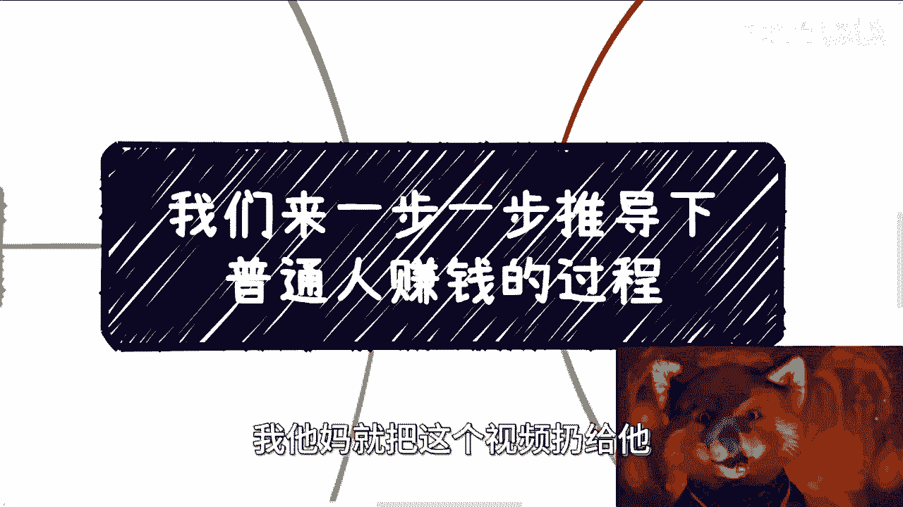
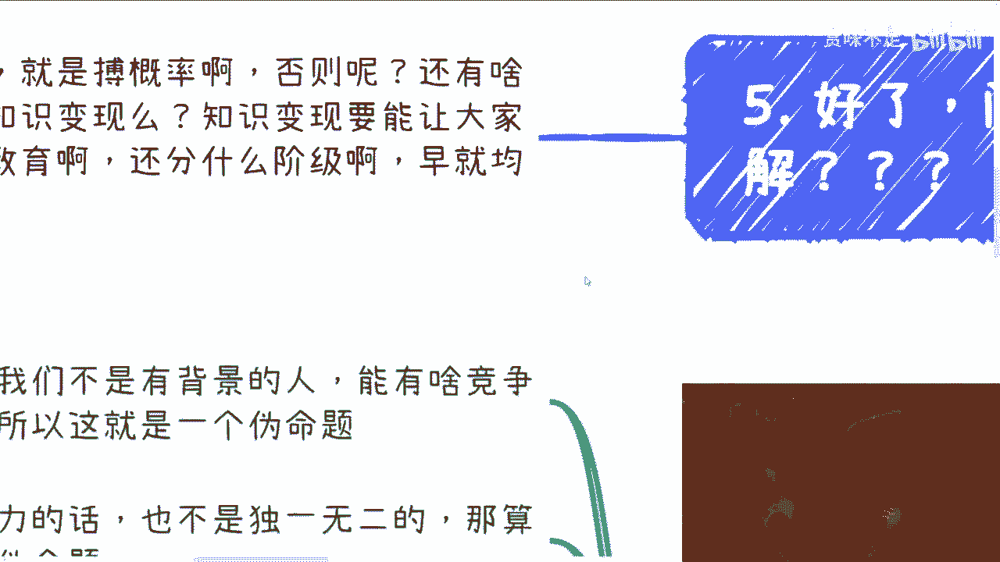
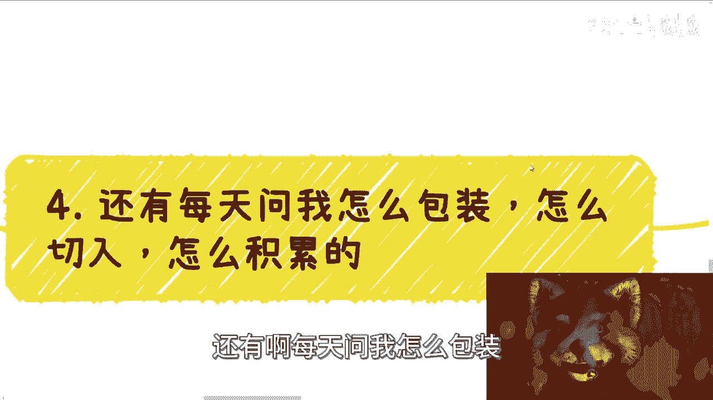

# 我们来一步一步反推下普通人赚钱的过程 - P1 - 赏味不足 - BV1z34y1g7iL

哈喽大家好，这不是我第一次讲这个问题，但是绝对是我最后一次讲这个问题，我以后不想再讲这个问题，真的啊。

所以以后要是再有人来问我这个问题，我他妈就把这个视频扔给他。

首先啊是这样子的，先说结论啊，所有我们考虑自己做什么啊，或者自己积累什么，自己到底从什么切入点去切入的一切，一切的前提是什么，是我们先要去知道自己所在领域，原本的在以前的，比如说10年20年过程当中。

那些成熟的赚钱的方式，那些商业的盈利的方式，那些齿轮怎么怎么滚的对吧，怎么个玩法原本就存在于世界上，赚钱的模式有哪些对吧，而不是说你就是最近咨询下来，就很多人我跟他讲完了，他还在问我。

他说那是不是说我得选择一个这个新兴领域，对吧，以后你觉得以后哪个领域比较好，好不好不重要啊，不好你你去了解里面的赚钱方式，你也能赚钱啊，好啊，你不了解你一样不能赚钱，有意义吗，没有意义的呀。

就大家你你们他妈所有人读完书，对于整个世界毫无认知，真的我现在咨询到今天我算是发现了，就是读完研，读完博跑出来，卧槽哎，连企业里面有这个怎么哪些组织架构，有哪些管理的对吧，怎么样一个级别他都不知道。

然后连政府这边有哪些部门对吧，然后政府这边有一些比较大的一些对吧，因为经信委，科委或其他地各个地方到底怎么个管理的对吧，或者说有哪些协会从上到下的整个组织架构，他也不知道，他说听都没听过对吧。

就你不知道你要去知道啊，你不知道你怪谁，你哦，你所有的东西都不知道对吧，包括高校里面，你说我要赚高校的钱啊，我想高高校合作怎么合作呢，不知道对吧，然后来问我第一步怎么做，什么都不知道。

你哪里来的哪里来的第一步啊，我以为学语数外呢，我真的他妈无语了，我真的是，对吧，唉你好，你想所有的人你想好了，问题来了对吧，所有的人都在问对吧，那我们怎么了，怎么了解怎么去破这个局对吧。

所以我才跟你说去社交啊，社交什么意思啊，社交就是博概率对吧，什么叫博概率，就是你得去了解这些东西，你怎么了解呢，你只能社交，为什么，因为没有别的方式低，没有别的地方让你们去了解了，你们去问你们的老师。

他们会说实话吗，不会他们了解吗，也不一定对吧，那你们去买，他们花个10万20万吗，四五十万读个NBA有用吗，有用的啦，如果有用的话，大家早早就突破瓶颈了，还他妈要什么教育啊，对不对，还分什么级别了。

还百还什么5%，掌握95%的财富，但是早就军服了呀，对不对，就是因为这些东西它不好了解，它不透风，所以我才跟你们说，这是普通人唯一的手段，你们要去社交，去博概率，不是说你们什么信息都不拼对吧。

什么东西都不知道，然后就哦我每天看短视频啊，我每天去问吕老师对吧，我第一步怎么走，有用了，没有用的呀，就我跟你讲，就感觉什么就感觉就是说很多人活在这世界上，已经活了20多年，30多年了，对整个中国。

对整个国家的运作没有任何的认知，然后就说好，我他妈要开始干了，你干什么玩意儿啊，怎么无语了，你知道吗，就是就是哎我有时候想想啊，我视频做到现在播了半年对吧，就是就是你可以没有进步，但是你不能说思想上面。

连这个东西还没有改变啊。

第一我们从小被教育要有竞争力。

要有护城河对吧，我跟你讲，我们都是都是一个人啊，我们没有背景，富二代，富二代，你有什么竞争力啊，都是标品，你有什么竞争力啊，这怎么就是个伪命题呀，哦操那每一年每一年清华毕业多少人，北大毕业多少人啊。

你毕业出来不都是标品吗，你告诉我有什么竞争力啊对吧，你跟我说哦，就是我在老百姓当中有竞争力，我在打工当中有竞争力，那他妈就是50步笑百步，有什么区别了，没有意义的呀，对不对啊，你跟我说学历是竞争力。

我就问你学历是独一无二的，是不是不是，那不是算他妈毛巾真理啊，还是文明题啊，哦大家活了20多年，30多年，这点逻辑想不清楚吗，对吧，所以说结论是什么，就是我们做什么东西没有用啊，因为我们啥也没有啊。

就是我们是对社会，我们对商业，对别人赚钱，对整个运作里面的齿轮，每一个环节怎么做，我们一无所知对吧，我聊下来就是一无所知的我我真的我我不夸张，所有人都是一无所知对吧。

那很多人连企业连政府有哪些部门有哪些管理，他都不知道啊，你要开始告诉我要积累了，我要切入了，我思考了，你积累个屁，思考个屁啊，对不对，不是你啥都不知道，你就直来，真的奇了怪了，然后然后你知道吗。

每次我跟他们这么讲，他们还问我，那我怎么做，怎么去积累啊，我怎么去了解呢，哎我的，做语数外呢，1+1为什么等于二是吧，有答案了没有答案呀，要有标准答案，大家早就均富了，早就他妈都暴富了呀。

哎妈真的我我现在我给你们讲，最近一个月我讲的最多的一句话是什么，就他妈读书读傻了，对吧，你别任何一个问题，就是一句话，我觉得很难啊，我觉得门槛很高，哎我觉得这个东西我做不了，什么都不了解。

你就跟我谈门槛，什么门槛我就问你什么门槛是吧，我跟你们讲真的，每次咨询真是都跟我讲门槛很高啊，我觉得很难，那我就问他难在什么地方，门槛在什么地方，你说呀，你倒是说呀，你说不出来，哎呦真的。

我真的觉得真的。

怎么怎么会教育成这个样子，我是没想到，我是真没想到，你知道吧，好那按按按我们主题啊。

我们来推演一下，比如说你要做产品赚钱对吧，好好什么产品，什么领域，近5年近10年这个产品怎么赚钱的，你知道吗，你先去了解别人。

别人做产品怎么赚钱呢对吧，比如说我们了解到有的产品靠流量卖广告赚钱，有的产品靠一小撮土豪买买卡包啊，6648对吧赚钱，有的是靠C端用户交手续费赚钱的，那么问题来了，他们怎么0~1的。

他们怎么接这个广告的，他们怎么找到一小撮土豪的，他们的倍数又是什么，为什么他们的产品，比如说用户企业政府会用对吧。

你倒推啊啊，那么包括高校购买他们的产品对吧，流程是什么对吧，一般都是谁拍板的，一般材料包含什么，高校的钱哪里来，高校为什么会有这笔钱，高校为什么舍得花这笔钱，他们又得到了什么对吧，高校每一年的KPI。

从哪里来对吧，然后高校是怎么来汇报的，啊那么高校为什么他要去看，每一年要开新的专业对吧，那么高校一般对外，比如说是哪些人来负责这个东西对吧。

好那么你做政府项目对吧好，那么哪些项目是要走服务的，哪些项目走招投标的啊，哪些项目是就走服务，什么意思，就是走采购的对吧，哪些项目是要走招投标的对吧，然后怎么样是真的招投标，哪些招投标是那种虚虚的对吧。

就走走形式，然后有很多陪标的对吧，政府都是些什么部门负责这个东西对吧，那那个部门下面它的整个汇报，这个流程又是怎么样子的，整个流程周期是怎么样子的对吧，你从开始做到真正的交付，他又是怎么样子的对吧。

他的利润怎么样对吧，你所有这些东西都不知道，你就跟我说，我要做产品，你就在那边想，你第一步就是好，我要做产品，我要解决一些问题，我要解决痛点，我要去找融资，哎我跟你讲啊，也还有很多人跟我说什么。

他说我今天做的产品我跑到供应商，我跑到什么什么运营商，我保到甲方那边，我要去销售啊，我觉得就是说他们这个东西可以走采购，哎我说他妈的奇了怪了，人家是有自己的供应商，凭什么采购你的，对吧哦。

地球不是围着你转的，我管你什么学历，什么学校，你懂啥玩意儿，就自己在那边想，没有用的呀，所有第一步都不走，对吧，就我觉得大部分人可能接受不了，就觉得，我他妈的沉没成本这么高对吧，你说我读完本科。

读完硕士，读完博士出来，对这些赚钱都是一无所知，那不好意思，就是一无所知啊。

对吧，那么就比如说你要做咨询服务啊。

你比如说个人企业，政府单位，高校这四方咨询都怎么做的，周期一般多久，付款周期怎么样，付款的金额大概什么范围，高校是什么形式，它有什么门槛，你做咨询，你是一个人还是一个团队，还是个企业主体。

你要准备什么材料对吧，那么这个材料里面包含哪些内容啊，然后咨询从0~1的流程是什么，一般沟通是几轮，每一轮要产出什么东西，如何你去提升自己的价值，如何提升如何，你可以通过一些手段。

提升甲方付款的客单价对吧，包括咨询服务，如何进行批量化复制，如何让自己脱离出来，让别人去劳动，这其中的钱一般怎么分的利，呃呃呃呃，这个交税怎么交，成本是怎么样子，每一期投入产出比大概多少，合同怎么签。

谁去签，几方拒签，你什么都不知道，你就说啊，你每次都是我跟别人说，我说你可以去做。

你可以从资讯开始切啊，然后他就开始问了，问怎么积累啊，我怎么做这个东西，那你去了解啊，对哦你不去了解你怎么地啊，上来就做，你怎么做，你连流程都不知道，你找谁去对吧。

真的我服了，还有啊每天问我怎么包装。

怎么切入，怎么积累的对吧，好看啊，我先问所有人问我这个问题，我都问你们想做什么，你们想怎么赚钱，你们定位是什么角色是什么，想好没有没想好，那你记得个屁啊，对吧哦，你们所有讲出来的那些赚钱逻辑。

都他妈的是自己YY出来的，有什么用啊，没用的呀，地球不围着你转的，你别看到一个自媒体，看到一个什么案例啊，就说好了，他这样做，我也要这么做，你要去了解他为什么能这么做，细节呢对吧，真的我真的。

我不知道大家就这就这这么多人读书，是怎么读出来的，就硕士出来，我就这还不如一个出租车的逻辑性对吧，就是你所有的事情路径是反推出来的，就是说你要先了解整个环境怎么做的，整个模式怎么样的对吧。

你也别去管什么领域对吧，因为无论什么领域，政府企业个人高效赚钱的逻辑它是不会变的哦，你难道说那个云计算哦，一套逻辑今天有一个新的东西，比如说呃这个大数据出来，有一套新的逻辑啊。

明天远远就出来一套新的逻辑，可能那不可能的呀，对不对，整个东西抛开这些东西之后，他的抽象出来的逻辑都一样的，你要先去了解它的逻辑是什么对吧，你怎么积累怎么做，取决于你最终的目的对吧，你目的都不知道。

你整个赚钱，我一直说赚钱闭环，赚钱闭环，你连整个赚钱的逻辑谁付钱，钱怎么来，你都不知道，你谈什么积累呀，对不啦，好啦对吧。

那那就回到这个地方来，我我就明确跟你们讲了啊，这些东西不是你们付个几10万，付个十几万，别人就愿意讲的，因为这些东西从本质上来讲都是商业机密，他就是一个平行宇宙对吧，你们别老。

就是我发现很多人好像觉得哎理所当然，就是我应该知道一些方法论，然后老百姓用这个方法论就可以去翻身，可能不拉，奇了怪了，真的是，就是就真的读书读傻了好吧，就是所有的路径它是反推出来的，你得先了解你。

不了解你就去想，所有都是白用功，都是白做工，没有用的啊，你明白一件事情没有用的。

就是你我我还是那句话，你们不是赚不到钱，你们可以赚到钱，但都是辛苦钱，而且不稳定，就这么简单，好吧，这个问题我以后不想再讲了哦，我我我但凡以后有人再问我这个问题，我就把这个视频扔给他，结束了。

我就这么着了，好吧啊，所以我从一开始就说得很清楚，什么学历，什么领域，什么你做什么东西，什么什么哪个领域，未来好一点或者怎么样不重要，有什么有什么重要，一点都不重要，对不了。

我只能说相对你可能竞争不那么激烈，但是不是说啊这个这个领域好吧，这个领域增量市场好，我就充了，你充什么玩意儿啊，你你你你你连整个社会怎么运作都不知道，你还冲冲什么东西啊，好就这么着吧好吧。

你们想清楚很多东西，想明白想明白，然后有具体的就是说问题啊，然后包括就是说商业，包括就是说就是说就是说手上的牌怎么打对吧，或者怎么样子，我们再来咨询好吧，真的我行吧。

还是我太有良心啊。