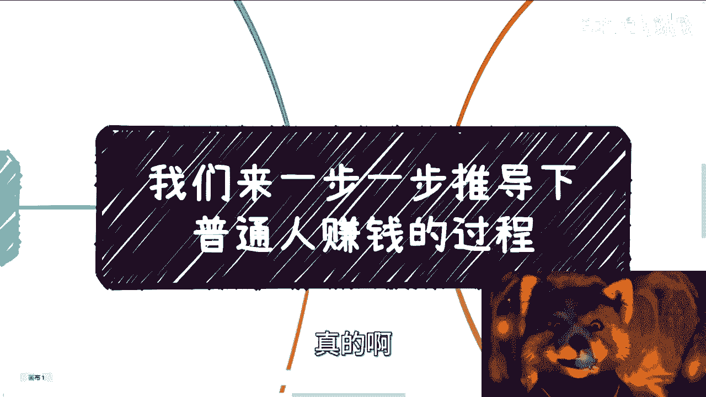
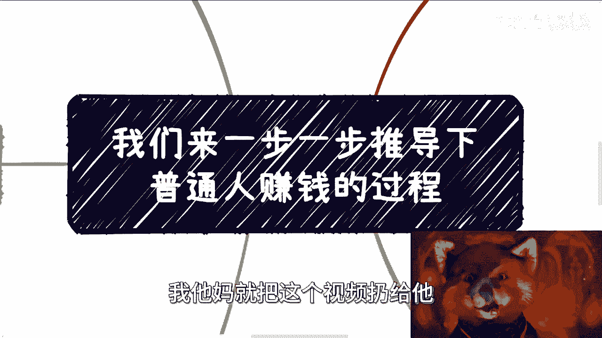
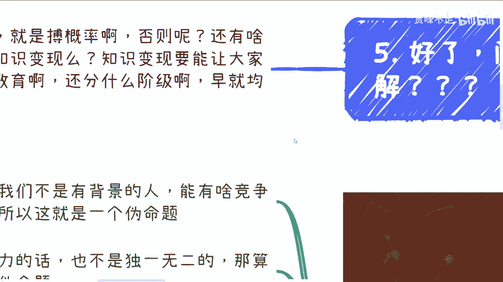
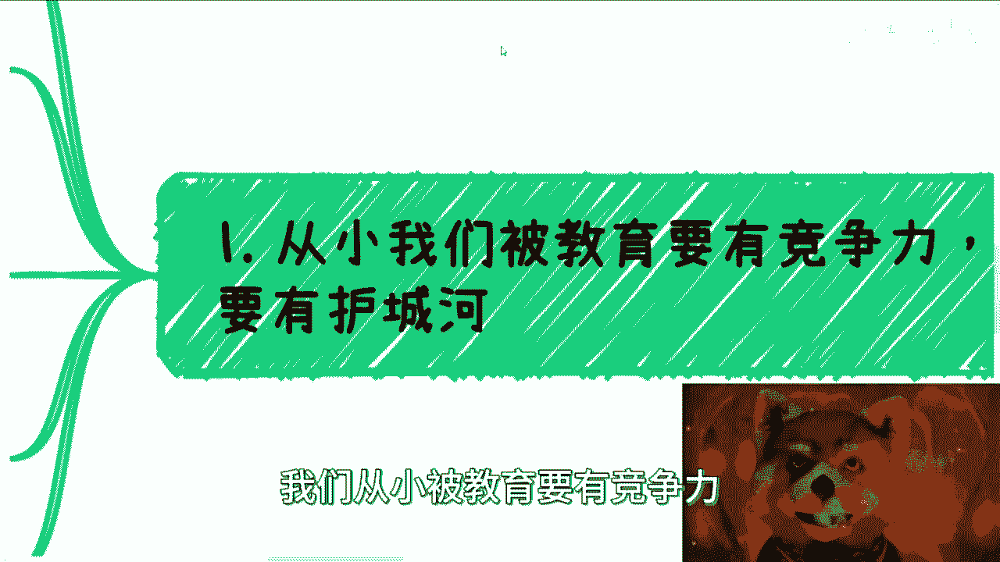
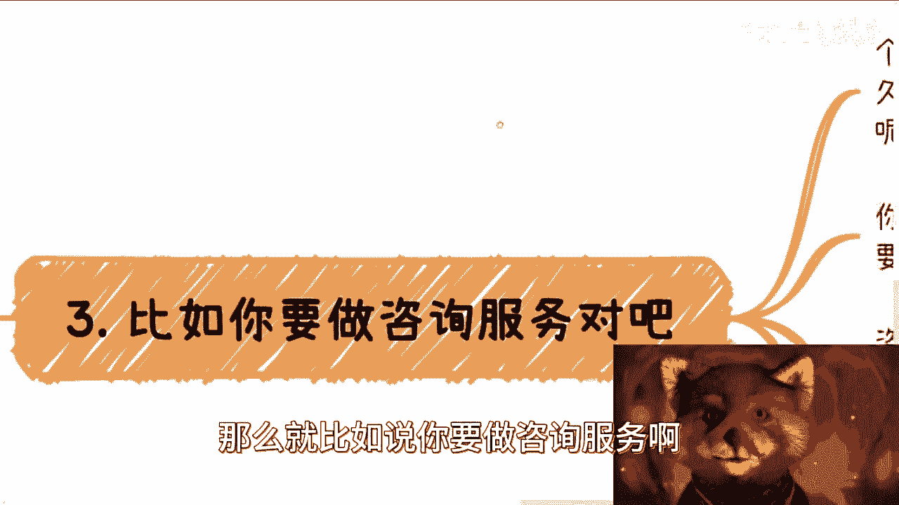
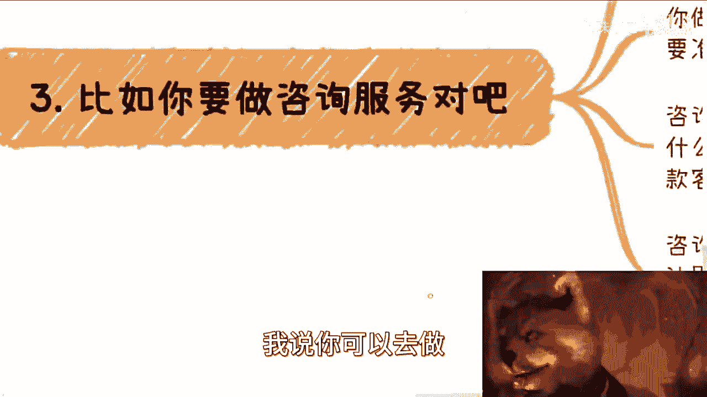
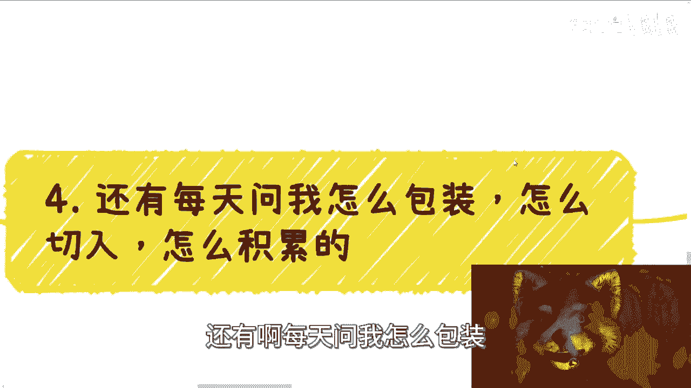
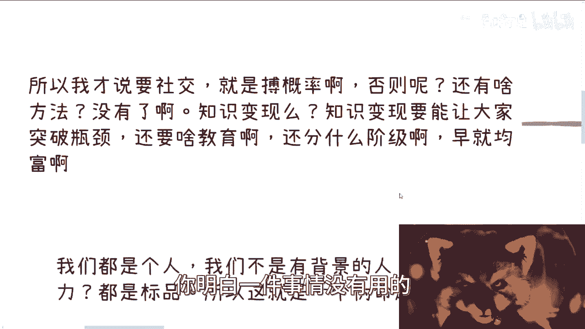

# 课程 P1：普通人赚钱路径反推 🧭

在本节课中，我们将学习如何通过逆向思维，理解社会与商业运作的真实逻辑，从而找到个人赚钱的切入点。核心在于，你必须先了解一个领域内成熟的赚钱模式，而不是凭空想象。

---

许多人常问：“我该从何开始积累？如何切入一个领域？” 问题的根源在于，他们对社会既有的商业运作方式缺乏基本认知。无论是企业、政府还是高校，其内部的运作逻辑、盈利模式和决策流程，对于多数受过高等教育的人来说，竟是一片空白。

上一节我们指出了认知空白的问题，本节中我们来看看，为什么传统的“竞争力”思维可能是无效的。

我们从小被教育要建立个人竞争力与护城河。但对于没有特殊背景的普通人而言，所谓的学历和技能在市场上往往是**标品**。每年有大量相似背景的毕业生涌入市场，这并不能构成独特的竞争优势。问题的核心并非个人资质，而是对社会商业齿轮如何转动**一无所知**。

既然缺乏对系统的认知，那么正确的起点是什么？答案是：**逆向推演**。

以下是进行逆向推演的核心思路，你需要像侦探一样，去剖析一个成熟商业模式的全貌：

*   **产品如何赚钱？** 例如，是靠流量广告 (`广告收入 = 流量 × 转化率 × 单价`)、少数高净值用户付费，还是向海量用户收取手续费？
*   **客户如何决策？** 以高校采购为例：流程是什么？谁拍板？预算从何而来？高校的KPI是什么？他们通过采购想获得什么？
*   **项目如何运作？** 以政府项目为例：哪些走直接采购，哪些必须招投标？哪些招标是形式性的？负责部门是谁？项目周期和利润结构如何？

如果你对这些具体问题毫无概念，那么“我要做一个产品解决痛点”的想法就如同空中楼阁。地球并非围绕你的想法转动，你必须先理解现有的游戏规则。

了解了产品与项目，我们再来看看另一种常见的赚钱方式——咨询服务。

如果你计划提供咨询服务，无论是面向个人、企业、政府还是高校，你必须弄清以下细节：

*   **服务流程：** 从接洽到交付的完整周期 (`咨询周期 = 需求沟通 + 方案制定 + 交付 + 复盘`)。
*   **商业细节：** 付款方式、金额范围、合同签订方、税费处理。
*   **升级路径：** 如何提升客单价？如何将服务产品化、规模化？利润如何分配？

在了解这些之前，空谈“积累”和“切入”是没有意义的。你的所有行动路径，都应从**终极赚钱目的**反推而来。

许多人期望付费就能获得一套“万能翻身方法论”。但现实是，这些涉及具体运作流程和资源的细节，往往是**商业机密**，构成了一个普通人难以窥见的“平行宇宙”。赚钱的闭环逻辑 (`赚钱闭环 = 谁付钱 + 为何付钱 + 钱从哪来 + 如何交付`) 是普适的，但填充这个闭环的具体信息，需要你主动去探索和拼图。

总结来说，本节课我们一起学习了：
1.  赚钱的第一步是**认知现实**，而非空想。
2.  个人竞争力在缺乏系统认知时作用有限。
3.  正确的方法是**逆向推演**：深入研究目标领域内现有的、成熟的赚钱模式与运作细节。
4.  所有行动都应从清晰的赚钱闭环逻辑反推，明确“谁付钱”和“为何付钱”。

你并非无法赚钱，但若不了解系统，则只能赚取不稳定且辛苦的劳力钱。想明白基本逻辑，针对具体问题再进行深入探讨，才是有效的路径。