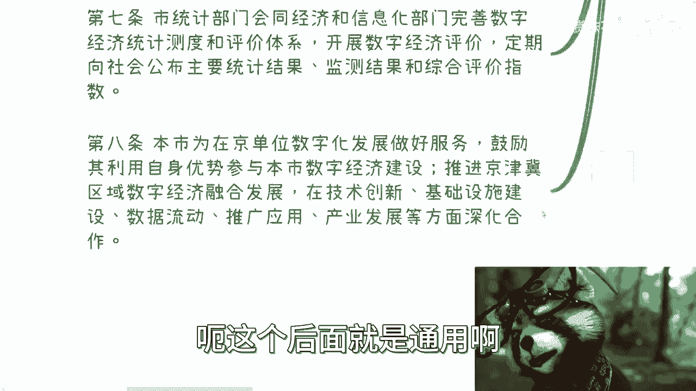
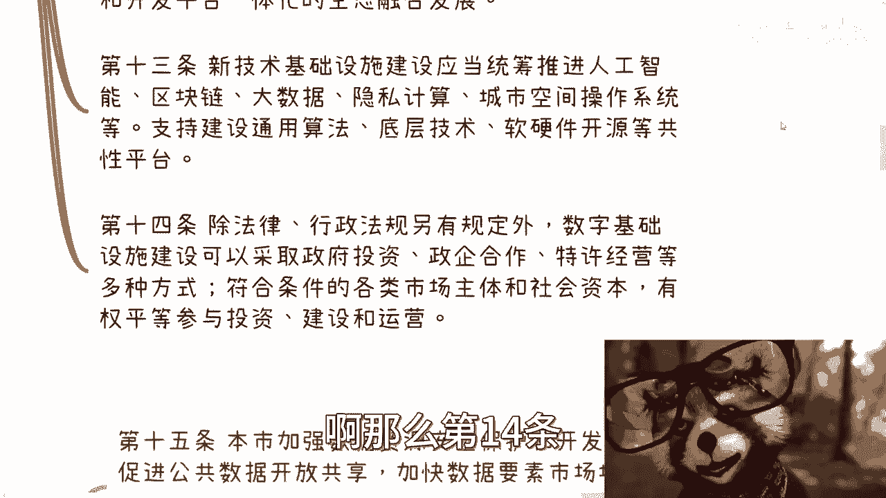
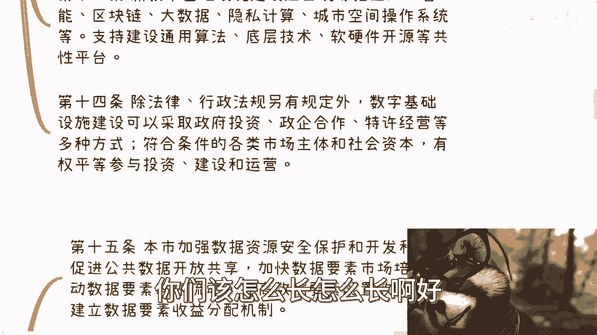
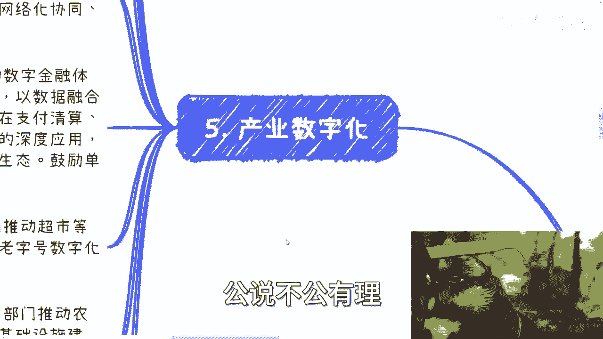

# 课程一：解读《北京市数字经济促进条例》核心框架 🧭

在本节课中，我们将一起学习《北京市数字经济促进条例》的核心内容。该条例于2022年11月25日通过，自2023年1月1日起施行。我们将梳理其核心框架与关键概念，帮助初学者理解数字经济的政策导向。

## 概述：条例的基本信息

条例的发布日期为2022年10月27日。其根本目的是加强数字基础设施建设、培育数据要素市场、推进数字产业化与产业数字化，并完善数字经济治理，旨在将北京建设成为全球数字经济的标杆城市。

---

## 第一章：总则 📜

总则部分明确了条例的立法目的、适用范围和基本原则。

条例所称数字经济，是指以**数据资源为关键要素**，以**现代信息网络为主要载体**，以**信息通信技术融合应用**和**全要素数字化转型**为重要推动力，促进公平与效率统一的新经济形态。

促进数字经济发展是北京市的重要战略，应遵循创新驱动、融合发展、普惠共享、安全有序的原则。

市经济和信息化部门负责统筹指导与规划拟定，统计部门则需完善数字经济统计测量评价体系。

---

## 第二章：数字基础设施建设 🏗️

上一节我们介绍了条例的总则，本节中我们来看看数字基础设施建设的规划。

数字基础设施建设应遵循合理布局、集约高效、绿色低碳的原则，主要包括以下三个方面：

以下是数字基础设施的三大组成部分：
1.  **网络基础设施建设**：重点支持新一代高速固定宽带、移动通信网络、卫星互联网、量子通信等。
2.  **算力基础设施建设**：统筹建设智能计算中心、边缘计算节点等，形成协同高效的计算体系。
3.  **新技术基础设施建设**：统筹推进人工智能、区块链、大数据、隐私计算、城市空间操作系统等平台建设。

此外，应推进传统基础设施的数字化、智能化改造，并将数字基础设施纳入国土空间等各项规划中予以保障。

在建设运营模式上，除法律另有规定外，可采取政府投资、政企合作、特许经营等多种方式，鼓励各类市场主体平等参与。

---

## 第三章：数据资源与要素市场 💾

数字基础设施为数据流动提供了载体，本节我们将聚焦于数据资源本身的管理与价值释放。

本市将加强数据资源安全保护与开发利用，核心目标是促进公共数据开放共享，加快培育数据要素市场，推动数据要素有序流通与高效配置，并探索建立数据要素收益分配机制。

以下是数据资源管理的几个关键方向：
*   **统一目录管理**：建立统一的公共数据目录，推动公共数据共享。
*   **分级分类开放**：制定公共数据开放清单，采取无条件或有条件方式向社会开放。
*   **赋能产业发展**：设立金融、医疗、交通等领域的公共数据专区，推动数据赋能产业。
*   **探索数据资产化**：支持市场主体探索数据资产定价机制，推动数据资产登记、评估，以及数据信贷、数据资产证券化等创新。
*   **规范数据交易**：支持在依法设立的数据交易机构内开展数据交易活动。

其核心逻辑可概括为两个步骤：**数据资产化**与**资产证券化**。

---

## 第四章：数字产业化 🚀

数据要素的价值需要通过具体的产业形态来实现。本节我们进入数字产业化部分。

数字产业化是指数字技术本身形成产业的过程。本市将支持数字产业基础研究与关键技术攻关，并鼓励开源生态建设与网络安全技术发展。

以下是数字产业化的重点领域：
*   **支持平台企业发展**：鼓励平台企业加大研发投入，加强与企业间合作，优化平台生态。
*   **鼓励新业态创新**：支持远程办公、在线服务等数字经济新业态发展。
*   **建设产业集聚区**：支持建设数字经济产业园与创新基地，推动产业集群化发展。
*   **探索数字贸易**：放宽新业态准入，发展跨境数字贸易、物流与支付。

---

## 第五章：产业数字化 🔄

上一节我们讨论了如何将数字技术做成产业，本节我们来看看如何用数字技术升级传统产业，即产业数字化。

产业数字化是指利用数字技术对传统产业进行全方位、全链条的改造。条例支持农业、制造业、金融、医疗、教育等几乎所有主要产业的数字化转型。

以下是产业数字化的几个典型场景：
*   **工业互联网**：推动工业企业建设智能车间、智能工厂，实现智能化生产与网络化协同。
*   **国有企业引领**：鼓励国有企业整合内部系统，实现全面数字化转型，树立行业标杆。
*   **金融体系数字化**：推动数字化金融体系建设，鼓励使用数字人民币。
*   **商业数字化转型**：推动传统商业、老字号品牌进行数字化推广与营销。
*   **智慧农业**：在农业农村领域，推动物联网、遥感、区块链等技术应用，助力乡村振兴。
*   **数字文化生活**：支持和规范在线教育、在线旅游、数字动漫等新业态，发展智慧博物馆、智慧体育场馆等新场景。

产业数字化的核心是**降本增效**与**模式创新**，其覆盖范围远不止互联网行业，更关乎制造业、农业等国民经济的主体。

---

## 总结

本节课中，我们一起学习了《北京市数字经济促进条例》的核心框架。我们从**总则**出发，了解了数字经济的定义与战略地位；随后探讨了**数字基础设施**作为发展底座的重要性；接着深入分析了**数据资源**如何通过市场化配置释放价值；然后区分了**数字产业化**（创造数字技术产业）与**产业数字化**（用数字技术升级传统产业）这两大核心路径。

该条例为数字经济发展描绘了清晰的蓝图：**夯实设施、激活数据、做强产业、赋能百业**。理解这一框架，有助于我们把握数字经济的发展方向与关键机遇。