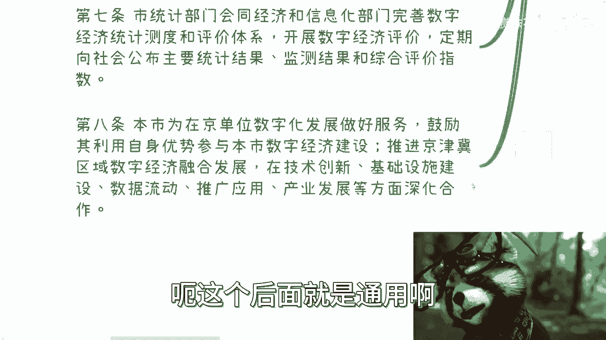
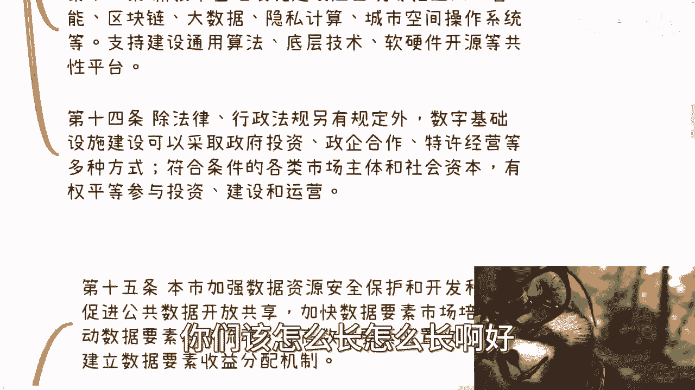
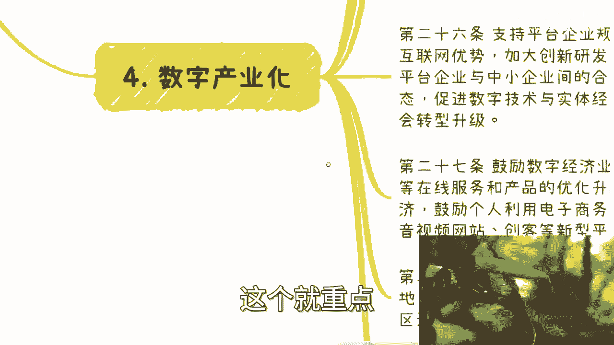

# 我们来一起看下《北京市数字经济促进条例》 - P1 - 赏味不足 - BV1MC4y1H7N2

啊好大家好啊，我们来看一下这个啊，这个是四天前，三天前我也震惊了对吧，10月27号发的这个数字经济促进条例呃，蛮好的啊，我我甚至没有收到通知，我就好像我还是自己搜的呃，10月27号对，嗯我看一下啊。

它是由这个2022年11月25号通过的，然后呢，限于发布自2023年叫什么，1月1号进行实施呃，大差不差，但我不知道他为什么，这个日期写的是10月27号啊。

无所谓啊，不重要啊，我们来看一下啊。

首先我靠，我跟你讲这个东西真的多，多的来一塌糊涂，为什么找不到了，一呢啊，总则啊，你看啊，首先啊为了加强数字基础设施啊，培育数据要素，推进数字产业化，你看啊，我跟你们说的很清楚啊。

就是数字产业化和产业数字化，它不是一个东西对吧，我之前在数字经济的那个内容里面，跟强调过很多次啊，这是两个东西啊，完善数字经济治理对吧，你看啊治理啊，促进数字经济发展，建立全球啊，全球就是全球对吧。

这个定位也定清楚了啊，数字标杆啊，根据有关法律啊，结合本市情况制定本条条例，第二你看啊，行政区域内数字经济促进数数数，这数字经济相关啊，适用于本条例啊，本条例所称数字经济是指以数据资源为关键，你看啊。

数据资源为关键要素，以现代化网络为主要载体，以信息通信技术融合呃，全要素数字化转型为重要推动力，促进公平效率啊，我们举个例子啊，你看啊以数据资源为关键要素，比如说以前大数据整理的数据对吧。

以现代信息网络为主要载体，比如说区块链，比如说啊这个互联网技术对吧，以信息通信技术，比如说5G6G等融合技术，全要素数字化转型对吧，那好这个地方还提到了数字化转型，对不对，但是还是那句话。

你会发现这个叫什么，这个叫做这个叫做语言的艺术，你懂吗，就是你要往里面套，至于怎么套，要看大家本事啊，没有必要把东西写死掉，因为写死不利于发展啊，那么第三条啊，促进数字经济发展是本市重要战略对吧。

促进数字经济发展应遵循驱动，创新驱动融合发展，普惠共享，安全有序协同，那这些我跟你讲都是呃这个叫什么，就公共公共话术啊，通用话术啊，那么第四条啊，工作领导啊，那个建立健全推进协调机制。

将数字经济发展纳鲁国民机制，会的对啊，研究制定促进什么什么什么啊，这个我跟你讲也是套话啊，那么市经济和信息化部门负责相关指导啊，拟定规划推动怎么样怎么样啊，你妈也是套话啊，好那么市经济会有关推进诶。

这两个一样吗，哦不一样啊，你看啊这个有关体系建设对吧，建立相关关键技术数据治理和安全合规啊，公共数据的我跟你讲，你也是套话啊，就哪个都一样啊，反正就是这些东西啊，那么市统计部门会和。

会同这个经济和信息化部啊，完善数字经济统计测量评价体系啊，开展呃这个经济评测啊制定，那简单来讲就是说你看啊，这几个你把数据经济换成别的语言啊，换成别的技术，或者换成换成别的方向的一个道理啊。

呃呃这个后面都是通用的。

我们就不去看了，好吧啊，好转总总总则啊。

基本上是这样子啊，那么二我们来看看二啊，数字基础建设对吧，好你看啊，合理布局，集约高效，绿色低碳的原则，加快建设基础建设啊，这个地方提到了，你看啊，一网络基础建设，二算力基础建设。

三新技术基础建设等数字基础建设，你看啊，网络基础是通用的啊，算力基础也是这两年经常说的新技术啊，不知道啊，看你们套对吧啊，好推进传统基础设施的数字化改造对吧，你看啊啊传统基础设施对吧。

好推动新型城市基础设施建设，并将数字基础设施纳入国民经济社会规划，国土空间规划，相关部门做好能源土地，市政交通等方面保证工作啊，那么这个呢其实你也看得出来啊，整体来讲就是说那个通用的网络算力星期数。

然后呢，要将数字化基础建设纳入原本的规划当中啊，那么原本的比如说那个国民经济社会发展，肯定是有规划的，那么包括那个国土空间对吧，那么能源土地市政这些都要配合交通等等等啊，这个也也比较通用，也比较通用好。

第十条呃，信息网络基础建设，应当重点支持新一代高速固定宽带啊，这个别谈了啊，这个这个还是通用的还是通用的啊，当然这个地方你看啊提到了卫星互联网，量子通信对吧，好那呃原因很简单，我看了一下这个文件呃。

时间肯定也长了啊，你不可能说这个国，北京市这边发出来一个数字经济促进，你说是一个35年的，我觉得不可能，他起码是一个以10年15年为单位的东西，所以说你在他的这个文件里面能看到。

比如说卫卫星互联网啊啊量子通信啊，我觉得没毛病啊，没毛病好，那么第11条，你看感知物联网就是我们之前说的对吧，你数字经济本身，你数字化本身你离不开物联网的，你怎么你你想看你怎么离开物联网对吧。

你传统化基础建设，比如说呃什么碳啊，煤啊，铜啊，各种各样的工厂啊，你离开互联网，你离开互联网，你怎么个数字化，数字化个屁啊，对不对啊，感知物联网建设应当支持部署，你看啊，低成本低功耗，高精度啊。

安全可靠，智能化传感器对吧，那那你有传感器，你才能数字化对吧，你否则数字化个屁啊，哈啊好，第12条，你看算力基础建设，哎这个就不说了，因为算力基础建设各地方的那个算力研究院，这个这两年一直在说对吧。

也也都在做对吧，这个我跟你讲也是通用的啊，那么第13条，新技术基础建设应当统筹推进，你看啊，人工智能区块链啊，大数据隐私计算，城市空间操作系统等啊，支持建设通用算法底层技术啊，软硬件开源等等。

那个工信平台对吧，那这个也就是提了一下啊，告诉大家，上面我们之前从第一条到12条，所提到的新技术，新技术可能会包含哪些，当然这个地方哎你看啊，等对吧，他不会写死的啊，不现实的啊，因为为什么很简单。

因为中国各省市区从一线到五线，你你你觉得大家的技术发展，以致为了不一致的呀，对不来哦，你一线一线1。5线做区块链，你你你找个五线做做看啊，做个P对啊，那么第14条。

除除法律行政法规另有规定外，数字基础建设可以采取啊，你看啊，可以采取政府投资啊，政企合作，特许经营等多种方式，符合条件的各类市场主体和社会资本，有权平等参与投资建设和运营，我跟你讲这句话的意思也很简单。

就是说啊就是各地方你们可以自定义，或者说可以有一定的灵活性啊，到底是怎么个运营方式，到底怎么个融资怎么样子，没有强行规定啊，就是说白了就是说的高这个嗯叫什么，高情商一点就是呃上下弹性很大啊。

低情商一点就是我野蛮生长吧，你们该怎么长怎么长啊。

好然后第三个啊，数据资源，你看啊，数据资源第15条，本市应加强数据资源安全保护和开发利用啊，促进公共数据开放共享，加快数据要素市场培育，推动数据要素有序流通，提高数据要素配置效率。

探索建立数据要素收益分配机制，这句话什么意思呢，也很简单对吧，之前因为说的很清楚了，就是呃有很多人问我，你比如说大数据外来有没有发展，你让我怎么定义有没有发展，就是你要是对整个大数据的这个理解对吧。

包括数据理解都还是在你们学校，或者在在原本的，比如说2015年到2020年，这一个理念当中，那你是没发展对吧，因为现在数据要什么，你看啊他要利用啊，要共享，要加快培育，要推动流通，这些才是正重点。

不是说数据的本身清洗或者怎么样才，这个已经是0~1K了，你明白吧，就之前包括直播的时候，我也说的很清楚，就是接下来的数据要用啊，是用了之后干嘛要流通，要流动对吧，第16行，你看啊，统一目录管理啊。

我跟你们说啊，你们去查啊，你们去查查什么就查关键字，比如说区块链空格啊，大数据呃，大数据目录啊，或者说数据目录，你们去查，你们去看看中国各地方是几几年在做这件事情，那好第17条，推动啊，这个很正常对吧。

简单来讲就是说数据孤岛要打破啊，就这么就这句话啊，第18啊，市经济和信息化部啊，应当按照需求导向啊，分级分类，安全可控，高效便捷的原则，制定相关开放清单清单啊，采取无条件开放。

有条件开放等方式向社会开放，公共数据担任等等等，一样的就打破信息叫做打破信息孤岛，增加整个社会信任度啊，就这么一件事情啊，第19条，本市设立金融，医疗，交通空间等领域公共数据专区推动。

那这个就是说什么呢，啊那个赋能产业啊，就要赋能产业，你不能说你不能说你数据那个打通就空打通啊，你得跟产业挂钩啊，对吧，我们以前说过的啊，那么第20条对吧，除法律行政法规另有规定，当事人另外约定以外。

单位和个人对其合法正常身份数据可以依法呃，存储持有好，那这个啊这个说白了是什么意思，就是你看他写的是叫做可以合法正当收集数据，但其实他要表达的意思是什么，意思是这个数据要开始管理了啊。

这个数就要开始管理了，那那到底怎么管理，请依法，你明白吧啊那么这句话是这个意思啊，那么第21条，支持市场主体探索数据啊，你看啊你看啊，支持市场主体探索数据资产定制机制啊，推动形成数据资产目录好。

这两件事情，都是这两年国家的数据交易所在做的事情，激发企业在数据在数字经济领域投资动力，你看到没有好吧，只要跟数据资产挂钩的，就一定会跟数字经济挂钩，你看到没有啊，推进建立数据资产登记和评估机制。

支持开放数据入股，数据信贷，数据信托和数据资产，你看到没有，数据资产证券化等数字经济创业形态啊，创新这个东西是国家文件，总之这不是我造出来的词啊，对吧啊，培育数据交易撮合评估对吧。

托管这些就说整个这件事情意味着什么，意味着还是我说的那两个步骤，一数字资产化，二资产证券化啊，就这么简单，你知道吧啊好，那么第22条，支持在依法设立的数据交易机构当中，开展数据交易活动对吧。

那这个就是这个就是从中央这边就要推动，为什么比如说这两天数据局成立对吧，为什么中国的各地方啊，包括北上广深这边有数据交易所，都是在开始摸索相关的东西以及相关机制，那你要问我什么是未来，这些就是未来。

对吧啊，好我们来看啊，第四个数字产业化啊，第五个叫产业数字化，我们一个来看啊，数字产业化，你看啊，应当支持数字产业基础研究和关键技术攻关啊，引导企业高校科研究所，新型研发机构，开源社区。

围绕前沿领域提升基础软硬件和核心元器件啊，关键基础吧一大堆啊，好那这些这个都是通用话术啊，咱们去说它好，第二支持建设开源社区，开源平台和开源项目，鼓励软件软件开放信息创新啊，这个也是通用的。

不去看它支持网络安全啊，数据安全，算法安全等等等等等，哎呀我跟你讲都都一样的啊，那么支持平台企业健康发展，鼓励利用互联网优势加大创新研发投入，然后加强平台企业间平台呃，平台平台企业间。

平台企业与中小企业间的合作共享对吧，就好你看啊，优化平台发展生态啊，促进数字技术与实体，赋能经济社会转型升级，这个就是重点啊，这个就是重点就是产业化啊。

一定要记住产业化，那么鼓励数字经济业态创新，支持远程办公等等等等等啊，那么当然这个其实更多的就是降本增效，降本增效好，那么第28条对吧，支持建设数字经济产业园跟创新基地推动，挨着我跟你讲。

这个都是都是通用的，就是我跟你们讲，每个地方每个领域，每个方向也都会有产业园和所谓的创新基地，还有什么什么数字产业发展啊对吧，推动数字产业园呃，像园区巨龙啊对吧，培育起集群啊，我跟你讲。

你们去看这些都是通用话术，但是这个通用话术在这个地方，意味着意味着什么，意味着它就是会有这个方向的推动，就都会有有就行啊，他不没有，你知道吧啊好那么第29条啊，探索放宽数字经济新业态准入。

建立数字口岸国家啊，国际信息产业和数字港贸易，而数字贸易港啊，支持发展跨境贸易，跨境物流和跨境支付，促进数字证书和一大堆对吧好，那么这个其实也是一样的，因为你数字产业化里面。

最最最还有一个最重要的环节是什么，就是我们说的海内外啊，包括就是说这个这个这个叫什么，就是贸易支付，还有便利结算化，但为什么会放在最后一个地方，是因为本身目前的整个新数字经济产业化。

在中国其实还是比比较不成熟的啊，你你把这个相对来讲，如果放在第一条肯定不合适对吧，因为本身你数字你不管是离岸也好，还是说是整个支付也好，它都是敏感度比较高的哦，所以你一定是有先有上面这些基础建设啊。

然后再来发展下面东西的啊，好那么第5。5呢，我来第五点叫产业数字化啊，好你们看看有什么区别啊，第30条，支持农业制造业，建筑能源金融，医疗教育流通等产业领域互联网发展，推动产业数字化转型。

你看到没有转型啊啊啊数字化转型啊，支持产业互联网平台整合产业资源，提供远程协作，在线设计，线上营销，供应链金融等创新服务，建立健全的安全保障体系和产业生态是吧，那简单来讲就是说这些领域等都要做出大改造。

好那么第31条，鼓励国有企业整合内部信息系统，在研发设计，生产加工经营管理等等等等等啊，要去降本增效，就比如说产业链协同效率，树立全面数字化转型的行业标杆，就是啊就是你得先动起来啊，国企央企先动起来啊。

你你别就是等着下面动啊，那么第32条对吧，那个协同管理部门，健全公工业互联网标识解析体系，和新型工业网络部署对吧，支持工业企业，那这个就是我们说的就是说你传统行业啊对吧，工业互联网啊啊包括其他的一些。

就是你得有啊对吧，你比如说智能车间，智能化生产网络协同，那都要有啊对吧，就是我们说你哪怕有一些那个SAAS平台的支持，你也是紧跟政策的啊，那么第33条，应当推动数字化金融体系建设。

那这个东西这个东西就避无可避的，因为你本身产业数字化里面数字化也好，产业数字化也好，金融是避不开的对吧，你金融这个东西未来数字化，而且你看啊他避不开，还有数字人民币对吧。

鼓励单位和个人使用数字人民币正常啊，你怎么可能避开金融呢对吧，还有就是商务啊，你看啊传统商业数字化转型，推动传统品牌老字号数字化推广，那你看啊，前两年说什么呃，这个这个叫叫叫什么啊，数字藏品对吧。

或者数字营销也有非常多老字号，你们去查查看都有的啊，其实他们整个的政策定位也是放在，叫做推动传统品牌老字号数字化推广，那你你你不能说啊，这个这个你们一直说数字经济数字化改造对吧。

大家都是把眼光放在互联网，你们要明白，互联网在中国，从业人员只占了整个中国的13%了，这才有多少啊，而且中国作为发展中大国，他到现在为止优势这并不在互联网啊，它还是在制造业和工业上面对吧啊，第35条啊。

农业农村，你看啊这个农乡村振兴啊，你看啊，农业这边推动物联网啊，遥感监测，区块链，人工智能等技术深度发展提高呃，提升农产品生产加工等等等，那这个东西就是乡村振兴，乡村振兴，而且呢按照目前的整个方向来看。

未来的乡村振兴应该是要大力发展的，因为没有办法，他必须大力发展了，他不能在老师发展几个沿海城市，不可能的啊，那么第36条，你看啊，教育文化旅游体育，广播电视等部门应当支持和规范在线教育，在线旅游。

网络出版，融媒体，数字动漫等数字消费新模式，那这个就跟我们刚刚说的一样的，就是并不是说呃就支持是支持，但是要什么要开始管理啊，要开始管理叫依法管理啊，然后发展数字化文化消费新场景。

加强未成年人网络保护呃，鼓励开发智慧博物馆，智慧体育场，智慧科技园啊，提升数字生活品质，那这个地方还是那句话，你们千万不要看到这个东西就来问啊，你说哎智慧博物馆是什么，智慧体育馆是什么，别问。

那么搞得好像你问了有人懂一样的，你懂吗，就是各地方各省市区，然后各地方的解释可能都会非常不一样，你别管他什么叫这个东西不重要，你知道吗，你要做如果真的要去做项目，要去做什么东西。

你你你要做的就是怎么往上去靠啊，怎么能够把这个故事说圆了，你不要去问，千万不要去问公务员和政府说啊，我你说的这个智慧体育馆是什么，他妈的他要能知道他妈的，他早就写在文件里面，你知道吧。

或者说他就不应该写，就像我们说的，他把他写死，只会有限制发展，他写它干嘛呢，对吧，你只要知道这个产业，就是你只要你，你只要知道这个产业是在说数字化就可以了，要智慧啊，懂了要智慧，就像以前的智慧旅游。

智慧文旅，智慧城市智慧对吧，那你说怎么算智慧，那婆说婆有理，公说不过公有理无所谓啊。

这有什么关系，没了刷哎呀。

讲的好累啊，然后呢我跟你们说啊，除了这五点以外，你们可以去看一下原文件，原文件呢还有啊还有678呃，包括数据安全啊，包括一些其他的，我就我我就不想再练了，太多了好吧，反正就是说你们嗯看一下你们就知道了。

整个数字经济全貌是什么，大概什么意思，虽然这是北京市的，但是你肯定有参考性啊，你北京市还没参考性，哪有参考性啊，是不是啊好吧，哎呀嘞。

