# 我们来整理下当下的市场情况-表----P1---赏味不足---BV1RM4m1y7Z6

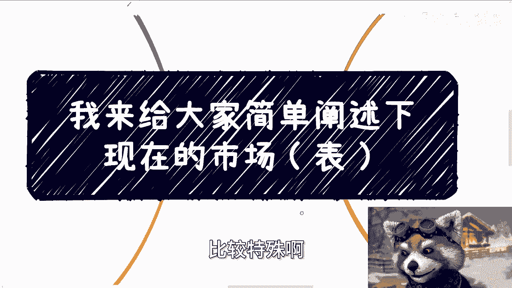

在本节课中，我们将系统性地分析当前市场的整体情况。我们将市场分为四个主要板块：高校端、企业端、政府端和C端（消费者端），并逐一剖析其现状、挑战与机遇。课程将采用“表世界”（公开可见的现象）与“里世界”（更深层的现实）的比喻，帮助你更清晰地理解市场全貌。

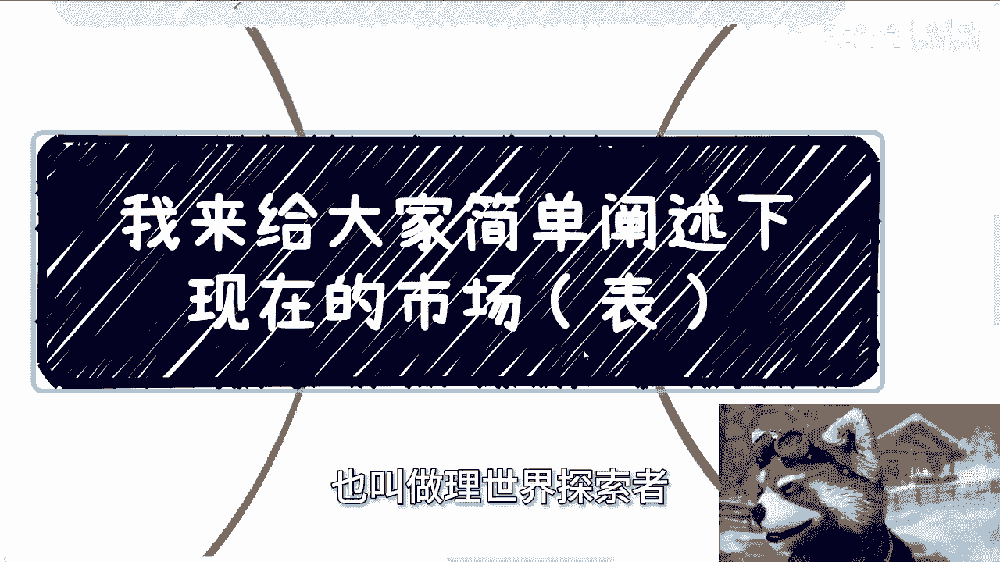

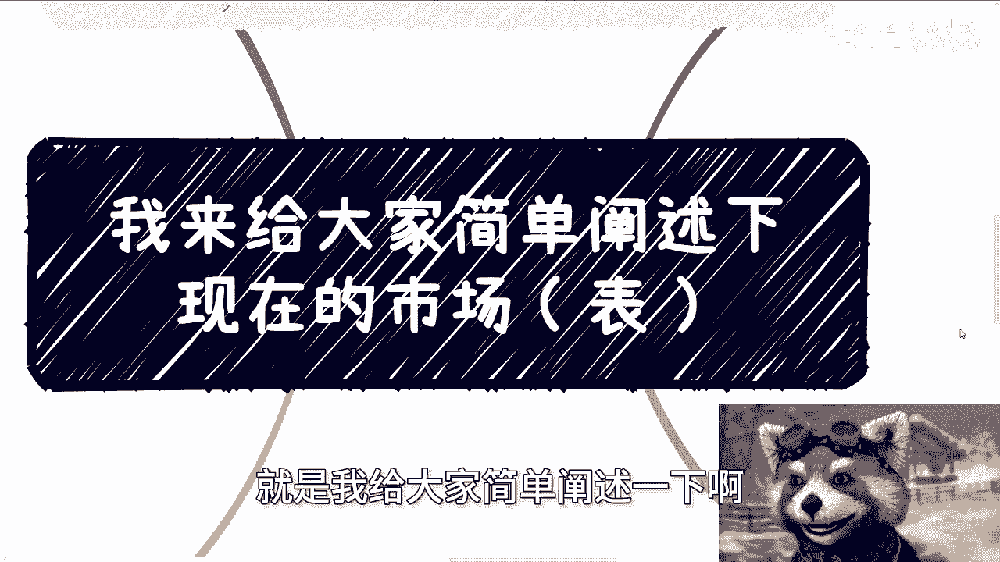

---

## 高校端：预算紧缩与学生代理兴起 🏫

上一节我们概述了课程框架，本节中我们首先来看看高校端市场的情况。

高校端今年面临明显的预算削减。虽然每年的项目类别基本不变，但可用资金大幅减少。许多高校正在裁撤部分专业，这些专业或因教学内容滞后，或因毕业生就业前景不佳。

不过，高校中存在一个特殊且活跃的群体：大学生。当前许多业务正积极发展大学生作为一级或二级代理。

以下是大学生成为理想代理人的几个原因：

*   **基数庞大**：大学生群体数量众多。
*   **认知尚浅**：社会经验相对不足。
*   **经济需求**：普遍有兼职赚钱的需求。
*   **执行力强**：较少受社会规则束缚，行动力强。

此外，高校对外的课程合作项目增多，但下沉市场的学校招生困难，导致项目落地时间经常推迟。

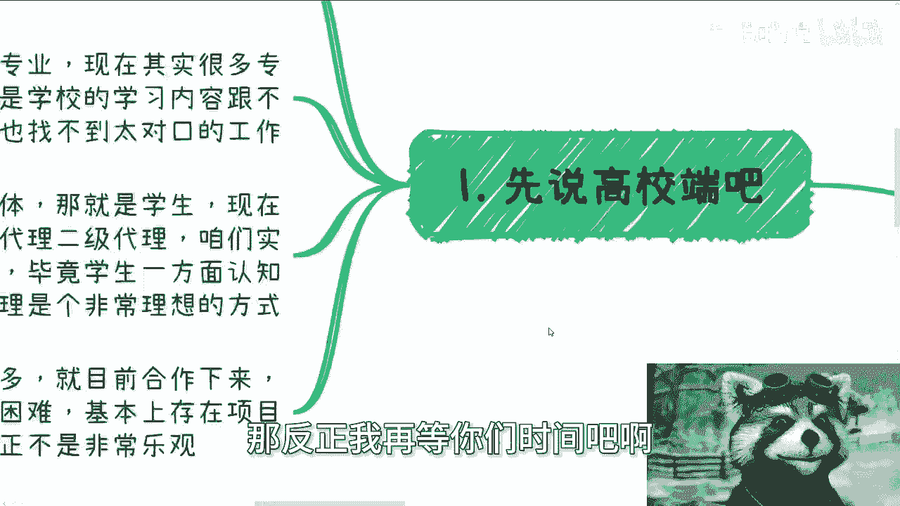

---

## 企业端：需求萎缩与销售思路变革 💼

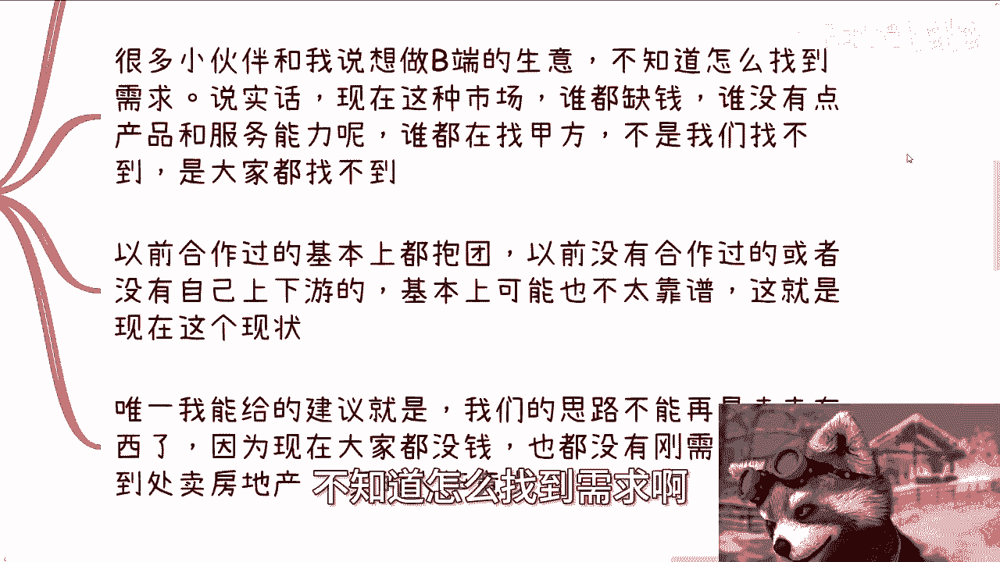

了解了高校端的情况后，我们转向企业端市场。这里的挑战更为严峻。

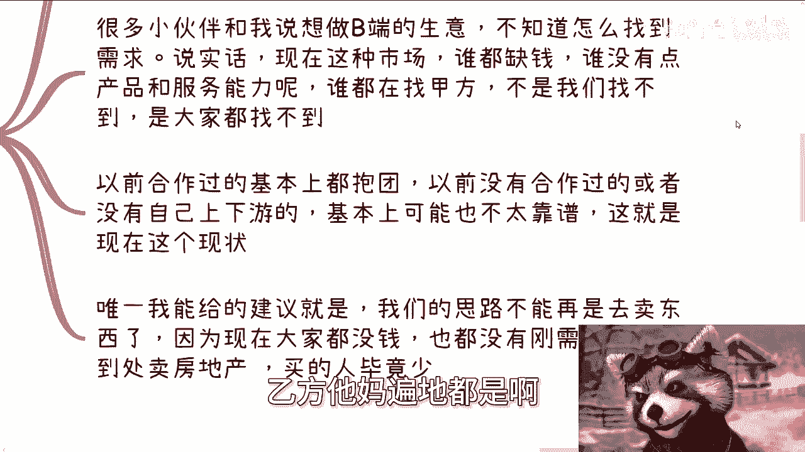

企业端市场目前面临双重压力。一方面，企业需要承担的五险一金等成本不断增加。另一方面，以往合作的甲方客户都在持续削减预算。

当前的市场现状是：**乙方（服务提供方）过剩，而甲方（需求方）稀缺**。拥有稳定上下游合作关系的企业尚能抱团取暖，但对于没有积累的新入局者而言，找到可靠的合作伙伴难度极高。

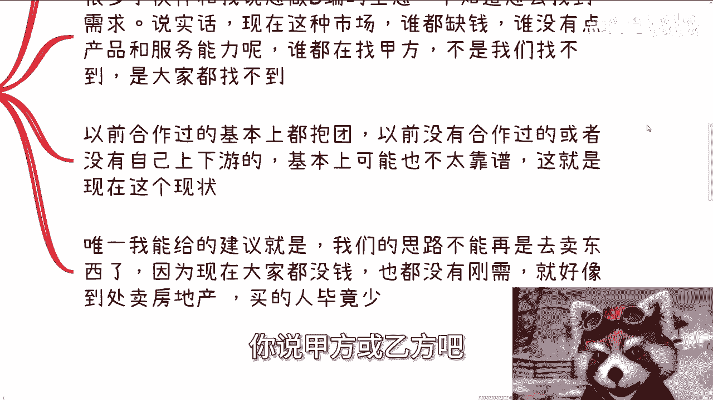

面对这种环境，传统的销售思路需要改变。不能再简单地推销产品。在中国企业端，真正的刚需通常只围绕两点：

1.  **政策强制**：`需求 = 中央命令`
2.  **利润驱动**：`需求 = 明确赚钱`

如果无法满足以上任意一点，企业很难产生购买意愿。

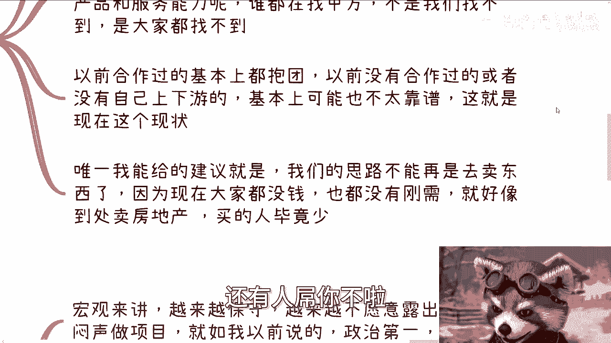

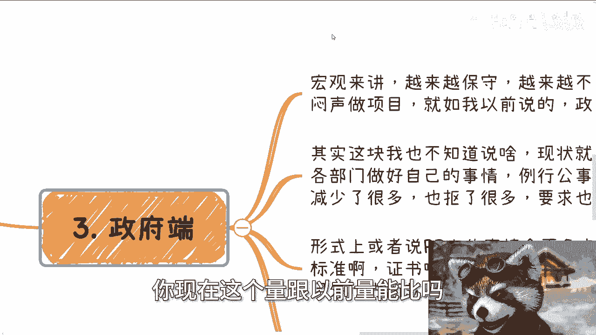

---

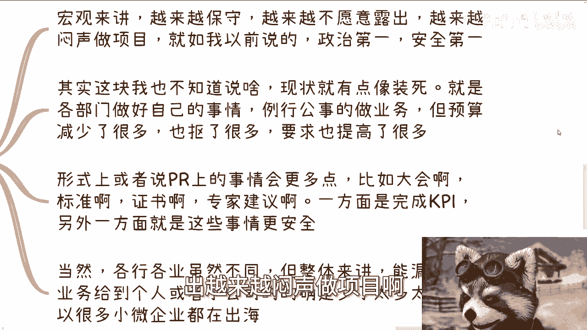

## 政府端：保守运作与门槛提升 🏛️

分析完企业端，我们来看政府端市场的宏观特点。

政府端目前整体趋向保守，更倾向于低调、稳妥地推进项目，将“政治第一”和“安全第一”作为首要原则。

各部门都在按部就班地履行职责，但项目预算普遍减少，审批门槛却有所提高。与此同时，各种形式上的、宣传类的工作（如举办大会、制定标准、颁发证书、专家评审等）可能会增多。这类工作既能满足绩效要求，风险也相对较低。

总体来看，能够释放给个人或小微企业的实际业务机会，相比前几年已经大幅减少。

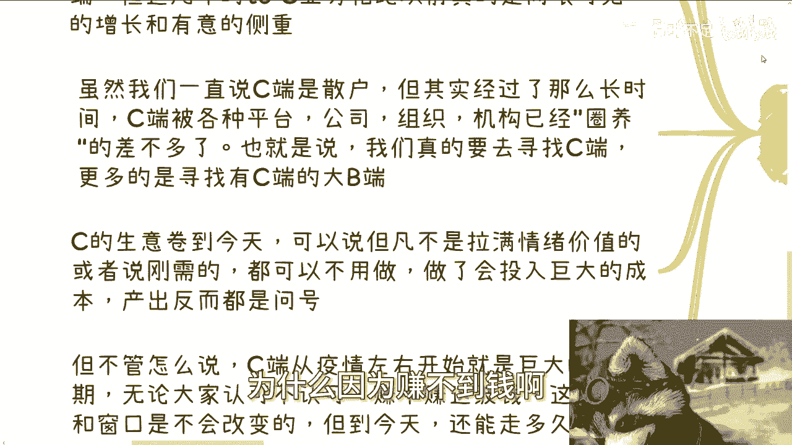

---

## C端：红海竞争与关键策略 👥

最后，也是最重要的部分，我们聚焦C端（消费者端）市场。

从宏观角度看，当前许多利润增长点都集中在C端业务，例如直播电商、在线课程、自媒体、培训等。这是因为B端（企业和政府）赚钱愈发困难。

然而，经过多年发展，C端流量已被各大平台、公司和组织深度整合。因此，现在的关键策略不是直接寻找零散的C端用户，而是寻找**拥有C端资源的关键节点**。

寻找关键节点的公式可以表示为：
`目标 = 拥有C端的大B端 或 KOL（关键意见领袖） 或 社群管理者`

当前的C端生意已经高度内卷。一个简单的判断标准是：如果你的业务不能充分激发用户情绪，或者不是对方的绝对刚需，那么投入产出比很可能不理想。例如，某些培训证书如果不在升学政策中带来实际优势（如加分），对家长而言就不是刚需。

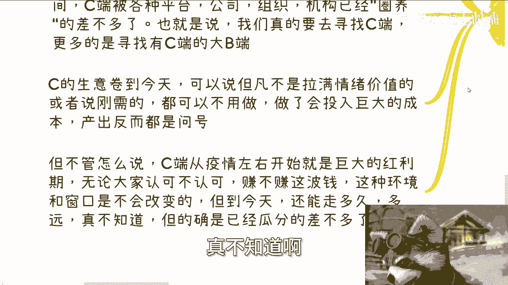

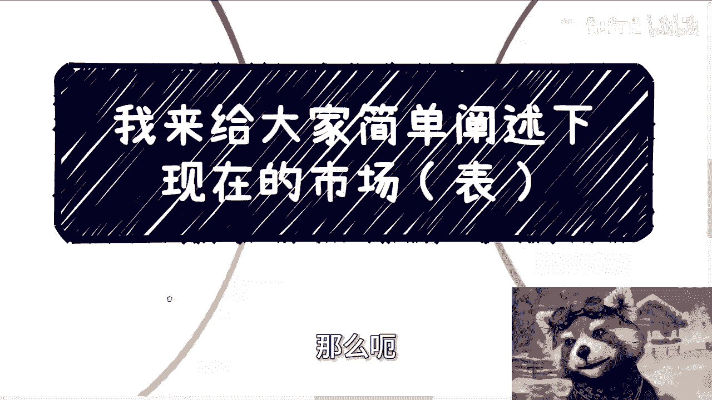

尽管从疫情开始，C端市场经历了巨大的红利期，但时至今日，这波红利已进入尾声，市场被瓜分殆尽，未来能持续多久尚不明确。

---

## 总结与“里世界”现实 🎯

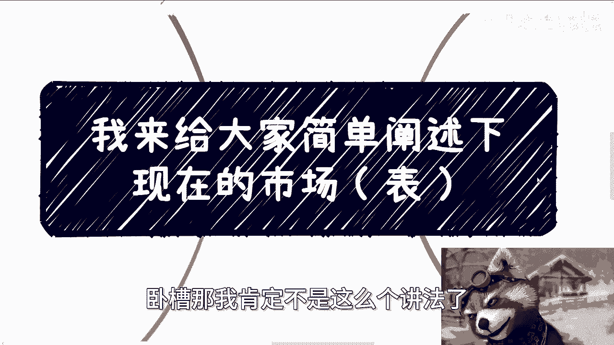

本节课中，我们一起学习了当前四大市场板块的现状。

最后需要强调的是“表里世界”的差异。以上分析是基于公开信息和中立视角的“表世界”描述。而更深层的“里世界”现实是：**实际情况往往比上述描述更为严峻**。如果你觉得上述内容已略显悲观，那么真实环境可能需要在此基础上再下调两档预期。

**核心公式回顾**：
*   企业端刚需：`需求 = 中央命令 或 明确赚钱`
*   C端关键策略：`目标 = 拥有C端资源的关键节点`

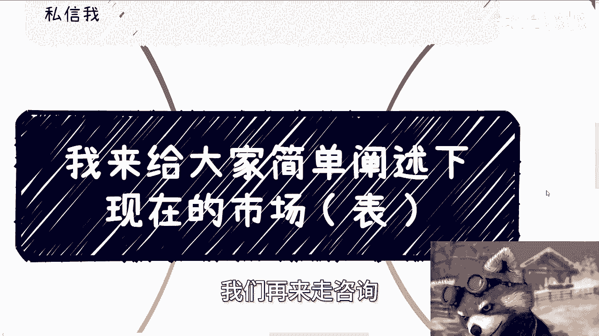

希望本课程能帮助你更清晰地把握市场脉搏，为你的决策提供参考。