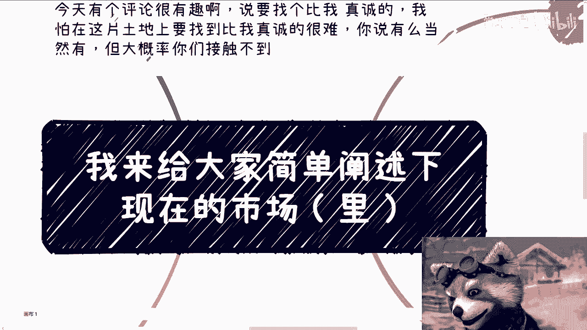
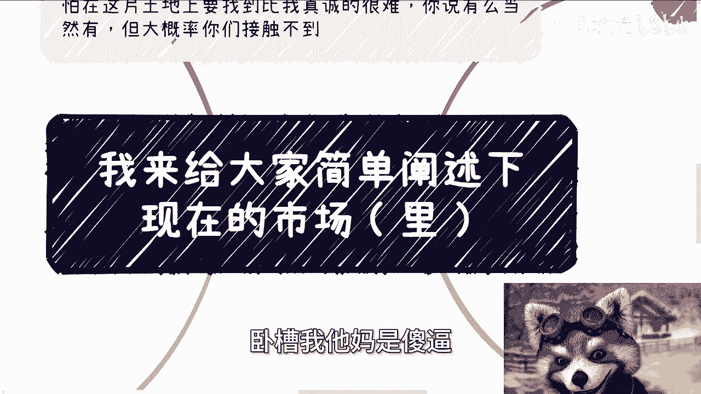
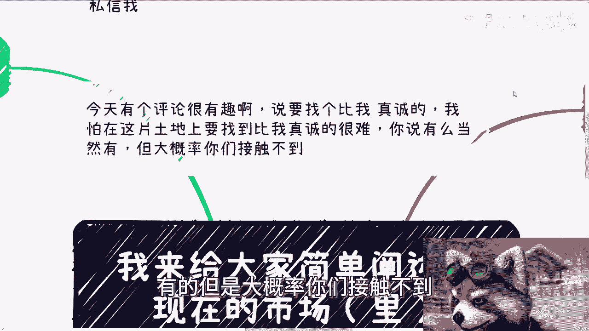
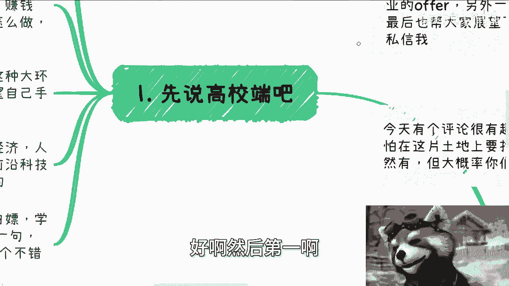
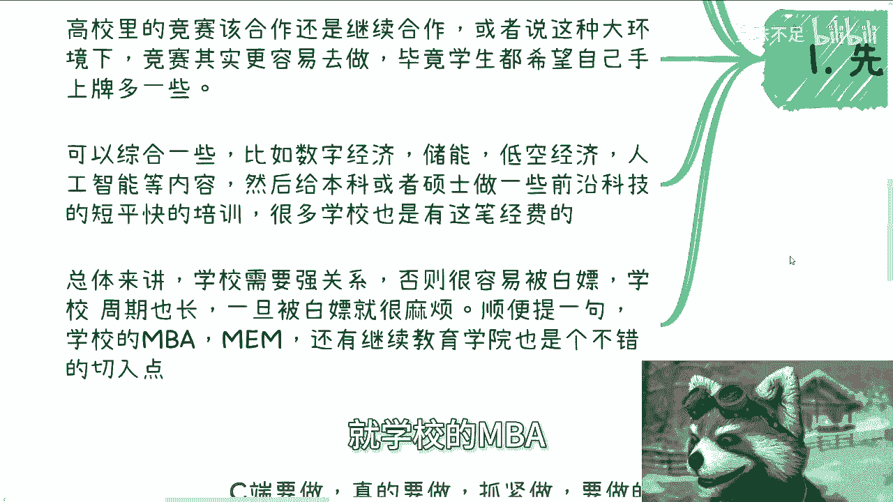
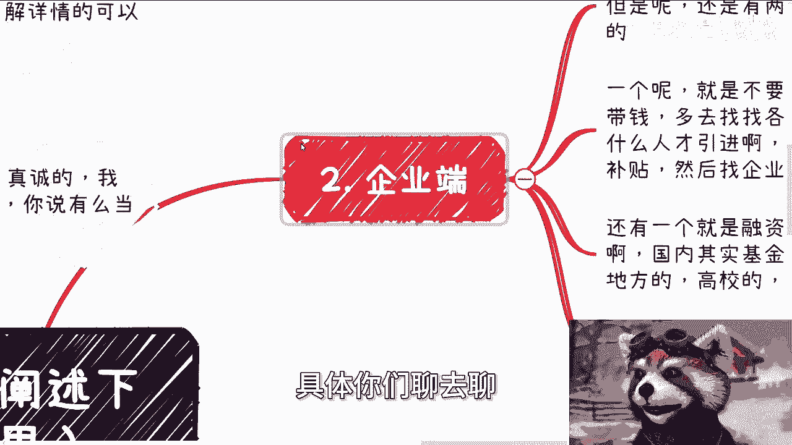
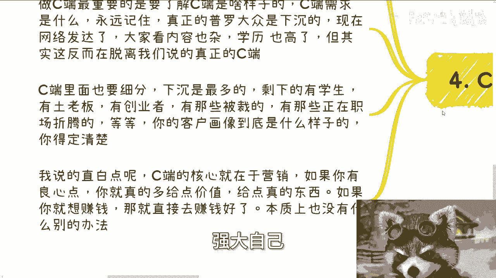
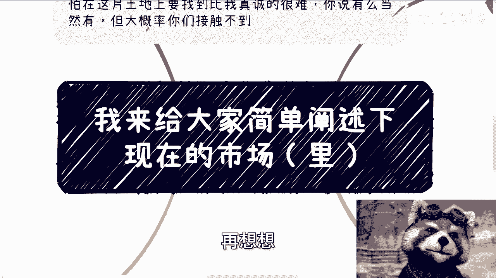

# 市场现状分析教程（里世界篇）- P1 📊

在本教程中，我们将系统性地分析当前市场环境，特别是“里世界”（即非公开或更复杂的商业层面）的现状。我们将从高校、企业、政府和个人消费者（C端）四个维度展开，探讨各自的痛点、机会与策略。

---

## 概述

上一节我们介绍了“表世界”的市场概况。本节中，我们将深入“里世界”，分析高校端、企业端、政府端以及个人消费者（C端）在当前经济环境下的真实状况、核心痛点以及可行的切入点。

---

## 高校端 🏫

高校端目前存在合作机会，但逻辑已发生变化。

新的热点领域，如专业共建、产业学院、师资培训、学习软件采购等，每年仍有资金支持。但资金总量在减少，同时KPI考核依然存在。这意味着项目可以做，但需要更精准地满足需求。

高校与学生的核心痛点非常明确：
*   **高校的痛点**是**就业率**。
*   **学生的痛点**是**赚钱**（或获得赚钱能力）。

因此，与高校洽谈合作时，以“提升就业”为切入点会比前两年更容易。面向学生，切入点则非常广泛，例如恋爱、赚钱、留学等，因为学生基数庞大。一个简单的商业模式是：**创建付费社群或俱乐部**，例如“学生的第一堂商业课”，收取年费。

高校内的竞赛合作在当前环境下也更容易推进，因为学生希望为自己的简历增加筹码（如竞赛名次、证书、荣誉等）。可以结合数字经济、储能、低空经济、人工智能等热点内容，为本科生或研究生提供前沿科技的短期校外培训，许多学校也有相关经费。

**核心要点**：与高校合作需要**强关系**，否则极易被“白嫖”，且高校合作周期通常较长。

此外，高校的**MBA/MEM项目**以及**继续教育学院**也是潜在且优质的合作方，有具体的切入点可供挖掘。

---

## 企业端 🏢

企业端目前普遍预算紧张，直接让其付费非常困难。

正如“表世界”所述，有两个方向可以切入：
1.  **不要只想着向企业要钱，要想着给企业带钱**。多寻找地方政府提供给企业的各类补贴（如人才引进、科技创新补贴等），然后与企业合作申请，从补贴中分得一部分作为收益。
2.  **融资顾问（FA）服务**。多对接国有基金、美元基金以及各类地方性、高校创业基金等，帮助企业融资，从中获得佣金。

在当前环境下，如果仍试图以传统销售或商务推广的方式，向企业推销自己的产品或服务，将极其困难。需要转换思路，从“为企业创造额外价值或资金”入手。

---

## 政府端 🏛️

政府端预算同样有限，合作的关键在于**迎合其诉求与KPI**。

不同省、市、区以及不同职能部门的侧重点各异。但从轻量级合作的角度看，政府的需求通常集中在以下几类：
*   **找专家**
*   **找企业**
*   **找投资**
*   **办活动**
*   **办大会**
*   **定标准**

例如，即使某个地方政府有能力自己举办20场活动，但如果你能提供“打包服务”，帮其承办其中的5场，为其省去主题策划、嘉宾邀请、宣传推广等繁琐工作，这便是一个清晰的合作点。

与政府合作时，心态要摆正：初期合作不一定以直接赚钱为目的。**政府愿意与你合作，本身就是一种资源和信任的背书**。目标是通过初次接触，建立联系，并在后续沟通中逐步探寻更深层次的项目合作机会。上述“找活动、办大会”等只是浅层切入点，而非最终目的。

---

## 个人消费者端（C端） 👥

如果想做C端业务，行动要快，不要犹豫，因为竞争已非常激烈。

做C端业务，首要任务是**真正理解你的目标客户**。必须清醒认识到，我们大多数人其实并不了解真正的“下沉市场”。即使身处四五线城市，也可能因教育、职业、圈层等原因与更广泛的C端需求脱节。

C端市场需要进一步细分，例如：
*   学生
*   本土中小企业家（“土老板”）
*   创业者
*   被裁员人员
*   普通职场人士
*   ……

你的产品或服务必须**精准定位**某一类细分人群，妄想“一网打尽”所有C端用户是不现实的。

**C端的核心在于营销，而非产品或服务本身**。如果你有良心，就在赚钱的同时，为用户提供真实价值。如果你只想赚钱，那就专注于营销和转化。最糟糕的情况是：**既有道德负担，又不懂营销，最终赚不到钱还陷入内耗**。

对于个体而言，首要目标是突破自身圈层（“象牙塔”），先积累资源和实力。强大自身之后，才有能力去承担更大的社会责任。

---

## 总结与建议 💡

综合来看，当前市场环境确实充满挑战，并且明年可能会更难。尽管政府出台了一些刺激政策（如复兴教培、支持K12等），但经过多年发展，中国市场的各个细分领域都已被深度开发。

在中国市场赚钱，策略需要**彻底**：
*   要么彻底“用爱发电”，追求理想和价值。
*   要么彻底务实，优先解决赚钱和生存问题。

不要空谈长远规划，任何长远的成功都是由一系列“短平快”的胜利积累而成的。对于普通创业者或从业者而言，要避免投入**沉没成本**过高的项目（例如耗时半年一年却无确定回报的业务）。控制试错成本，快速迭代，是更稳妥的策略。

---

## 本节课总结

本节课我们一起深入分析了“里世界”的四大板块：高校、企业、政府和C端。我们探讨了各板块的现状、核心痛点以及潜在的切入策略。关键结论是：**关系、价值置换、精准定位和敏捷行动**是在当前复杂市场环境中生存和发展的重要原则。无论选择哪个方向，都需要基于现实，灵活调整策略。