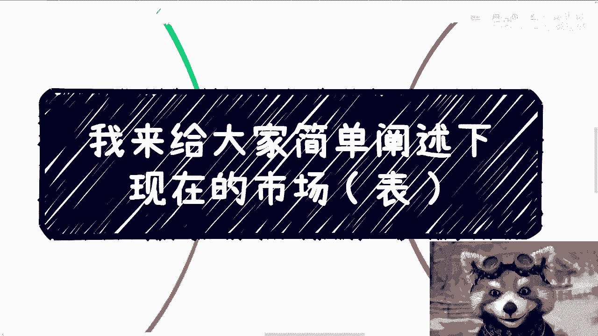
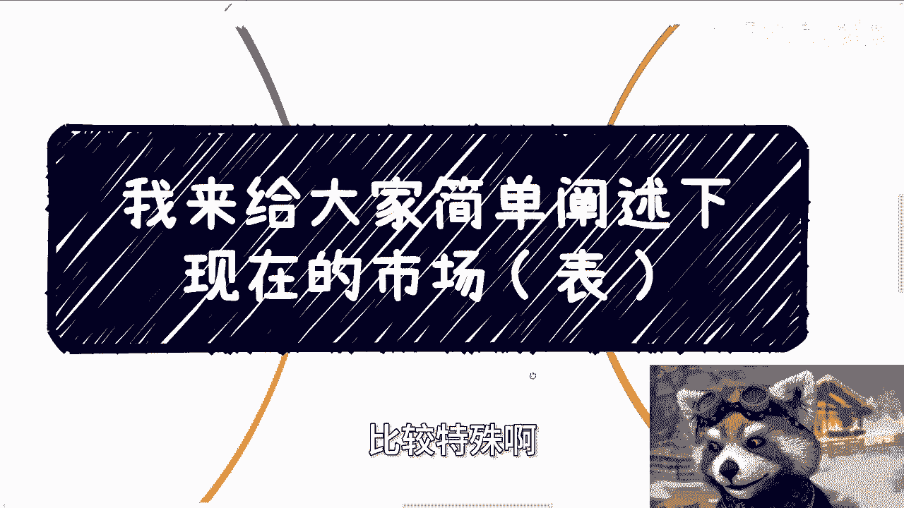
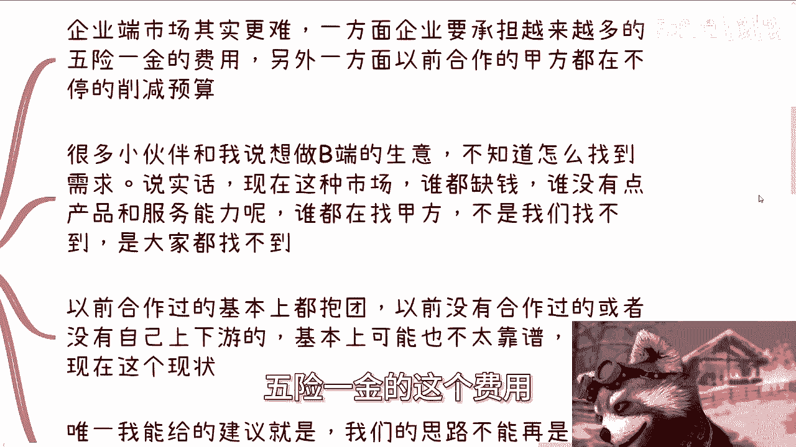
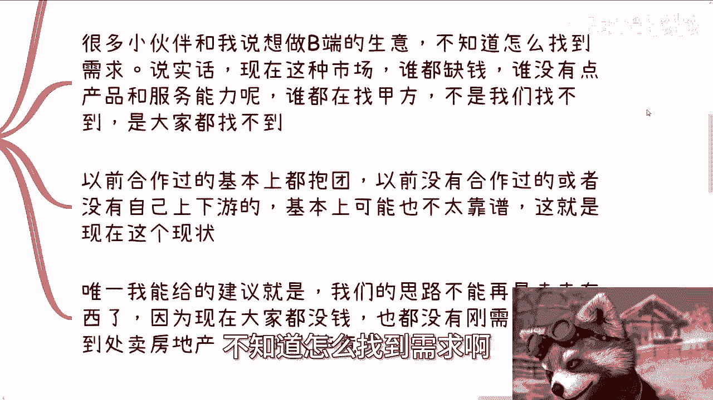
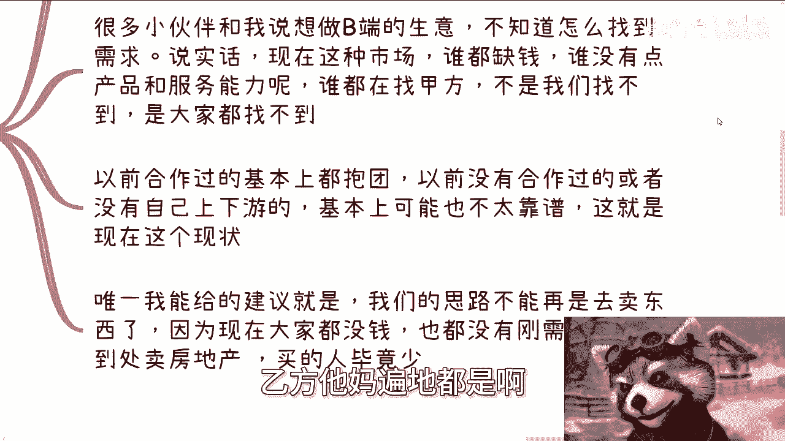
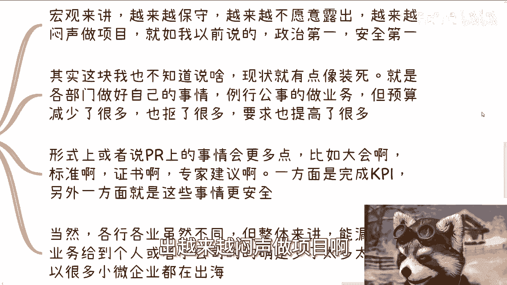
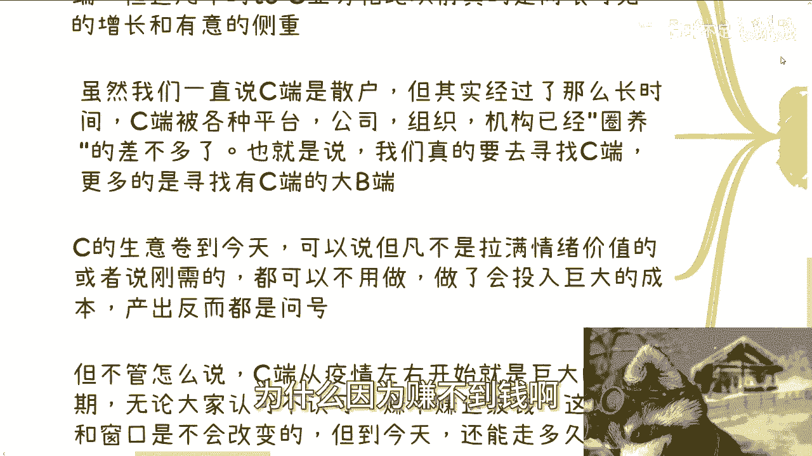
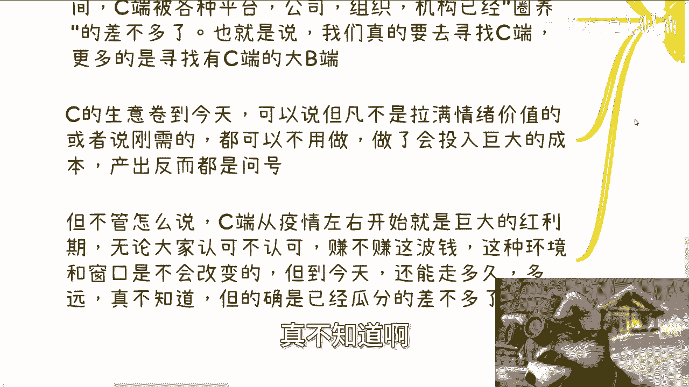
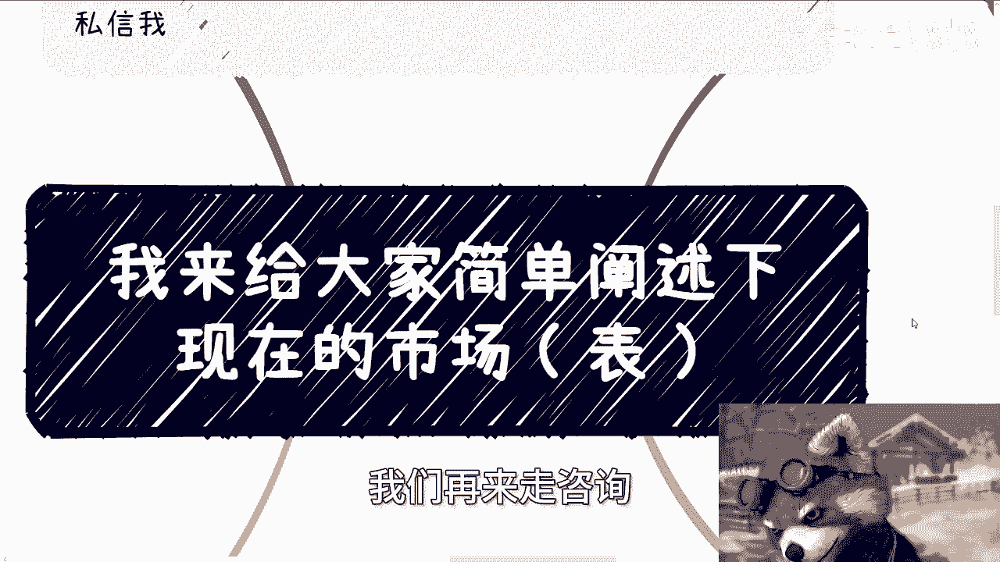

# 我们来整理下当下的市场情况（表） - P1 - 赏味不足 - BV1RM4m1y7Z6

好大家好，今天我们来讲这个主题呢比较特殊啊。

我分成了表里世界啊，这个了解过寂静岭的小伙伴都知道对吧，这个表世界代表什么，里世界代表什么啊，啊我我，我在B站上面给你们的那个叫什么充电的，那个名字，也叫做里世界探索者对吧。

其实也是一个道理啊，那么今天我们来给大家讲的呢，就是我给大家简单阐述一下啊。

就是当下的整个的一个市场啊，那么首先呢下一期活动已经定了，在本周日啊，8月11号啊，在长沙，在长沙，那么大概主题的话呢，一个是围绕不同的企业的offer，就国央企啊，私企啊，民企啊，外企啊对吧。

这样子啊，那另外一方面呢，就是说围绕大家个体去做自媒体和跨境电商，那么最后呢也帮大家去展望一下，这个接下来未来啊，那么报名或者了解详情，可以私信我好，那么我们一个个来说啊，先说高校端。

高校端呢今年是肉眼可见的，没钱啊，没有预算，说白了，而高校每一年该能做的项目呢还是能做啊，类目呢还是那些类目，但是预算呢锐减啊，那么有的高校呢还在砍以前很多的一些专业啊，甚至就是说嗯把一些专业砍了。

倒不是说是新增专业，那么现在其实很多专业呢也的确跟不上，一方面是学校的内容他跟不上，另外一方面呢是专业这个专业出来之后，可能也找不到太多直接对口的工作，那么这个对于学校跟学生来讲。

也都是非常困扰的一个事情啊，那不过高校里面呢有个非常特殊的群体，那就是大学生啊，现在很多业务都是找大学生来做一级代理，二级代理的啊，但凡你们了解过，你们就会很清楚这个活呢他非常的嗯怎么说呢。

非常的贴切啊，就咱实实事求是来讲，效果是很不错的，为什么呢，因为大学生一方面基数很大，那另外一方面呢大学生很认认知还比较浅薄啊，再另外一方面呢大学生也缺钱，所以说当他们看到一些小目小蝇头小利的时候。

他就会哎也很喜欢去做，而且他们做呢还就毕竟他们没有接触过社会嘛，所以说很多大学生做事情呢，他还没有那种哼就很多这种规规规矩啊，或者这个框架的束缚，所以你会发现他们很多大学生啊做事情放得开。

尤其是做一级二级代理的，他不管啊，反正就是拉人头嘛，对不对，那那那那只要不超过二级代理，又不算传销啊对吧，就拉人头嘛，谁不会嘛啊，那么呃学校对外的课程呢其实也越来越多，就目前合作下来呢。

一些下沉市场的学校招生其实也非常困难哦，基本上存在项目落地时间一拖再拖，就包括我最近合作一些这个学校啊，他们给我的项目，本来本来还说呢，8月11号12号要去那个叫什么厦门啊，后来就脱了，说招生没招满啊。

我说那算了，那反正我在等你们时间吧。

啊啊这是第一个第二个企业端啊，企业端市场呢其实更难啊，因为一方面企业你会发现，每个地方的企业要承担越来越多的，五险一金的这个费用。

另外一方面呢，就是以前合作的甲方呢都在不停的削减预算，那么很多小伙伴就跟我和小伙伴跟我说啊，就说做想做B端的生意啊，不知道怎么找到需求啊。

我说实话啊，现在这种市场谁都缺钱，谁没有一点产品跟服务的能力呢，对不对，就像我说的，满地都可以找乙方，乙方他妈遍地都是啊。

谁都在找甲方，不是我们找不到，是大家都找不到啊。

以前合作过的基本上都在抱团，以前没有合作过的，或者还说没有自己上下游积累的，基本上我跟你们讲，要现在去找到一些能合作的，你说甲方或乙方吧。

唉呀难度很高啊，呃这就是这个现状，就咱们不要去想着说一定有什么呃方法，方法论或者什么东西能打破这个现状，我们再牛逼，不能跟环境左右啊，对不对啊，那另外一方面呢，就是说我觉得唯一我能给的建议是什么。

就是我们的思路不能再去卖东西了啊，这个销售思路得变啊，就是说因为现在大家都没钱，而且也没有刚需，就像我以前一直说的，一一直强调那两点，在中国企业端的刚需是什么，就是两个东西，你要么就跟企业说。

他妈的这个是中央的命令，你要么就跟企业说，你做这件事情能赚钱，否则别跟我逼逼，人家不会来踩你的啊，这就好像你现在到处在卖房地产，还有人叼你们了。

对不对，当然有的当然有啊，但毕竟少啊，你现在这个量跟以前的量能比吗啊。

那么第三政府端宏观点来讲，政府端现在就是越来越保守，越来越不愿意露出，越来越闷声做项目啊。

就如我以前说的，政治第一，安全第一啊，其实这块呢我也不知道说啥，因为现状就有点像装死，就是各部门呢都在做好自己的事情，例行公事的做业务，但预算减少了很多，也抠了很多，同时门槛还提升了很多。

那么形式上或者还说pr上面，就是我们说的这种宣传，宣发上面的事情可能会更多，比如说什么大会啊，标准啊，证书啊，专家建议啊对吧，那一方面是为了满满足这个KPI，另外一方面是这些事情相对来讲都更安全。

对不对啊，包括网络上各地举报，你们也看到了，对不对呃，封口哎，不是封口，叫叫做风声很紧对吧，那当然啊，各行各业虽然不同，但整体来讲呢，能录下来的业务给到个人或者小微企业的，我觉得已经少太多了。

就就就相比呃222年21年二零年啊，或者说115年到20年这段时间吧，就相比那个时间来讲就少太多少太多了啊，所以说就是很多小微企业也都在出海嘛对吧，那么第四啊，最后就是最重要的C端呃，宏观角度来讲啊。

其实你们会发现，现在基本上都是在赚C端的钱呃，直播电商啊，高校各各种对外的课程啊，政府各种对外的证书啊，各种自媒体啊，活动啊，培训啊，巴拉巴拉巴拉嘛，反正都一样啊，那当然啊我们不能不不能否认一点。

就是无论高校还是企业还是政府等，最后它落到每个人身上，其实也就是所谓的C端，但是这几年to c的业务的确是相比以前，真的是肉眼可见的增长和有益的侧重，为什么，因为赚不到钱啊。

虽然我们一直是说说C端是散户，C端是散户，但其实经过这么长时间，C端已经被各种平台公司，组织机构等圈养的差不多了，那也就是说我们真的要去寻找C端，更多的寻找的是拥有C端的大B端。

或者就像我们跟你跟你说的，就拥有C端的KOL，就是那些啊什么大V对吧，或者说拥有C端的社群啊，或者拥有C端的那种就管理者对吧，机构啊，你要找的是这种，而不是说直接去找C端，你直接去找C端。

我觉得到2024年也很难找啊，那么C的这个生意呢，卷到今天可以说我我我可以一刀切，就是说但凡你不是情绪拉满，或者但凡不是对方的刚需，你都可以不用做，因为做了都会投入巨大的成本产出。

我不能说你产出大还是小，但是产出就是个问号，对不对，你就我给你们举个例子，你就像很多人跟我说，他们做那个什么啊，小升初啊，初升高啊，一些什么什么证书类培训，我说那这个证书在当地政策上面有扶持吗。

有没有明确的扶持，比如说有没有加分对吧，有没有就是说啊能够进入重点大学对吧，进进入重点高中的这种，这这这这这叫什么优先权对吧，我说但凡政策上没有，那你说做这个证书做了有吊用啊，对不对。

那你但凡没有这种优先权，优先权没有加分，你这不是刚需啊，你对家长来讲就不是刚需啊，谁他妈来报啊啊，但不管怎么说啊，C端从疫情那个时间点开始，到现在就是巨大的红利期，无论大家认不认可。

因为我们是那个大环境，是不由我们个人所左右的嘛对吧，那么我不管大家认不认可，赚不赚这波钱，这这个呃当下的这个环境和窗口，它是不会改变的，但是到了今天，其实就按我一直说法，就是夕阳中的夕阳。

到底C端这波红利还能走多久，能走多远，真不知道啊。

但的确都已经瓜分的差不多了，这有一说一啊啊，那么额最后来总结一下啊。

就是从表示检角度来讲，就是我们看到这些东西啊，我只能这么说啊，就是如果你们从刚刚我的描述上面能够感受到，我是一个中立，或者说你们自己觉得呃，听下来好像还算一个比较中立的一个观点的话，那么我可以告诉你们。

事实层面就是我们说的理世界对吧，就事实层面比这个要肯定要差很多，而如果你们听下来已经是偏向中性偏啊，叫做悲观的，或者偏，就是说嗯，就是就是就是就相对来讲比较差的，这么一个环境的话，那我就跟你们讲。

你们得要往差的那个环境再拨两档啊，就是这么个情况，因为毕竟对吧，就是说在这当中我毕竟是在网络上跟你们讲嘛，对吧，那如果今天比如说就是一个私人局啊，比如说就那么两三个人对吧，我们吃个饭，那我操。

那我肯定不是这么个讲法啊。

哼好吧啊行，那就这么着啊，然后那个长沙长沙这个活动啊，11号好吧，11号下午啊要报名和了解了解详情的，继续私信我，那另外一方面，就是说你们现在自己这个工作上面啊，包括你们跟别人一起做一些业务。

或者你们自己想要去做一些副业，或者怎么样的呃，这当中可能会涉及到一些呃业务规划啊，包括这个客户画像啊，包括合同啊，分红啊，分润啊，股份啊，期权啊，项目计划书啊啊等等等一些东西啊。

你们希望通过我的一些视角呃，结合你们个人的情况跟个人背景，能够给你们一些更贴近地气的一些建议，或者说让你们少走点弯路的话，你们可以整理好个人的背景跟详情问题啊，我们再来走，咨询好。

