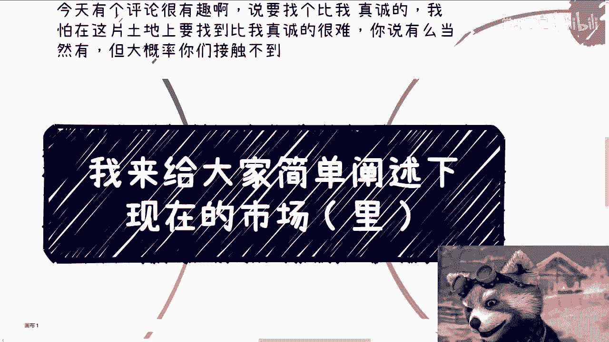
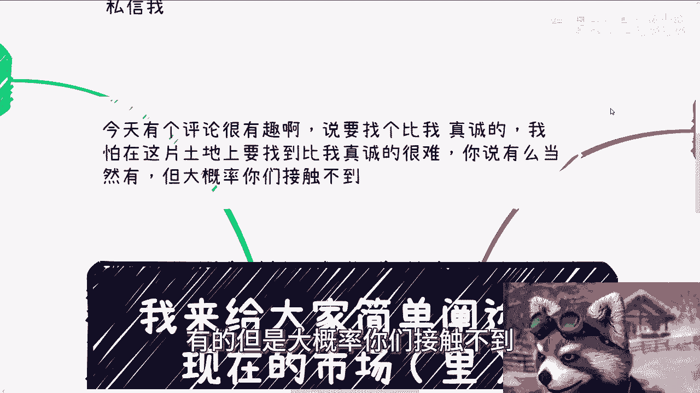

# 我们来整理下当下的市场情况（里） - P1 - 赏味不足 - BV1jr421M7J3

哈喽大家好啊，我刚刚表世界那个视频已经给你们上传了啊。

然后这个就是李世界的对吧，首先我跟你们讲，我很不开心哈，我刚刚打了一盘星期二的天梯吗，打到一半，我感觉那个无线鼠标哎呀，起码他妈有500ms的延迟，我他妈立马下单了一个有线的，我他妈是。

哎唉呀就是无解啊，难过啊啊，然后那个呃叫什么啊，今天啊我先说一下吧，下一期活动经定了好吧，本周日啊，8月11号在长沙啊，然后大概的主题的话呢，一个是围绕不同企业的这个offer的一些发展，包括呃民企啊。

国央企啊对吧，外企啊对吧这些，然后另外一个就是围绕自媒体，还有跨境电商啊，这个当个人做的一些发展，然后最后我也帮大家展望一下未来呃，报名或者了解详情的可以私信我啊，然后今天呢还有个很有趣的评论啊。

我也要说一下，就是说他说啊，如果他原话是这么说的啊，我估计你们有人看到原话说的是，如果我未来有孩子的话，我要找一个比up主真诚的人啊去沟通，呵呵妈把我气笑了哈，我我只想这么说啊，我可以很负责任的说。

我怕在这片土地上要找到比我真诚的人很难，你说有吗，有的，但是大概率你们接触不到。

我就就这么个情况啊，好啊，然后第一啊我们来讲李世界的故事啊。

第一先说高效端啊，首先新的领域热点领域专业共建产业学院，师资培训，学习软件的采购，该有的也都有啊，每一年同样都有资金支持，只不过就是就如我表世界里面所写的，就知资资金减少，但是呢每一年KPI都是有的。

要做还是可以做的，高校跟学生现在痛点是什么，是就业是赚钱对吧，就是说高校痛点是就业，学生痛点是赚钱，那么高校现在去谈就业，就会比我们前两年去谈更容易啊，也算个切入点，那么学生的话的切入点太多了啊。

比如说谈恋爱啊，赚钱啊，留学啊，妈的什么都可以，为什么，因为学生基数实在太大了啊，我给你们打个比方，之前还有个人专门做什么，做叫做给学生的第一堂商业课，卧槽一个人他妈收个年费，就叫做什么商业俱乐部啊。

一个人收个年费999，卧槽他妈收的不太啊啊呃但是还是那句话，我觉得先不说大家赚多少钱啊，随便怎么做，小钱肯定赚得到的啊，那么高校里的竞赛呢该合作还是要合作的，或者来说这种这种当下的大环境下面。

竞赛其实更容易去做，因为毕竟学生都希望自己手上牌多一点对吧，你比如说弄些什么竞赛啊，弄些什么证书啊，弄些什么名誉啊对吧，怎么样的东西啊，呃但是咱话又说回来啊，就是我也得跟你们实话实说，就是这些吊毛东西。

如果你们不是自己去做，如果你们是去这个参加的话，我就告诉你们，这些东西在社会上没什么太大用处啊，可以综合一些，比如说数字经济啊，储能啊，低空经济啊，人工智能啊等一些热点内容啊。

然后呢给本科或者硕士做一些前沿的科技的短，评外的培训，这也是可以做的，而且很多学校呢也有这笔经费，那么总体来讲呢学校需要强关系，记住啊，需要强关系，否则很容易被白嫖，就学校整个周期一般都很长。

一旦被白嫖就很麻烦哦，哦我顺便写这个x man的时候，我也提，我也想到一点，还有一点要补充的，就学校的NBAMEM。

还有继续教育学院也是个很不错的合作方啊，很有切入点，具体你们得下去了好吧。

第二企业端啊，说实话企业端基本上呢就是现在就装死，要抠出来钱很难，但是就如我表示，界里面所写的，有两个东西是可以去切的，至少我认为是可以去切的，一个呢就是不要老想着问企业要钱，要想着给企业带钱。

多去找找各地方当地的补贴给企业的，不管是什么人才引进啊，新科技啊对吧，还是什么各种各样的东西，多找点政府一定有的啊，不一定有的啊，然后找企业啊，找企业合作，那么这里面呢其实钱也不少，哎说白了怎么赚呢。

你跟企业一起拿补贴嘛，然后你你在补贴里面分一部分嘛对吧，还有就是融资，就我们说的FA啊，多找点国有基金，美元基金，国内呢其实基金分值也很多，个人的私募的地方的高校的大学生创业的，卧槽不要太多对吧。

那么这些还是有切入点的啊，但是当下这个环境跟中国这个土壤呢，想要问别人要钱或者推销自己的产品or服务，给别人，我跟你们讲基本就别想了，你明白吗，就就你们审视一下自己的服务。

如果还要想着以这种销售或者商务的形式，推给别人，很难很难啊，第三政府端预算很少，我们能做的只有迎合他们的诉求，迎合他们的KPI，每个省市区的侧重点不一样，每个领域肯定也是不同的。

但是啊你要从轻量级的角度来讲，无非就那么几种，找专家，找企业，找投资，找活动，找大会，找标准没了，记住对吧，就什么意思呢，就比如说哪怕科技厅啊，农业厅，金融厅对吧，或者各个其他各个支线对吧。

就是你说我想从呃，我我想以自己的这个角色，或者以这个民企，一家私营企业的角色跟对方合作，怎么合作呢，很简单啊，政府要的是什么，缺专家啊，缺干活的专家，缺企业，缺能够投资的企业，缺能够申报项目的企业。

缺投资就是缺能够来投钱的人，缺活动，能够来承办活动人，缺大会，承办大会的人，对不对，就是你们不要觉得政府都不缺，我跟你们这么讲，你们仔细想想看，就是就算你们不做，比如说啊，比如说某个城市的政府。

他一年办20场活动，可不可以办，可以办，但是他很烦啊，他要他要定主题，他要找专家啊，要找嘉宾啊，还要做做大会的这个宣发啊，做很多东西，如果你现在跟他说，你有现成的，直接帮他办个五场市场。

TMD他不开心吗，对不对，一个道理呀，就说白了政府最好的合作点，你就是帮他们找资源，他们缺什么，你帮他找，你不行，你就找行的资源啊，当然你跟政府合作，不要只想着赚钱，政府不给你钱，给你跟你合作。

已经给你莫大的面子了，你心里面一定要有逼数啊，我们要的是跟他们从不认识到认识，然后通过一次一次的沟通，去摸索到更深层次的项目或者合作点，我们说的上面那种呀，完了完了完了完了，哎我操什么鬼东西啊。

我按我我他妈的了，按了一个锁屏键啊，那么你比如说通过一次次沟通，去摸索到更深层次合作，我们说的上面那些合作，比如说找投资啊，找活动啊，找大会啊，其实都是非常表面的，也都是非常浅层次的啊，你们就是要切入。

可以从这里切入，但是这不是我们最终目的，那么第四就是C端啊，C端要做的真的如果要做，我跟你们讲就抓紧做，不要想那些有的没的要做的话，就别犹豫，毕竟现在谁都在做，做C端，重要的是要了解C端什么样子。

C端的需求是什么，你永远记住你也好，我也好，我们这些人，大部分人其实都是不了解下沉市场的，哪怕你在下沉，你在四五线城市，你也不了解下沉市场，没有办法的，你知道吗，就是你在没有真正去了解之前。

你就是不了解的好，那么现在网络发达了，大家看内容也砸了，学历也高了，但其实这反而是让我们脱离，我们所谓的真正的C端，另外一方面，C端里面你也要细分，比如说下沉市场里面有很多，剩下的剩下有什么，有学生。

有土老板，有创业者，有那些被裁的，有那些正在职场里折腾的等等等，这些都是C端，你不可能跟我说，你今天给一个服务，给一个产品，他妈的一网打尽，你一定是针对某一个C端对吧，你要想明白，如果你想不明白。

你定不清楚，你根本就赚不到钱啊，那么我再说的直白一点，C端的核心是在于营销，不在于产品，也不在于服务，如果你是有理有点良心的，那么你就真的在给C端赚C端钱的时候，多给C端一些价值，给点真的东西。

如果你没有那些良心，没有道德观，那也无所谓，如果你就想赚钱，那你就直接去赚对吧，我说了就是最最最不希望看到的是什么，就是你既赚不到，你，又有很有良心啊，然后你也不懂营销，然后你在赚不到钱的情况情况下面。

还自我内耗，然后还自己整抑郁了，或者自己啊这个这里不行，那里不行的，没有意义的，因为我们每一个人，就像我之前讲的那个那个突破啊，楚门的世界对吧，一样的道理，就说我们每一个人都是在一层甚至N层，象牙塔内。

对于我们每一个个体来讲，我们首先是要突破象牙塔，先赚到钱，强大自己再去给社会做贡献。

再去给大众做贡献，你否则你现在你你你你怎么做，你告诉我对不对啊，温水煮青蛙，煮到最后就是自己熟了没了对吧，所以说我最后额就是综综合来讲，我给你们总结一下，就是当下处于一个很难的状态哦，很难的状态呃。

明年可能更难，从目前来看，明年可能更难啊，那么虽然啊就是说最近政府也出了一些政策嘛，包括就是说复兴教培啊对吧，包括一些这个K12的教育啊，包括加各种东西啊，但是还是那句话，发展到2024年。

其实整个市场上面就像我表世界里面写的，所谓的C端，其实都是基于平台，都是基于运营呃，社群基于很多东西的，你不要看中国14亿人，该该被瓜分的也都瓜分了哦，所以说就是说就像我之前跟你们讲的。

如果啊要在中国这个市场里面赚钱，你们一定要彻底，就是要么就是彻底的用爱发电，要么就是彻底的先去赚钱啊，不要想着那些很长远的东西，因为你在那我不是说不支持做长远的东西，但是再长远的东西。

都是由一个一个短平快的东西积累起来的，你否则的话就是我们一直说的那一点，就是你今天做个业务，如果花半年一年投进去，那你的沉没成本太高了，我们每个人作为一个普通人，谁有这么高的沉没成本去付出啊，没人的啊。

所以说这一点大家一定要明白，就无论做什么事情一定要明白好吧，哦基于以上这些，反正你们可以再想想啊，再想想行啊。

那么就这么着啊，然后那个呃活动啊，活动这边要参与的继续报名好吧，本周日啊长沙，然后剩下的话就是说你们自己这个工作上面啊，包括跟别人一些合作啊，包括就是呃这个合作过程当中啊，副业过程当中有些什么职业规划。

商业规划啊，股权啊，合同啊，呃呃股份啊，分红啊，分润啊对吧，包括各种各样的一些规划，如果你们不清楚的啊，或者说呃模棱两可的，你们可以整理好对应的问题跟个人背景好吧，然后我我们再来走咨询啊。

然后也我也可以说，根据你们个人的这个具体情况情况，给你们，符合你们个人情况跟当当下这个呃经济发展，或者说整个环境的这么一个啊规划跟建议，好吧行啊。

