# 课程 P1：深入探讨读书与学历的目的 🎯

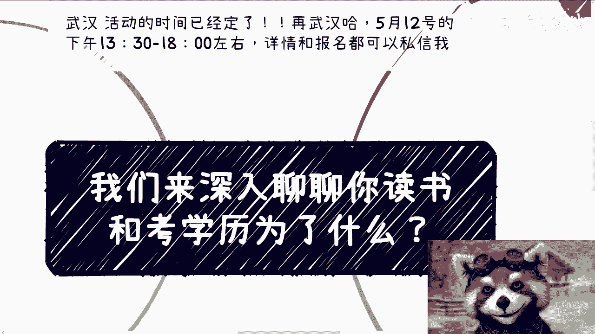

在本节课中，我们将深入探讨一个根本性问题：我们读书和考取学历究竟是为了什么？我们将从个人、市场和社会多个角度进行分析，帮助你理清思路，明确目标。

---

## 概述

本节课程旨在引导你思考接受教育和追求学历背后的真实动机。我们将通过一系列问题，剖析常见的回答，并探讨当前教育体系与市场需求之间的脱节现象。

---

## 为何读书与考学历？

大多数人被问到“为何读书考学历”时，答案高度一致。

*   **核心回答**：为了赚钱，为了找到好工作。

那么，为什么人们会认为高学历能带来好工作和高收入呢？

*   **普遍逻辑**：因为社会、家长、老师和学校都是这么规定的。

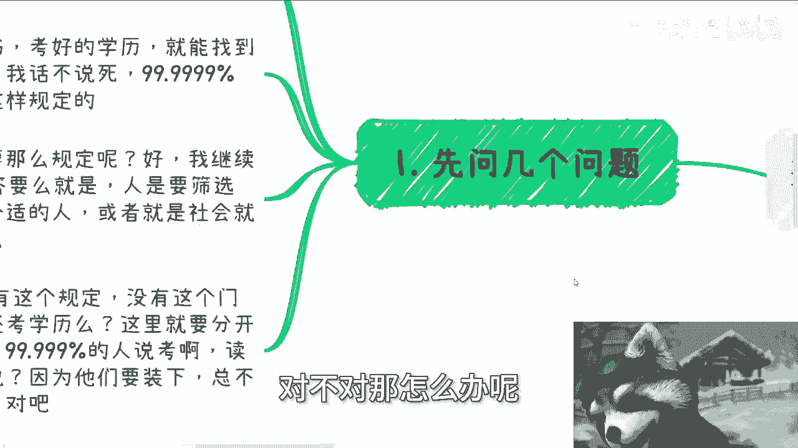

我们继续追问：社会为何要如此规定？

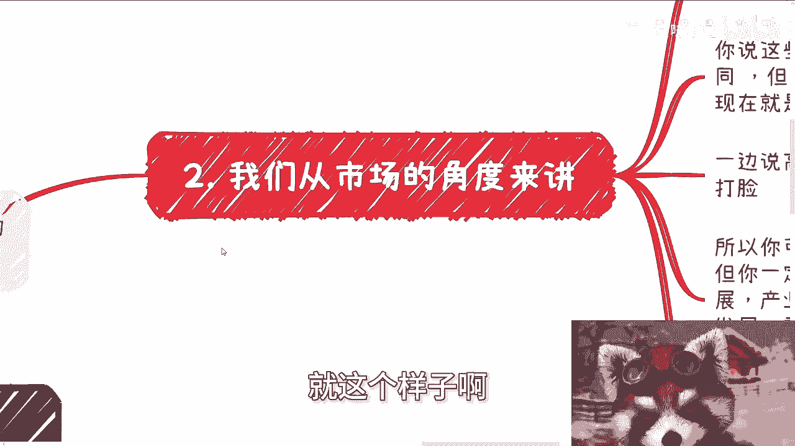

*   **常见解释**：为了筛选人才，提升社会运行效率。或者，单纯接受规定，不深究原因。

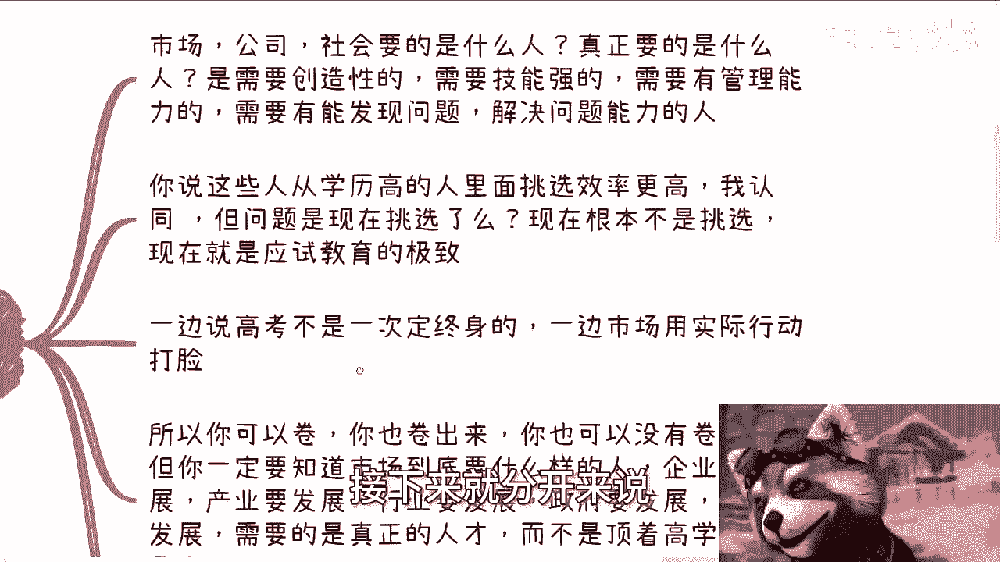

---

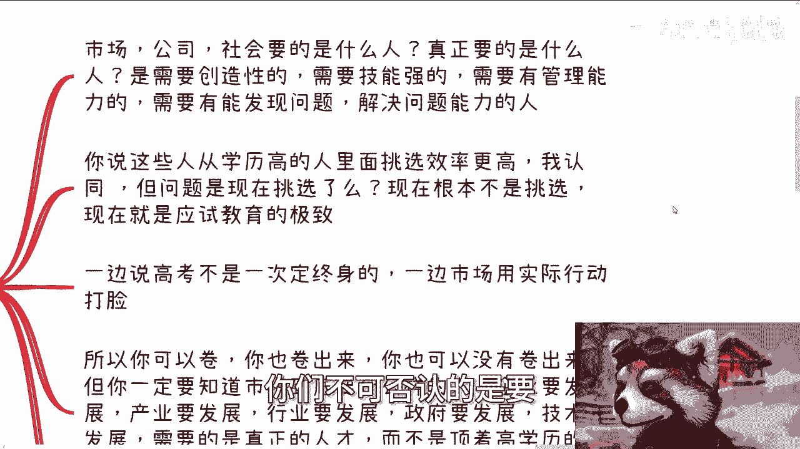

## 假设没有学历门槛

上一节我们探讨了现状下的普遍逻辑。现在，让我们做一个思想实验：如果今天社会取消了学历门槛，你还会选择读书和考试吗？

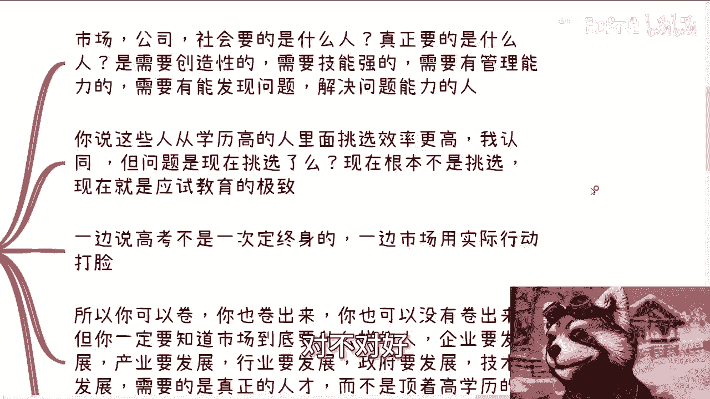

对于这个问题，人们的反应大致可以分为两类：

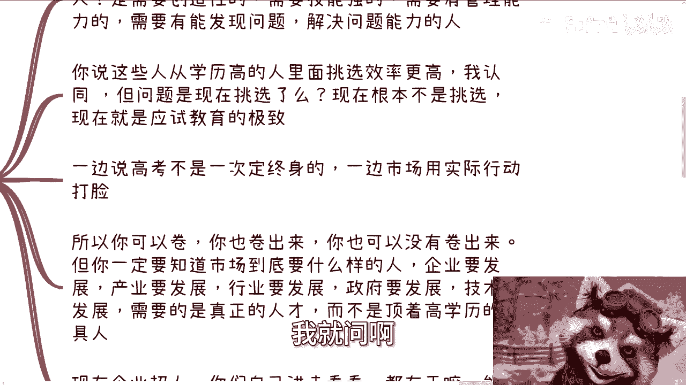

1.  **不假思索型**：表示仍然会读、会考。
2.  **条件反射型**：认为即使没有学历门槛，也必然存在其他筛选机制。

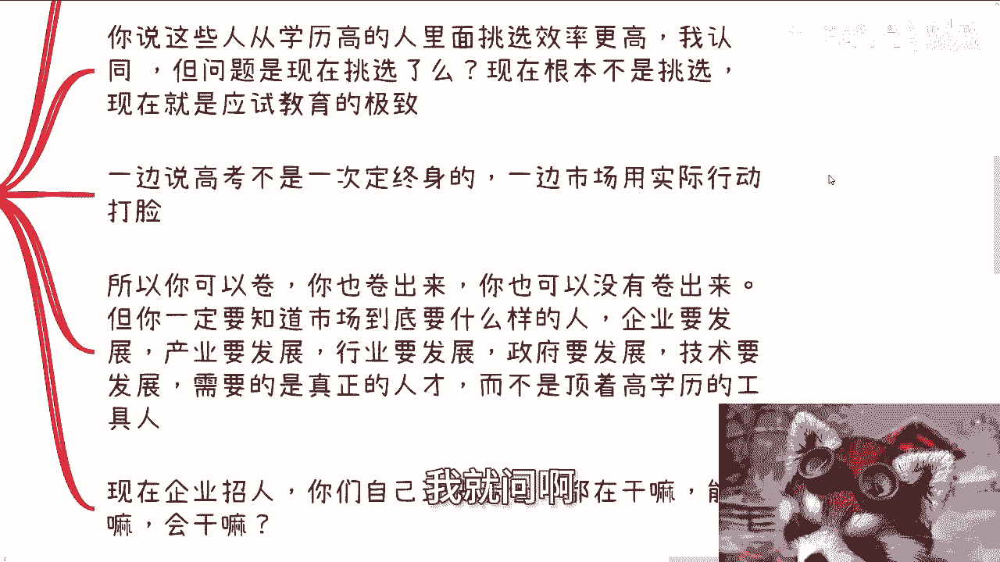

从提问者角度看，许多人给出肯定回答可能出于一种“社会期望压力”，即认为在这个语境下，否定读书的价值是不被接受的。

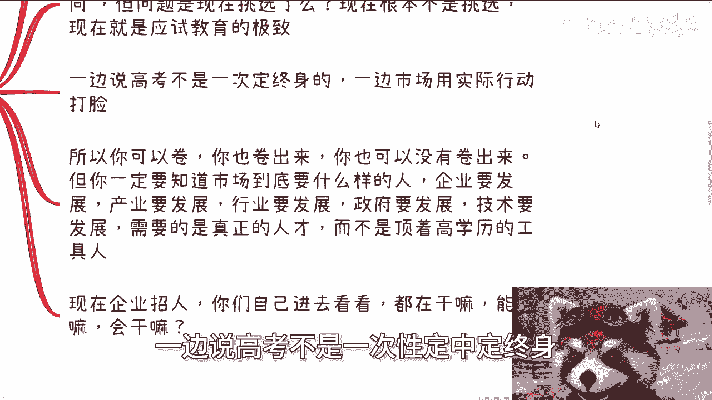

---

## 市场究竟需要什么人？

我们转换视角，从市场需求出发。公司和社会究竟需要什么样的人才？

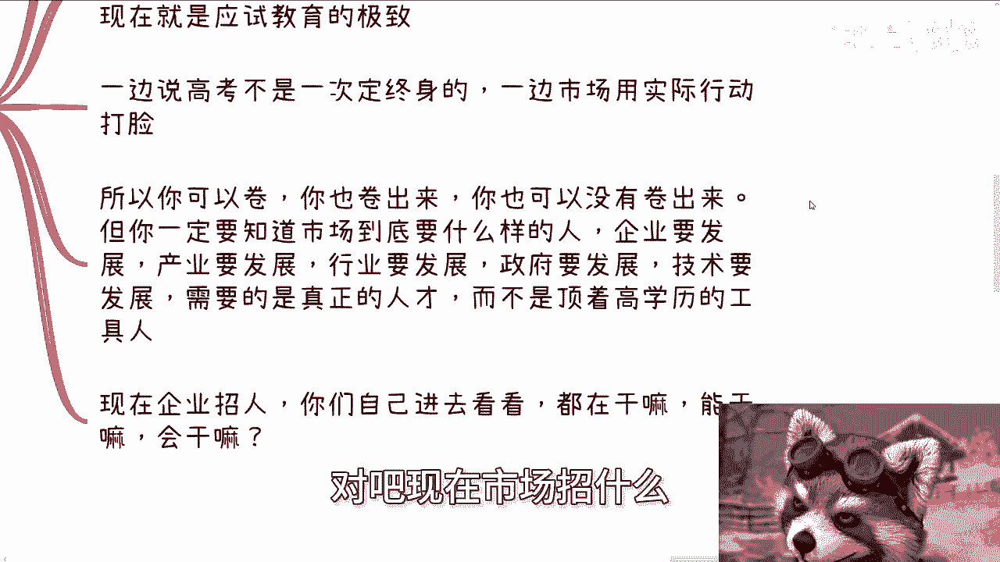

以下是企业发展的核心需求：

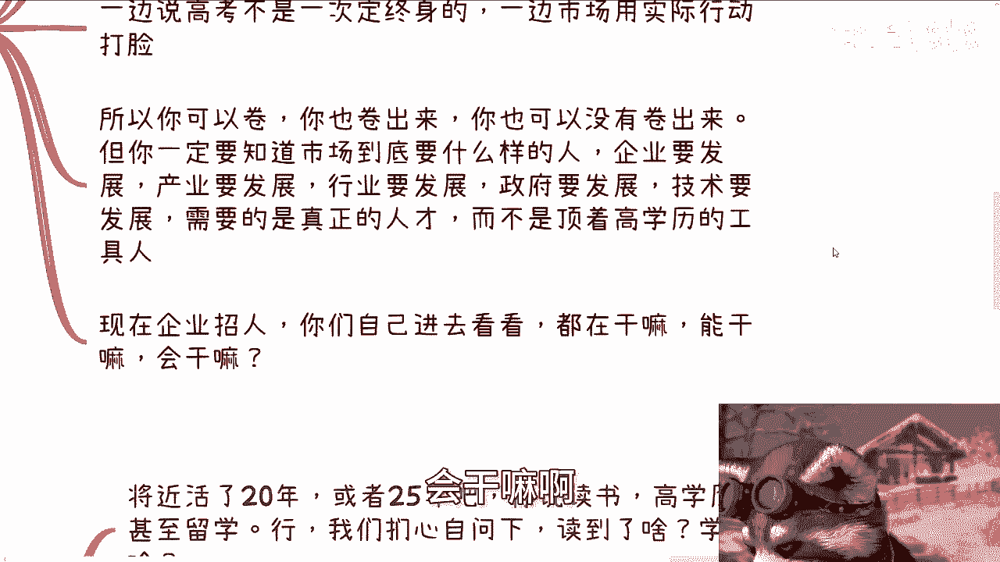

*   **创造力**
*   **强大的专业技能**
*   **出色的技术能力**
*   **卓越的管理才能**
*   **发现与解决问题的能力**

理论上，从高学历群体中筛选具备这些素质的人效率更高。这个逻辑本身没有问题。

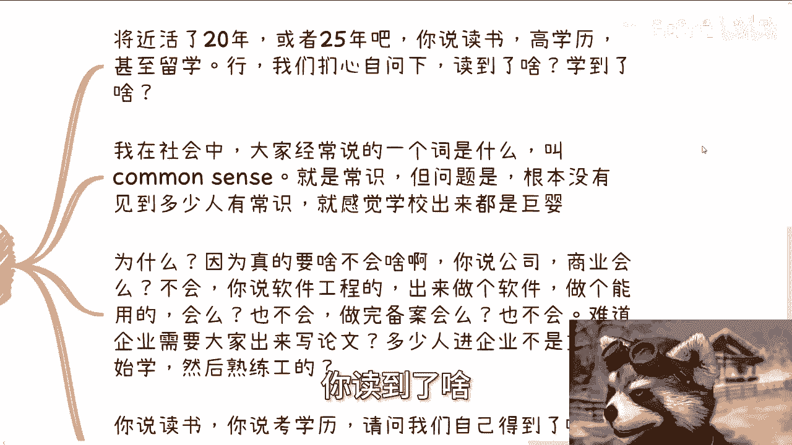

**但关键问题在于**：当前的市场行为是“筛选”吗？

现实情况可能更接近“应试教育的极致”，即学历本身成为了首要甚至唯一的硬性门槛，而非能力的证明。一边宣称“高考不决定一生”，一边在用人时严格执行学历歧视；一边讨论“35岁危机”，一边用实际行动加剧年龄焦虑。

你可以选择参与内卷，也可能卷得出来或卷不出来。但你必须清楚，市场**应该需要**的是真正能推动发展的**人才**，而非仅顶着高学历头衔的**工具人**。

当前许多企业的招聘现状是：不清楚候选人实际能做什么、会做什么。

---

## 我们自身获得了什么？

从个人角度反思：在近20年（本科）或25年（硕士）的求学生涯中，我们究竟学到了什么？

在社会中，我们常强调 **`common sense`**（常识）。但许多毕业生或职场人给人的感觉是缺乏常识。这是因为在学校里，很多实际需要的技能并没有被教授。

例如：
*   公司运作、商业逻辑不懂。
*   计算机专业毕业生可能不会搭建一个完整的、可上线的网站项目（包括备案、部署等流程）。

绝大多数人进入企业后，都需要重新学习数月才能成为熟练工。那么，我们花费大量时间获得的学历，究竟带来了什么实质性的成长？

这是一种“生活在社会中，却又与社会脱节”的状态。你生活在这片土地上，但对它的运行规则缺乏真正的了解。

---

## 海外的视角与差异

海外的情况同样存在竞争，但教育文化存在差异。

海外的教育通常不那么压抑，不强调单一的“规训”。其核心包含一定程度的“自由”——这不是指无限制的放纵，而是在主权国家框架内，鼓励**探索更多可能性**。

这与许多国内学生“除了读书内卷，其他什么都不会”的状态形成对比。掌握一些实用技能，在海外的接受度和价值认可度往往更高。

在学历背景相差不大的情况下（例如都是本科），海外市场通常更看重**实际能力**与**个人价值**。而在国内，这种情况相对较少。

---

## 独立思考与自我审视

无论社会环境如何，每个人都需要思考：活在世上，做任何事情，总要有**目的**。

读书，就应该读进去一些东西。考取学历，比如即使从清华毕业，也需要自问：除了满足父母、个人或社会的虚荣心，**我还真正获得了什么？**

社会可能扭曲，但我们不应随之一起扭曲。保持独立思考，明确自己的真实追求至关重要。

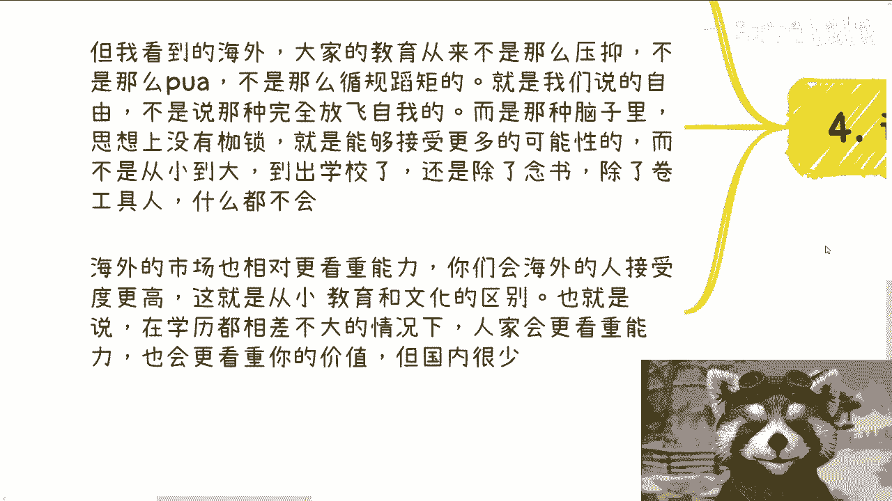

---

## 总结

本节课我们一起探讨了读书与学历的目的。我们分析了从众心理下的标准答案，反思了学历门槛的意义，并对比了市场需求与教育产出的脱节。同时，我们也引入了海外不同的教育视角，并最终落脚于**个人独立思考与价值实现**的重要性。

记住，教育的目的不应仅仅是获得一纸文凭，而是培养真正的能力、常识以及对世界的理解，从而找到属于自己的人生道路。

---

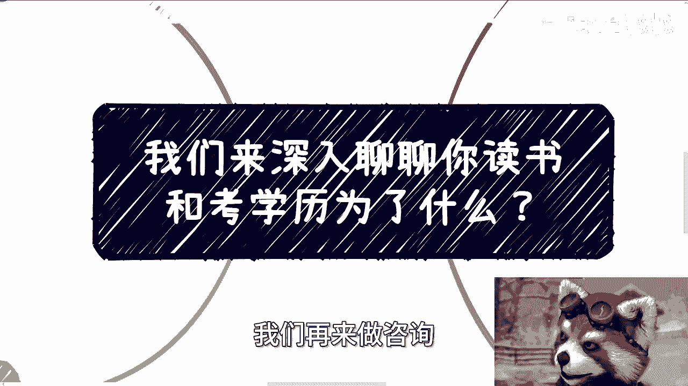

**注**：如果你需要对个人职业、商业规划（如融资、股权、商业计划书等）进行梳理，或希望借助外部视角更清晰地认识自身优势与路径，可以整理好具体问题后进行咨询。