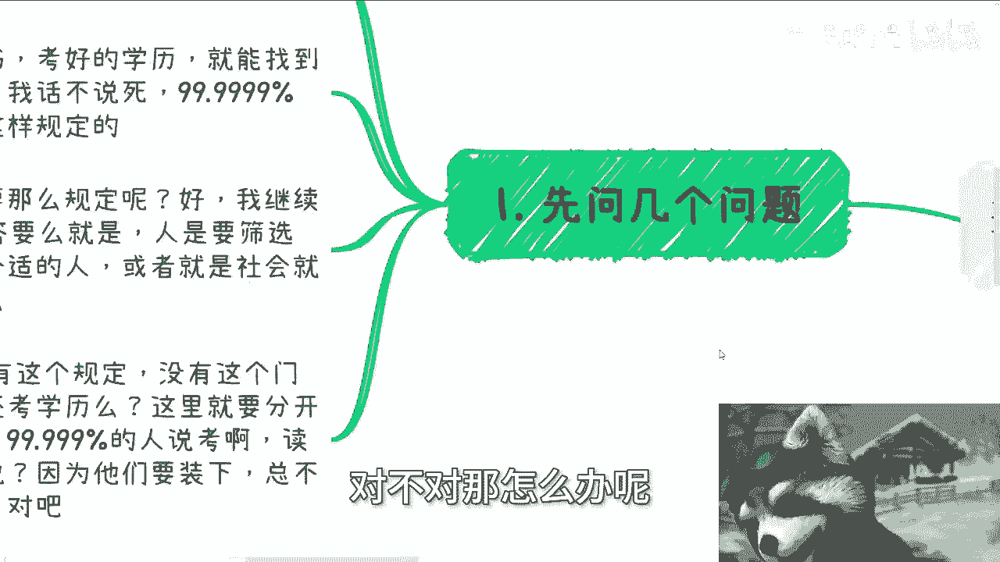
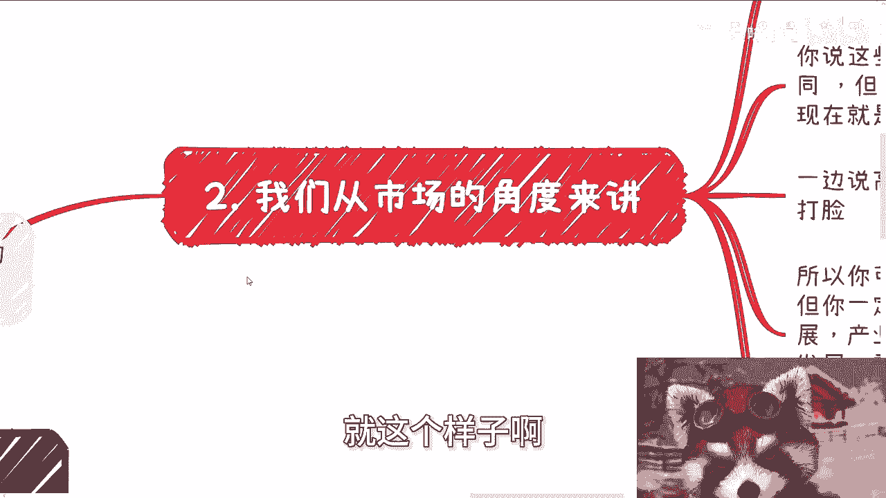
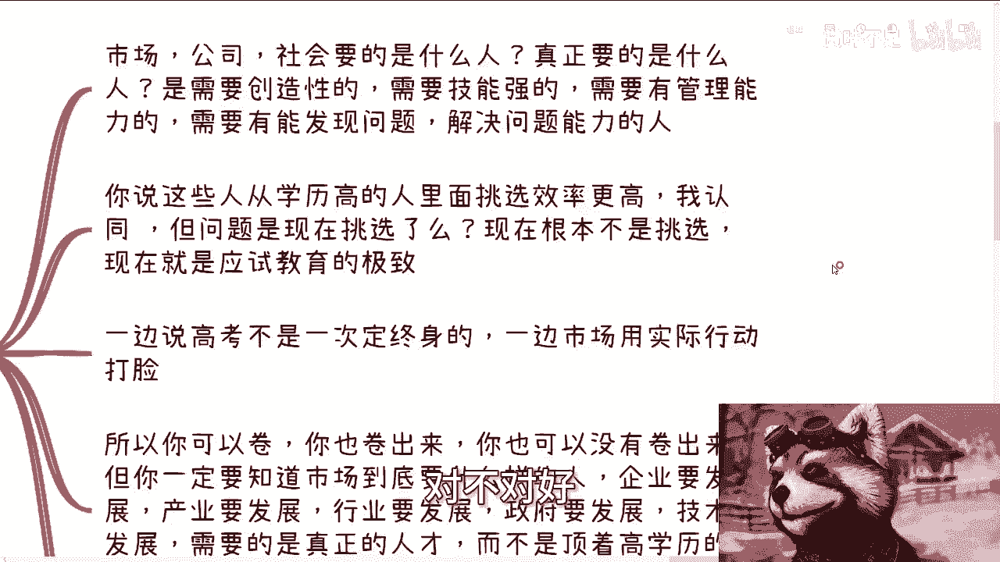
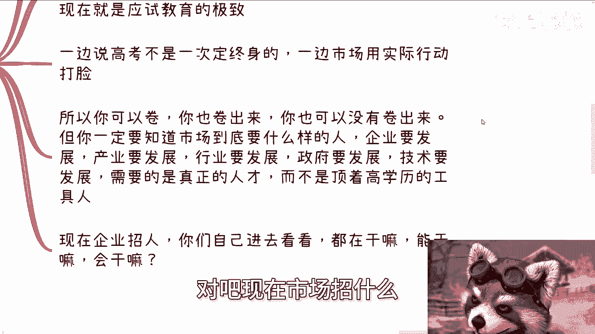
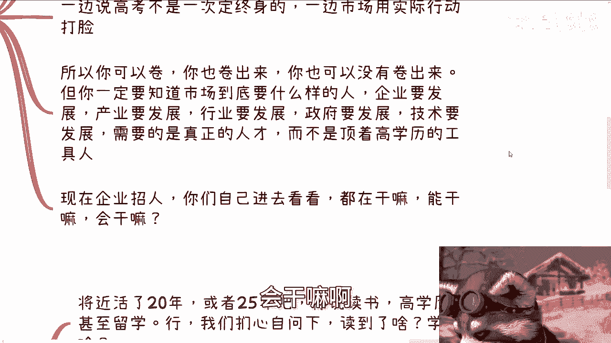
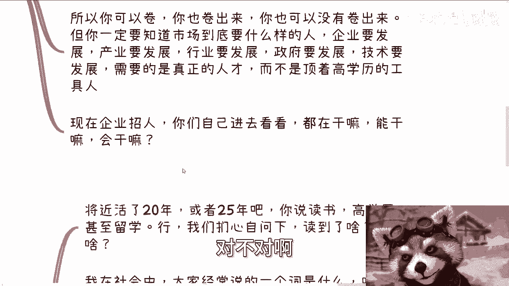
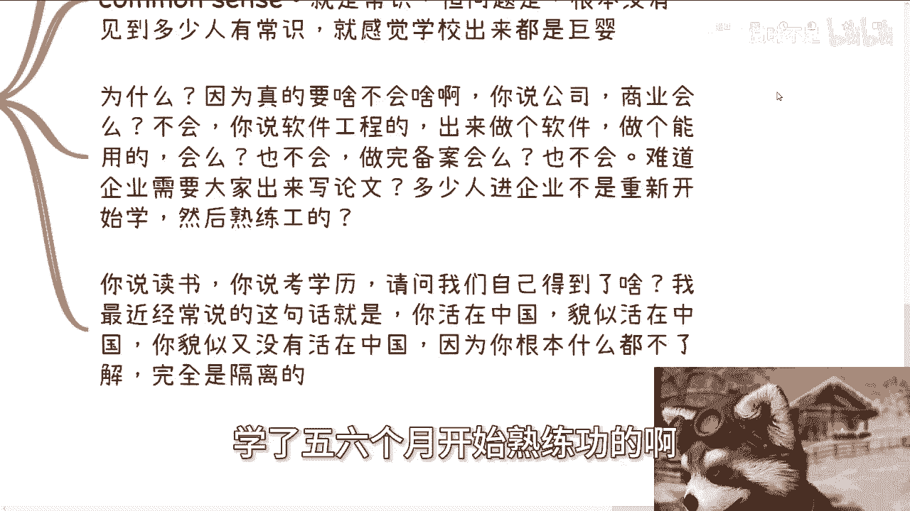
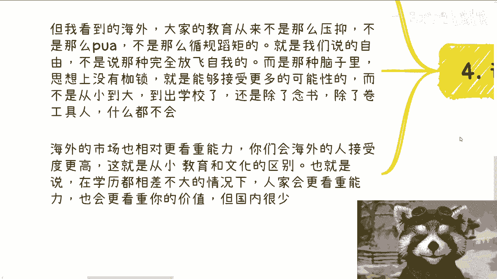
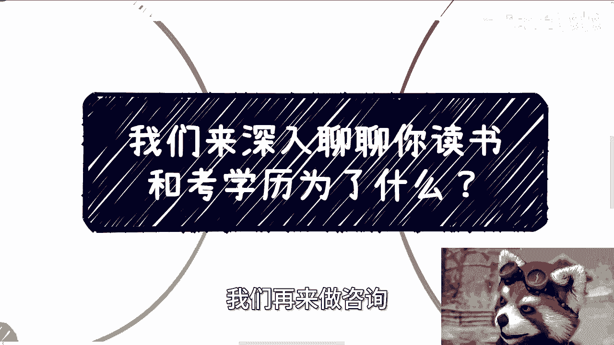

# 我们来深入聊聊你读书和考学历为了什么？ - P1 - 赏味不足 - BV11S411F7hV

啊大家好，武汉活动已经定了啊，本周日好吧，01：30到六点好吧，相亲跟报名可以私信我啊。

今天我们来讲个稍微擦点边的话题啊，哈就我们来深入聊聊。

你读书跟考学历是为了什么啊，首先我们先问几个问题啊，大家读书，大家考学历为了啥啊，这样子啊，我话不说死啊，99。9999999%的人会说，为了赚钱，为了找好的工作，对不对，我就问我就问对不对对吧。

好无脑回答是吧好，那我们继续玩，那为什么你读书，你觉得为什么你读书考到好的学历，就能找到好的工作呢，或者说就能赚到钱呢对吧，我说我话不说死啊，99。99999%的人又会说啊，因为社会就是这么规定的啊。

因为这个家长就这么说的啊，老师就这么说的啊，学校就这么讲的，对不对啊，好那我们继续来问啊，为什么要这么规定呢，啊我就问为什么社会会这么规定啊，好那我这句话不说死啊，99。9999999%的人对吧。

回答要么就是说人呢是需要筛选的啊，社会为了定制定一个更好的效率，找到合适的人，或者说社会就是这么规定的啊，他妈关我吊事对吧啊，好可以啊，可以好，那么继续来问啊，如果今天没有这些规定，没有这个门槛。

你还赌吗，我就问你还赌吗啊，你还考吗，这里我们就要分开来说，分开来说是什么呢，就是我话不说死的人说要考啊，要读啊，然后呢还有可能就这里面一半的人可能说啊，就是不假思索说要考要读啊。

还有一些人可能就要说了啊，那就要看对吧，是不是有些别的什么门槛对吧，因为你没有这个门槛，肯定有别的门槛嘛，对不对啊，好那当然啊，你从我的角度来讲，他们为什么这么说，因为他们要装对吧，那为什么要装呢。

很简单啊，你这么问他总不能说不读吧对吧，总不能说不读吧啊总不能说不不不不考吧对吧。

那不读不考干嘛呢，对不对，那怎么办呢。

人就这么装啊，就这么装啊，你们我跟你们讲就这个样子啊。

我对基本盘非常了解啊，第二我们从市场角度来讲啊，接下来就分开来说。

第一市场公司社会需要什么样的人，我们就问为什么要招人。

要什么样的人，真正要的是什么，我们就这么说啊，你们不可否认的是要需要创造性吧。

需要技能强的吧，需要技术强的吧，需要有管理能力的吧对吧，需要有发现问题，解决问题能力的吧，对不对好。

那么你说从这些人啊，这些人里面，从高学历的人里面挑选效率更高，我认可啊，这个逻辑没有错，但问题现在是挑选吗，我就问啊。

现在这市场是挑选了啊，现在有选吗，我就问啊。

现在这个就叫做应试教育的极致，什么意思啊，就是一边说高考不是一次性定定终生。

一边是在用实际行动在他妈打脸对吧，一边说35岁之后找到工作，一边事实上也在用实际行动来打脸，有意义吗对吧，所以我就问我就说啊，你可以卷，你也可以卷的出来，你也可以卷不出来。

但你一定要知道市场到底要怎么样的人，就是市场应该要怎么样的人，对吧，我就这么跟你们讲，一个国家企业要发展产业要发展，行业要发展，政府要发展技术要发展，需要的是所谓的真正的人才，而不是顶着高学历的工具人。

对不对，现在呢对吧，现在市场招什么。

你们比我清楚，是不是，那我们我就问现在企业招人，你们自己进去看看都能干嘛，会干嘛啊。

能干嘛知道干嘛吗，知道个P对不对好。

然后我们再从自己的角度出发，我就问啊，将近活了20年25年对吧，本科差不多20年左右，硕士差不多15年左右对吧，你说读书高学历甚至留学行啊，我就问你们，你们扪心自问一下，你读到了啥。

你学到了啥，我就问你学到了啥啊，你学到了啥对吧，我就这么跟你们讲啊，在社会当中我们经常讲的一个词叫什么叫common sense，什么叫common sense，就是所谓的常识对。

但问题是我们看到基本上现在出来的大学生，或者说是工作里面出来的人啊，工作里面出来的工具人，我没有看到有常识啊，哪来的常识，就没有感觉到一丝有常识啊，为什么，因为真的要做啥不会啥都不会啊。

你说公司公司会吗，不会公司公司懂吗，不懂商业会吗，不会你说做软件工程的，找个计算机专业出来的做做个软件，给我弄个网站会吗，你不会啊，会吗啊，做完会备案吗，知道知道做一个东西，市场在中国接下来怎么做吗。

整个东西要上线怎么做，知道吗，不会不知道，那难道什么意思啊，难道企业需要大家出来写论文啊，还是说还是说需要需要大家出来什么来，来把你的那个他妈的学历贴你脑门上对吧，我就问多少人进企业。

不是重新开始学的啊，然后学了那么三四个月，学了五六个月开始熟练工的啊。

多少人你们自己问问自己，你们去问问你们的学长学姐对吧，你说读书，你说考学历，那我就请问我们到底得到了什么啊，你这一辈子能活多少年，你这你现在得到了什么，我最近经常说的一句话，就是说你感觉你活在中国。

你貌似活在中国，但你貌似又没有活在中国，为什么，因为你了解吗，你了解什么，你告诉我，你什么都不了解，你完全是隔离的啊，你就好像活在这片土地上，但又没有活在这片土地上，我我就我也不明白对吧。

你们有没有想过这个问题，好，那我们再说说海外，海外现在也是越来越卷，当然当然这种卷的情况下，论学历论也是非常合适的，但是海外也是这个吊样子没什么区别啊，但是就我所知道的，海外的很多人。

大家从小教育从来不是这么压抑的，也不是这么PUA的，也不是这么循规蹈矩的，它里面会核心的一个东西，会包括他们说的自由，当然啊这种自由不是说完全的言论自由，不是完全的放飞自我，因为你要明白。

只要在一个主权国家，你不是在中国，不是在就无论在中国，在美国，在日本在什么地方，你只要是主权国家，你不可能有完完全全放飞自我，完全放飞自我，这不现实呀，对不对，你肯定是要有束缚的。

但是这种束缚它它需要有限度的对吧，而不是现在就是说大家这是什么脑子里面啊，对吧，怎么怎么就就就就就比如说读书读出来也好，包括工作，工作了一段时间也好，就脑子里面跟思想里面都是枷锁。

就永远不愿意接受更多的可能性，而且自己是没有想法的对吧，就是说不但不愿意外面不断，不但不愿意接受外面的可能性，自己也不会愿意接受自己的可能性，什么都不接受，但是外面不一样。

外面就是你会发现他们愿意接受更多的可能性，而不是说从小到大到了初学校还是除了念书，除了卷工具人什么都不会，为什么我就问为什么啊，你你看看你自己，你看看你们身边人会什么会啥啊。

你不要再跟我说什么什么国家金奖啊，什么什么什么竞赛是吧，什么东西有用了有用吗，能赚钱吗，我请问能赚钱吗，能养活你自己吗，能未来抗风险吗，啊对吧，你懂得怎么在社会上生活生存吗，不懂懂啥，你一旦被开掉。

你什么都不是就这么简单，对不对，那海外的市场我跟你讲也相对更看重能力，你们会在海外，你们我跟你们讲啊，你们会一些技能，在海外你们会发现啊，海外的接受度会更高，这就是从小教育跟文化的区别。

也就是说在学历相差不大的情况下面，就大差不差啊，就比如说可能比如说大家都是本科对吧，我也不去关心什么一本二本三本了对吧，人家就会更看重能力，更看重你的价值，但国内很少，我就这么说，国内很少。

我之前跟很多咨询的人，我也说过一点，就是你们跟我的沟通，我很有自信地说，很有可能你们这辈子也就是跟我，跟我这样的沟通，可能也就那么一次，为什么，因为你们很难碰到这样的人，你明白吗，就是说我我为什么。

因为我属于完全的三界之外三不管地带对吧，因为我既没有在任何地方任职啊，我也没有任何的社会地位和政治地位，我我也不会屁股决定我的脑袋，所以我所有的态度都是保留了我，我从底层看到的东西。

以及我一个客观的一个态度没了对吧，我不会说，因为我现在啊，因为在某个地方任职对吧，我可能屁股一歪，脑袋一歪对吧，怎么样不会的，但是你们跟别人，你们自己看对吧，要么就是想来割的。

要么就是说啊就是也许他能明白真相，比如说你们学校里的老师或者教授，也许他们明白一些东西，但他们敢讲，他们不敢讲对吧。

但是我觉得是这样子的，你们可以仔细想想看，不管现在社会多么扭曲，也不管现在整个全球多么扭曲，你活在世界上，你为了什么，你做事情总要有目的吧对吧，你比如说你说你读书，你读得读进去点东西吧。

你读进去了吗对吧，你说你考个学历，我今天就算你清华毕业了，请问你会了什么，我想知道啊，你除了你爸妈的虚荣，除了你自己的虚荣，除了这个社会给你的虚荣，你还得到了什么，不明白我真不明白对吧。

就这不是应该我们所追求的东西，而我们也不应该说这个社会因为扭曲，所以我们跟着他一起扭曲，好吧，行啊，就这么着啊，就这么着，你们可以仔细想想，看自己想看好吧，直接规划商业规划啊，然后那个融资股权股份啊。

然后分红商业计划书，包括你们自己手上有什么牌啊，或者你们没有牌啊，你们希望通过我的视角，通过我的一些认知，能够帮助你们更好的做出规划的好吧，那么你们就可以整理好问题，我们再来咨询。

