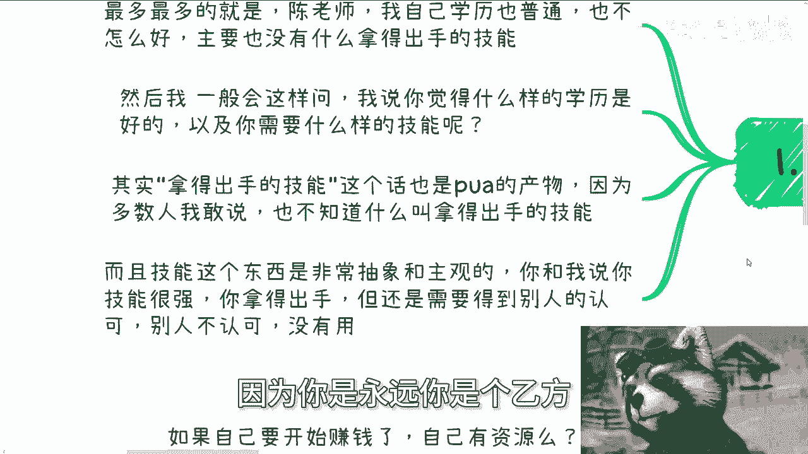

# 我们来聊聊“拿得出手的技能” - P1 - 赏味不足 - BV14t421g7yb

哈喽大家好啊，那今天我们继续来说一下。

就是之前的这个内容啊，呃首先下一期活动活动已经定了，5月25号好吧，下午在杭州，活动地点在杭州站，杭州站附近啊，详细内容跟报名可以私信我啊。

那么本期这个内容呢，我们来讲的是聊聊关于这个所谓的技能的，这个作用啊。

首先呢咨询的时候听到最多的话是什么，他说最多最多的就是陈老师，我觉得我自己学历普通啊，也不怎么好，主要他说也没有什么拿得出的技能啊，每次听到这话，我妈血压就很高啊，然后呢我一般会这么问。

我说你觉得怎么样的学历是你想要的，以及你觉得需要什么样的技能对吧，那其实觉拿得出手的技能，这句话也是PUA的产物，因为多数人多数人啊，我99。9%，我敢说啊，他也不知道什么叫拿得出手的技能，因为什么呢。

因为技能这个东西很抽象啊，而且很主观，你跟我说，你技能很强，你拿得出手，但是你需要被你在打工层面，你还是需要得到别人的认可，因为你是永远你是个乙方。

或者你永远是一个打工人对吧，你只要别人不认可，你再觉得你你所谓有用的技能有用吗。

没卵用，对这是第一点，第二点。

其实前几天也有个很有趣的一个讨论，他是这么说的，他小伙伴跟我说，他说他一直觉得呢自己要强大啊，要强大，他自己很菜啊，想要去进步，就感觉自己貌似不太行啊，想让自己有点底气啊，所以要去努力自己争取啊。

然后问我对不对，我说对啊，那没毛病啊，你的确是自己努力自己争取嘛，对不对，但是呢好经过后来的沟通啊，我他跟我说的是他的所谓的进步，强大指的是什么呢，指的就是他想要一个拿得出手的技能，我说我说好了。

那问题来了，我说你努力对吧，他努力，当然也他也要去考学历嘛对吧，然后也要继续学习一些东西，我说你有了技能之后什么打算呢对吧，你是因为自己能找到工作，就认为自己有技能，还是因为自己找不到工作。

觉得自己没有技能对吧，这到底是怎么才算你有技能，你有没有想过这个问题啊，另外关于一个人有没有底气，我跟你讲啊，一个人有没有底气，跟你有什么样的技能没有关系，因为本质上你会发现你有底气，原因是因为什么。

是因为你这个技能被很多人认可，这就好像你今天会拧螺丝，我也会拧螺丝，大家都会拧螺丝，但是认可你的人多了，你自然而然就比我有底气，比我有自信，是这个逻辑啊，你明白吗，那么第三努力的方向要对啊。

否则就没啥用，这个事情呢也是老生常谈，那么几乎所有的人想法都是如此，都跟我说，他说啥，我想赚钱，你我我就这么跟你们讲，他们的目标是什么，他说我想赚钱，然后他们的过程是什么，是考CPA，考CFA。

考各种证书，考各种全日制，非全日制，我就这么说啊，我跟你们讲，你们你们会发现大部分人读的很苦，学的很累，但是你知道吗，就是你在我听来最最奇怪的一件事情是什么，就是你学的很苦啊，读的很累。

但是你的这个过程跟目标没有关系啊，你知道吗，就是你学你苦读的很苦，学的很累，你跟最终赚钱有关系吗，没有啊啊那么过了若干年后，我跟你们这么说啊，你们出来之后啊，就是说这个这个工作也好，或者毕业也好啊。

你们过了若干年之后，你们还是会觉得自己没有资源，自己赚不到钱，就是就是我跟你们这么说，现在很多人问我的问题，我会跟他们这么说，我说你们现在问出来的问题，但凡现在不去解决，你们自己赚钱的问题。

你们工作就算再工作5年，工作10年，你出来的时候发现，你到时候的问题跟你今天列出来的，列出的问题是一模一样的，你知道吗，就是说你最终还是不知道从什么切入点去赚钱，不还是一样吗，对吧。

你说现在很多人咨询跟我说，他说我要出国，我要全职啊，全日制不是全日制啊，他说我要全日制以及非全日制读个书吧，或者说去什么工作，那个积累积累经验啊，我就这么问你吗，我说你们想一个问题啊。

我们假设公司真的能积累经验以及经营积累，你怎么赚钱经验，你年轻的时候能积累多少家公司，我就算你一年一换好了，你到你30几岁也就十家公司对吧，那我就请问你在这十家公司里面。

每家公司一年你能积累出多少经验对吧，这些经验你你够用吗，够你赚钱吗，这他妈不是笑话吗，对不对啊，然后第四点啊，很多时候我跟你们讲，你问问自己什么呢，就是说如果自己要开始赚钱，你有资源吗，你有关系吗。

你知道切入点是什么吗，你自己知道别人怎么赚钱吗，你如果来说什么都不知道，那你要做的是什么，你要做的不是说什么，哎我现在去找找找点工作，我现在去什么多读点书对吧，怎么样子，你要从现在开始就去了解这个社会。

大家是怎么做的对吧，当然啊，这跟你要去读书，跟你要去什么积累工资呃，什么是公司里面打工对吧，去积累所谓你所谓的经验，他不冲突啊对吧，然后昨天有个小伙伴问我一个问题，我跟你讲，也把我问笑了啊。

就是他找到了一个政府的文件，然后问我，他说老师这个东西怎么切，我真的我就问笑了，为什么，因为如果我说如果我们找到一个文件，然后找到一个切入点就能切，如果这么容易切的话，那他妈大家早就财务自由了啊。

这事是这么玩的吗，对不对啊，我就跟你们讲啊，中国任何事情靠的都是关系啊，什么意思，就是说这些关系你日常就要去找对吧，日常就要去积累，去探索，去套近乎，然后你要通过这些关系去了解。

有哪些最新的项目或者最新的机会，是这么一个逻辑啊，不是说比如说今天我们看到的政策文件诶，陈老师我们怎么切怎么切啊，你切个屁对吧，要么就是说创始我缺钱，我想赚钱，然后他说哎哎那我问一下这个政府啊。

协会怎么签，要命了，大哥哦，你们的逻辑是我缺钱了，我就能去切了啊，这社会是这么容易切的对吧，那如果说因为我缺钱了，我就去切，就这么容易切的话，就不要赌了呀，大家大家也不要也不要9年制义务教育学。

要什么教育了，直接上来签包好了，有这么容易啊，对不对啊，那么什么意思呢，意思就是说日常啊你该吃饭吃饭，该喝酒喝酒，该聊天聊天，这些套近乎的技能其实才是大家应该去学的，这也是我认为最最应该有的技能。

包括就是说这些套近乎的技能啊，PPT的技能啊对吧，然后呃产品包装啊，服务包装啊对吧，就是我我我，你包括就是正常的一个一个产品的PPT，和正常的一个服务的PPT，我发现很多人都不会写，都不会写。

他都不知道，他都不知道架构什么样子对吧，而不是说今天看到一个公开公开的文件，然后就想着说哎我怎么切要命了，中国14亿人，你肯定不是最聪明的，我也不是，对不对啊，好然后每个既然文件是公开的。

那么也就意味着每个人都能这么做，对不对，好，那如果来说每个人都能这么做，要命了，那他妈的每个人都财务自由了，你想想是这样子的，对不对。

就就就你知道我为什么笑吗，你就是我，我有时候就真的觉得很多的逻辑，这这难道一个本科读出来的大学生，和硕硕硕士读出来的这个硕士生研究生，这点逻辑想不通吗，我就不明白了，那这书读来干嘛呀。

说书读到哪去了都天对不对，对吧，所以说你们有时候我就我就真的，你们仔细想想看，你说我想要有个有用的技能，你你就再往下想一步呀，什么叫有用的技能，你有用了之后怎么变现，你知道吗，你不知道对吧。

那你在那边讲这些空话有什么用呢，而且我一直跟你们讲，你们知道吗，就整个老百姓面上面，讲这种空话的人特别特别多，就就我不知道真的，我其实到今天为止，我都没太明白这种坏习惯到哪来的，到底是什么抖音造成的。

还是快手造成的，还是短视频造成的，我也不知道，但是就现在年轻人就讲话，就真的就是你就是很多人啊，他他很讨厌假大空，但是他自己讲的话就很假大空，但是他自己不觉得啊。

这这这这这这是最二的一个地方，OK啊那就这么着啊，然后那个活动好吧，我已经订好了，5月25号呃，在杭州好吧，地点在杭州站附近啊，你们要了解的可以私信我，然后报名也私信我啊，然后就是呃日常的啊职业规划。

商业规划啊，分红啊，股权融资啊对吧，商业计划书啊，包括你们手上有什么牌，包括你们没有牌对吧，你们希望通过跟我的沟通啊，能够更好的帮助你们了解这个社会啊，或者说帮助你们更好的做规划。

那么你们就啊这个整理好自己的问题啊。

