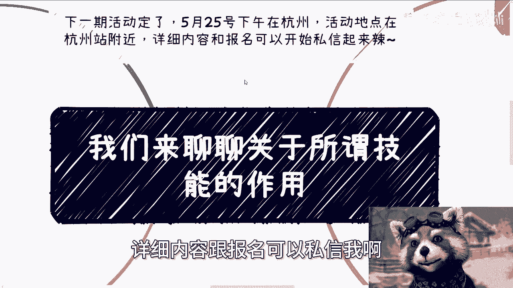
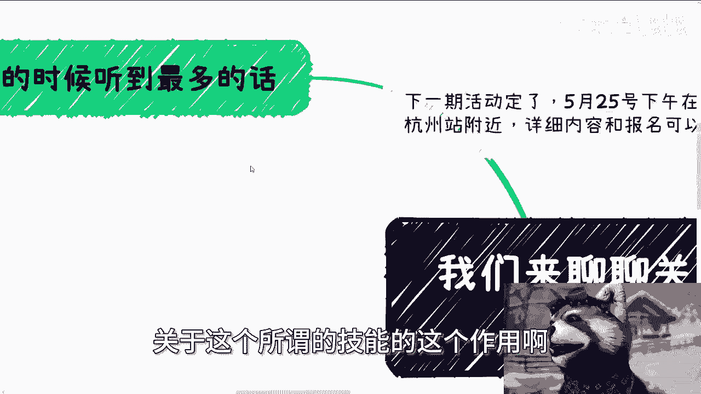
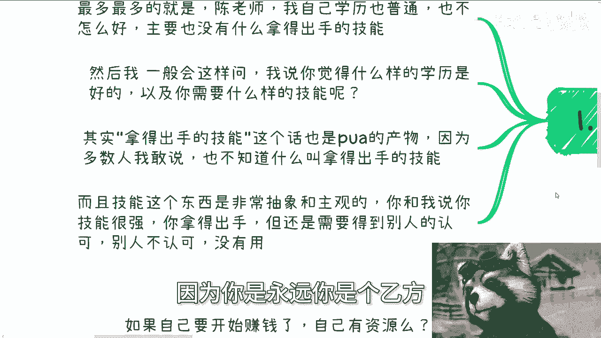
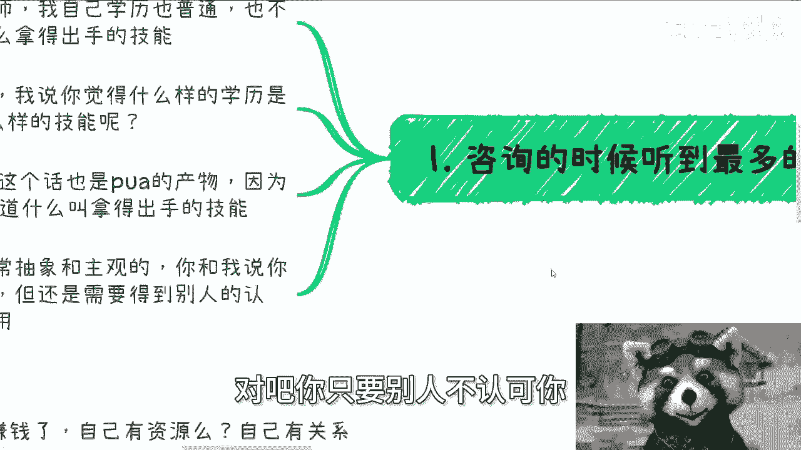
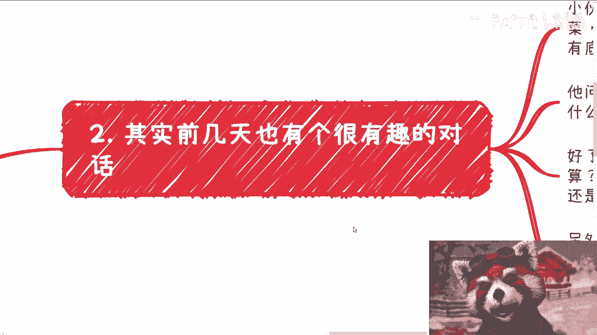
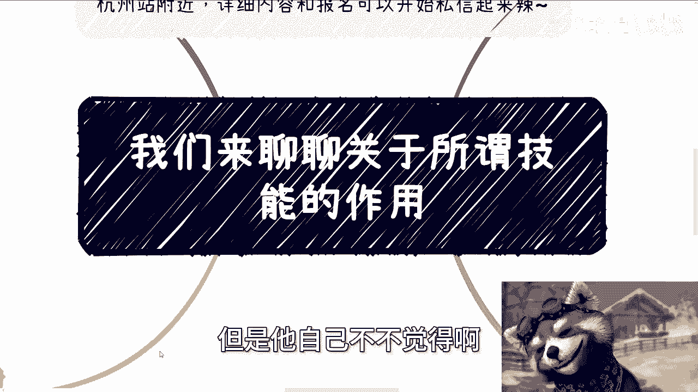

# 课程名称：聊聊“拿得出手的技能” - P1 🧠

在本节课中，我们将要探讨一个在职业咨询中频繁出现的话题——“拿得出手的技能”。我们将分析这个概念的来源、常见的理解误区，并探讨什么才是真正有效、能创造价值的技能。

---

上一节我们介绍了本课程的主题。本节中，我们来看看关于“拿得出手的技能”最常见的几种误解。

以下是关于“拿得出手的技能”的四个核心观点：

**1. 技能的价值取决于他人认可**
技能本身是抽象且主观的。你认为自己技能很强，但在职场中，你作为乙方或打工人，其价值最终需要得到他人的认可。公式可以表示为：**技能价值 = 技能水平 × 他人认可度**。如果缺乏认可，自我感觉再良好也无用。

**2. 底气源于认可，而非技能本身**
许多人希望通过获得技能来增强自信和底气。然而，一个人的底气本质上来源于其技能被广泛认可。例如，`你会拧螺丝，我也会拧螺丝`，但认可你的人更多，你就自然更有底气和自信。努力的方向不应仅仅是获取技能，而应是获取认可。

**3. 努力方向必须与目标对齐**
绝大多数人的目标是赚钱，但他们的努力过程（如考取CPA、CFA等各种证书）却常常与这个目标脱节。代码可以描述这种错位：`if (goal == “赚钱”) { process = “考证书”; } // 逻辑错误：过程与目标不匹配`。如果努力的过程不能直接服务于最终目标（赚钱），那么多年后，你依然会面临“不知如何赚钱”的困境。

**4. 赚钱的关键是资源与关系，而非机械积累**
当你思考如何赚钱时，需要问自己：你有资源吗？有关系吗？你知道切入点吗？如果答案都是否定的，那么你需要做的不是盲目地“积累工作经验”或“读书”，而是主动去了解社会运作的真实逻辑。在中国，很多事情依靠的是日常积累的**关系网络**。这意味着你需要通过日常社交、沟通去探索机会，而不是指望看到一份公开政策文件就能轻松切入。如果仅凭公开信息就能成功，那所有人都早已财务自由了。

---

通过以上分析，我们可以看出，被泛泛而谈的“拿得出手的技能”往往是一个空洞的概念。真正应该掌握的，是那些能连接资源、获取认可、并直接服务于你核心目标（如赚钱）的**实践性技能**。

本节课中我们一起学习了：
1.  技能的价值由市场（他人）认可决定。
2.  自信和底气来源于外部认可，而非技能本身。
3.  努力必须与终极目标紧密挂钩，避免无效付出。
4.  在社会中获取成功的关键，往往在于构建**关系网络**和掌握**资源整合**的能力，而非孤立地提升某项技术。

因此，与其追求一个模糊的“拿得出手的技能”，不如专注于学习如何有效沟通、包装自己（如制作专业的PPT）、建立人脉以及洞察商业机会，这些才是更具现实意义的“技能”。

---

**附：线下活动通知**
下一期线下活动已确定。
*   **时间**：5月25日下午
*   **地点**：杭州站附近
*   **内容**：详细活动内容与报名请私信咨询。

此外，对于职业规划、商业规划、股权融资、商业计划书制定，或希望梳理自身优势与路径的同学，可以整理好具体问题后进行咨询。