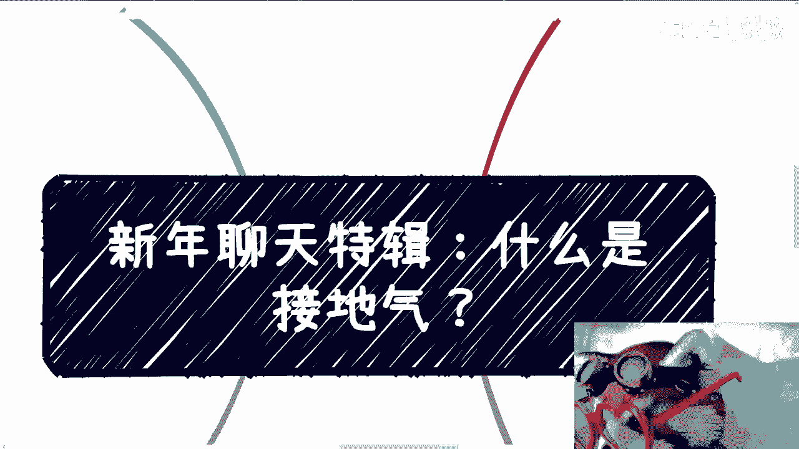
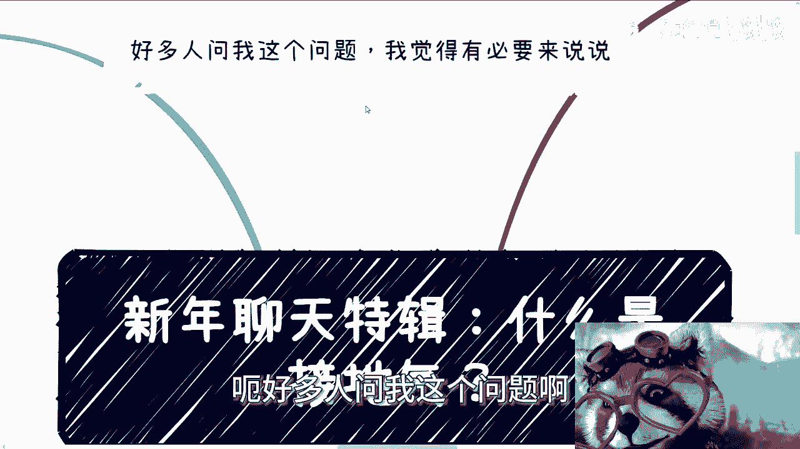
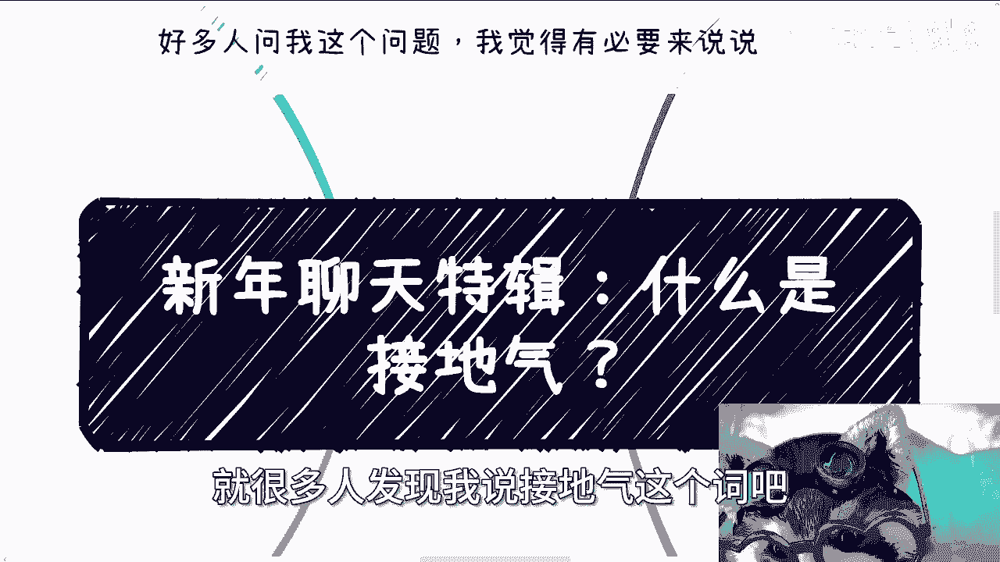
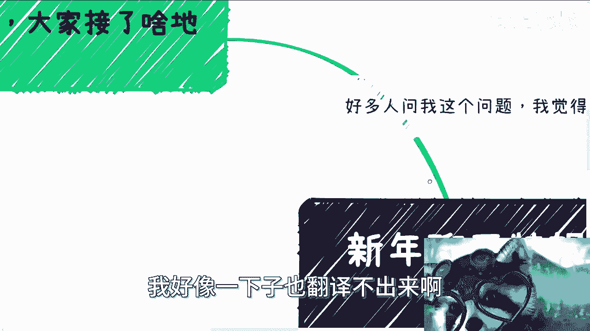
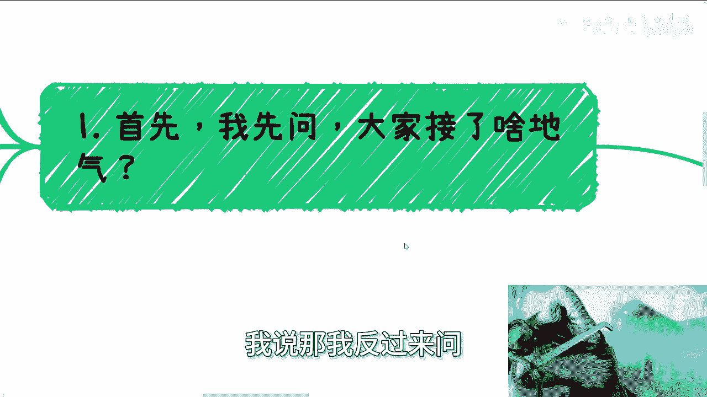
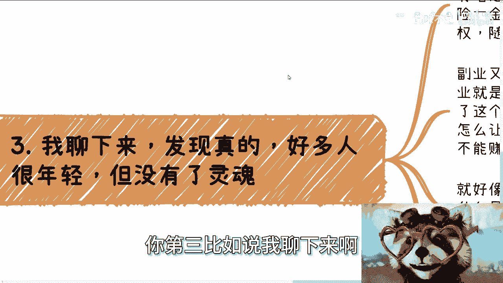
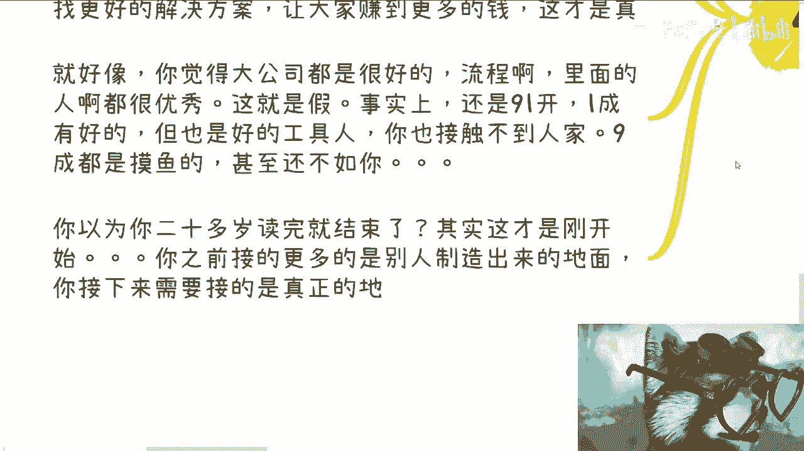
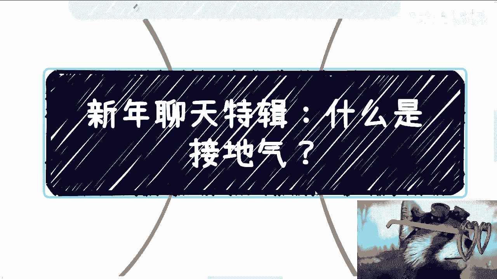
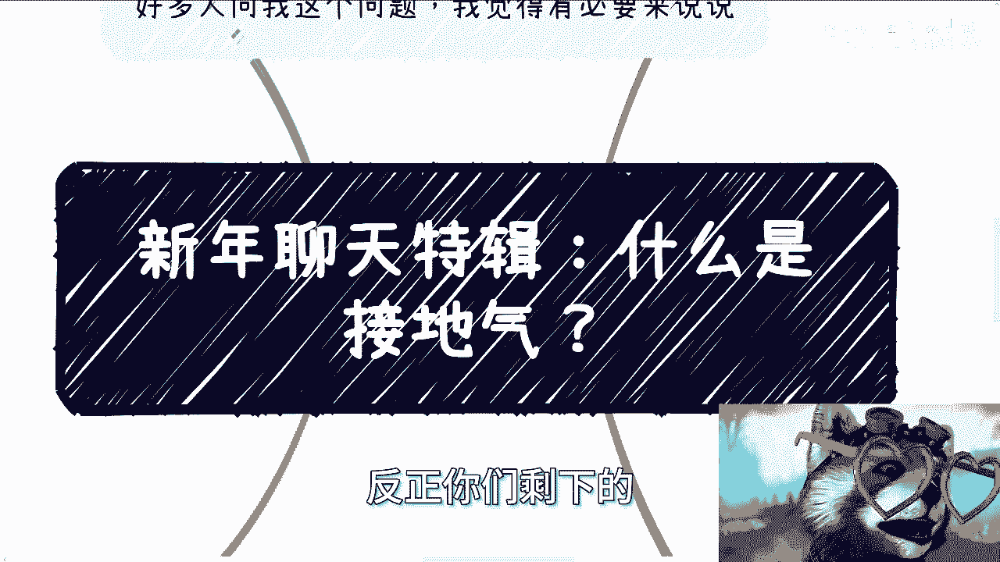

# 我们来聊聊什么是接地气，那就是要看“地气”是什么了 - P1 - 赏味不足 - BV1FU421Z7PV

啊大家好好多人问我这个问题啊。

我觉得这个有必要来回答一下啊，来说说啊，这个也放在聊天专辑里面，就什么是接地气是吧，就很多人发现我说接地气这个词儿吧。

那他也理解不了，但是你要我翻译吧，我好像一下子也翻译不出来啊。

首先啊一般他们问我，我就会问我说，那我反过来问你们接了什么地气。

或者你觉得你接了什么地气对吧，这就好像前两天那个视频，说学校有优秀人士一样，卧槽这下面的人我到后面就不想回来，我看到就拉黑了，没啥好回的，为什么，因为这鸡同鸭讲啊，就是你再优秀，你再好的学校。

你出来还是工具人，这就是我的point对吧，这就是我的核心观点，就你要找优秀的人，难道不应该是去社会上找那些经过毒打的，已经经历过非常多这种毒打事件的对吧，就是被已经三观重塑过的人嘛，这叫优秀啊对吧。

你学校里面碰到的最优秀的，但无非还是工具人啊，你你然后一群学生我已经看出来了，就是学生视频也不看的，你知道吧，我已经看明白了，就是我一开始在里面其实写的很清楚，我说学校出来的都是工具人，他不看。

他上来就就他妈的喷对吧，那你说你去学校找，这不是托托公司放屁吗对吧，你问我什么叫接地气，那我就问问目前咱们有什么是接地气的，我就问你知道除了打工以外，还有什么方式赚钱吗，什么方式赚性价比高的钱对吧。

什么叫赚钱对吧，你知道公司什么情况下面贵人运作，什么情况下公司才能运作，公司如果要融资，怎么谈什么叫资本运作对吧，你知道高校每一年前哪里来吗，你知道企业里面业务线怎么划分的吗，你知道里面怎么晋升晋升。

表面上说晋升其实里面是怎么运作的，你知道你也许知道水面上的那20%，但水下的80%呢对吧，你知道协会商会协会都是怎么运作的，你知道国标团标，国标团标怎么写的，写了之后有什么用，对你接地气。

你接了什么地气，就是你用我话来讲，就是你活在中国，你接了中国任何一个地气吗，你跟我讲讲看，对吧，接地气的本质是什么，是在于你要对这个社会，对这个国家，对整个制度，对整个商业的运作，对真实的情况好。

记住我们说真实的情况，真实的轮廓你得有个了解，你别以为说你做一些实习，跟导师做一些项目，就好像有了解了你那些叫什么东西啊，啊你做工具人了解不到任何东西，对吧，第二讲完对吧，随即而来的就问我怎么接。

对吧啊，你看啊，怎么接自己接呗，怎么接呢，你指望谁来给你接，你知道吗，昨天啊，今天早上我看到那个评论区，还有个人跟我说，他说我没记错的话，他应该是既没充电，也没有充那个充电视频，然后就跟我说。

他说陈老师你能不能出一个商业的实操视频啊，付费也可以好，没问题没问题，我待会就给出一个啊，我会来告诉你为什么出不了这个东西对吧，你我我后面怎么回他了，你知道吗，我写的很清楚，我说你会这么问。

就代表你对中国这个国家，跟对整个商业一无所知，而且非常的一无所知，对吧啊，你们要明白，这个社会早就是一个扭曲的状态了啊，当然很多人不明白啊，那我不在，你想想看啊，你们跟我沟通。

我从来不在乎你们的学历跟学校，我也不在乎别人是怎么看你们的对吧，有很多人咨询跟我说爱陈老师啊，你看啊我我父母怎么说我对吧，我朋友怎么说我对吧，然后他说，我觉得我对这个学历跟学校很自卑对吧。

我说怎么样了呢，诶诶奇了怪了，真是我说你难道活在这世界上两件事情，一你要让你自己开心，二你要赚钱，赚到钱可能是逼不得已的，因为这个这个世界本身离开前，是你也很难活下去，对不对。

那我说剩下的东西有什么关系啊，诶奇了怪了，你有什么好自卑的呢对吧，所以说你看你们跟我沟通，我只在乎你们是怎么看你们自己的，你们千万不要用别人的眼光看你们自己，这有什么好看的对吧，你看很多小伙伴跟我聊。

他可能是属于那种人生第一次就是深度的，比如说一个小时的大家去聊嘛对吧，但是你们要记住啊，这有可能是你们最正这辈子最正常的，第一次交流，也是最后一次交流，你毕竟像我这样跟你们沟通。

我愿意客观地撇开你们那些有的没的东西，然后去跟你们讲真实的现状是什么样子，然后我也希望我也会结合你们的情况，来跟你们讲，哪些路是适合你们的，然后里面的利跟弊是什么对吧，你像我这样跟你们沟通的。

我觉得社会上根本不存在，为什么，因为至少我毕业到现在走过来，我就没有人这么跟我沟通过，一个都没有对吧，你说你你说我为什么，你说你说前两天有个视频，我跟大家说，我说我可能很多人觉得很孤独，那你们不想想看。

为什么我能接地气啊，为什么我能清楚你们怎么想的，这他妈是因为我就是这样过来的，对吧，你说书有用吗，很多人问我，陈老师有什么书推荐，有没有用有用，等你们有了一定经验，被吊打了之后对吧。

被按在地上摩擦了之后，你去看才有用，你现在看了有什么用啊对吧，你就像看我视频一样的呀，你说到现在500多个视频，2023年3月份到现在，很多人看到现在他能懂我背后想表达的意思吗，我敢打赌0。

1%的人能懂就不错了对吧，视频有用吗，也有用啊，但需要你们有了判断能力去看啊对吧，你才能明白什么是实的，什么是虚的对吧，不是说那不是说陈老师一定要给你们当谜语，谜语人对吧，我这是没办法，我跟你们说。

你们要是想了解更多的东西，对不对，最直接的方式你们就直接过来找我，我们线下聊对吧，你一次性聊清楚，你指望我网络上能说什么，对吧，咳咳咳，然后你们从学校出来，我告诉你们，这就像开了一个新的地图。

你们以前的认知就是另外一个世界，你知道吗，就说这就是两个平行世界，而这张新的地图探索率你们就是0%，你不要不要去，就是将不要去辩论啊，不要去，就是说刚没什么好杠的，因为这不是你们的问题。

这个就是学校里面都不会讲，你们出来就是0%，所以说你需要去探索，你不探索永远都是0%，没有用的，你明白吧，而不是说一直就问，比如说哎怎么怎么怎么做，能不失业。

怎么怎么能做，能赚更多的钱，没有用的，你探索率永远如果0%，你你你这些问题怎么会有解呢。

你无解的呀对吧，你第三比如说我聊下来啊。

很多人我觉得很年轻啊，但没有灵魂，就是说这就好像很多人一开始跟我纠结对吧，主业跟副业这有意义吗，什么叫主义哦，你跟我说有个工作给你交社保，五险一金，交主页了，那我就问你把一个你毫无主动权。

随时可能丢掉的东西对吧，你根本不能保证你明天还能不能做的，这个东西叫主页啊，对吧，那副业又叫什么呢，那很多人觉得副业叫什么，顾名思义是一个附属品对吧，他就觉得没有主业重要，所以叫主副主副嘛对吧。

那很多人正因为他觉得不重要，所以他会觉得这是一个赚外快赚快钱的东西，这其实也没啥问题啊，我觉得你要去这么定也没问题，但是你一旦接受了这个设定，你还怎么积累自己的关系，你怎么成长啊。

你把你所有的精力放在主业上，放在一个你没有任何成长性，没有任何就是说主动权的这么一个地方，你有什么用啊，对吧，我跟你们讲，这确实很简单，这就像很多人说，我要去从一个junior变成一个C。

也变成变成一个manager，对吧好，没问题的，没问题的，我今天就这么跟你讲，你今天在一家公司作为一个管理层，或者做一个VP，你出来有人认不了，你自己出来试试看啊，鬼他妈认你啊。

你你你你不要先不要说什么高校政府了，你就算在整在企业的这个这个圈子里，在这个商圈里面也没人认的，你要明白，你离开了公司，等你年纪大了，一旦一旦失去了这份工作，你屁都不是，对不啦，你说你说。

为什么很多商业合作伙伴翻脸比翻书都要快，为什么很简单，因为我们只看钱，结束了，你就像刚刚刚刚有一个那个小伙伴对吧，找我咨询也是的，他说陈老师，我是学生，我就直接回他的，我不在乎你是不是学生。

你是不是学校跟我当关系啊，对不对，我只关心我，你是不是有比如说我们有什么事情要聊对吧，你有什么商业的东西需要我来看，还是说你要找我合作对吧，有事快说，有屁快放，对不对啊，那么就像以前嗯和我纠结。

还有很多人跟我纠结，就是说什么叫技术啊，就跟我说爱车二闪这个这个我这个岗位啊，呃这个感觉没什么技术含量啊，或者怎么样，你要什么技术含量，诶，我奇了怪了，你难道会写代码叫技术吗。

啊还是你会写一些论文叫技术，还是说你会写解决方式叫技术，你这叫技术啊，对吧啊，然后然后非要用这种莫名其妙的东西，就是灌输的思维来绑架自己，就觉得这是一个这是个技术，你自欺欺人有什么用呢，没有用的。

你跑出去别人不认得呀，对对对，你包括以前跟我纠结什么叫区块链，什么叫去中心化，什么叫什么叫就是说呃多中心化，什么什么情况是足够是不足够的，去中心化等等等，有什么好纠结的呢，我们纠结这些东西有意义吗对吧。

你就算现在做纯学术的，他也得赚钱啊，更何况你纠结这种东西，就以我跟你们的level，就以我们的这个这个高度，我们纠结了也更没有用，我们我们甚至纠结这些东西没有办法把它变现，也没人愿意来认可我们的东西。

你去纠结它干嘛呢对吧，包括就是还有很多人跟我说，父母说的是对的，或者说他现在年纪还小，我说年纪还小，成年了，不然成年了，那我说成年了，你还为父母活着吗对吧，我说客观的说，你要这么想。

我们撇开那些乱七八糟的，你所现在得到的一切的认知，不就是人类社会强加给你的吗，我就问你，你生下来的时候，你知道这些吗，你生下来的时候，你脑子里有这些吗，没有的呀，你现在所所有的这些想法。

不就是别人灌输进去的吗，对吧，你要跟我说，你要给你父母养老是天经地义的，我觉得完全没问题，你要孝顺他们，我觉得这也是完全没问题的，而且这也是你应该做的，对不对，但是剩下的呢啊。

剩下的你脑子里面所有的那些什么什么哦，父母觉得这样做应该是对的啊，我应该顺应他们啊，然后就说我应该去纠结一些要做，做一些所谓稳定的东西，我应该在那边纠结一些有的没的，然后我应该在乎别人的眼光。

那这些东西不都是一些莫名其妙的东西吗，你生下来有吗，没有，那不就这个社会PUA你的吗，你为什么要拿一个，就是就是人类社会所营造出来的一个东西，来莫名其妙绑架你自己呢，更何况你还你还十几岁甚至20几岁。

对吧就我不明白了呀，就是就是你要我说句假大空的话是什么，就是你们作为祖国未来的花朵，你们年轻的时候，就用这种腐朽的东西去框住自己，那还有什么未来，还有什么未来，对吧，那我们来说什么叫接地气啊。

接地气就是你要先了解社会运作规则，了解什么是真，什么是假，什么是自己真正竞争力，这个社会大家到底看重是什么，然后你要有独立的思想，而不是说别人灌输思想对吧，这就好像你跟我说，你做的好，你做的很好。

你技术很好对吧，你有好的学历，好的学校，你有所谓的一技之长，你就能横着走了，这是假对吧，那什么是真啊，真就是你所谓的横着走是什么意思啊，你需要积累关系，你需要有跟你强绑定的人脉。

你需要有跟你抢绑定的那些合作方，那些上下游，你的一技之长更多的指的是什么，指的是你要有完善的商业思维跟整个全局，就是你做，比如说你做电商，你做教育，你做游戏，对你做什么东西，你对中国乃至全球的发展。

包括大家的这个动向，你得对全局有了足够的了解，什么叫战略啊，战略就是你得有足够的了解，我们我以前说过，我不我不相信什么的，前瞻性的，所谓前瞻性，就是你有足够的信息能够让你得出一个结论，这叫前瞻性。

而不是说他妈瞎瞎瞎，他妈在那边预测对吧，你能够对全局有足够的了解，寻找更好的解决方案，让你也好，你跟你合作的人也好，赚到钱，这他妈才叫真，你知道吗，上面上面这些东西就叫甲，对吧。

这就好像你觉得大公司都很好啊，流程啊，里面的人啊都很优秀对吧，这就叫甲为什么事实上他还是九一开一城，有没有有的有好的，也有优秀的，但是还是那句话，在资本家根基得利益者来讲，这些优秀人还是工具人。

但是就算这些人相比别人很优秀，你也接触不到人家，你知道公司能接触到那一层的人吗，你接触过我看看对吧，然后剩下九成你自己去你就知道了，不用我说，你们但凡现在有人有朋友在里面去问问他们，九成人都是摸鱼的。

甚至他妈还不如你，有意义不了，有什么意义呢对吧，什么叫假假的，就是你认为你读完就结束了，你认为你硕博读出来就好了，这世界就非常的光明，接下来一片就是未来是一片大好的，但其实这才刚刚开始啊对吧。

你要认为你接的是地气，那么我就告诉你，你之前接的更多的是别人制造出来的地面，他妈的，这不是真正的地面啊。

对吧，那我再给你们举个例子，这就像很多人跟我聊，跟我咨询的时候，他一开始就问我，就说哎陈老师我怎么称呼你对吧，然后就说嗯，包括就是说哎，我要不要就说有些条条框框的东西会怎么样。

我说我不在乎对不在乎这些东西干什么，我说真正想要去做事情的人，谁在乎这些对吧，我要是哪天跟你们聊，我说哎你们一定要对我有要尊称对吧，你们一定要称呼我什么东西，哎你们不称呼什么东西，我他妈就觉得你们。

你们不尊重我，越是这样子的，越是他妈的，对不对，咳咳咳，就是人要有这个判断能力，但是没办法，就是一路走过来，你们是没有判断能力的对吧，那如何让自己有判断能力呢，那只能出了学校之后，或者说你们有意识的话。

在大一大二的时候就应该到外面去多认识人，不管好的还是不好的，多去做项目，不管是被坑的还是赚钱的，因为你只有这样，你才能有能力去判断好跟要真和假，你否定你怎么判断，真的我觉得就是讲不听的，真的讲不听的啊。

还不如还不如讲鸡汤，真的还不如讲鸡汤啊，未来很美好对吧，这个洋溢着幸福美满地气氛是吧，哎呀就这么着吧啊这个啊对对，说好，每次给你们拜年难啊，新年快乐是吧，然后那一样的。

反正你们剩下的如果有什么详细的东西好吧。

